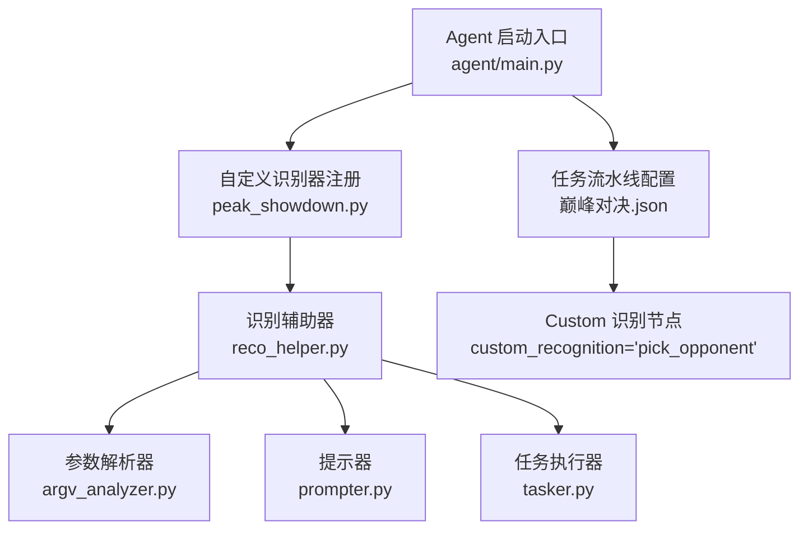
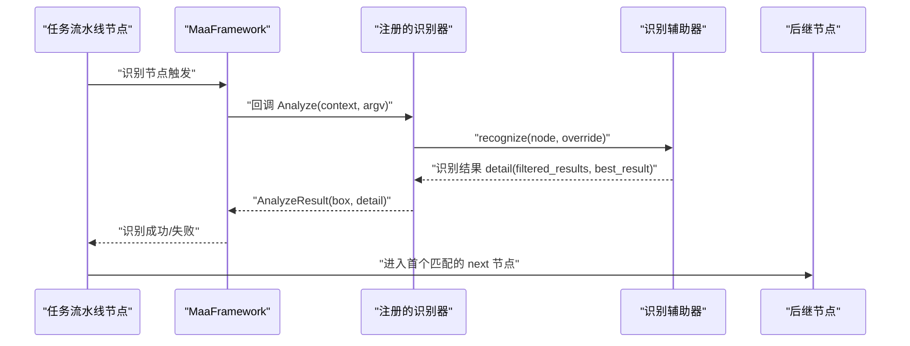
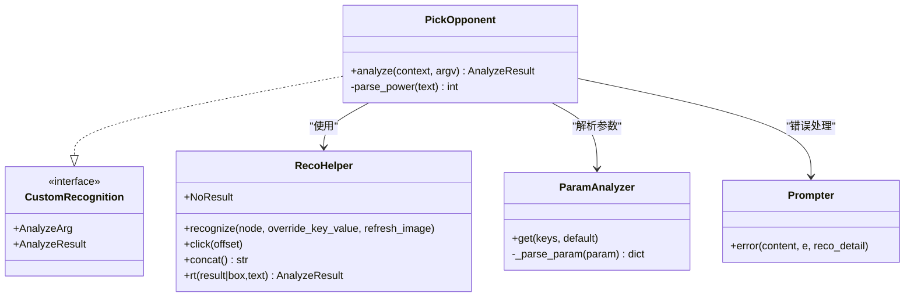
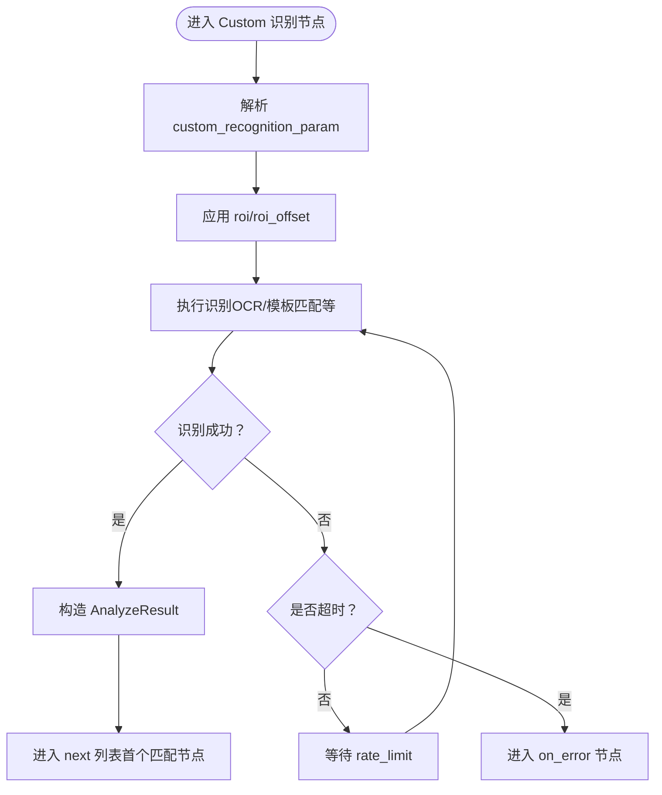
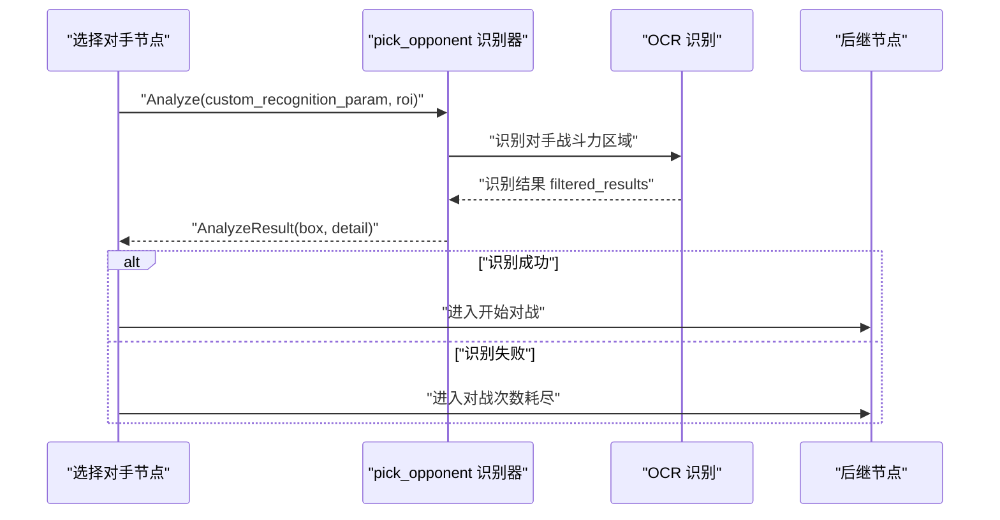
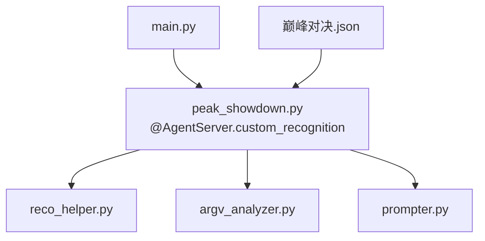

# 与任务流水线集成

<cite>
**本文档引用的文件**
- [3.1-任务流水线协议.md](file://instructions/maafw-guide/3.1-任务流水线协议.md)
- [2.2-集成接口一览.md](file://instructions/maafw-guide/2.2-集成接口一览.md)
- [peak_showdown.py](file://agent/customs/special_treat/peak_showdown.py)
- [reco_helper.py](file://agent/customs/maahelper/reco_helper.py)
- [argv_analyzer.py](file://agent/customs/maahelper/argv_analyzer.py)
- [prompter.py](file://agent/customs/utils/prompter.py)
- [tasker.py](file://agent/customs/maahelper/tasker.py)
- [periodic_check.py](file://agent/customs/global_func/periodic_check.py)
- [main.py](file://agent/main.py)
- [巅峰对决.json](file://assets/resource/base/pipeline/日常任务/巅峰对决.json)
</cite>

## 目录
1. [简介](#简介)
2. [项目结构](#项目结构)
3. [核心组件](#核心组件)
4. [架构总览](#架构总览)
5. [详细组件分析](#详细组件分析)
6. [依赖关系分析](#依赖关系分析)
7. [性能考量](#性能考量)
8. [故障排查指南](#故障排查指南)
9. [结论](#结论)

## 简介
本文件面向在任务流水线中集成“自定义识别类型”的开发者，围绕以下目标展开：
- 基于任务流水线协议中的 custom_recognition 字段定义，说明如何在 JSON 配置中引用已注册的自定义识别器名称。
- 解析 custom_recognition_param 参数的序列化传递机制，展示如何从流水线节点向识别器回调函数传递动态参数。
- 通过“巅峰对决.json”实际配置案例，演示 ROI 区域裁剪、识别超时设置等高级选项的配置方法。
- 说明识别结果如何影响后续动作节点的执行流程，包括 hit/miss 分支决策和结果数据传递机制。

## 项目结构
本仓库采用模块化组织，与自定义识别集成相关的关键目录与文件如下：
- 指南与协议：instructions/maafw-guide 下的协议与接口文档
- 自定义识别实现：agent/customs/special_treat 与 agent/customs/maahelper
- 任务流水线配置：assets/resource/base/pipeline/日常任务/巅峰对决.json
- Agent 启动入口：agent/main.py

图表来源
- [main.py](file://agent/main.py#L17-L42)
- [peak_showdown.py](file://agent/customs/special_treat/peak_showdown.py#L51-L96)
- [reco_helper.py](file://agent/customs/maahelper/reco_helper.py#L17-L256)
- [argv_analyzer.py](file://agent/customs/maahelper/argv_analyzer.py#L17-L159)
- [prompter.py](file://agent/customs/utils/prompter.py#L16-L55)
- [tasker.py](file://agent/customs/maahelper/tasker.py#L16-L177)
- [巅峰对决.json](file://assets/resource/base/pipeline/日常任务/巅峰对决.json#L480-L501)

章节来源
- [main.py](file://agent/main.py#L17-L42)
- [巅峰对决.json](file://assets/resource/base/pipeline/日常任务/巅峰对决.json#L1-L566)

## 核心组件
- 自定义识别器注册与回调
  - 通过装饰器注册自定义识别器名称，回调接收 AnalyzeArg，包含 custom_recognition_name、custom_recognition_param、roi 等字段。
- 识别辅助器
  - 封装识别结果处理、点击操作、结果过滤等常用功能，支持链式调用。
- 参数解析器
  - 将传入的自定义识别参数字符串解析为字典，支持 JSON 与查询字符串格式。
- 任务执行器
  - 提供截图、点击、滑动等操作，以及任务运行与覆盖能力。
- 任务流水线配置
  - JSON 中通过 recognition.type='Custom' 与 recognition.param.custom_recognition 指定识别器名称，custom_recognition_param 传递动态参数，roi/roi_offset 控制识别区域。

章节来源
- [peak_showdown.py](file://agent/customs/special_treat/peak_showdown.py#L51-L96)
- [reco_helper.py](file://agent/customs/maahelper/reco_helper.py#L17-L256)
- [argv_analyzer.py](file://agent/customs/maahelper/argv_analyzer.py#L17-L159)
- [tasker.py](file://agent/customs/maahelper/tasker.py#L16-L177)
- [3.1-任务流水线协议.md](file://instructions/maafw-guide/3.1-任务流水线协议.md#L776-L793)

## 架构总览
自定义识别在任务流水线中的调用链路如下：
- Agent 启动后注册自定义识别器（如 pick_opponent）。
- 流水线节点设置 recognition.type='Custom'，并在 recognition.param 中指定 custom_recognition 与 custom_recognition_param。
- MaaFramework 调用注册的识别器回调，传入图像、ROI、参数等上下文。
- 识别器内部使用识别辅助器执行 OCR/模板匹配等识别，返回 AnalyzeResult。
- 流水线根据识别结果决定进入 next 列表中的首个匹配节点，或进入 on_error。

图表来源
- [peak_showdown.py](file://agent/customs/special_treat/peak_showdown.py#L59-L95)
- [reco_helper.py](file://agent/customs/maahelper/reco_helper.py#L62-L94)
- [3.1-任务流水线协议.md](file://instructions/maafw-guide/3.1-任务流水线协议.md#L22-L51)

## 详细组件分析

### 自定义识别器注册与回调
- 注册方式
  - 使用装饰器注册识别器名称，回调函数签名接收 context 与 argv，返回 AnalyzeResult。
- 回调参数
  - argv 中包含 custom_recognition_name、custom_recognition_param、roi 等字段，可在识别器内部解析使用。
- 典型实现
  - 在 pick_opponent 识别器中，解析策略参数，调用识别辅助器执行 OCR，返回最佳结果或无结果。

图表来源
- [peak_showdown.py](file://agent/customs/special_treat/peak_showdown.py#L51-L96)
- [reco_helper.py](file://agent/customs/maahelper/reco_helper.py#L17-L256)
- [argv_analyzer.py](file://agent/customs/maahelper/argv_analyzer.py#L17-L159)
- [prompter.py](file://agent/customs/utils/prompter.py#L16-L55)

章节来源
- [peak_showdown.py](file://agent/customs/special_treat/peak_showdown.py#L51-L96)
- [argv_analyzer.py](file://agent/customs/maahelper/argv_analyzer.py#L17-L159)
- [prompter.py](file://agent/customs/utils/prompter.py#L16-L55)

### JSON 配置中的 custom_recognition 与 custom_recognition_param
- 引用已注册识别器
  - 在 recognition.param 中设置 custom_recognition 为已注册的识别器名称（如 pick_opponent）。
- 动态参数传递
  - custom_recognition_param 支持任意类型，框架将其序列化后传入识别器回调 argv.custom_recognition_param。
  - 识别器内部可用 ParamAnalyzer 解析为字典，支持 JSON 与查询字符串格式。
- ROI 与超时设置
  - roi/roi_offset 控制识别区域；timeout 控制识别超时；rate_limit 控制识别轮次最小间隔。

图表来源
- [3.1-任务流水线协议.md](file://instructions/maafw-guide/3.1-任务流水线协议.md#L168-L170)
- [reco_helper.py](file://agent/customs/maahelper/reco_helper.py#L62-L94)
- [argv_analyzer.py](file://agent/customs/maahelper/argv_analyzer.py#L48-L101)

章节来源
- [3.1-任务流水线协议.md](file://instructions/maafw-guide/3.1-任务流水线协议.md#L776-L793)
- [argv_analyzer.py](file://agent/customs/maahelper/argv_analyzer.py#L48-L101)

### “巅峰对决.json”实战案例
- 选择对手节点
  - recognition.type='Custom'，custom_recognition='pick_opponent'。
  - 通过 custom_recognition_param 传递策略参数（如 strategy/min_power）。
- ROI 区域裁剪
  - 识别战斗力文本时，使用 recognition.param 中的 expected 与 roi 指定 OCR 识别区域。
- 识别超时设置
  - 通过 timeout 字段控制识别超时时间，避免长时间等待。
- 结果驱动的分支决策
  - 识别成功后进入“开始对战”节点；识别失败或 on_error 指定的节点进入“对战次数耗尽”。

图表来源
- [巅峰对决.json](file://assets/resource/base/pipeline/日常任务/巅峰对决.json#L480-L501)
- [peak_showdown.py](file://agent/customs/special_treat/peak_showdown.py#L59-L95)

章节来源
- [巅峰对决.json](file://assets/resource/base/pipeline/日常任务/巅峰对决.json#L480-L501)
- [peak_showdown.py](file://agent/customs/special_treat/peak_showdown.py#L59-L95)

### 识别结果对后续节点的影响
- 命中（hit）与未命中（miss）
  - 识别成功时，框架选择 next 列表中首个匹配节点；识别失败时，进入 on_error 列表。
- 结果数据传递
  - AnalyzeResult.detail 可携带文本、命中标记等信息，供后续节点使用（如 OCR 节点的 expected 匹配）。
- 与周期性任务联动
  - 通过自定义动作 periodic_check 与 record_period，实现“是否需要执行”的条件判断，配合 Custom 识别器形成闭环。

章节来源
- [3.1-任务流水线协议.md](file://instructions/maafw-guide/3.1-任务流水线协议.md#L168-L174)
- [periodic_check.py](file://agent/customs/global_func/periodic_check.py#L183-L252)

## 依赖关系分析
- Agent 启动与注册
  - main.py 启动 Agent 服务，注册自定义识别器与动作。
- 识别器依赖
  - PickOpponent 依赖 RecoHelper、ParamAnalyzer、Prompter。
- 配置与执行
  - 流水线 JSON 通过 recognition.type='Custom' 与 recognition.param 指定识别器与参数；框架负责回调与结果分发。

图表来源
- [main.py](file://agent/main.py#L17-L42)
- [peak_showdown.py](file://agent/customs/special_treat/peak_showdown.py#L51-L96)
- [reco_helper.py](file://agent/customs/maahelper/reco_helper.py#L17-L256)
- [argv_analyzer.py](file://agent/customs/maahelper/argv_analyzer.py#L17-L159)
- [prompter.py](file://agent/customs/utils/prompter.py#L16-L55)
- [巅峰对决.json](file://assets/resource/base/pipeline/日常任务/巅峰对决.json#L480-L501)

章节来源
- [main.py](file://agent/main.py#L17-L42)
- [peak_showdown.py](file://agent/customs/special_treat/peak_showdown.py#L51-L96)

## 性能考量
- 识别区域优化
  - 合理设置 roi/roi_offset，缩小识别范围，提升速度与准确性。
- 超时与速率限制
  - 通过 timeout 与 rate_limit 控制识别节奏，避免无效轮询。
- 结果复用
  - 识别辅助器支持链式调用与结果缓存，减少重复识别成本。
- 参数解析开销
  - 自定义参数解析仅在识别器内部进行，建议保持参数简洁，避免过大负载。

## 故障排查指南
- 识别器未找到
  - 确认自定义识别器已通过装饰器注册，且名称与 JSON 中 custom_recognition 一致。
- 参数解析失败
  - 检查 custom_recognition_param 的格式（JSON 或查询字符串），必要时在识别器中打印 argv 内容定位问题。
- ROI 不匹配
  - 校验识别区域是否与实际画面分辨率一致，必要时使用相对节点名作为 roi 引用。
- 识别超时
  - 适当增大 timeout，或优化识别策略（如降低阈值、减少模板数量）。
- 结果未命中分支
  - 检查 next 列表中各节点的 recognition 配置与 expected/roi 设置，确保与实际画面一致。

章节来源
- [peak_showdown.py](file://agent/customs/special_treat/peak_showdown.py#L94-L96)
- [argv_analyzer.py](file://agent/customs/maahelper/argv_analyzer.py#L48-L101)
- [prompter.py](file://agent/customs/utils/prompter.py#L34-L55)

## 结论
通过在任务流水线中使用 Custom 识别类型，可以灵活集成自定义识别逻辑，实现复杂的业务判断与自动化操作。关键在于：
- 正确注册识别器并命名一致
- 在 JSON 中通过 custom_recognition 与 custom_recognition_param 传递参数
- 合理设置 ROI、超时与速率限制
- 借助识别辅助器与参数解析器简化开发与维护