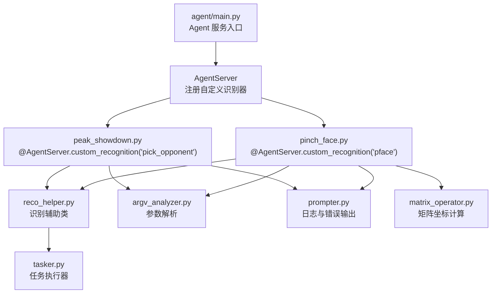
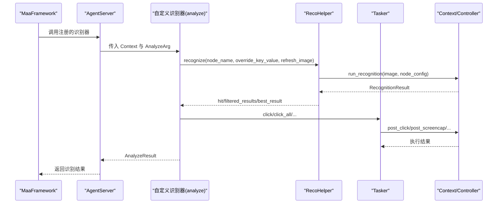
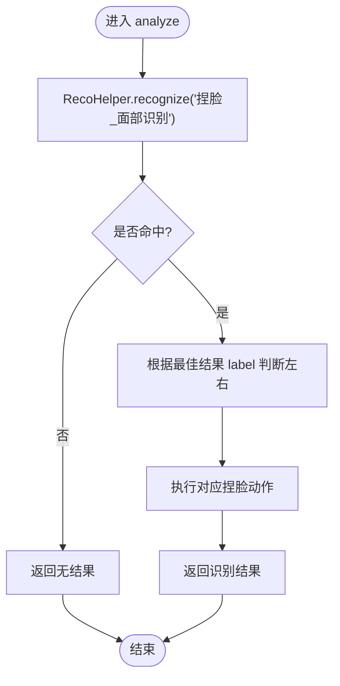
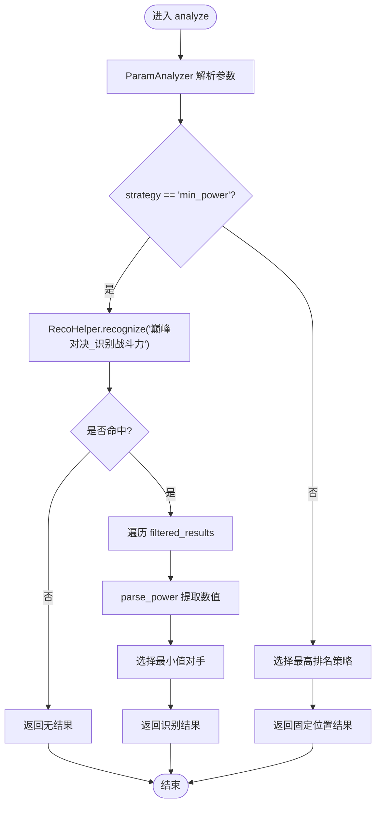
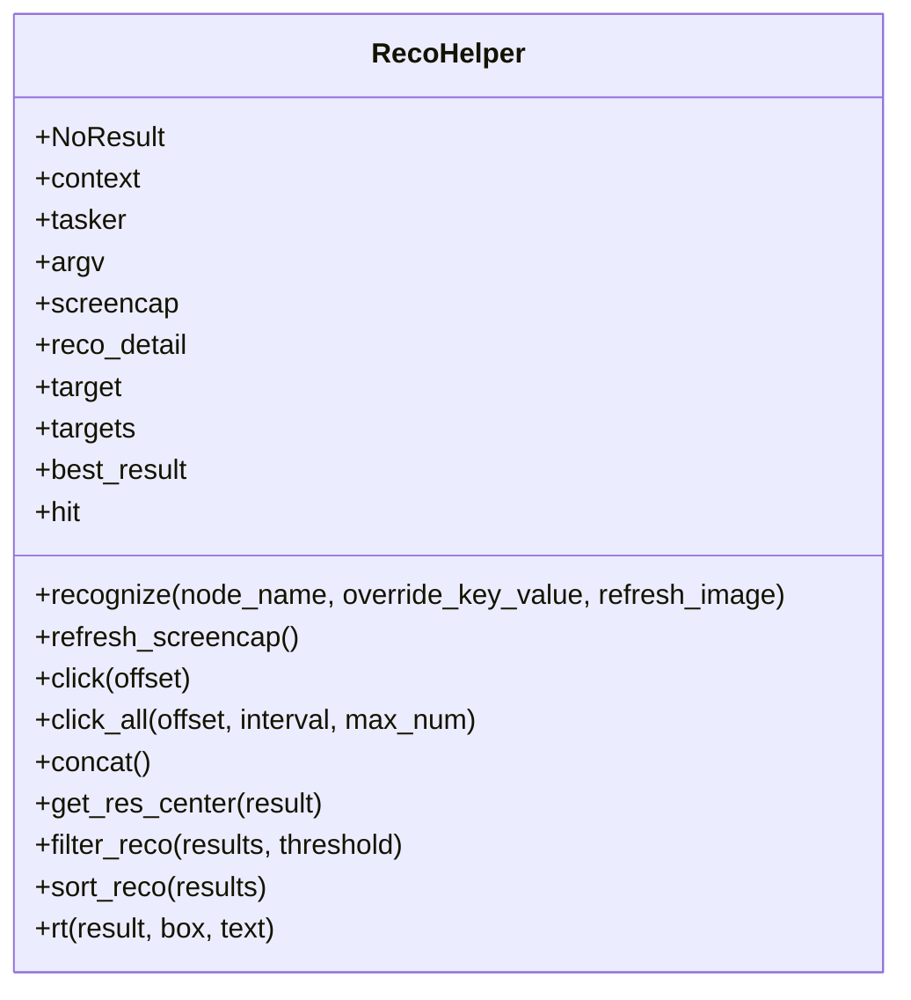
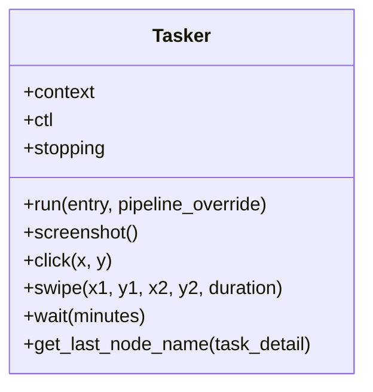
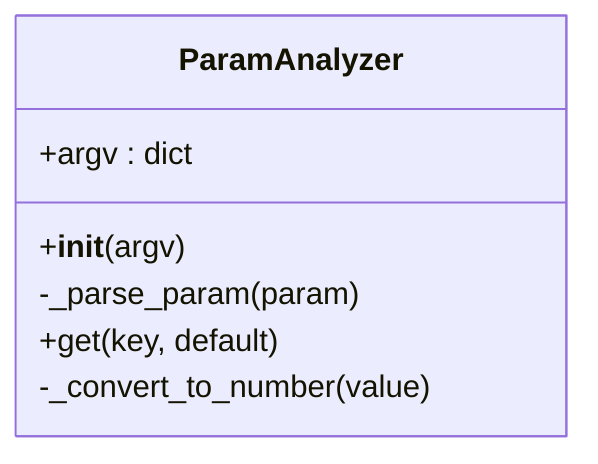
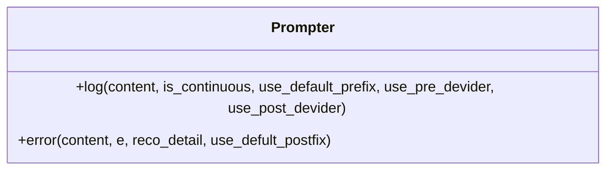
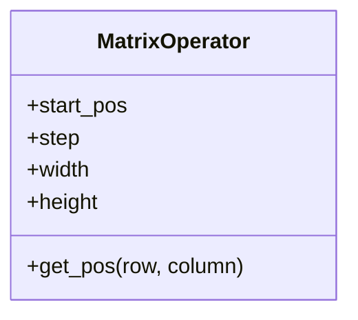
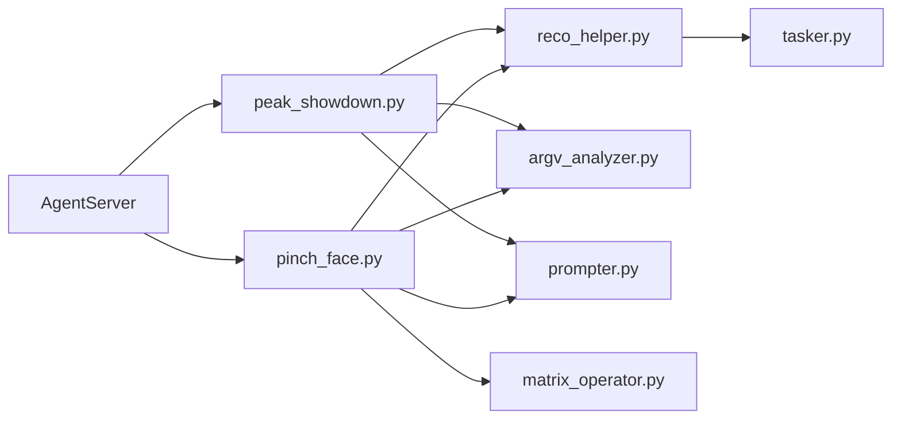

# 自定义识别器开发

<cite>
**本文引用的文件**
- [agent/customs/global_func/pinch_face.py](file://agent/customs/global_func/pinch_face.py)
- [agent/customs/special_treat/peak_showdown.py](file://agent/customs/special_treat/peak_showdown.py)
- [agent/customs/maahelper/reco_helper.py](file://agent/customs/maahelper/reco_helper.py)
- [agent/customs/maahelper/tasker.py](file://agent/customs/maahelper/tasker.py)
- [agent/customs/maahelper/argv_analyzer.py](file://agent/customs/maahelper/argv_analyzer.py)
- [agent/customs/utils/prompter.py](file://agent/customs/utils/prompter.py)
- [agent/customs/utils/matrix_operator.py](file://agent/customs/utils/matrix_operator.py)
- [agent/main.py](file://agent/main.py)
- [instructions/maafw-guide/2.2-集成接口一览.md](file://instructions/maafw-guide/2.2-集成接口一览.md)
- [instructions/maafw-guide/3.1-任务流水线协议.md](file://instructions/maafw-guide/3.1-任务流水线协议.md)
- [assets/config/maa_pi_config.json](file://assets/config/maa_pi_config.json)
</cite>

## 目录
1. [简介](#简介)
2. [项目结构](#项目结构)
3. [核心组件](#核心组件)
4. [架构总览](#架构总览)
5. [详细组件分析](#详细组件分析)
6. [依赖关系分析](#依赖关系分析)
7. [性能考虑](#性能考虑)
8. [故障排查指南](#故障排查指南)
9. [结论](#结论)
10. [附录](#附录)

## 简介
本文围绕基于 MaaFramework 的自定义识别器开发，系统讲解如何通过 AgentServer 的自定义识别接口实现图像匹配、OCR 识别与逻辑判断。结合 agent/customs 目录下的 pinch_face.py（捏脸界面识别）与 peak_showdown.py（巅峰对决对手选择）两个实例，阐述识别器的注册、生命周期管理、资源释放、参数传递与回调处理机制，并给出错误处理策略、性能优化建议与最佳实践。

## 项目结构
该项目采用模块化组织，核心识别逻辑集中在 agent/customs 下，配合工具模块与辅助类实现统一的识别与操作抽象。Agent 服务入口位于 agent/main.py，通过 AgentServer 启动并注册自定义识别器。

图表来源
- [agent/main.py](file://agent/main.py#L17-L42)
- [agent/customs/global_func/pinch_face.py](file://agent/customs/global_func/pinch_face.py#L15-L55)
- [agent/customs/special_treat/peak_showdown.py](file://agent/customs/special_treat/peak_showdown.py#L51-L96)
- [agent/customs/maahelper/reco_helper.py](file://agent/customs/maahelper/reco_helper.py#L17-L256)
- [agent/customs/maahelper/tasker.py](file://agent/customs/maahelper/tasker.py#L16-L177)
- [agent/customs/maahelper/argv_analyzer.py](file://agent/customs/maahelper/argv_analyzer.py#L17-L159)
- [agent/customs/utils/prompter.py](file://agent/customs/utils/prompter.py#L16-L55)
- [agent/customs/utils/matrix_operator.py](file://agent/customs/utils/matrix_operator.py#L1-L58)

章节来源
- [agent/main.py](file://agent/main.py#L17-L42)

## 核心组件
- 自定义识别器基类与注册：通过 AgentServer.custom_recognition 装饰器注册识别器，识别器需实现 analyze 方法，接收 Context 与 AnalyzeArg，返回 AnalyzeResult。
- 识别辅助类 RecoHelper：封装 run_recognition、hit 判断、结果过滤、点击、文本拼接等常用能力，简化识别器实现。
- 任务执行器 Tasker：封装截图、点击、滑动、等待等底层操作，屏蔽 MaaFramework 细节。
- 参数解析器 ParamAnalyzer：解析来自 MaaFramework 的自定义识别参数字符串，支持 JSON 与查询字符串格式。
- 错误输出 Prompter：统一的日志与错误输出，便于调试与告警。
- 矩阵坐标计算 MatrixOperator：在网格布局中快速定位坐标，辅助识别器进行批量点击或区域定位。

章节来源
- [agent/customs/maahelper/reco_helper.py](file://agent/customs/maahelper/reco_helper.py#L17-L256)
- [agent/customs/maahelper/tasker.py](file://agent/customs/maahelper/tasker.py#L16-L177)
- [agent/customs/maahelper/argv_analyzer.py](file://agent/customs/maahelper/argv_analyzer.py#L17-L159)
- [agent/customs/utils/prompter.py](file://agent/customs/utils/prompter.py#L16-L55)
- [agent/customs/utils/matrix_operator.py](file://agent/customs/utils/matrix_operator.py#L1-L58)

## 架构总览
自定义识别器通过 AgentServer 注册后，由 MaaFramework 的上下文驱动执行。识别器内部使用 RecoHelper 调用 run_recognition，结合 Tasker 执行点击等操作；参数通过 AnalyzeArg 传入，经 ParamAnalyzer 解析后驱动识别逻辑；错误通过 Prompter 输出并返回标准结果对象。

图表来源
- [agent/customs/maahelper/reco_helper.py](file://agent/customs/maahelper/reco_helper.py#L62-L94)
- [agent/customs/maahelper/tasker.py](file://agent/customs/maahelper/tasker.py#L51-L138)
- [agent/customs/global_func/pinch_face.py](file://agent/customs/global_func/pinch_face.py#L23-L55)
- [agent/customs/special_treat/peak_showdown.py](file://agent/customs/special_treat/peak_showdown.py#L59-L96)

## 详细组件分析

### 组件A：捏脸识别器（pinch_face.py）
- 角色与职责：识别游戏内捏脸界面，根据识别结果自动执行左/右捏脸动作。
- 关键流程：
  - 使用 RecoHelper.run_recognition 执行“捏脸_面部识别”节点。
  - 若命中，依据最佳结果的 label 决定执行“捏脸_左捏”或“捏脸_右捏”动作。
  - 返回识别结果或无结果。
- 参数与回调：
  - AnalyzeArg 由 MaaFramework 传入，识别器通过 RecoHelper 接收并执行 run_recognition。
  - 识别器内部不直接解析 AnalyzeArg，而是交由节点配置与 RecoHelper 处理。
- 错误处理：
  - 捕获异常并通过 Prompter.error 输出错误信息并返回标准结果对象。

图表来源
- [agent/customs/global_func/pinch_face.py](file://agent/customs/global_func/pinch_face.py#L23-L55)
- [agent/customs/maahelper/reco_helper.py](file://agent/customs/maahelper/reco_helper.py#L62-L94)

章节来源
- [agent/customs/global_func/pinch_face.py](file://agent/customs/global_func/pinch_face.py#L15-L55)

### 组件B：巅峰对决对手选择识别器（peak_showdown.py）
- 角色与职责：在巅峰对决中选择战斗力最低的对手，支持“最低战力”和“最高排名”两种策略。
- 关键流程：
  - 解析参数（strategy/min_power 或 max_rank）。
  - 识别所有对手的战斗力文本，解析数值，选择最小值对应的对手。
  - 返回该对手的识别结果。
- OCR 与逻辑判断：
  - 通过节点“巅峰对决_识别战斗力”获取文本，parse_power 提取数值。
  - 逻辑判断：比较多个识别结果的文本数值，选择最小者。
- 参数与回调：
  - AnalyzeArg 通过 ParamAnalyzer 解析，支持 JSON 或查询字符串格式。
  - 识别器内部使用 RecoHelper 进行识别与结果处理。

图表来源
- [agent/customs/special_treat/peak_showdown.py](file://agent/customs/special_treat/peak_showdown.py#L59-L96)
- [agent/customs/maahelper/argv_analyzer.py](file://agent/customs/maahelper/argv_analyzer.py#L103-L131)
- [agent/customs/maahelper/reco_helper.py](file://agent/customs/maahelper/reco_helper.py#L62-L94)

章节来源
- [agent/customs/special_treat/peak_showdown.py](file://agent/customs/special_treat/peak_showdown.py#L51-L96)
- [agent/customs/maahelper/argv_analyzer.py](file://agent/customs/maahelper/argv_analyzer.py#L17-L159)

### 组件C：识别辅助类（reco_helper.py）
- 职责：封装 run_recognition、hit 判断、结果过滤、点击、文本拼接等常用能力。
- 关键能力：
  - recognize：根据参数选择截图来源（缓存/刷新/argv.image），执行节点识别。
  - hit：判断识别是否命中。
  - click/click_all：点击最佳或全部结果，支持偏移与间隔。
  - concat：拼接所有识别结果文本。
  - rt：构造 AnalyzeResult，支持从 RecognitionResult 或手动 box/text 构建。
- 性能与复用：通过缓存截图减少重复截图成本，支持链式调用提升可读性。

图表来源
- [agent/customs/maahelper/reco_helper.py](file://agent/customs/maahelper/reco_helper.py#L17-L256)

章节来源
- [agent/customs/maahelper/reco_helper.py](file://agent/customs/maahelper/reco_helper.py#L17-L256)

### 组件D：任务执行器（tasker.py）
- 职责：封装截图、点击、滑动、等待等底层操作，屏蔽 MaaFramework 细节。
- 关键能力：
  - run：执行任务节点，自动注入运行监测器。
  - screenshot/click/swipe/wait：执行对应操作并返回自身以支持链式调用。
  - get_last_node_name：获取最后执行的节点名称。
- 生命周期：Tasker 由 RecoHelper.init_tasker 初始化，贯穿识别器整个生命周期。

图表来源
- [agent/customs/maahelper/tasker.py](file://agent/customs/maahelper/tasker.py#L16-L177)

章节来源
- [agent/customs/maahelper/tasker.py](file://agent/customs/maahelper/tasker.py#L16-L177)

### 组件E：参数解析器（argv_analyzer.py）
- 职责：解析来自 MaaFramework 的自定义识别参数字符串，支持 JSON 与查询字符串格式。
- 关键能力：
  - _parse_param：依次尝试 JSON 与查询字符串解析，失败返回空字典。
  - get：按键名或键名列表获取参数值，支持默认值与数字类型自动转换。
- 使用场景：在识别器中通过 ParamAnalyzer(argv) 获取策略、阈值、节点名等参数。

图表来源
- [agent/customs/maahelper/argv_analyzer.py](file://agent/customs/maahelper/argv_analyzer.py#L17-L159)

章节来源
- [agent/customs/maahelper/argv_analyzer.py](file://agent/customs/maahelper/argv_analyzer.py#L17-L159)

### 组件F：错误输出（prompter.py）
- 职责：统一的日志与错误输出，便于调试与告警。
- 关键能力：
  - log：输出带分隔符的日志，支持前缀与分隔符控制。
  - error：输出错误详情并返回 False 或自定义 AnalyzeResult，便于识别器捕获。

图表来源
- [agent/customs/utils/prompter.py](file://agent/customs/utils/prompter.py#L16-L55)

章节来源
- [agent/customs/utils/prompter.py](file://agent/customs/utils/prompter.py#L16-L55)

### 组件G：矩阵坐标计算（matrix_operator.py）
- 职责：在矩阵布局中快速定位坐标，支持正负索引与宽高约束。
- 使用场景：在网格布局的识别器中，快速计算目标元素坐标，辅助点击或区域定位。

图表来源
- [agent/customs/utils/matrix_operator.py](file://agent/customs/utils/matrix_operator.py#L1-L58)

章节来源
- [agent/customs/utils/matrix_operator.py](file://agent/customs/utils/matrix_operator.py#L1-L58)

## 依赖关系分析
- 自定义识别器依赖 RecoHelper 进行识别与结果处理，依赖 Tasker 执行点击等操作。
- ParamAnalyzer 为识别器提供参数解析能力，支持 JSON 与查询字符串格式。
- Prompter 为识别器提供统一的错误输出与日志输出。
- AgentServer 通过装饰器注册识别器，识别器通过 Context 与 AnalyzeArg 接收参数。

图表来源
- [agent/customs/global_func/pinch_face.py](file://agent/customs/global_func/pinch_face.py#L15-L55)
- [agent/customs/special_treat/peak_showdown.py](file://agent/customs/special_treat/peak_showdown.py#L51-L96)
- [agent/customs/maahelper/reco_helper.py](file://agent/customs/maahelper/reco_helper.py#L17-L256)
- [agent/customs/maahelper/tasker.py](file://agent/customs/maahelper/tasker.py#L16-L177)
- [agent/customs/maahelper/argv_analyzer.py](file://agent/customs/maahelper/argv_analyzer.py#L17-L159)
- [agent/customs/utils/prompter.py](file://agent/customs/utils/prompter.py#L16-L55)
- [agent/customs/utils/matrix_operator.py](file://agent/customs/utils/matrix_operator.py#L1-L58)

## 性能考虑
- 模板匹配阈值与算法
  - 在任务流水线协议中，模板匹配支持多种算法与阈值设置。合理设置 threshold 与 method 可显著提升识别稳定性与速度。
  - 建议优先使用 TM_CCOEFF_NORMED（method=5）以获得更好的鲁棒性与阈值可控性。
- 模板图像质量
  - 模板图片应为无损原图缩放到 720p 后的裁剪，避免过度模糊或失真。
  - 模板应包含足够纹理细节，避免纯色或重复纹理导致特征点不足或误匹配。
- 识别区域与 ROI
  - 通过 roi 与 roi_offset 精确限定识别区域，减少无效扫描，提高识别速度与准确率。
- 结果排序与索引
  - 使用 order_by 与 index 控制结果排序与选取，减少不必要的后处理。
- 截图与缓存
  - 使用 RecoHelper 的截图缓存机制，避免重复截图带来的性能损耗。
- 点击间隔与批量点击
  - 在批量点击时设置合理的间隔与最大点击数量，避免触发风控或遗漏目标。

章节来源
- [instructions/maafw-guide/3.1-任务流水线协议.md](file://instructions/maafw-guide/3.1-任务流水线协议.md#L440-L472)
- [instructions/maafw-guide/3.1-任务流水线协议.md](file://instructions/maafw-guide/3.1-任务流水线协议.md#L463-L467)
- [instructions/maafw-guide/3.1-任务流水线协议.md](file://instructions/maafw-guide/3.1-任务流水线协议.md#L489-L492)
- [agent/customs/maahelper/reco_helper.py](file://agent/customs/maahelper/reco_helper.py#L80-L94)
- [agent/customs/maahelper/reco_helper.py](file://agent/customs/maahelper/reco_helper.py#L141-L172)

## 故障排查指南
- 识别失败的常见原因
  - 模板质量差或阈值设置不当：调整 threshold 与 method，优化模板图像。
  - 识别区域过大或过小：通过 roi/roi_offset 精确定位。
  - 截图时机不当：使用 refresh_image 或缓存截图策略。
- 错误输出与日志
  - 使用 Prompter.error 输出错误详情，便于定位问题。
  - 在识别器中捕获异常并返回标准结果对象，避免中断流程。
- 超时与重试
  - 在任务流水线中设置合理的超时与重试策略，避免长时间阻塞。
  - 使用 Tasker.wait 在关键步骤插入等待，确保状态稳定后再继续。

章节来源
- [agent/customs/utils/prompter.py](file://agent/customs/utils/prompter.py#L34-L54)
- [agent/customs/maahelper/reco_helper.py](file://agent/customs/maahelper/reco_helper.py#L80-L94)
- [agent/customs/maahelper/tasker.py](file://agent/customs/maahelper/tasker.py#L158-L170)

## 结论
通过 AgentServer 的自定义识别接口，结合 RecoHelper、Tasker、ParamAnalyzer、Prompter 等工具模块，可以高效地实现图像匹配、OCR 识别与逻辑判断。在实际开发中，应重视模板质量、阈值设置、识别区域与 ROI 的优化，并通过参数解析与错误处理机制提升稳定性与可维护性。遵循本文提供的最佳实践，可在保证性能的同时获得可靠的识别效果。

## 附录

### trans_arg 参数在上下文数据传递中的作用机制
- trans_arg 作为识别器参数传递的关键载体，由 MaaFramework 通过 AnalyzeArg 传入识别器。
- 在识别器内部，可通过 ParamAnalyzer 解析 trans_arg，获取策略、阈值、节点名等配置信息。
- trans_arg 支持 JSON 与查询字符串格式，便于灵活配置与扩展。

章节来源
- [agent/customs/maahelper/argv_analyzer.py](file://agent/customs/maahelper/argv_analyzer.py#L48-L101)
- [agent/customs/special_treat/peak_showdown.py](file://agent/customs/special_treat/peak_showdown.py#L77-L78)

### 回调函数接收与处理
- 识别器通过 analyze 方法接收 Context 与 AnalyzeArg，内部使用 RecoHelper.run_recognition 执行识别。
- 识别完成后，识别器根据结果调用 Tasker 执行点击等操作，并返回 AnalyzeResult。
- 错误处理通过 Prompter.error 输出并返回标准结果对象，确保回调一致性。

章节来源
- [agent/customs/global_func/pinch_face.py](file://agent/customs/global_func/pinch_face.py#L23-L55)
- [agent/customs/special_treat/peak_showdown.py](file://agent/customs/special_treat/peak_showdown.py#L59-L96)
- [agent/customs/maahelper/reco_helper.py](file://agent/customs/maahelper/reco_helper.py#L62-L94)
- [agent/customs/maahelper/tasker.py](file://agent/customs/maahelper/tasker.py#L125-L138)
- [agent/customs/utils/prompter.py](file://agent/customs/utils/prompter.py#L34-L54)

### 识别器注册、生命周期管理与资源释放最佳实践
- 注册：使用 @AgentServer.custom_recognition 装饰器注册识别器，确保在 AgentServer 启动时被正确加载。
- 生命周期：在 agent/main.py 中启动 AgentServer 并 join，确保服务持续可用。
- 资源释放：识别器内部通过 Prompter.error 返回结果时，避免持有外部资源；Tasker 与 RecoHelper 在识别结束后自然释放。
- 依赖检查：在启动前检查并安装依赖，确保运行环境稳定。

章节来源
- [agent/main.py](file://agent/main.py#L17-L42)
- [agent/customs/utils/prompter.py](file://agent/customs/utils/prompter.py#L34-L54)

### 任务流水线与识别配置参考
- 任务流水线协议中提供了模板匹配、特征匹配、颜色匹配、OCR、分类与检测等识别算法的详细配置项，包括 roi、roi_offset、template、threshold、order_by、index、method、green_mask 等。
- 通过合理配置这些参数，可以在保证识别精度的同时提升性能与稳定性。

章节来源
- [instructions/maafw-guide/3.1-任务流水线协议.md](file://instructions/maafw-guide/3.1-任务流水线协议.md#L432-L472)
- [instructions/maafw-guide/3.1-任务流水线协议.md](file://instructions/maafw-guide/3.1-任务流水线协议.md#L474-L521)
- [instructions/maafw-guide/3.1-任务流水线协议.md](file://instructions/maafw-guide/3.1-任务流水线协议.md#L525-L555)
- [instructions/maafw-guide/3.1-任务流水线协议.md](file://instructions/maafw-guide/3.1-任务流水线协议.md#L609-L645)