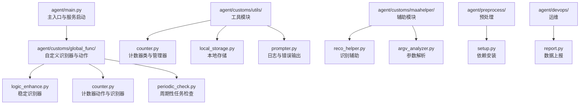
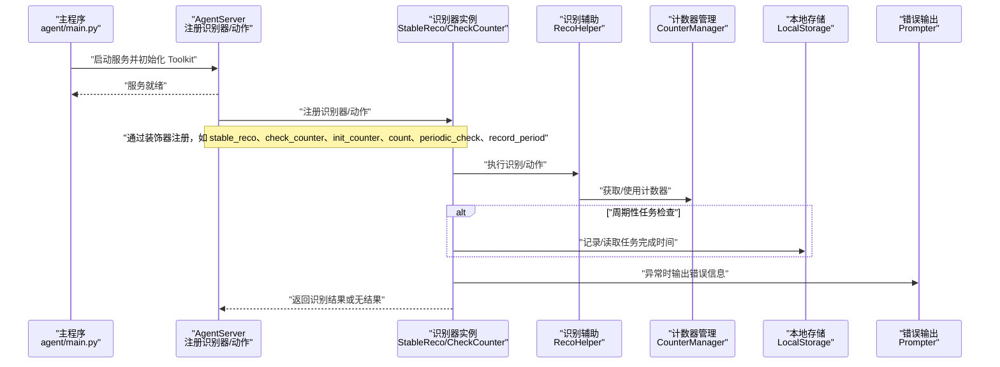
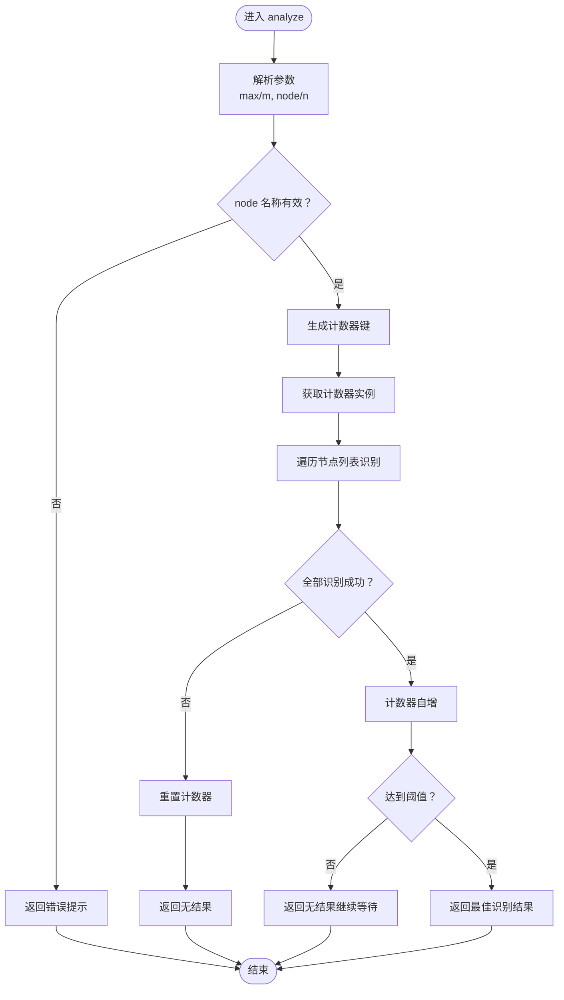
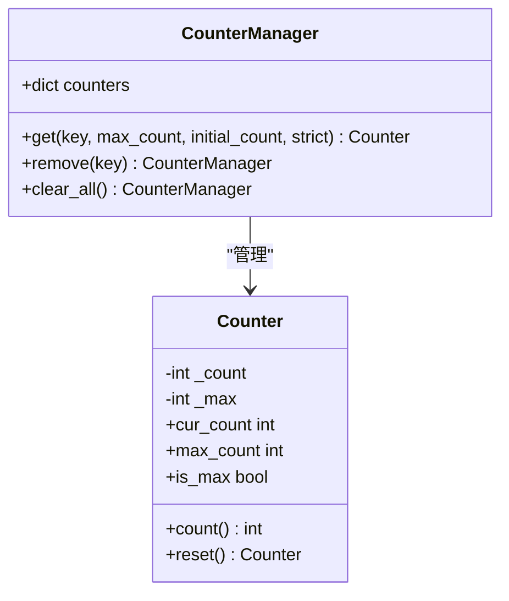
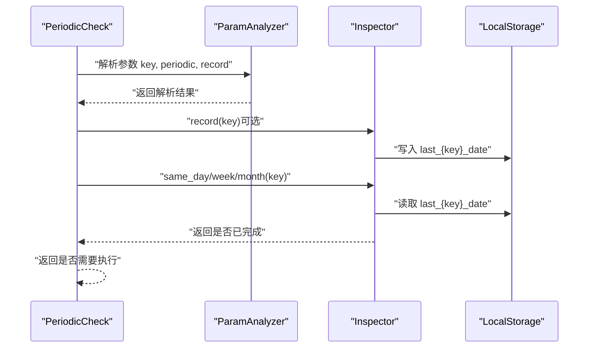
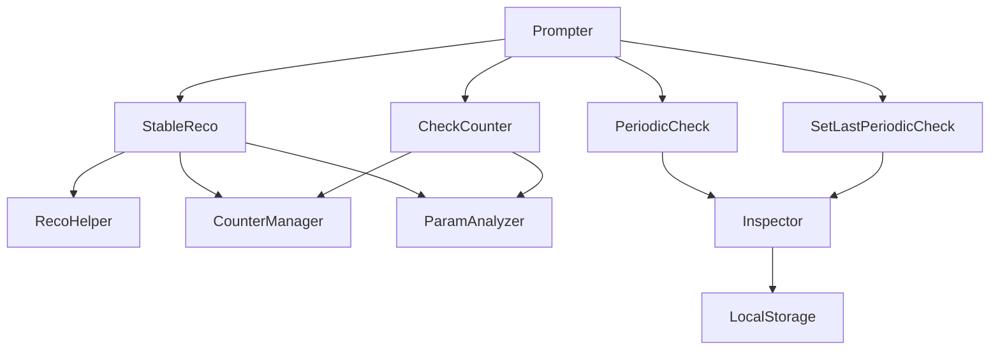

# 识别器生命周期管理

<cite>
**本文档引用的文件**
- [agent/main.py](file://agent/main.py)
- [agent/customs/global_func/logic_enhance.py](file://agent/customs/global_func/logic_enhance.py)
- [agent/customs/global_func/counter.py](file://agent/customs/global_func/counter.py)
- [agent/customs/global_func/periodic_check.py](file://agent/customs/global_func/periodic_check.py)
- [agent/customs/utils/counter.py](file://agent/customs/utils/counter.py)
- [agent/customs/maahelper/reco_helper.py](file://agent/customs/maahelper/reco_helper.py)
- [agent/customs/utils/local_storage.py](file://agent/customs/utils/local_storage.py)
- [agent/customs/utils/prompter.py](file://agent/customs/utils/prompter.py)
- [agent/customs/maahelper/argv_analyzer.py](file://agent/customs/maahelper/argv_analyzer.py)
- [agent/preprocess/setup.py](file://agent/preprocess/setup.py)
- [agent/devops/report.py](file://agent/devops/report.py)
</cite>

## 目录
1. [简介](#简介)
2. [项目结构](#项目结构)
3. [核心组件](#核心组件)
4. [架构总览](#架构总览)
5. [详细组件分析](#详细组件分析)
6. [依赖关系分析](#依赖关系分析)
7. [性能考量](#性能考量)
8. [故障排查指南](#故障排查指南)
9. [结论](#结论)

## 简介
本文件围绕自定义识别器的完整生命周期管理展开，重点说明从注册、初始化、执行到资源释放的全过程。结合 logic_enhance.py 中的周期性检测模式，解释如何利用 Counter 工具实现识别次数统计与阈值控制；阐述 context 对象在跨帧识别中的状态维持作用，以及如何通过 trans_arg 传递自定义状态变量；同时结合 main.py 中的异常处理框架，定义识别器的优雅降级策略，包括超时控制（max_times 参数）、失败重试机制和错误传播规范，并提供资源清理的最佳实践，确保长时间运行下的内存稳定性。

## 项目结构
该项目采用分层模块化组织，核心入口位于 agent/main.py，自定义识别器与动作集中在 agent/customs/global_func 下，辅助工具分布在 agent/customs/utils 与 agent/customs/maahelper 中，预处理与部署相关逻辑位于 agent/preprocess 与 agent/devops。

图表来源
- [agent/main.py](file://agent/main.py#L1-L48)
- [agent/customs/global_func/logic_enhance.py](file://agent/customs/global_func/logic_enhance.py#L1-L96)
- [agent/customs/global_func/counter.py](file://agent/customs/global_func/counter.py#L1-L118)
- [agent/customs/global_func/periodic_check.py](file://agent/customs/global_func/periodic_check.py#L1-L286)
- [agent/customs/utils/counter.py](file://agent/customs/utils/counter.py#L1-L141)
- [agent/customs/maahelper/reco_helper.py](file://agent/customs/maahelper/reco_helper.py#L1-L256)
- [agent/customs/utils/local_storage.py](file://agent/customs/utils/local_storage.py#L1-L111)
- [agent/customs/utils/prompter.py](file://agent/customs/utils/prompter.py#L1-L55)
- [agent/customs/maahelper/argv_analyzer.py](file://agent/customs/maahelper/argv_analyzer.py#L1-L159)
- [agent/preprocess/setup.py](file://agent/preprocess/setup.py#L1-L230)
- [agent/devops/report.py](file://agent/devops/report.py#L1-L34)

章节来源
- [agent/main.py](file://agent/main.py#L1-L48)
- [agent/customs/global_func/logic_enhance.py](file://agent/customs/global_func/logic_enhance.py#L1-L96)
- [agent/customs/global_func/counter.py](file://agent/customs/global_func/counter.py#L1-L118)
- [agent/customs/global_func/periodic_check.py](file://agent/customs/global_func/periodic_check.py#L1-L286)
- [agent/customs/utils/counter.py](file://agent/customs/utils/counter.py#L1-L141)
- [agent/customs/maahelper/reco_helper.py](file://agent/customs/maahelper/reco_helper.py#L1-L256)
- [agent/customs/utils/local_storage.py](file://agent/customs/utils/local_storage.py#L1-L111)
- [agent/customs/utils/prompter.py](file://agent/customs/utils/prompter.py#L1-L55)
- [agent/customs/maahelper/argv_analyzer.py](file://agent/customs/maahelper/argv_analyzer.py#L1-L159)
- [agent/preprocess/setup.py](file://agent/preprocess/setup.py#L1-L230)
- [agent/devops/report.py](file://agent/devops/report.py#L1-L34)

## 核心组件
- 自定义识别器注册与生命周期
  - 通过 AgentServer.custom_recognition 装饰器注册识别器，如 StableReco、CheckCounter。
  - 通过 AgentServer.custom_action 装饰器注册动作，如 InitCounter、Count、PeriodicCheck、SetLastPeriodicCheck。
- 计数器系统
  - Counter 类提供计数与阈值判断能力；CounterManager 统一管理多个计数器实例，支持获取、创建、重置与清空。
- 识别辅助与参数解析
  - RecoHelper 封装识别结果处理、点击操作与结果构造；ParamAnalyzer 支持 JSON 与查询字符串参数解析。
- 状态持久化与错误处理
  - LocalStorage 提供本地键值存储；Prompter 提供统一的日志与错误输出；main.py 提供全局异常捕获与优雅降级。

章节来源
- [agent/customs/global_func/logic_enhance.py](file://agent/customs/global_func/logic_enhance.py#L18-L96)
- [agent/customs/global_func/counter.py](file://agent/customs/global_func/counter.py#L21-L118)
- [agent/customs/global_func/periodic_check.py](file://agent/customs/global_func/periodic_check.py#L183-L286)
- [agent/customs/utils/counter.py](file://agent/customs/utils/counter.py#L1-L141)
- [agent/customs/maahelper/reco_helper.py](file://agent/customs/maahelper/reco_helper.py#L17-L256)
- [agent/customs/maahelper/argv_analyzer.py](file://agent/customs/maahelper/argv_analyzer.py#L17-L159)
- [agent/customs/utils/local_storage.py](file://agent/customs/utils/local_storage.py#L1-L111)
- [agent/customs/utils/prompter.py](file://agent/customs/utils/prompter.py#L16-L55)
- [agent/main.py](file://agent/main.py#L17-L47)

## 架构总览
下图展示了自定义识别器在 MaaFramework 中的注册、执行与资源管理的整体流程。

图表来源
- [agent/main.py](file://agent/main.py#L17-L47)
- [agent/customs/global_func/logic_enhance.py](file://agent/customs/global_func/logic_enhance.py#L18-L96)
- [agent/customs/global_func/counter.py](file://agent/customs/global_func/counter.py#L21-L118)
- [agent/customs/global_func/periodic_check.py](file://agent/customs/global_func/periodic_check.py#L183-L286)
- [agent/customs/maahelper/reco_helper.py](file://agent/customs/maahelper/reco_helper.py#L36-L95)
- [agent/customs/utils/counter.py](file://agent/customs/utils/counter.py#L75-L141)
- [agent/customs/utils/local_storage.py](file://agent/customs/utils/local_storage.py#L80-L111)
- [agent/customs/utils/prompter.py](file://agent/customs/utils/prompter.py#L34-L55)

## 详细组件分析

### 稳定识别器（StableReco）生命周期
- 注册与初始化
  - 通过 AgentServer.custom_recognition("stable_reco") 注册为自定义识别器。
  - 初始化阶段解析参数，提取 max/m 与 node/n；若缺失 node 名称则直接返回错误提示。
- 执行阶段
  - 根据 node 名称生成计数器键，使用 CounterManager.get 获取对应计数器实例。
  - 对节点列表逐一识别，若全部识别成功则计数器自增；若任一失败则重置计数器并返回无结果。
  - 当计数达到阈值（max_count）时，返回最佳识别结果；否则返回无结果，等待下一次调用。
- 资源释放
  - 识别器本身不持有外部资源，计数器由 CounterManager 统一管理，可在需要时调用 CounterManager.clear_all 进行清理。

图表来源
- [agent/customs/global_func/logic_enhance.py](file://agent/customs/global_func/logic_enhance.py#L38-L96)
- [agent/customs/utils/counter.py](file://agent/customs/utils/counter.py#L75-L141)
- [agent/customs/maahelper/reco_helper.py](file://agent/customs/maahelper/reco_helper.py#L62-L95)

章节来源
- [agent/customs/global_func/logic_enhance.py](file://agent/customs/global_func/logic_enhance.py#L18-L96)
- [agent/customs/utils/counter.py](file://agent/customs/utils/counter.py#L75-L141)
- [agent/customs/maahelper/reco_helper.py](file://agent/customs/maahelper/reco_helper.py#L36-L95)

### 计数器动作与识别器生命周期
- InitCounter：初始化指定键的计数器，支持设置初始值与最大值。
- Count：对指定键的计数器执行自增操作。
- CheckCounter：检查计数器是否达到最大值，达到则返回识别成功，否则返回无结果。
- 生命周期要点
  - 计数器由 CounterManager.get(key, max_count, initial_count) 获取或创建，支持严格模式与默认创建。
  - 计数器重置通过 reset() 完成；清空可通过 CounterManager.clear_all() 清理所有计数器。

图表来源
- [agent/customs/utils/counter.py](file://agent/customs/utils/counter.py#L1-L141)

章节来源
- [agent/customs/global_func/counter.py](file://agent/customs/global_func/counter.py#L21-L118)
- [agent/customs/utils/counter.py](file://agent/customs/utils/counter.py#L75-L141)

### 周期性任务检查生命周期
- PeriodicCheck：根据 key 与周期类型（day/week/month）判断任务是否需要执行；支持立即记录完成时间。
- SetLastPeriodicCheck：显式记录任务完成时间。
- Inspector：提供记录与判断逻辑，包括刷新时间调整（凌晨4点前算作前一天）与 ISO 周计算。
- LocalStorage：持久化存储任务完成日期，键名格式为 last_{key}_date。

图表来源
- [agent/customs/global_func/periodic_check.py](file://agent/customs/global_func/periodic_check.py#L183-L286)
- [agent/customs/maahelper/argv_analyzer.py](file://agent/customs/maahelper/argv_analyzer.py#L30-L101)
- [agent/customs/utils/local_storage.py](file://agent/customs/utils/local_storage.py#L80-L111)

章节来源
- [agent/customs/global_func/periodic_check.py](file://agent/customs/global_func/periodic_check.py#L29-L178)
- [agent/customs/global_func/periodic_check.py](file://agent/customs/global_func/periodic_check.py#L183-L286)
- [agent/customs/utils/local_storage.py](file://agent/customs/utils/local_storage.py#L1-L111)
- [agent/customs/maahelper/argv_analyzer.py](file://agent/customs/maahelper/argv_analyzer.py#L17-L159)

### 识别辅助与参数解析
- RecoHelper
  - 提供识别执行、截图缓存、点击操作、结果拼接与构造等能力。
  - 通过 context.run_recognition 执行节点识别，并维护最佳结果与命中状态。
- ParamAnalyzer
  - 支持 JSON 与查询字符串参数解析，自动转换数字字符串为数值类型，提供默认值与异常处理。

章节来源
- [agent/customs/maahelper/reco_helper.py](file://agent/customs/maahelper/reco_helper.py#L17-L256)
- [agent/customs/maahelper/argv_analyzer.py](file://agent/customs/maahelper/argv_analyzer.py#L17-L159)

### 异常处理与优雅降级
- main.py
  - 捕获启动阶段异常，打印错误信息并退出进程，避免服务不可用。
- Prompter
  - 提供统一的日志输出与错误包装，支持返回 False 或识别结果对象，便于识别器在异常时优雅降级。
- 识别器异常处理
  - StableReco、CheckCounter、PeriodicCheck 等均在 try-except 中执行，异常时通过 Prompter.error 输出错误并返回无结果或错误结果。

章节来源
- [agent/main.py](file://agent/main.py#L25-L47)
- [agent/customs/utils/prompter.py](file://agent/customs/utils/prompter.py#L16-L55)
- [agent/customs/global_func/logic_enhance.py](file://agent/customs/global_func/logic_enhance.py#L94-L96)
- [agent/customs/global_func/counter.py](file://agent/customs/global_func/counter.py#L48-L50)
- [agent/customs/global_func/counter.py](file://agent/customs/global_func/counter.py#L78-L80)
- [agent/customs/global_func/counter.py](file://agent/customs/global_func/counter.py#L116-L118)
- [agent/customs/global_func/periodic_check.py](file://agent/customs/global_func/periodic_check.py#L251-L253)
- [agent/customs/global_func/periodic_check.py](file://agent/customs/global_func/periodic_check.py#L284-L286)

## 依赖关系分析
- 组件耦合
  - StableReco 依赖 RecoHelper、CounterManager、ParamAnalyzer；CheckCounter 依赖 CounterManager、ParamAnalyzer。
  - PeriodicCheck 依赖 Inspector 与 LocalStorage；Inspector 依赖 LocalStorage。
  - Prompter 作为通用错误输出工具被多个组件复用。
- 外部依赖
  - MaaFramework 的 AgentServer、Context、CustomRecognition、CustomAction 接口。
  - requests（devops/report.py）用于数据上报。

图表来源
- [agent/customs/global_func/logic_enhance.py](file://agent/customs/global_func/logic_enhance.py#L18-L96)
- [agent/customs/global_func/counter.py](file://agent/customs/global_func/counter.py#L85-L118)
- [agent/customs/global_func/periodic_check.py](file://agent/customs/global_func/periodic_check.py#L183-L286)
- [agent/customs/maahelper/reco_helper.py](file://agent/customs/maahelper/reco_helper.py#L17-L256)
- [agent/customs/utils/counter.py](file://agent/customs/utils/counter.py#L75-L141)
- [agent/customs/utils/local_storage.py](file://agent/customs/utils/local_storage.py#L1-L111)
- [agent/customs/utils/prompter.py](file://agent/customs/utils/prompter.py#L16-L55)
- [agent/customs/maahelper/argv_analyzer.py](file://agent/customs/maahelper/argv_analyzer.py#L17-L159)

章节来源
- [agent/customs/global_func/logic_enhance.py](file://agent/customs/global_func/logic_enhance.py#L18-L96)
- [agent/customs/global_func/counter.py](file://agent/customs/global_func/counter.py#L21-L118)
- [agent/customs/global_func/periodic_check.py](file://agent/customs/global_func/periodic_check.py#L183-L286)
- [agent/customs/utils/counter.py](file://agent/customs/utils/counter.py#L75-L141)
- [agent/customs/utils/local_storage.py](file://agent/customs/utils/local_storage.py#L1-L111)
- [agent/customs/utils/prompter.py](file://agent/customs/utils/prompter.py#L16-L55)
- [agent/customs/maahelper/reco_helper.py](file://agent/customs/maahelper/reco_helper.py#L17-L256)
- [agent/customs/maahelper/argv_analyzer.py](file://agent/customs/maahelper/argv_analyzer.py#L17-L159)

## 性能考量
- 识别稳定性与资源占用
  - StableReco 通过阈值控制减少误识别，但会增加识别轮次；合理设置 max/m 可平衡准确率与性能。
  - 计数器操作为内存级操作，开销极低；注意避免在高频循环中频繁创建新计数器键。
- 截图与识别缓存
  - RecoHelper 支持截图缓存与刷新策略，减少重复截图带来的性能损耗。
- 网络与IO
  - LocalStorage 读写为本地文件 IO，建议批量读写或在任务结束后统一清理；PeriodicCheck 的记录与判断逻辑简单，对性能影响较小。
- 依赖安装与环境准备
  - setup.py 在首次或版本变更时自动安装依赖，避免运行时因缺少依赖导致异常；镜像源切换与兜底策略提升安装成功率。

[本节为通用性能指导，不直接分析特定文件]

## 故障排查指南
- 启动失败
  - 检查 main.py 中的异常捕获与退出逻辑，确认 Toolkit 初始化与 AgentServer 启动是否成功。
- 识别器无响应或频繁无结果
  - 检查 StableReco 的参数解析与计数器阈值设置；确认 node 名称正确且节点可识别。
- 计数器异常
  - 确认 InitCounter 是否正确初始化；检查 Count 与 CheckCounter 的键名一致性；必要时调用 CounterManager.clear_all 清理。
- 周期性任务判断异常
  - 检查 PeriodicCheck 的参数 key 与 periodic；确认 LocalStorage 文件是否存在且格式正确。
- 错误输出与降级
  - 使用 Prompter.error 的返回值区分错误与无结果场景；在识别器中统一捕获异常并返回无结果，避免中断流水线。

章节来源
- [agent/main.py](file://agent/main.py#L25-L47)
- [agent/customs/utils/prompter.py](file://agent/customs/utils/prompter.py#L34-L55)
- [agent/customs/global_func/logic_enhance.py](file://agent/customs/global_func/logic_enhance.py#L94-L96)
- [agent/customs/global_func/counter.py](file://agent/customs/global_func/counter.py#L48-L50)
- [agent/customs/global_func/counter.py](file://agent/customs/global_func/counter.py#L78-L80)
- [agent/customs/global_func/counter.py](file://agent/customs/global_func/counter.py#L116-L118)
- [agent/customs/global_func/periodic_check.py](file://agent/customs/global_func/periodic_check.py#L251-L253)
- [agent/customs/global_func/periodic_check.py](file://agent/customs/global_func/periodic_check.py#L284-L286)

## 结论
本项目通过清晰的模块划分与统一的工具抽象，实现了自定义识别器的完整生命周期管理。StableReco 以阈值控制提升识别稳定性，Counter 与 CounterManager 提供轻量级状态管理，PeriodicCheck 与 LocalStorage 实现周期性任务的状态持久化。配合 Prompter 的统一错误输出与 main.py 的异常捕获，识别器能够在异常情况下优雅降级，保障长时间运行的稳定性。建议在生产环境中定期清理计数器与本地存储，合理设置识别阈值与参数，以获得最佳的性能与可靠性。