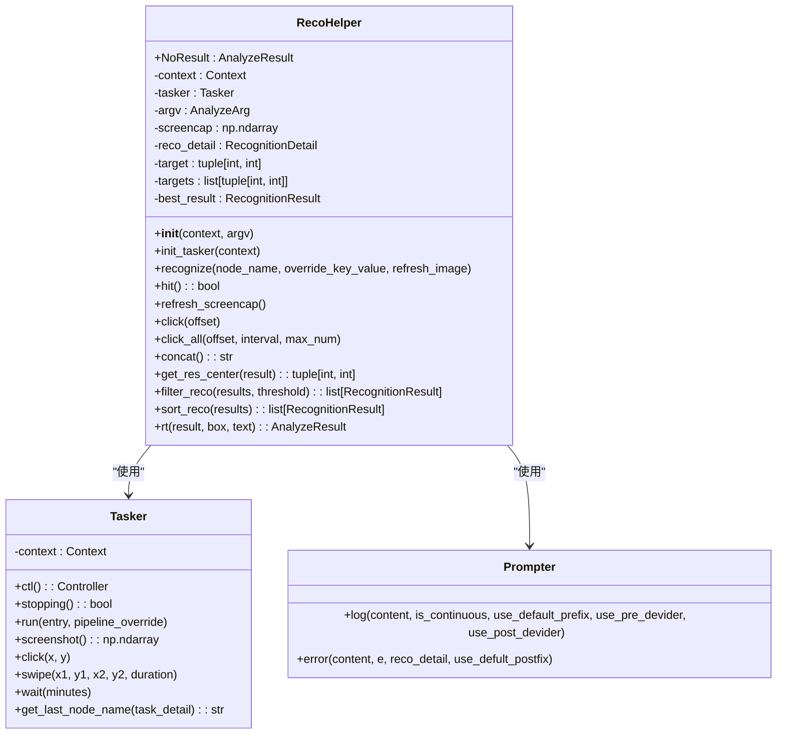
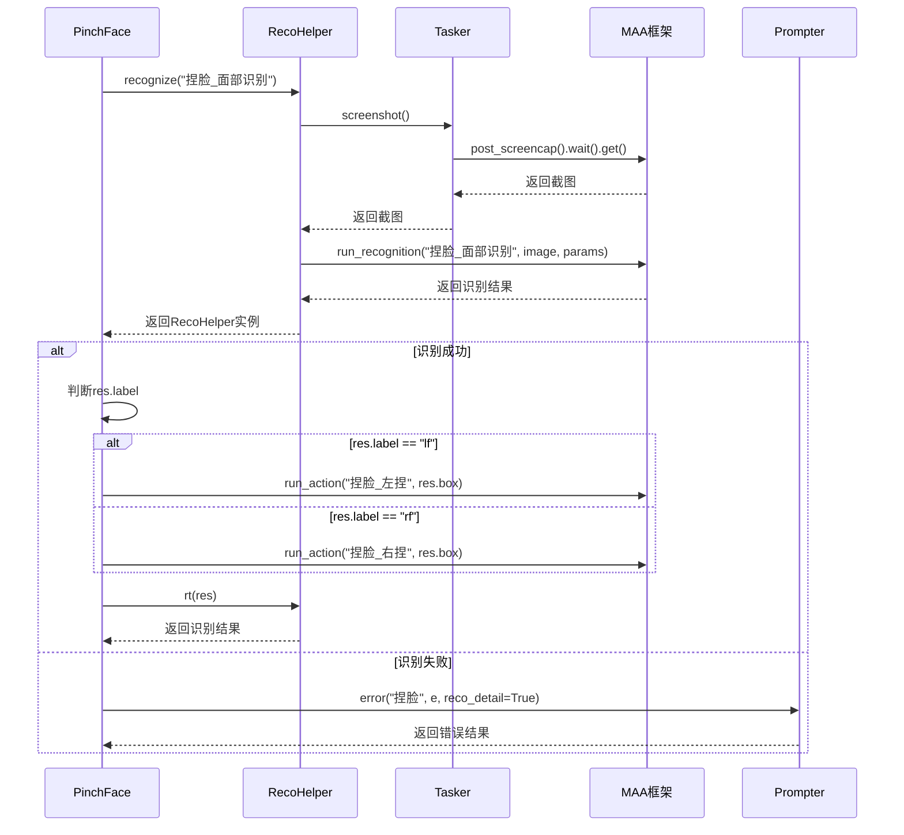
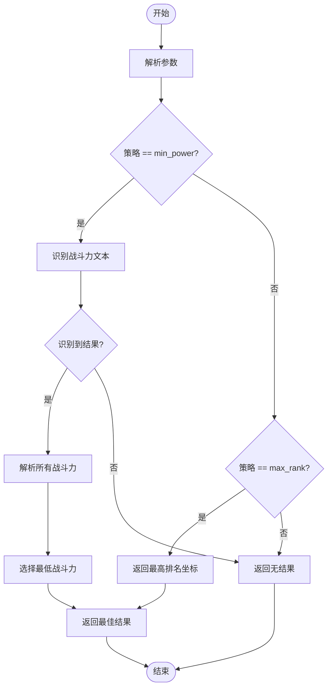
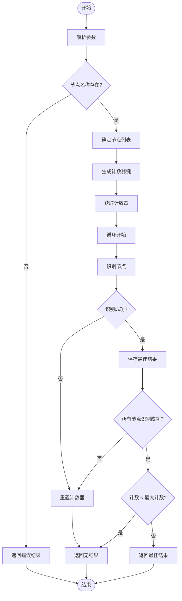
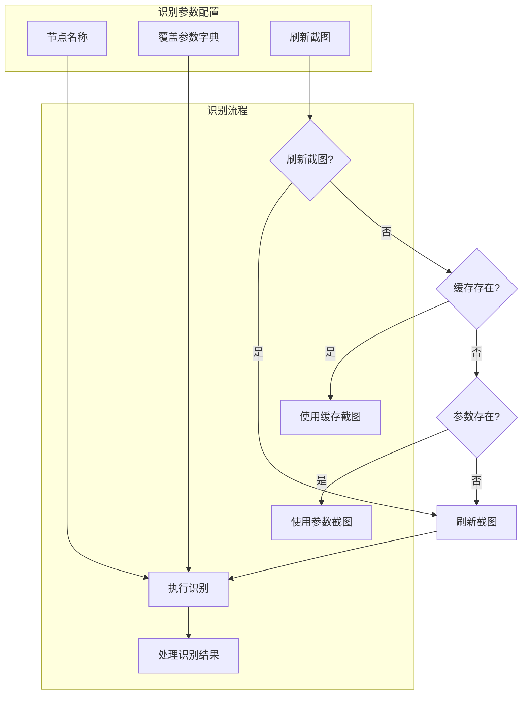

# 识别逻辑实现模式

<cite>
**本文档引用文件**  
- [reco_helper.py](file://agent/customs/maahelper/reco_helper.py)
- [pinch_face.py](file://agent/customs/global_func/pinch_face.py)
- [peak_showdown.py](file://agent/customs/special_treat/peak_showdown.py)
- [tasker.py](file://agent/customs/maahelper/tasker.py)
- [prompter.py](file://agent/customs/utils/prompter.py)
- [matrix_operator.py](file://agent/customs/utils/matrix_operator.py)
- [巅峰对决.json](file://MFAAvalonia/Resource/base/pipeline/日常任务/巅峰对决.json)
- [捏脸.json](file://MFAAvalonia/Resource/base/pipeline/通用/捏脸.json)
- [3.1-任务流水线协议.md](file://instructions/maafw-guide/3.1-任务流水线协议.md)
- [logic_enhance.py](file://agent/customs/global_func/logic_enhance.py)
</cite>

## 目录
1. [引言](#引言)
2. [RecoHelper核心识别模式](#recohelper核心识别模式)
3. [模板匹配识别模式](#模板匹配识别模式)
4. [OCR识别模式](#ocr识别模式)
5. [复合逻辑判断模式](#复合逻辑判断模式)
6. [辅助方法与性能优化](#辅助方法与性能优化)
7. [结论](#结论)

## 引言
本文档系统性地归纳了基于RecoHelper工具类的三种核心识别模式：模板匹配、OCR识别和复合逻辑判断。通过分析pinch_face.py和peak_showdown.py实例，深入解析了基于图像模板的目标检测实现和多状态组合识别的逻辑设计。文档详细说明了RecoHelper.recognize方法的调用约定，包括节点配置映射、ROI区域设置和置信度阈值处理，并提供了filter_reco和sort_reco等辅助方法的使用场景及性能优化建议。

## RecoHelper核心识别模式
RecoHelper类作为识别辅助的核心工具，封装了识别结果处理、点击操作和结果过滤等常用功能。该类通过链式调用设计，提供了简洁的API接口，支持模板匹配、OCR识别和复合逻辑判断等多种识别模式。

**图表来源**  
- [reco_helper.py](file://agent/customs/maahelper/reco_helper.py#L17-L256)
- [tasker.py](file://agent/customs/maahelper/tasker.py#L16-L177)
- [prompter.py](file://agent/customs/utils/prompter.py#L16-L55)

**章节来源**  
- [reco_helper.py](file://agent/customs/maahelper/reco_helper.py#L1-L256)

## 模板匹配识别模式
模板匹配识别模式通过图像模板进行目标检测，是RecoHelper中最基础的识别方式。以pinch_face.py为例，展示了如何通过面部特征识别实现自动化捏脸操作。

在pinch_face.py中，PinchFace类通过@AgentServer.custom_recognition装饰器注册为自定义识别器，其analyze方法实现了核心识别逻辑。该方法首先调用RecoHelper的recognize方法执行"捏脸_面部识别"节点的识别任务，然后根据识别结果执行相应的左捏或右捏动作。

**图表来源**  
- [pinch_face.py](file://agent/customs/global_func/pinch_face.py#L15-L55)
- [reco_helper.py](file://agent/customs/maahelper/reco_helper.py#L62-L94)
- [tasker.py](file://agent/customs/maahelper/tasker.py#L115-L123)

**章节来源**  
- [pinch_face.py](file://agent/customs/global_func/pinch_face.py#L1-L55)
- [reco_helper.py](file://agent/customs/maahelper/reco_helper.py#L62-L94)

## OCR识别模式
OCR识别模式通过光学字符识别技术解析图像中的文本内容，适用于需要识别和处理文本信息的场景。以peak_showdown.py为例，展示了如何通过OCR识别实现巅峰对决中的对手选择逻辑。

在peak_showdown.py中，PickOpponent类实现了选择对手的识别器。该类首先通过ParamAnalyzer解析参数，获取选择策略（最低战力或最高排名）。当策略为"min_power"时，调用RecoHelper识别"巅峰对决_识别战斗力"节点，获取所有对手的战斗力文本，然后通过parse_power函数解析战斗力数值，选择战斗力最低的对手。

**图表来源**  
- [peak_showdown.py](file://agent/customs/special_treat/peak_showdown.py#L51-L96)
- [reco_helper.py](file://agent/customs/maahelper/reco_helper.py#L62-L94)
- [3.1-任务流水线协议.md](file://instructions/maafw-guide/3.1-任务流水线协议.md#L567-L602)

**章节来源**  
- [peak_showdown.py](file://agent/customs/special_treat/peak_showdown.py#L1-L96)
- [reco_helper.py](file://agent/customs/maahelper/reco_helper.py#L62-L94)

## 复合逻辑判断模式
复合逻辑判断模式通过组合多个识别条件实现复杂的识别逻辑，适用于需要多状态组合判断的场景。以logic_enhance.py中的StableReco类为例，展示了如何通过多次连续识别实现稳定识别。

StableReco类的analyze方法实现了稳定识别逻辑。该方法首先解析参数，获取最大计数和节点名称。然后对指定节点进行识别，如果识别成功则累加计数，直到达到阈值才返回识别结果；如果识别失败则重置计数。这种模式可以有效避免因短暂画面抖动导致的误识别。

**图表来源**  
- [logic_enhance.py](file://agent/customs/global_func/logic_enhance.py#L38-L95)
- [reco_helper.py](file://agent/customs/maahelper/reco_helper.py#L62-L94)
- [prompter.py](file://agent/customs/utils/prompter.py#L34-L54)

**章节来源**  
- [logic_enhance.py](file://agent/customs/global_func/logic_enhance.py#L36-L95)
- [reco_helper.py](file://agent/customs/maahelper/reco_helper.py#L62-L94)

## 辅助方法与性能优化
RecoHelper提供了多种辅助方法和性能优化策略，以提高识别效率和准确性。

### recognize方法调用约定
RecoHelper的recognize方法是核心识别接口，其调用约定包括：

- **节点配置映射**：通过node_name参数指定识别节点名称，override_key_value参数用于覆盖节点的参数配置
- **ROI区域设置**：通过配置文件中的roi参数指定识别区域坐标[x, y, w, h]，可限定识别范围以提高效率
- **置信度阈值处理**：通过threshold参数设置识别置信度阈值，默认值为0.7，可根据实际需求调整

**图表来源**  
- [reco_helper.py](file://agent/customs/maahelper/reco_helper.py#L62-L94)
- [3.1-任务流水线协议.md](file://instructions/maafw-guide/3.1-任务流水线协议.md#L432-L448)

### filter_reco和sort_reco方法
RecoHelper提供了filter_reco和sort_reco两个静态方法用于处理识别结果：

- **filter_reco**：根据可信度过滤识别结果，默认阈值为0.7，返回可信度大于等于阈值的结果列表
- **sort_reco**：按可信度对识别结果排序，返回按可信度降序排列的结果列表

这些方法可用于预处理识别结果，提高后续处理的准确性和效率。

### 性能优化建议
基于RecoHelper的使用经验，提出以下性能优化建议：

1. **识别区域裁剪**：通过ROI参数精确限定识别区域，减少不必要的计算
2. **模板图像预处理**：确保模板图片为无损原图缩放到720p后的裁剪，提高匹配精度
3. **异步识别队列设计**：合理设置rate_limit参数，控制识别速率，避免过度消耗系统资源
4. **绿色掩码使用**：对于复杂背景，可使用绿色掩码排除干扰区域，但应避免过度涂抹导致主体特征丢失
5. **算法选择**：推荐使用TM_CCOEFF_NORMED（method=5）算法，具有较好的光照鲁棒性和不敏感的颜色特性

**章节来源**  
- [reco_helper.py](file://agent/customs/maahelper/reco_helper.py#L207-L230)
- [3.1-任务流水线协议.md](file://instructions/maafw-guide/3.1-任务流水线协议.md#L463-L467)
- [捏脸.json](file://MFAAvalonia/Resource/base/pipeline/通用/捏脸.json#L60-L83)
- [巅峰对决.json](file://MFAAvalonia/Resource/base/pipeline/日常任务/巅峰对决.json#L398-L416)

## 结论
本文档系统性地归纳了基于RecoHelper工具类的三种核心识别模式：模板匹配、OCR识别和复合逻辑判断。通过分析pinch_face.py和peak_showdown.py实例，深入解析了基于图像模板的目标检测实现和多状态组合识别的逻辑设计。文档详细说明了RecoHelper.recognize方法的调用约定，包括节点配置映射、ROI区域设置和置信度阈值处理，并提供了filter_reco和sort_reco等辅助方法的使用场景及性能优化建议。这些模式和方法为自动化识别任务提供了强大的支持，可根据具体需求灵活组合使用，实现高效、准确的识别效果。