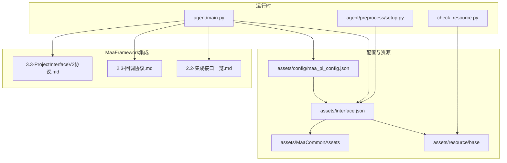
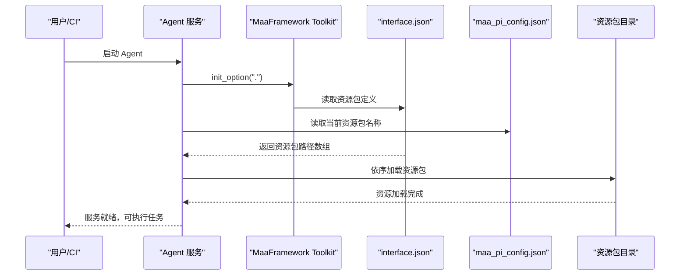
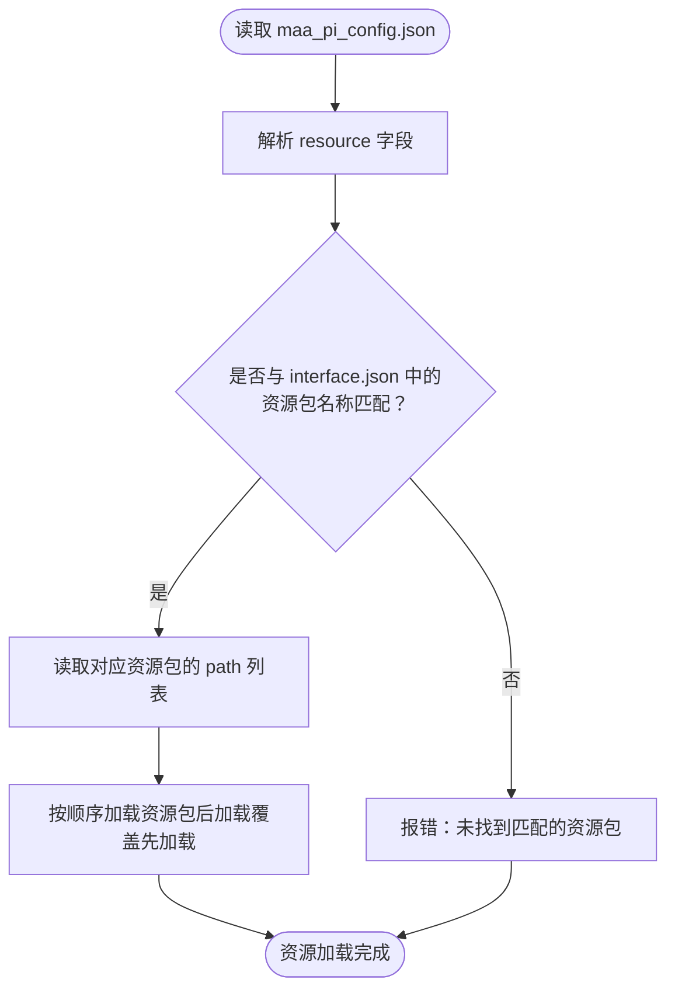
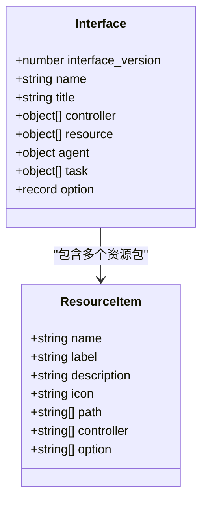
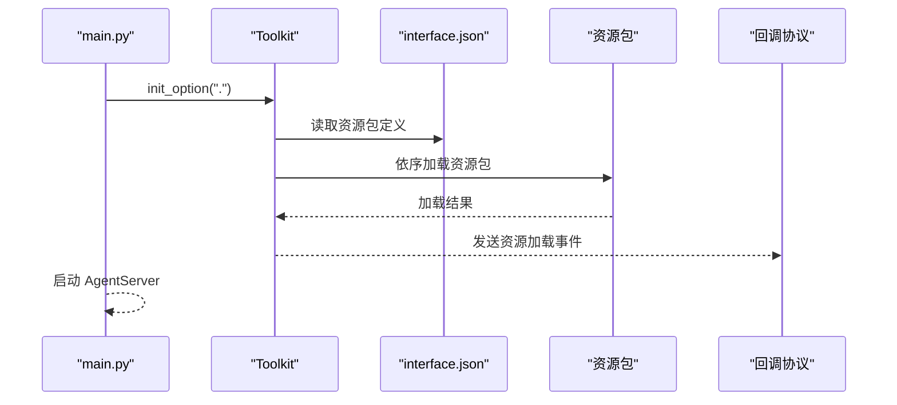
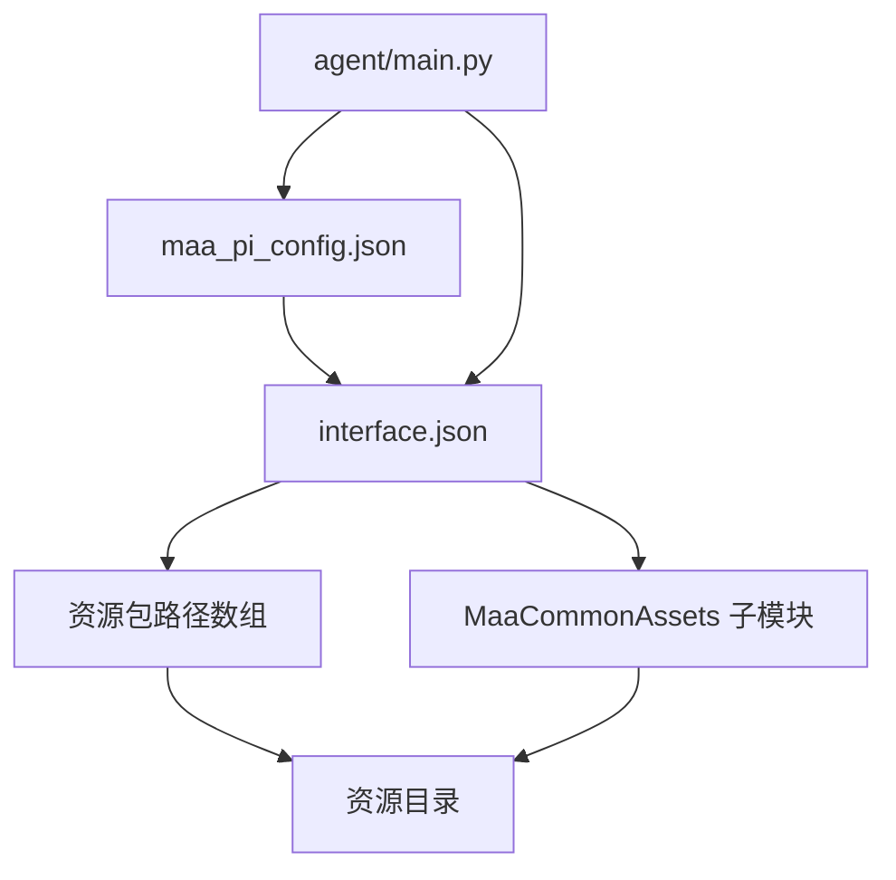

# MaaFramework框架配置

<cite>
**本文档引用的文件**
- [maa_pi_config.json](file://assets/config/maa_pi_config.json)
- [interface.json](file://assets/interface.json)
- [main.py](file://agent/main.py)
- [setup.py](file://agent/preprocess/setup.py)
- [check_resource.py](file://check_resource.py)
- [.gitmodules](file://.gitmodules)
- [2.2-集成接口一览.md](file://instructions/maafw-guide/2.2-集成接口一览.md)
- [2.3-回调协议.md](file://instructions/maafw-guide/2.3-回调协议.md)
- [3.3-ProjectInterfaceV2协议.md](file://instructions/maafw-guide/3.3-ProjectInterfaceV2协议.md)
</cite>

## 目录
1. [简介](#简介)
2. [项目结构](#项目结构)
3. [核心组件](#核心组件)
4. [架构总览](#架构总览)
5. [详细组件分析](#详细组件分析)
6. [依赖关系分析](#依赖关系分析)
7. [性能考虑](#性能考虑)
8. [故障排查指南](#故障排查指南)
9. [结论](#结论)
10. [附录](#附录)

## 简介
本文件深入解析 MaaFramework 在本项目中的配置体系，重点围绕 assets/config/maa_pi_config.json 的配置逻辑，说明 resource 字段如何指定资源包（如"B服"），以及该配置如何影响运行时资源加载路径。我们将阐述该配置文件与 MaaFramework 核心引擎的集成机制，解释其如何指导框架选择正确的资源目录进行自动化操作。同时，文档将给出配置文件的加载时机与优先级规则，提供多资源包配置的最佳实践与故障排查方法。

## 项目结构
本项目的配置与资源组织遵循 MaaFramework 的 ProjectInterface 协议，核心文件包括：
- assets/config/maa_pi_config.json：轻量配置文件，用于指定当前使用的资源包名称
- assets/interface.json：完整的 ProjectInterface 描述文件，定义资源包、任务、控制器等
- agent/main.py：Agent 服务启动入口，负责初始化 Toolkit 并启动服务
- agent/preprocess/setup.py：依赖环境检测与安装模块
- check_resource.py：资源包校验脚本，验证资源目录的有效性
- instructions/maafw-guide：官方集成与协议文档

**图表来源**
- [maa_pi_config.json](file://assets/config/maa_pi_config.json#L1-L3)
- [interface.json](file://assets/interface.json#L1-L1196)
- [main.py](file://agent/main.py#L17-L42)
- [setup.py](file://agent/preprocess/setup.py#L204-L230)
- [check_resource.py](file://check_resource.py#L10-L23)
- [2.2-集成接口一览.md](file://instructions/maafw-guide/2.2-集成接口一览.md#L1-L161)
- [2.3-回调协议.md](file://instructions/maafw-guide/2.3-回调协议.md#L1-L56)
- [3.3-ProjectInterfaceV2协议.md](file://instructions/maafw-guide/3.3-ProjectInterfaceV2协议.md#L1-L425)

**章节来源**
- [maa_pi_config.json](file://assets/config/maa_pi_config.json#L1-L3)
- [interface.json](file://assets/interface.json#L1-L1196)
- [main.py](file://agent/main.py#L17-L42)
- [setup.py](file://agent/preprocess/setup.py#L204-L230)
- [check_resource.py](file://check_resource.py#L10-L23)

## 核心组件
- maa_pi_config.json：包含单一字段 resource，用于声明当前使用的资源包名称。该文件通常由用户或自动化流程维护，决定运行时加载哪个资源包。
- interface.json：定义资源包、任务、控制器、选项等完整元数据。其中 resource 数组定义了可用的资源包及其路径，path 字段为相对路径数组，支持多路径叠加与覆盖。
- Agent 启动流程：agent/main.py 在启动时调用 Toolkit.init_option(".")，随后启动 AgentServer 并进入服务循环。该初始化过程会触发 MaaFramework 的全局选项设置与资源加载流程。
- 资源校验：check_resource.py 提供资源包有效性检查能力，通过 post_bundle 验证资源目录结构与内容。

**章节来源**
- [maa_pi_config.json](file://assets/config/maa_pi_config.json#L1-L3)
- [interface.json](file://assets/interface.json#L29-L34)
- [main.py](file://agent/main.py#L25-L37)
- [check_resource.py](file://check_resource.py#L10-L23)

## 架构总览
MaaFramework 在本项目中的集成流程如下：
- 启动阶段：Agent 通过 Toolkit.init_option(".") 初始化全局选项，随后加载 interface.json 中的资源包定义。
- 资源包选择：maa_pi_config.json 的 resource 字段用于确定当前使用的资源包名称，框架据此定位 interface.json 中对应资源包的 path 列表。
- 资源加载：框架按 path 数组顺序加载资源，后加载的资源会覆盖先前加载的同名资源，形成最终的资源集。
- 运行阶段：Tasker 执行任务流水线，使用已加载的资源（pipeline、OCR 模型、图片等）完成自动化操作。

**图表来源**
- [main.py](file://agent/main.py#L25-L37)
- [interface.json](file://assets/interface.json#L29-L34)
- [maa_pi_config.json](file://assets/config/maa_pi_config.json#L1-L3)

## 详细组件分析

### maa_pi_config.json 配置逻辑
- 字段含义：resource 表示当前使用的资源包名称，必须与 interface.json 中 resource 数组的某一项 name 字段一致。
- 影响范围：该配置直接影响框架在启动时选择哪一组 path 进行资源加载。若名称不匹配，框架将无法找到对应资源包，导致资源加载失败。
- 作用机制：框架在初始化时会读取该文件，结合 interface.json 的资源包定义，定位到具体资源目录并按顺序加载。

**图表来源**
- [maa_pi_config.json](file://assets/config/maa_pi_config.json#L1-L3)
- [interface.json](file://assets/interface.json#L29-L34)

**章节来源**
- [maa_pi_config.json](file://assets/config/maa_pi_config.json#L1-L3)
- [interface.json](file://assets/interface.json#L29-L34)

### interface.json 与资源包定义
- 资源包结构：resource 数组中的每个对象包含 name、label、path 等字段。path 为字符串数组，支持多路径叠加与覆盖。
- 路径解析：path 中的相对路径基于 interface.json 所在目录进行解析，最终指向实际资源目录（如 ./resource/base）。
- 多资源包支持：可通过添加多个资源包对象实现多资源包配置，配合 maa_pi_config.json 的 resource 字段切换。

**图表来源**
- [interface.json](file://assets/interface.json#L29-L34)
- [3.3-ProjectInterfaceV2协议.md](file://instructions/maafw-guide/3.3-ProjectInterfaceV2协议.md#L173-L225)

**章节来源**
- [interface.json](file://assets/interface.json#L29-L34)
- [3.3-ProjectInterfaceV2协议.md](file://instructions/maafw-guide/3.3-ProjectInterfaceV2协议.md#L173-L225)

### Agent 启动与资源加载集成
- 启动流程：agent/main.py 在 main() 中调用 Toolkit.init_option(".")，随后启动 AgentServer 并进入服务循环。
- 集成要点：init_option(".") 指定工作目录为项目根目录，框架在此目录下查找 interface.json 并加载资源包定义。
- 事件回调：通过回调协议，框架可在资源加载开始、成功、失败时发出通知，便于监控与排障。

**图表来源**
- [main.py](file://agent/main.py#L25-L37)
- [2.3-回调协议.md](file://instructions/maafw-guide/2.3-回调协议.md#L26-L56)

**章节来源**
- [main.py](file://agent/main.py#L25-L37)
- [2.3-回调协议.md](file://instructions/maafw-guide/2.3-回调协议.md#L26-L56)

### 资源包校验与最佳实践
- 校验脚本：check_resource.py 提供资源包有效性检查，通过 post_bundle 验证资源目录结构与内容。
- 最佳实践：
  - 将资源包路径设置为相对路径，确保在不同环境下的一致性
  - 使用多路径叠加时，明确覆盖顺序，避免关键资源被意外覆盖
  - 为不同服务器/渠道提供独立资源包，通过 maa_pi_config.json 切换
  - 在 CI 中集成资源包校验，确保部署前资源有效

**章节来源**
- [check_resource.py](file://check_resource.py#L10-L23)
- [3.3-ProjectInterfaceV2协议.md](file://instructions/maafw-guide/3.3-ProjectInterfaceV2协议.md#L193-L197)

## 依赖关系分析
- maa_pi_config.json 依赖 interface.json 中的资源包定义，二者必须保持名称一致
- Agent 启动依赖 Toolkit.init_option(".")，框架在此目录下解析 interface.json
- 资源加载依赖 interface.json 中的 path 数组，按顺序加载并覆盖
- 子模块 assets/MaaCommonAssets 为公共资源包，可作为资源包的一部分被加载

**图表来源**
- [.gitmodules](file://.gitmodules#L1-L3)
- [interface.json](file://assets/interface.json#L29-L34)
- [main.py](file://agent/main.py#L25-L37)

**章节来源**
- [.gitmodules](file://.gitmodules#L1-L3)
- [interface.json](file://assets/interface.json#L29-L34)
- [main.py](file://agent/main.py#L25-L37)

## 性能考虑
- 资源加载顺序：后加载的资源会覆盖先前加载的同名资源，合理安排 path 顺序可减少不必要的覆盖
- 资源大小：大型 OCR 模型与图片会增加加载时间，建议按需加载与缓存
- 日志与调试：通过全局选项设置日志级别与可视化质量，平衡性能与可观测性

## 故障排查指南
- 配置无效
  - 检查 maa_pi_config.json 中的 resource 名称是否与 interface.json 中某资源包的 name 一致
  - 确认 interface.json 的 resource 数组中包含该资源包定义
- 资源加载失败
  - 使用 check_resource.py 对资源目录进行校验，确认资源包结构与内容有效
  - 查看回调协议中的资源加载事件，定位失败阶段与原因
- 路径解析问题
  - 确认 interface.json 中的 path 为相对路径，基于其所在目录解析
  - 在 CI 环境中，确保工作目录正确，避免相对路径解析偏差
- 多资源包冲突
  - 检查 path 数组的顺序，确认后加载资源是否正确覆盖了预期资源
  - 为不同资源包设置独立的 path，避免相互覆盖

**章节来源**
- [check_resource.py](file://check_resource.py#L10-L23)
- [2.3-回调协议.md](file://instructions/maafw-guide/2.3-回调协议.md#L26-L56)
- [3.3-ProjectInterfaceV2协议.md](file://instructions/maafw-guide/3.3-ProjectInterfaceV2协议.md#L193-L197)

## 结论
maa_pi_config.json 通过 resource 字段与 interface.json 的资源包定义建立强关联，指导 MaaFramework 在启动时选择正确的资源包并按顺序加载。结合 Toolkit.init_option(".") 的初始化流程与回调协议的事件通知，项目实现了清晰、可控的资源加载机制。通过合理的多资源包配置与严格的校验流程，可显著提升自动化任务的稳定性与可维护性。

## 附录
- 集成接口参考：MaaFramework 提供的全局选项与资源接口，用于配置日志、调试模式、插件加载等
- 回调协议：统一的消息格式与资源加载事件类型，便于监控与排障
- ProjectInterface V2：完整的资源包、任务、控制器与选项定义规范

**章节来源**
- [2.2-集成接口一览.md](file://instructions/maafw-guide/2.2-集成接口一览.md#L23-L161)
- [2.3-回调协议.md](file://instructions/maafw-guide/2.3-回调协议.md#L1-L56)
- [3.3-ProjectInterfaceV2协议.md](file://instructions/maafw-guide/3.3-ProjectInterfaceV2协议.md#L1-L425)