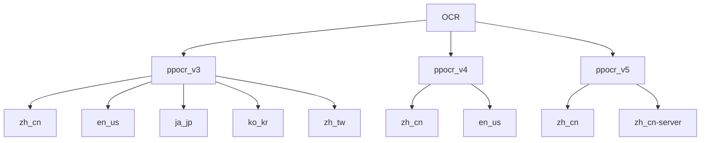
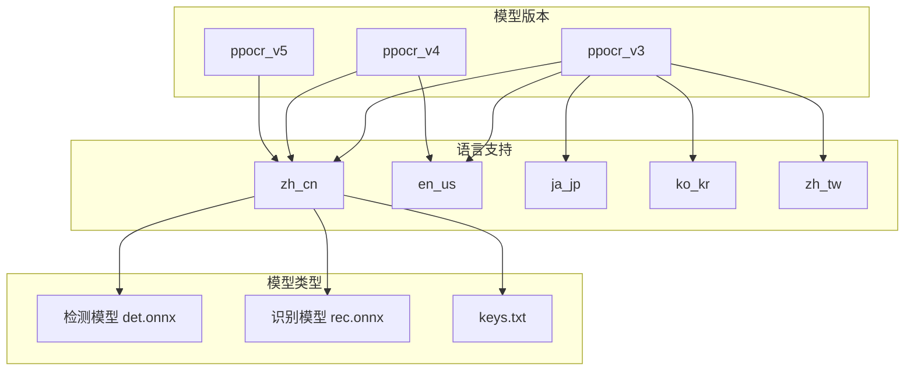
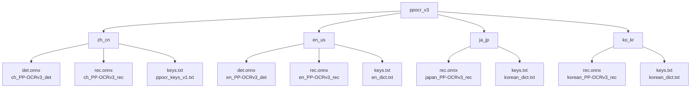
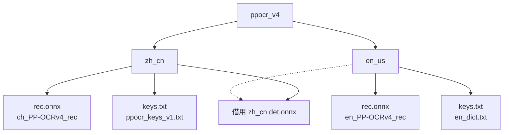
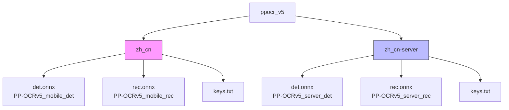
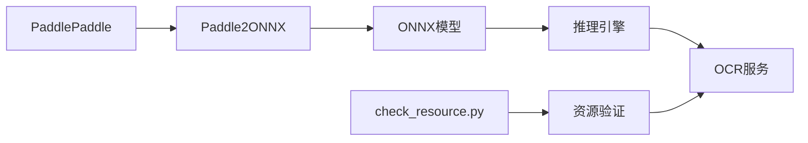

# OCR模型资源管理

<cite>
**本文档引用的文件**  
- [assets/MaaCommonAssets/OCR/README.md](file://assets/MaaCommonAssets/OCR/README.md)
- [assets/MaaCommonAssets/OCR/ppocr_v3/zh_cn/README.md](file://assets/MaaCommonAssets/OCR/ppocr_v3/zh_cn/README.md)
- [assets/MaaCommonAssets/OCR/ppocr_v3/en_us/README.md](file://assets/MaaCommonAssets/OCR/ppocr_v3/en_us/README.md)
- [assets/MaaCommonAssets/OCR/ppocr_v3/ja_jp/README.md](file://assets/MaaCommonAssets/OCR/ppocr_v3/ja_jp/README.md)
- [assets/MaaCommonAssets/OCR/ppocr_v3/ko_kr/README.md](file://assets/MaaCommonAssets/OCR/ppocr_v3/ko_kr/README.md)
- [assets/MaaCommonAssets/OCR/ppocr_v3/zh_tw/README.md](file://assets/MaaCommonAssets/OCR/ppocr_v3/zh_tw/README.md)
- [assets/MaaCommonAssets/OCR/ppocr_v4/zh_cn/README.md](file://assets/MaaCommonAssets/OCR/ppocr_v4/zh_cn/README.md)
- [assets/MaaCommonAssets/OCR/ppocr_v4/en_us/README.md](file://assets/MaaCommonAssets/OCR/ppocr_v4/en_us/README.md)
- [assets/MaaCommonAssets/OCR/ppocr_v5/README.md](file://assets/MaaCommonAssets/OCR/ppocr_v5/README.md)
- [assets/MaaCommonAssets/OCR/ppocr_v5/zh_cn/README.md](file://assets/MaaCommonAssets/OCR/ppocr_v5/zh_cn/README.md)
- [assets/MaaCommonAssets/OCR/ppocr_v5/zh_cn-server/README.md](file://assets/MaaCommonAssets/OCR/ppocr_v5/zh_cn-server/README.md)
- [assets/MaaCommonAssets/OCR/ppocr_v3/zh_cn/keys.txt](file://assets/MaaCommonAssets/OCR/ppocr_v3/zh_cn/keys.txt)
- [assets/MaaCommonAssets/OCR/ppocr_v4/zh_cn/keys.txt](file://assets/MaaCommonAssets/OCR/ppocr_v4/zh_cn/keys.txt)
- [assets/MaaCommonAssets/OCR/ppocr_v5/zh_cn/keys.txt](file://assets/MaaCommonAssets/OCR/ppocr_v5/zh_cn/keys.txt)
- [check_resource.py](file://check_resource.py)
</cite>

## 目录

1. [引言](#引言)
2. [项目结构](#项目结构)
3. [核心组件](#核心组件)
4. [架构概述](#架构概述)
5. [详细组件分析](#详细组件分析)
6. [依赖分析](#依赖分析)
7. [性能考虑](#性能考虑)
8. [故障排除指南](#故障排除指南)
9. [结论](#结论)

## 引言

本文档系统化地描述了OCR资源管理体系，重点对比分析ppocr_v3、v4、v5三个版本的技术差异和适用场景。详细说明各语言版本（zh_cn、en_us、ja_jp等）的目录结构和keys.txt字典文件的作用，解释多语言OCR模型的加载策略和自动选择机制，阐述版本升级时的兼容性考虑和迁移路径，并提供OCR识别精度优化建议和自定义模型替换指南。

## 项目结构

OCR资源管理体系位于`assets/MaaCommonAssets/OCR/`目录下，采用版本化管理策略，包含ppocr_v3、ppocr_v4、ppocr_v5三个主要版本。每个版本目录下按语言代码（如zh_cn、en_us、ja_jp）组织模型文件，形成清晰的层级结构。

**图示来源**  
- [assets/MaaCommonAssets/OCR/](file://assets/MaaCommonAssets/OCR/)

**本节来源**  
- [assets/MaaCommonAssets/OCR/README.md](file://assets/MaaCommonAssets/OCR/README.md)

## 核心组件

OCR资源管理体系的核心组件包括三个主要版本的模型：ppocr_v3、ppocr_v4和ppocr_v5。每个版本提供文本检测（det）和文本识别（rec）两个子模型，支持多种语言识别。系统通过keys.txt文件定义字符字典，确保识别结果的准确性。

**本节来源**  
- [assets/MaaCommonAssets/OCR/README.md](file://assets/MaaCommonAssets/OCR/README.md)
- [assets/MaaCommonAssets/OCR/ppocr_v3/zh_cn/README.md](file://assets/MaaCommonAssets/OCR/ppocr_v3/zh_cn/README.md)
- [assets/MaaCommonAssets/OCR/ppocr_v4/zh_cn/README.md](file://assets/MaaCommonAssets/OCR/ppocr_v4/zh_cn/README.md)
- [assets/MaaCommonAssets/OCR/ppocr_v5/zh_cn/README.md](file://assets/MaaCommonAssets/OCR/ppocr_v5/zh_cn/README.md)

## 架构概述

OCR资源管理体系采用分层架构设计，上层为版本管理，中层为语言分类，底层为具体模型文件。系统支持ONNX格式的模型转换，通过Paddle2ONNX工具将PaddlePaddle模型转换为ONNX格式，以提高跨平台兼容性和推理效率。

**图示来源**  
- [assets/MaaCommonAssets/OCR/README.md](file://assets/MaaCommonAssets/OCR/README.md)
- [assets/MaaCommonAssets/OCR/ppocr_v3/zh_cn/README.md](file://assets/MaaCommonAssets/OCR/ppocr_v3/zh_cn/README.md)

## 详细组件分析

### ppocr_v3 分析

ppocr_v3是最早的版本，提供完整的多语言支持。中文模型（zh_cn）支持中英文混合检测和识别，英文模型（en_us）专注于英文识别。日文（ja_jp）和韩文（ko_kr）模型使用独立的识别模型，但检测模型建议使用中文版本。

**图示来源**  
- [assets/MaaCommonAssets/OCR/ppocr_v3/zh_cn/README.md](file://assets/MaaCommonAssets/OCR/ppocr_v3/zh_cn/README.md)
- [assets/MaaCommonAssets/OCR/ppocr_v3/en_us/README.md](file://assets/MaaCommonAssets/OCR/ppocr_v3/en_us/README.md)
- [assets/MaaCommonAssets/OCR/ppocr_v3/ja_jp/README.md](file://assets/MaaCommonAssets/OCR/ppocr_v3/ja_jp/README.md)
- [assets/MaaCommonAssets/OCR/ppocr_v3/ko_kr/README.md](file://assets/MaaCommonAssets/OCR/ppocr_v3/ko_kr/README.md)

**本节来源**  
- [assets/MaaCommonAssets/OCR/ppocr_v3/zh_cn/README.md](file://assets/MaaCommonAssets/OCR/ppocr_v3/zh_cn/README.md)
- [assets/MaaCommonAssets/OCR/ppocr_v3/en_us/README.md](file://assets/MaaCommonAssets/OCR/ppocr_v3/en_us/README.md)
- [assets/MaaCommonAssets/OCR/ppocr_v3/ja_jp/README.md](file://assets/MaaCommonAssets/OCR/ppocr_v3/ja_jp/README.md)
- [assets/MaaCommonAssets/OCR/ppocr_v3/ko_kr/README.md](file://assets/MaaCommonAssets/OCR/ppocr_v3/ko_kr/README.md)

### ppocr_v4 分析

ppocr_v4是中间版本，技术上有所改进。中文模型（zh_cn）提供更新的检测和识别模型，支持中英文混合识别。英文模型（en_us）仅提供识别模型，检测模型需借用其他版本。

**图示来源**  
- [assets/MaaCommonAssets/OCR/ppocr_v4/zh_cn/README.md](file://assets/MaaCommonAssets/OCR/ppocr_v4/zh_cn/README.md)
- [assets/MaaCommonAssets/OCR/ppocr_v4/en_us/README.md](file://assets/MaaCommonAssets/OCR/ppocr_v4/en_us/README.md)

**本节来源**  
- [assets/MaaCommonAssets/OCR/ppocr_v4/zh_cn/README.md](file://assets/MaaCommonAssets/OCR/ppocr_v4/zh_cn/README.md)
- [assets/MaaCommonAssets/OCR/ppocr_v4/en_us/README.md](file://assets/MaaCommonAssets/OCR/ppocr_v4/en_us/README.md)

### ppocr_v5 分析

ppocr_v5是最新版本，采用单一模型支持多语言识别。根据部署环境分为移动端（zh_cn）和服务端（zh_cn-server）两个子版本，均支持简体中文、繁体中文、英文和日文识别。

**图示来源**  
- [assets/MaaCommonAssets/OCR/ppocr_v5/README.md](file://assets/MaaCommonAssets/OCR/ppocr_v5/README.md)
- [assets/MaaCommonAssets/OCR/ppocr_v5/zh_cn/README.md](file://assets/MaaCommonAssets/OCR/ppocr_v5/zh_cn/README.md)
- [assets/MaaCommonAssets/OCR/ppocr_v5/zh_cn-server/README.md](file://assets/MaaCommonAssets/OCR/ppocr_v5/zh_cn-server/README.md)

**本节来源**  
- [assets/MaaCommonAssets/OCR/ppocr_v5/README.md](file://assets/MaaCommonAssets/OCR/ppocr_v5/README.md)
- [assets/MaaCommonAssets/OCR/ppocr_v5/zh_cn/README.md](file://assets/MaaCommonAssets/OCR/ppocr_v5/zh_cn/README.md)
- [assets/MaaCommonAssets/OCR/ppocr_v5/zh_cn-server/README.md](file://assets/MaaCommonAssets/OCR/ppocr_v5/zh_cn-server/README.md)

### keys.txt 字典文件作用

keys.txt文件是OCR模型的字符字典，定义了模型能够识别的字符集合。不同语言版本使用不同的字典文件：

- **zh_cn**: 使用ppocr_keys_v1.txt，包含中文、英文、数字及常用符号
- **en_us**: 使用en_dict.txt，主要包含英文字符和数字
- **ja_jp/ko_kr**: 使用korean_dict.txt，包含日韩文字符
- **zh_tw**: 使用chinese_cht_dict.txt，包含繁体中文字符

字典文件直接影响识别准确率，自定义模型时需要确保字典文件与训练数据一致。

**本节来源**  
- [assets/MaaCommonAssets/OCR/ppocr_v3/zh_cn/keys.txt](file://assets/MaaCommonAssets/OCR/ppocr_v3/zh_cn/keys.txt)
- [assets/MaaCommonAssets/OCR/ppocr_v4/zh_cn/keys.txt](file://assets/MaaCommonAssets/OCR/ppocr_v4/zh_cn/keys.txt)
- [assets/MaaCommonAssets/OCR/ppocr_v5/zh_cn/keys.txt](file://assets/MaaCommonAssets/OCR/ppocr_v5/zh_cn/keys.txt)

## 依赖分析

OCR资源管理体系依赖于PaddlePaddle深度学习框架，通过Paddle2ONNX工具转换为ONNX格式以提高兼容性。系统通过check_resource.py脚本验证资源完整性，确保所有模型文件正确加载。

**图示来源**  
- [assets/MaaCommonAssets/OCR/README.md](file://assets/MaaCommonAssets/OCR/README.md)
- [check_resource.py](file://check_resource.py)

**本节来源**  
- [assets/MaaCommonAssets/OCR/README.md](file://assets/MaaCommonAssets/OCR/README.md)
- [check_resource.py](file://check_resource.py)

## 性能考虑

不同版本的OCR模型在性能和精度上有明显差异：

- **ppocr_v3**: 兼容性最好，但精度相对较低
- **ppocr_v4**: 精度有所提升，但多语言支持不完整
- **ppocr_v5**: 精度最高，支持单一模型多语言识别，但资源占用较大

移动端模型（mobile）优化了推理速度，适合资源受限环境；服务端模型（server）追求最高精度，适合高性能服务器部署。

## 故障排除指南

当OCR识别出现问题时，可按以下步骤排查：

1. 检查模型文件完整性，使用check_resource.py验证
2. 确认keys.txt字典文件与模型版本匹配
3. 对于日文/韩文识别，确保使用正确的识别模型
4. 英文检测可借用中文检测模型
5. 版本升级时注意字典文件的兼容性

**本节来源**  
- [check_resource.py](file://check_resource.py)
- [assets/MaaCommonAssets/OCR/ppocr_v3/ja_jp/README.md](file://assets/MaaCommonAssets/OCR/ppocr_v3/ja_jp/README.md)
- [assets/MaaCommonAssets/OCR/ppocr_v4/en_us/README.md](file://assets/MaaCommonAssets/OCR/ppocr_v4/en_us/README.md)

## 结论

OCR资源管理体系通过版本化管理（v3、v4、v5）实现了技术演进与兼容性平衡。建议新项目使用ppocr_v5版本以获得最佳识别效果，现有项目可根据需求逐步迁移。多语言支持通过独立的语言目录实现，keys.txt字典文件是确保识别准确性的关键。未来可进一步优化模型自动选择机制，根据输入内容智能切换最佳模型。