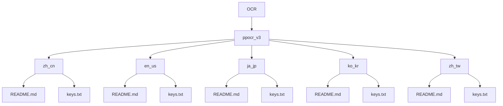

# ppocr_v3 模型管理

<cite>
**本文档引用文件**  
- [zh_cn/README.md](file://assets/MaaCommonAssets/OCR/ppocr_v3/zh_cn/README.md)
- [en_us/README.md](file://assets/MaaCommonAssets/OCR/ppocr_v3/en_us/README.md)
- [ja_jp/README.md](file://assets/MaaCommonAssets/OCR/ppocr_v3/ja_jp/README.md)
- [ko_kr/README.md](file://assets/MaaCommonAssets/OCR/ppocr_v3/ko_kr/README.md)
- [zh_tw/README.md](file://assets/MaaCommonAssets/OCR/ppocr_v3/zh_tw/README.md)
- [zh_cn/keys.txt](file://assets/MaaCommonAssets/OCR/ppocr_v3/zh_cn/keys.txt)
- [en_us/keys.txt](file://assets/MaaCommonAssets/OCR/ppocr_v3/en_us/keys.txt)
- [ja_jp/keys.txt](file://assets/MaaCommonAssets/OCR/ppocr_v3/ja_jp/keys.txt)
- [ko_kr/keys.txt](file://assets/MaaCommonAssets/OCR/ppocr_v3/ko_kr/keys.txt)
- [zh_tw/keys.txt](file://assets/MaaCommonAssets/OCR/ppocr_v3/zh_tw/keys.txt)
- [OCR/README.md](file://assets/MaaCommonAssets/OCR/README.md)
- [configure.py](file://tools/configure.py)
- [任务流水线协议.md](file://instructions/maafw-guide/3.1-任务流水线协议.md)
- [base/model/ocr/README.md](file://assets/resource/base/model/ocr/README.md)
</cite>

## 目录

1. [项目结构](#项目结构)  
2. [多语言支持与适用场景](#多语言支持与适用场景)  
3. [配置说明与字符字典机制](#配置说明与字符字典机制)  
4. [识别精度与性能表现](#识别精度与性能表现)  
5. [加载策略与调用示例](#加载策略与调用示例)  
6. [游戏自动化应用场景](#游戏自动化应用场景)  
7. [常见识别错误与优化建议](#常见识别错误与优化建议)  
8. [从v3到更高版本的迁移注意事项](#从v3到更高版本的迁移注意事项)

## 项目结构

ppocr_v3 OCR模型位于项目`assets/MaaCommonAssets/OCR/`目录下，采用多语言子目录结构，每个语言子目录包含独立的模型配置文件和字符字典。该结构支持灵活的多语言识别切换。



**图示来源**  
- [zh_cn/README.md](file://assets/MaaCommonAssets/OCR/ppocr_v3/zh_cn/README.md)
- [en_us/README.md](file://assets/MaaCommonAssets/OCR/ppocr_v3/en_us/README.md)
- [ja_jp/README.md](file://assets/MaaCommonAssets/OCR/ppocr_v3/ja_jp/README.md)
- [ko_kr/README.md](file://assets/MaaCommonAssets/OCR/ppocr_v3/ko_kr/README.md)
- [zh_tw/README.md](file://assets/MaaCommonAssets/OCR/ppocr_v3/zh_tw/README.md)

**本节来源**  
- [assets/MaaCommonAssets/OCR/ppocr_v3](file://assets/MaaCommonAssets/OCR/ppocr_v3)

## 多语言支持与适用场景

ppocr_v3版本提供对`zh_cn`（简体中文）、`en_us`（英文）、`ja_jp`（日文）、`ko_kr`（韩文）和`zh_tw`（繁体中文）五种语言的支持，每种语言均有独立的识别模型和字符集配置。

- **zh_cn**：适用于简体中文文本识别，支持中英文混合场景，检测与识别模型均为轻量级，适合移动端部署。
- **en_us**：专为英文文本优化，适用于纯英文界面或英文为主的混合文本识别。
- **ja_jp**：仅提供识别模型（`japan_PP-OCRv3_rec`），检测模型建议使用`ppocr_v4`的中文检测模型，适用于日文文本识别。
- **ko_kr**：仅提供识别模型（`korean_PP-OCRv3_rec`），检测模型同样建议使用`ppocr_v4`的中文检测模型，适用于韩文文本识别。
- **zh_tw**：使用`chinese_cht_PP-OCRv3_rec`模型，专为繁体中文设计，适用于港澳台地区文本识别。

**本节来源**  
- [zh_cn/README.md](file://assets/MaaCommonAssets/OCR/ppocr_v3/zh_cn/README.md)
- [en_us/README.md](file://assets/MaaCommonAssets/OCR/ppocr_v3/en_us/README.md)
- [ja_jp/README.md](file://assets/MaaCommonAssets/OCR/ppocr_v3/ja_jp/README.md)
- [ko_kr/README.md](file://assets/MaaCommonAssets/OCR/ppocr_v3/ko_kr/README.md)
- [zh_tw/README.md](file://assets/MaaCommonAssets/OCR/ppocr_v3/zh_tw/README.md)

## 配置说明与字符字典机制

各语言子目录中的`README.md`文件提供了模型的详细配置说明，包括模型名称、功能描述及下载链接。`keys.txt`文件是字符字典，定义了模型可识别的字符集合，其作用机制如下：

- **字符映射**：模型在识别过程中将图像特征映射到`keys.txt`中定义的字符索引，最终输出对应字符。
- **顺序敏感**：字符在`keys.txt`中的行号即为其ID，模型输出的字符ID需与字典行号严格对应。
- **语言覆盖**：不同语言的`keys.txt`包含各自语言的字符集，如`zh_cn/keys.txt`包含6623个常用汉字及符号，`en_us/keys.txt`包含96个ASCII字符。

例如，`en_us/keys.txt`仅包含基础ASCII字符，适合英文识别；而`zh_cn/keys.txt`包含大量汉字，支持复杂中文场景。

**本节来源**  
- [zh_cn/keys.txt](file://assets/MaaCommonAssets/OCR/ppocr_v3/zh_cn/keys.txt)
- [en_us/keys.txt](file://assets/MaaCommonAssets/OCR/ppocr_v3/en_us/keys.txt)
- [ja_jp/keys.txt](file://assets/MaaCommonAssets/OCR/ppocr_v3/ja_jp/keys.txt)
- [ko_kr/keys.txt](file://assets/MaaCommonAssets/OCR/ppocr_v3/ko_kr/keys.txt)
- [zh_tw/keys.txt](file://assets/MaaCommonAssets/OCR/ppocr_v3/zh_tw/keys.txt)

## 识别精度与性能表现

ppocr_v3模型在不同语言下的识别精度和性能表现如下：

- **中文（zh_cn）**：检测与识别模型均为轻量级，支持中英文混合，精度高，适用于复杂中文界面。
- **英文（en_us）**：专为英文优化，识别速度快，精度高。
- **日文（ja_jp）与韩文（ko_kr）**：仅提供识别模型，需配合`ppocr_v4`的检测模型使用，整体性能依赖于检测模型的准确性。
- **繁体中文（zh_tw）**：使用专用模型，对繁体字识别效果良好。

整体而言，ppocr_v3在中文和英文场景下表现优异，但在日文和韩文场景下需额外配置检测模型，增加了复杂性。

**本节来源**  
- [zh_cn/README.md](file://assets/MaaCommonAssets/OCR/ppocr_v3/zh_cn/README.md)
- [en_us/README.md](file://assets/MaaCommonAssets/OCR/ppocr_v3/en_us/README.md)
- [ja_jp/README.md](file://assets/MaaCommonAssets/OCR/ppocr_v3/ja_jp/README.md)
- [ko_kr/README.md](file://assets/MaaCommonAssets/OCR/ppocr_v3/ko_kr/README.md)
- [zh_tw/README.md](file://assets/MaaCommonAssets/OCR/ppocr_v3/zh_tw/README.md)

## 加载策略与调用示例

### 加载策略配置

根据[任务流水线协议.md](file://instructions/maafw-guide/3.1-任务流水线协议.md)，可通过`model`字段指定模型文件夹路径，使用`model/ocr`的相对路径。文件夹中需包含`rec.onnx`、`det.onnx`和`keys.txt`三个文件。

```json
{
  "algorithm": "OCR",
  "model": "zh_cn",
  "threshold": 0.7,
  "expected": "开始游戏"
}
```

### 实际调用示例

在代码中通过`reco_helper.py`进行OCR识别：

```python
from agent.customs.maahelper.reco_helper import RecoHelper

# 获取识别结果
results = RecoHelper.filter_reco(ocr_results, threshold=0.7)
sorted_results = RecoHelper.sort_reco(results)
```

**本节来源**  
- [任务流水线协议.md](file://instructions/maafw-guide/3.1-任务流水线协议.md)
- [reco_helper.py](file://agent/customs/maahelper/reco_helper.py)

## 游戏自动化应用场景

在游戏自动化中，ppocr_v3可用于识别游戏内的文本元素，如关卡名称、任务提示、资源数量等。例如，在“克隆工厂”关卡选择中，通过OCR识别关卡编号并自动点击：

```python
# 伪代码示例
def select_level(level):
    ocr_result = recognize_text(roi=(x, y, w, h))
    if ocr_result.text == str(level):
        click_position(ocr_result.box)
```

该技术可广泛应用于日常任务、活动界面、资源管理等自动化流程。

**本节来源**  
- [eat_sugar.py](file://agent/customs/special_treat/eat_sugar.py)

## 常见识别错误与优化建议

### 常见错误
- **字符混淆**：相似字符（如“日”与“曰”）易混淆。
- **低置信度**：复杂背景或模糊字体导致识别置信度低。
- **多语言干扰**：混合语言文本可能导致识别错误。

### 调试方法
- **调整阈值**：通过`threshold`参数过滤低置信度结果。
- **ROI精确设置**：使用`only_rec`模式，精确设置识别区域。
- **后处理替换**：利用`replace`字段对常见错误进行文本替换。

**本节来源**  
- [reco_helper.py](file://agent/customs/maahelper/reco_helper.py)
- [任务流水线协议.md](file://instructions/maafw-guide/3.1-任务流水线协议.md)

## 从v3到更高版本的迁移注意事项

根据`ppocr_v5/README.md`说明，v5模型已支持多语言（简体中文、繁体中文、英文、日文），且性能更优。迁移时需注意：

- **兼容性**：v5模型文件夹仍命名为`zh_cn`，但实际支持多语言，可直接替换。
- **默认配置**：`configure.py`脚本默认复制`ppocr_v5/zh_cn`作为OCR模型，建议升级使用。
- **性能提升**：v5模型在识别精度和速度上均有显著提升，推荐作为v3的替代方案。

**本节来源**  
- [ppocr_v5/README.md](file://assets/MaaCommonAssets/OCR/ppocr_v5/README.md)
- [configure.py](file://tools/configure.py)
- [base/model/ocr/README.md](file://assets/resource/base/model/ocr/README.md)