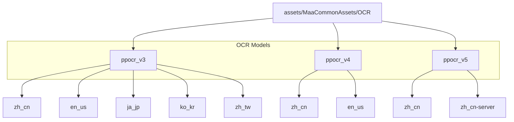
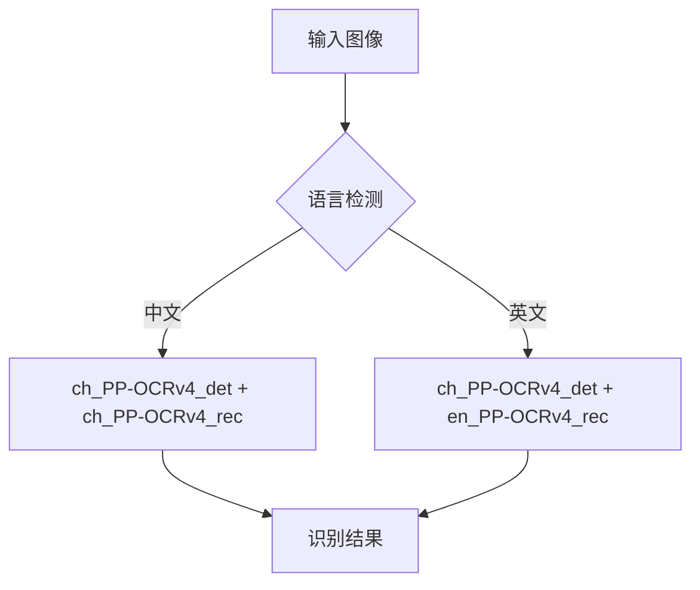
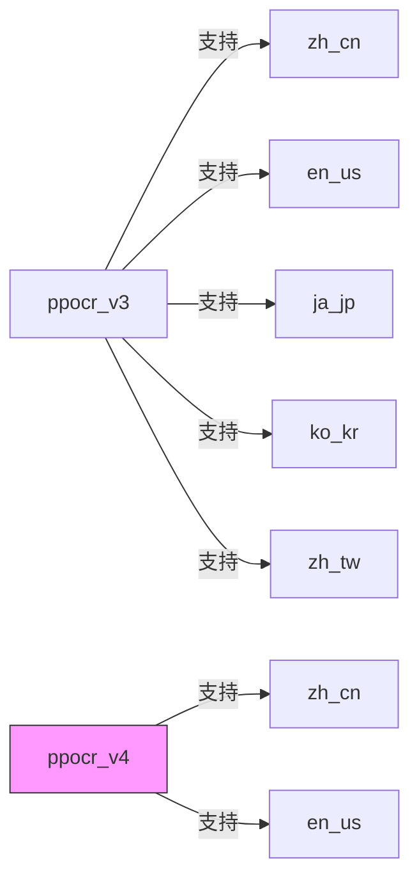
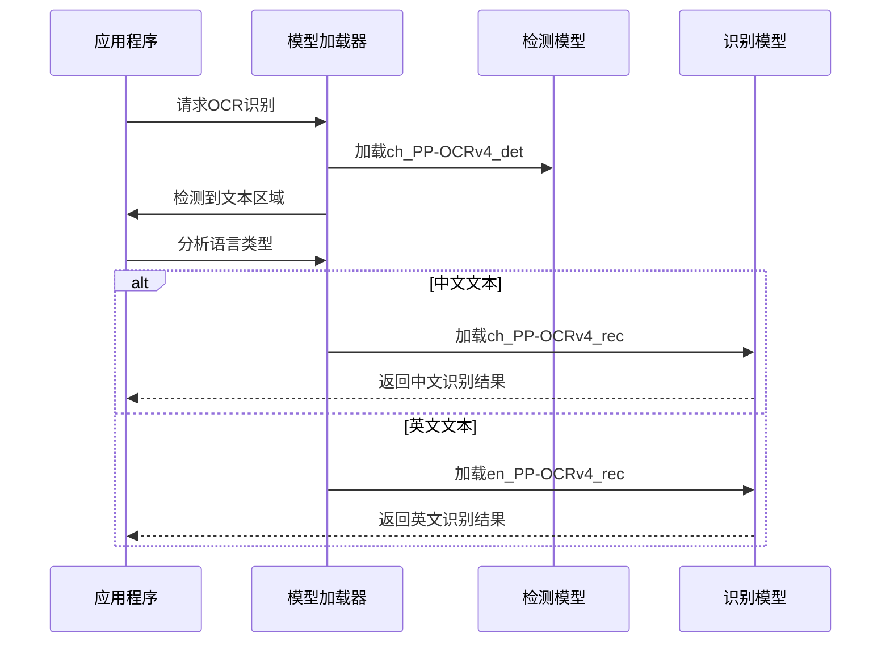
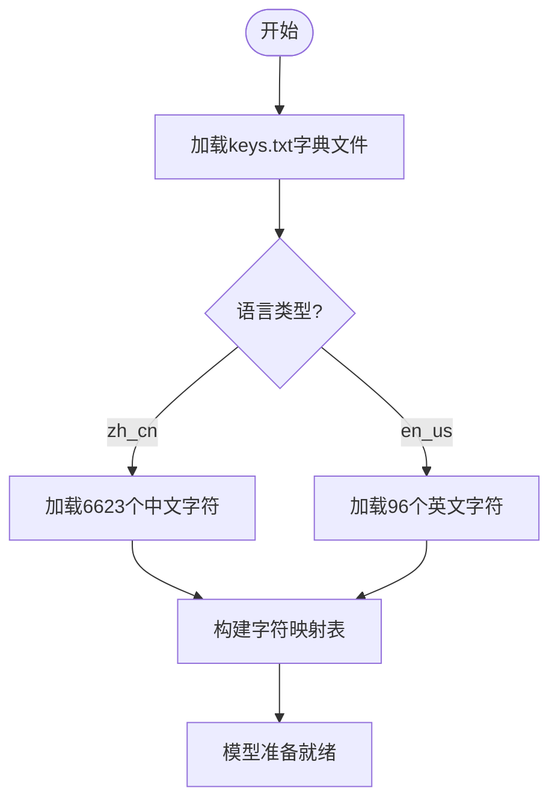
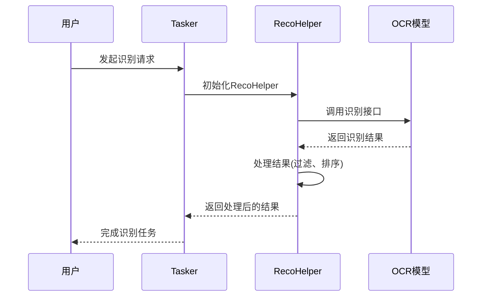
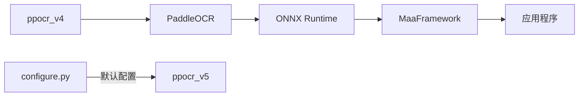

# ppocr_v4 模型管理

<cite>
**本文档引用文件**  
- [zh_cn/README.md](file://assets/MaaCommonAssets/OCR/ppocr_v4/zh_cn/README.md)
- [en_us/README.md](file://assets/MaaCommonAssets/OCR/ppocr_v4/en_us/README.md)
- [zh_cn/keys.txt](file://assets/MaaCommonAssets/OCR/ppocr_v4/zh_cn/keys.txt)
- [en_us/keys.txt](file://assets/MaaCommonAssets/OCR/ppocr_v4/en_us/keys.txt)
- [ppocr_v3/zh_cn/README.md](file://assets/MaaCommonAssets/OCR/ppocr_v3/zh_cn/README.md)
- [ppocr_v3/en_us/README.md](file://assets/MaaCommonAssets/OCR/ppocr_v3/en_us/README.md)
- [ppocr_v5/README.md](file://assets/MaaCommonAssets/OCR/ppocr_v5/README.md)
- [configure.py](file://tools/configure.py)
- [reco_helper.py](file://agent/customs/maahelper/reco_helper.py)
- [README.md](file://assets/MaaCommonAssets/OCR/README.md)
</cite>

## 目录
1. [引言](#引言)
2. [项目结构](#项目结构)
3. [核心组件](#核心组件)
4. [架构概述](#架构概述)
5. [详细组件分析](#详细组件分析)
6. [依赖分析](#依赖分析)
7. [性能考虑](#性能考虑)
8. [故障排除指南](#故障排除指南)
9. [结论](#结论)

## 引言
本文档系统化描述了ppocr_v4版本OCR模型的架构设计，重点分析其相较于v3的改进点，包括精简的语言支持（仅en_us、zh_cn）和优化的识别算法。说明zh_cn与en_us双语言模型的加载机制和自动切换逻辑，解析keys.txt字典文件的编码规则与自定义扩展方法。结合MaaFramework的OCR调用流程，展示该版本在中文界面识别中的优势。提供性能调优参数配置建议，并对比v5版本的技术差异，指导用户合理选择使用场景。

## 项目结构
项目中的OCR模型资源位于`assets/MaaCommonAssets/OCR/`目录下，包含多个版本的OCR模型：ppocr_v3、ppocr_v4和ppocr_v5。每个版本包含不同语言的支持，其中ppocr_v4仅支持en_us和zh_cn两种语言，体现了其精简化的语言支持策略。

**图示来源**  
- [assets/MaaCommonAssets/OCR](file://assets/MaaCommonAssets/OCR)

**本节来源**  
- [assets/MaaCommonAssets/OCR](file://assets/MaaCommonAssets/OCR)

## 核心组件
ppocr_v4版本的核心组件包括中文检测模型(ch_PP-OCRv4_det)、中文识别模型(ch_PP-OCRv4_rec)、英文识别模型(en_PP-OCRv4_rec)以及对应的语言字典文件。该版本通过精简语言支持，优化了模型体积和识别效率。

**本节来源**  
- [zh_cn/README.md](file://assets/MaaCommonAssets/OCR/ppocr_v4/zh_cn/README.md)
- [en_us/README.md](file://assets/MaaCommonAssets/OCR/ppocr_v4/en_us/README.md)

## 架构概述
ppocr_v4采用双语言架构设计，其中检测模型统一使用中文检测模型，而识别模型则根据语言需求分别加载。这种架构设计既保证了文本检测的准确性，又实现了语言识别的灵活性。

**图示来源**  
- [zh_cn/README.md](file://assets/MaaCommonAssets/OCR/ppocr_v4/zh_cn/README.md)
- [en_us/README.md](file://assets/MaaCommonAssets/OCR/ppocr_v4/en_us/README.md)

## 详细组件分析

### ppocr_v4与v3的改进点分析
ppocr_v4相较于v3的主要改进包括：精简的语言支持、优化的识别算法和更小的模型体积。v4版本仅保留en_us和zh_cn两种语言支持，而v3版本支持多种语言（包括ja_jp、ko_kr、zh_tw等），这使得v4版本更加专注于核心语言的识别精度和性能优化。

**图示来源**  
- [ppocr_v3/zh_cn/README.md](file://assets/MaaCommonAssets/OCR/ppocr_v3/zh_cn/README.md)
- [ppocr_v4/zh_cn/README.md](file://assets/MaaCommonAssets/OCR/ppocr_v4/zh_cn/README.md)

**本节来源**  
- [ppocr_v3/zh_cn/README.md](file://assets/MaaCommonAssets/OCR/ppocr_v3/zh_cn/README.md)
- [ppocr_v3/en_us/README.md](file://assets/MaaCommonAssets/OCR/ppocr_v3/en_us/README.md)
- [ppocr_v4/zh_cn/README.md](file://assets/MaaCommonAssets/OCR/ppocr_v4/zh_cn/README.md)
- [ppocr_v4/en_us/README.md](file://assets/MaaCommonAssets/OCR/ppocr_v4/en_us/README.md)

### 双语言模型加载机制分析
ppocr_v4的双语言模型加载机制通过检测模型统一处理，识别模型按需加载的方式实现。中文识别使用ch_PP-OCRv4_rec模型，英文识别使用en_PP-OCRv4_rec模型，检测模型则统一使用ch_PP-OCRv4_det。

**图示来源**  
- [zh_cn/README.md](file://assets/MaaCommonAssets/OCR/ppocr_v4/zh_cn/README.md)
- [en_us/README.md](file://assets/MaaCommonAssets/OCR/ppocr_v4/en_us/README.md)

**本节来源**  
- [zh_cn/README.md](file://assets/MaaCommonAssets/OCR/ppocr_v4/zh_cn/README.md)
- [en_us/README.md](file://assets/MaaCommonAssets/OCR/ppocr_v4/en_us/README.md)

### keys.txt字典文件编码规则分析
ppocr_v4的keys.txt文件定义了模型识别的字符集。中文模型(zh_cn)包含6623个字符，涵盖汉字、数字、标点符号等；英文模型(en_us)包含96个ASCII字符，符合标准英文字符集。

**图示来源**  
- [zh_cn/keys.txt](file://assets/MaaCommonAssets/OCR/ppocr_v4/zh_cn/keys.txt)
- [en_us/keys.txt](file://assets/MaaCommonAssets/OCR/ppocr_v4/en_us/keys.txt)

**本节来源**  
- [zh_cn/keys.txt](file://assets/MaaCommonAssets/OCR/ppocr_v4/zh_cn/keys.txt)
- [en_us/keys.txt](file://assets/MaaCommonAssets/OCR/ppocr_v4/en_us/keys.txt)

### MaaFramework OCR调用流程分析
MaaFramework通过reco_helper.py模块封装了OCR调用流程，提供了识别结果处理、点击操作等辅助功能。该流程结合ppocr_v4模型，在中文界面识别中表现出色。

**图示来源**  
- [reco_helper.py](file://agent/customs/maahelper/reco_helper.py)

**本节来源**  
- [reco_helper.py](file://agent/customs/maahelper/reco_helper.py)

## 依赖分析
ppocr_v4模型依赖于PaddleOCR框架，并通过ONNX格式进行部署。项目中的configure.py脚本负责配置OCR模型，但默认配置指向ppocr_v5版本。

**图示来源**  
- [configure.py](file://tools/configure.py)
- [README.md](file://assets/MaaCommonAssets/OCR/README.md)

**本节来源**  
- [configure.py](file://tools/configure.py)
- [README.md](file://assets/MaaCommonAssets/OCR/README.md)

## 性能考虑
ppocr_v4通过精简语言支持和优化算法，在保证识别精度的同时提升了性能表现。对于主要涉及中英文识别的场景，v4版本是理想选择。而对于需要多语言支持的场景，建议使用v5版本。

## 故障排除指南
当遇到OCR识别问题时，应首先检查模型文件是否完整，确认keys.txt文件与模型版本匹配，并验证ONNX转换过程是否正确执行。

**本节来源**  
- [README.md](file://assets/MaaCommonAssets/OCR/README.md)
- [reco_helper.py](file://agent/customs/maahelper/reco_helper.py)

## 结论
ppocr_v4版本通过精简语言支持（仅en_us、zh_cn）和优化识别算法，在中文界面识别场景中表现出优越的性能。其双语言模型加载机制合理高效，keys.txt字典文件编码规则清晰明确。虽然项目默认配置指向v5版本，但v4版本在特定场景下仍具有重要价值。用户应根据实际需求选择合适的OCR版本：对于专注中英文识别的场景推荐使用v4，对于需要多语言支持的场景则建议升级到v5版本。