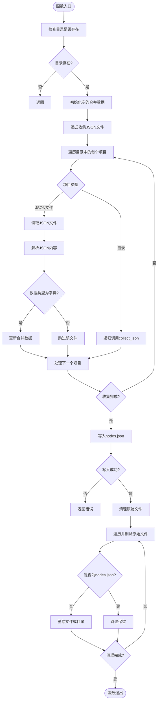
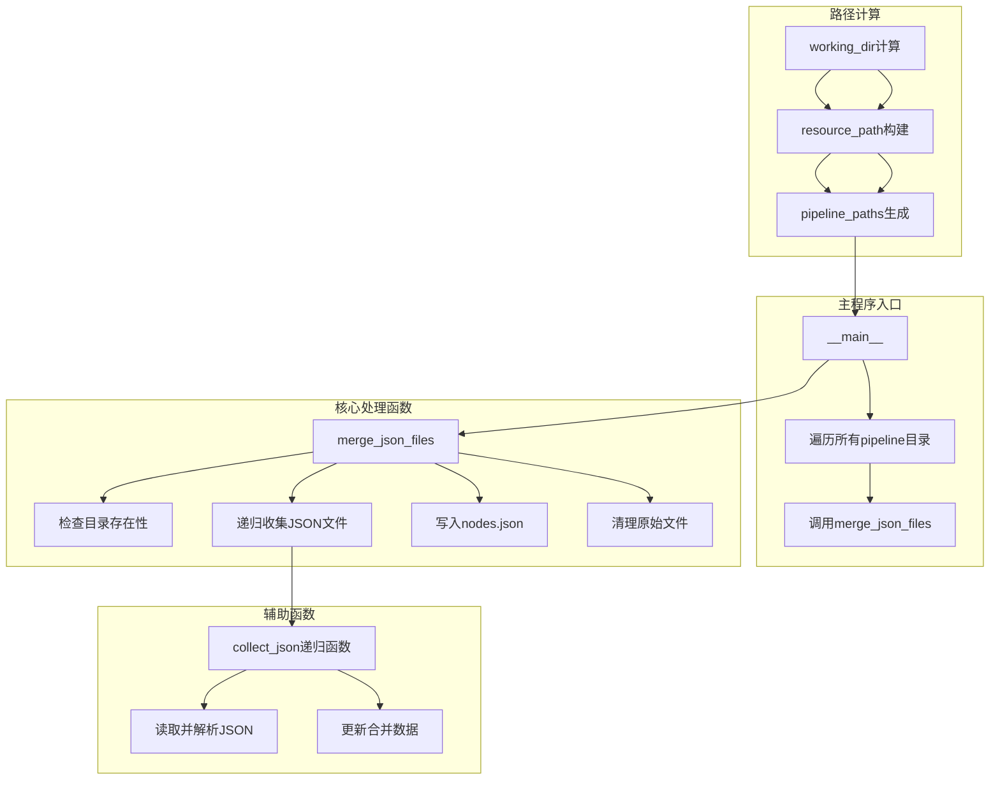
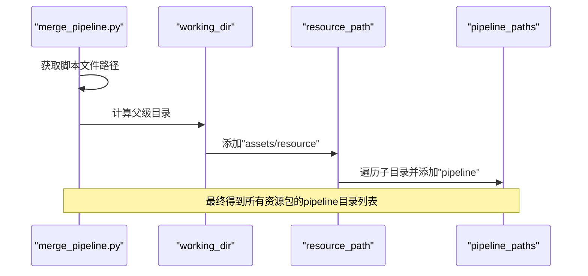
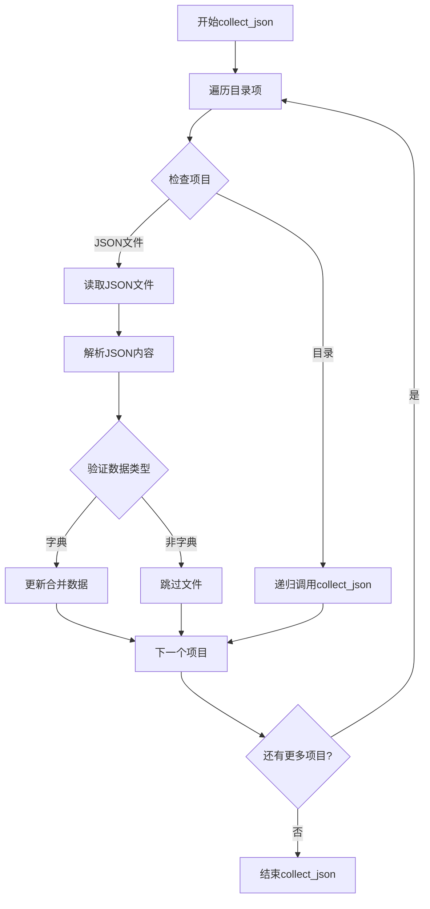
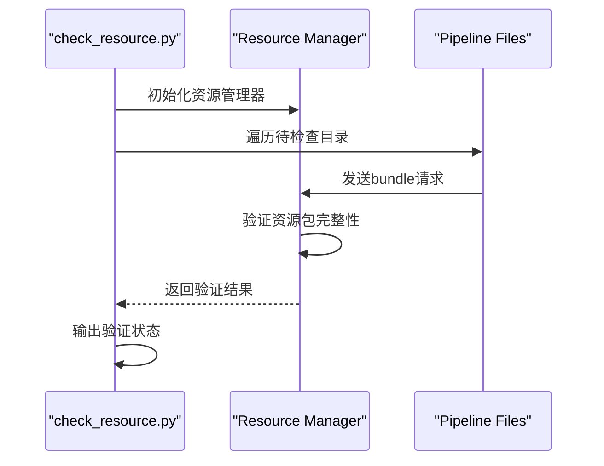

# 流水线合并机制

<cite>
**本文档引用的文件**
- [merge_pipeline.py](file://ci/merge_pipeline.py)
- [default_pipeline.json](file://assets/resource/base/default_pipeline.json)
- [hooks.json](file://assets/resource/base/pipeline/其他/hooks.json)
- [回到主界面.json](file://assets/resource/base/pipeline/通用/回到主界面.json)
- [连续作战.json](file://assets/resource/base/pipeline/开荒功能/连续作战.json)
- [每日活动作战.json](file://assets/resource/base/pipeline/日常任务/每日活动作战.json)
- [check_resource.py](file://check_resource.py)
</cite>

## 目录
1. [简介](#简介)
2. [项目结构](#项目结构)
3. [核心组件](#核心组件)
4. [架构概览](#架构概览)
5. [详细组件分析](#详细组件分析)
6. [依赖关系分析](#依赖关系分析)
7. [性能考虑](#性能考虑)
8. [故障排除指南](#故障排除指南)
9. [结论](#结论)

## 简介

本文档深入解析了 `ci/merge_pipeline.py` 脚本的工作原理，详细说明了它如何遍历 `assets/resource/*/pipeline` 目录并合并 JSON 文件的完整流程。该脚本实现了资源包管理中的关键功能，通过将分散在各个子目录中的 JSON 文件合并为统一的 `nodes.json` 文件，简化了资源包的组织和维护。

该机制对资源包管理和版本控制具有重要价值，能够：
- 提高资源包的可维护性
- 优化版本控制效率
- 简化资源包发布流程
- 支持多平台资源包管理

## 项目结构

该项目采用模块化的资源包结构，主要包含以下关键目录：

```mermaid
graph TB
subgraph "项目根目录"
CI[ci/] -- CI工具脚本
ASSETS[assets/] -- 资源文件
AGENT[agent/] -- 代理服务
DESCS[descs/] -- 描述文件
end
subgraph "CI工具"
MERGE[merge_pipeline.py] -- 流水线合并脚本
end
subgraph "资源包结构"
RESOURCE[assets/resource/] -- 资源包根目录
BASE[base/] -- 基础资源包
PIPELINE[pipeline/] -- 流水线目录
OTHER[其他/] -- 其他配置
DAILY[日常任务/] -- 日常任务流水线
COMMON[通用/] -- 通用流水线
EXPANSION[开荒功能/] -- 开荒功能流水线
end
CI --> MERGE
ASSETS --> RESOURCE
RESOURCE --> BASE
BASE --> PIPELINE
PIPELINE --> OTHER
PIPELINE --> DAILY
PIPELINE --> COMMON
PIPELINE --> EXPANSION
```

**图表来源**
- [merge_pipeline.py](file://ci/merge_pipeline.py#L9-L13)
- [default_pipeline.json](file://assets/resource/base/default_pipeline.json#L1-L7)

**章节来源**
- [merge_pipeline.py](file://ci/merge_pipeline.py#L1-L73)

## 核心组件

### 主要路径变量

脚本通过以下路径变量实现资源包的定位和处理：

- **working_dir**: 通过 `Path(__file__).parent.parent` 计算，指向项目根目录
- **resource_path**: 通过 `working_dir / "assets" / "resource"` 构建，指向资源包根目录
- **pipeline_paths**: 通过遍历资源包目录中的每个子目录并附加 "pipeline" 组成

### merge_json_files 函数

这是脚本的核心功能函数，实现了完整的 JSON 文件合并流程：



**图表来源**
- [merge_pipeline.py](file://ci/merge_pipeline.py#L16-L65)

**章节来源**
- [merge_pipeline.py](file://ci/merge_pipeline.py#L16-L65)

## 架构概览

脚本的整体架构采用自顶向下的设计模式，通过清晰的函数分离实现了单一职责原则：



**图表来源**
- [merge_pipeline.py](file://ci/merge_pipeline.py#L9-L13)
- [merge_pipeline.py](file://ci/merge_pipeline.py#L16-L65)

## 详细组件分析

### 路径计算机制

脚本通过相对路径计算实现了灵活的目录定位：



**图表来源**
- [merge_pipeline.py](file://ci/merge_pipeline.py#L9-L13)

#### working_dir 计算逻辑

`working_dir` 通过 `Path(__file__).parent.parent` 计算，确保无论脚本位于何处都能正确指向项目根目录。这种设计使得脚本可以在不同的工作环境中运行而不需要修改路径配置。

#### resource_path 构建逻辑

`resource_path` 通过将 `working_dir` 与固定路径 "assets/resource" 组合，形成标准的资源包目录结构。这个设计遵循了项目的约定式架构，便于维护和扩展。

#### pipeline_paths 生成逻辑

`pipeline_paths` 通过遍历 `resource_path` 下的所有子目录，为每个子目录添加 "pipeline" 后缀，形成完整的流水线目录列表。这种设计支持多资源包的并行处理。

**章节来源**
- [merge_pipeline.py](file://ci/merge_pipeline.py#L9-L13)

### 递归文件收集机制

`collect_json` 函数实现了深度优先的文件遍历：



**图表来源**
- [merge_pipeline.py](file://ci/merge_pipeline.py#L24-L40)

#### 数据合并策略

脚本采用字典更新的方式合并 JSON 数据，后读取的数据会覆盖先前的数据。这种策略适用于资源包场景，允许后续文件覆盖之前的配置。

#### 错误处理机制

每个文件读取操作都包含异常处理，确保单个文件的错误不会影响整个合并过程。错误信息会输出到控制台，便于调试。

**章节来源**
- [merge_pipeline.py](file://ci/merge_pipeline.py#L24-L40)

### 文件写入和清理机制

#### nodes.json 生成

脚本将合并后的数据写入 `nodes.json` 文件，使用 UTF-8 编码和 4 空格缩进，确保文件的可读性和兼容性。

#### 原始文件清理

清理阶段会删除除 `nodes.json` 外的所有原始文件和目录，实现资源包的最终形态。这种设计减少了存储空间并简化了部署。

**章节来源**
- [merge_pipeline.py](file://ci/merge_pipeline.py#L42-L65)

### 实际数据结构示例

#### 基础配置示例

基础资源包包含默认的流水线配置：

```json
{
    "Default": {
        "timeout": 30000,
        "pre_delay": 600
    }
}
```

#### 通用流水线示例

通用流水线包含返回主界面的复杂流程：

```json
{
    "返回主界面_开始": {
        "action": {
            "param": {
                "custom_action": "on_task_start"
            },
            "type": "Custom"
        },
        "focus": {
            "Node.Recognition.Starting": " > 返回主界面"
        },
        "next": [
            "返回主界面_检测主界面",
            {
                "jump_back": true,
                "name": "返回主界面_导航类返回"
            }
        ],
        "recognition": {
            "param": {},
            "type": "DirectHit"
        }
    }
}
```

#### 开荒功能示例

开荒功能包含连续作战的完整流程：

```json
{
    "连续作战_开始": {
        "action": {
            "param": {},
            "type": "DoNothing"
        },
        "next": ["连续作战_选择卡组", "连续作战_出发", "连续作战_下一关"],
        "recognition": {
            "param": {},
            "type": "DirectHit"
        }
    }
}
```

**章节来源**
- [default_pipeline.json](file://assets/resource/base/default_pipeline.json#L1-L7)
- [回到主界面.json](file://assets/resource/base/pipeline/通用/回到主界面.json#L74-L111)
- [连续作战.json](file://assets/resource/base/pipeline/开荒功能/连续作战.json#L79-L97)

## 依赖关系分析

脚本的依赖关系相对简单，主要依赖于标准库：

```mermaid
graph TB
subgraph "外部依赖"
PATHLIB[pathlib.Path] -- 标准库
JSON[json] -- 标准库
SYS[sys] -- 标准库
IO[io] -- 标准库
SHUTIL[shutil] -- 标准库
end
subgraph "内部组件"
MERGE_FUNC[merge_json_files函数]
COLLECT_FUNC[collect_json递归函数]
MAIN_ENTRY[__main__入口]
end
PATHLIB --> MERGE_FUNC
JSON --> MERGE_FUNC
SYS --> MERGE_FUNC
IO --> MERGE_FUNC
SHUTIL --> MERGE_FUNC
MERGE_FUNC --> COLLECT_FUNC
MAIN_ENTRY --> MERGE_FUNC
```

**图表来源**
- [merge_pipeline.py](file://ci/merge_pipeline.py#L1-L7)

### 外部依赖分析

- **pathlib.Path**: 提供跨平台的路径操作能力
- **json**: 处理 JSON 文件的读取和写入
- **sys**: 标准输出编码处理
- **io**: 文本流编码包装
- **shutil**: 文件和目录操作

### 内部组件耦合度

脚本采用了低耦合的设计，各函数职责明确：
- `merge_json_files`: 主要业务逻辑
- `collect_json`: 递归遍历功能
- 路径计算: 独立的全局变量

**章节来源**
- [merge_pipeline.py](file://ci/merge_pipeline.py#L1-L7)

## 性能考虑

### 时间复杂度分析

- **文件遍历**: O(n)，其中 n 是所有 JSON 文件的数量
- **数据合并**: O(m)，其中 m 是所有 JSON 对象的总数量
- **总体复杂度**: O(n + m)

### 空间复杂度分析

- **内存占用**: O(k)，其中 k 是合并后数据的大小
- **临时文件**: O(1)，只在写入时短暂存在

### 优化建议

1. **大文件处理**: 对于超大 JSON 文件，可以考虑分块处理
2. **并发处理**: 可以添加多线程支持处理多个资源包
3. **增量更新**: 实现基于时间戳的增量合并
4. **缓存机制**: 缓存已处理的文件避免重复读取

## 故障排除指南

### 常见问题及解决方案

#### 路径相关问题

**问题**: 脚本无法找到资源包目录
**原因**: 工作目录计算错误或路径配置不当
**解决方案**: 
- 验证 `working_dir` 是否指向正确的项目根目录
- 检查 `assets/resource` 目录是否存在
- 确认脚本运行权限

#### JSON 解析错误

**问题**: 文件读取失败或 JSON 解析异常
**原因**: 文件编码问题或 JSON 格式错误
**解决方案**:
- 确保所有 JSON 文件使用 UTF-8 编码
- 验证 JSON 格式的正确性
- 检查文件权限和完整性

#### 权限问题

**问题**: 无法删除原始文件或写入 nodes.json
**原因**: 文件权限不足或文件被其他进程占用
**解决方案**:
- 检查目标文件的写入权限
- 关闭可能占用文件的进程
- 以管理员权限运行脚本

### 调试技巧

#### 基础调试

1. **启用详细输出**: 脚本已经包含了详细的进度输出
2. **检查中间状态**: 在关键步骤添加临时文件记录
3. **验证数据结构**: 使用外部工具验证 JSON 文件的有效性

#### 高级调试

1. **单元测试**: 为关键函数编写独立的测试用例
2. **性能监控**: 监控脚本执行时间和内存使用
3. **错误日志**: 记录详细的错误信息和上下文

#### 资源验证

可以使用 `check_resource.py` 脚本验证资源包的完整性：



**图表来源**
- [check_resource.py](file://check_resource.py#L10-L23)

**章节来源**
- [check_resource.py](file://check_resource.py#L1-L39)

## 结论

`ci/merge_pipeline.py` 脚本通过简洁而高效的实现，解决了资源包管理中的核心问题。其设计特点包括：

### 技术优势

1. **简洁性**: 代码结构清晰，易于理解和维护
2. **健壮性**: 完善的错误处理机制
3. **可移植性**: 使用标准库实现跨平台兼容
4. **可扩展性**: 模块化设计便于功能扩展

### 业务价值

1. **提高效率**: 自动化处理减少人工干预
2. **保证质量**: 统一的处理流程确保资源包一致性
3. **降低风险**: 完善的错误处理避免数据丢失
4. **支持协作**: 标准化的资源包格式便于团队协作

### 改进建议

1. **配置化**: 支持通过配置文件定制处理行为
2. **日志系统**: 集成结构化的日志记录
3. **并发处理**: 支持多资源包并行处理
4. **增量更新**: 实现基于变更的增量合并

该脚本为资源包管理提供了坚实的技术基础，通过持续的优化和完善，将进一步提升资源包管理的效率和可靠性。