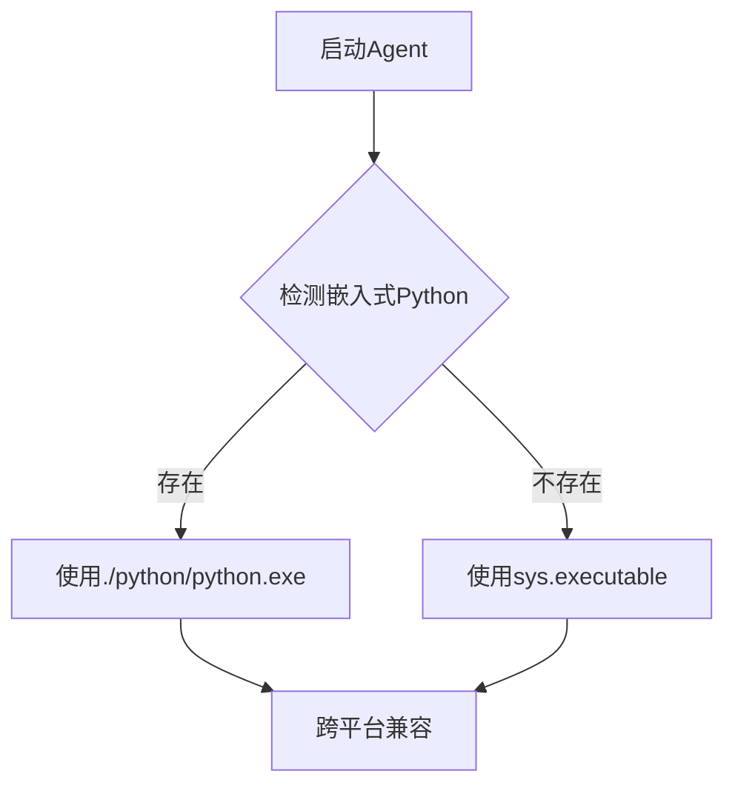
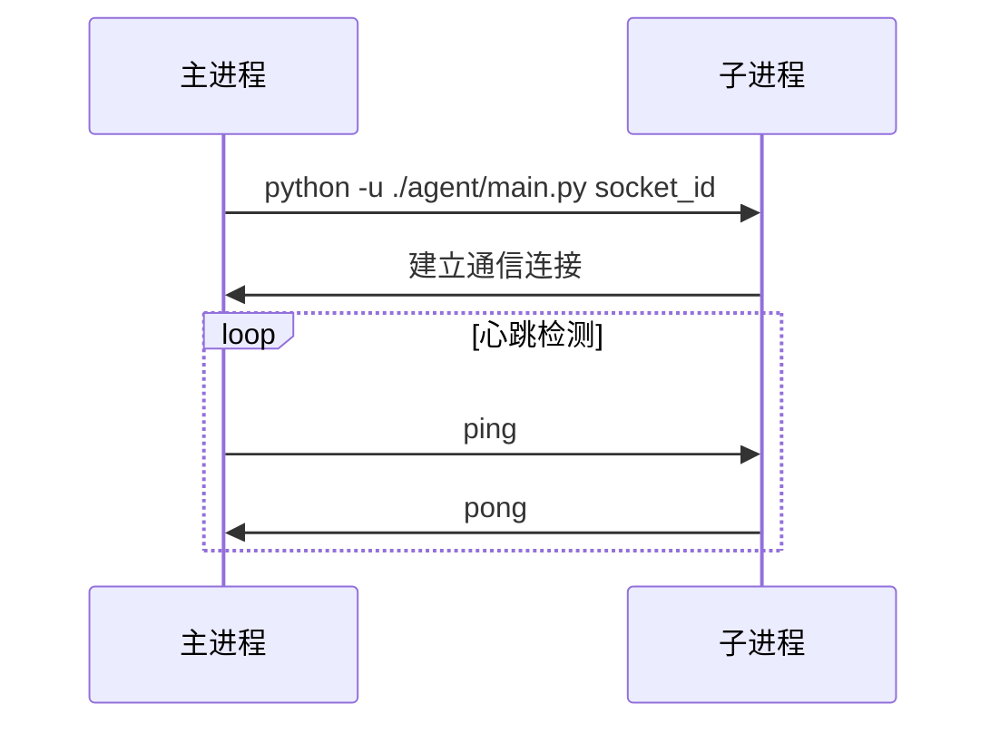
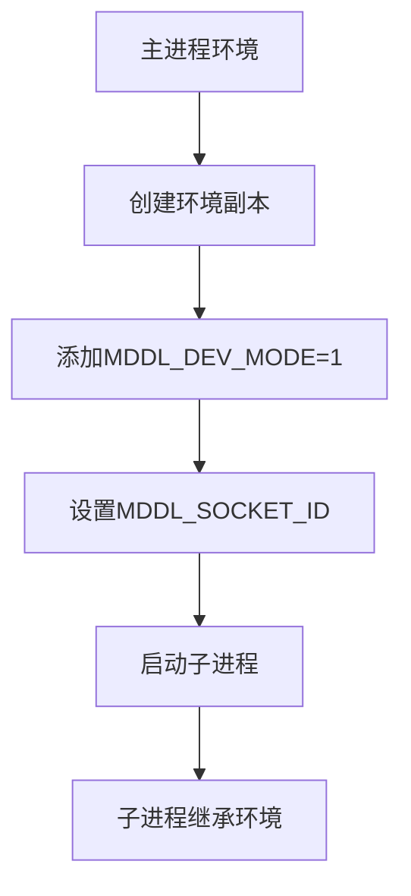
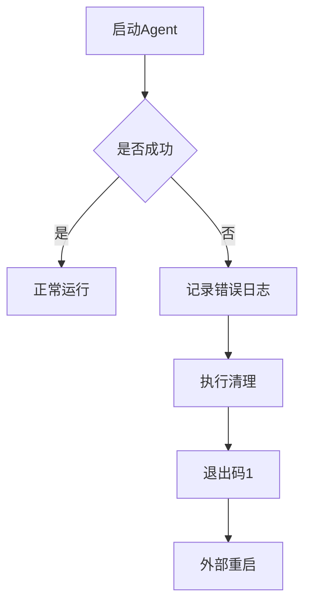
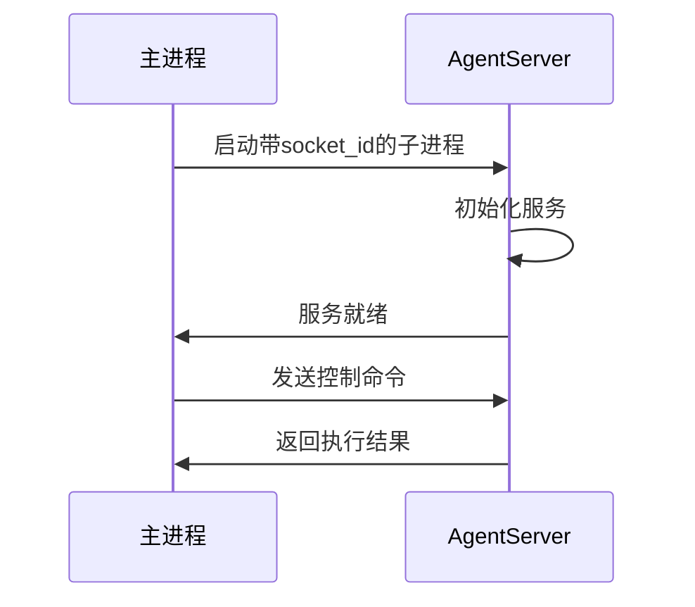
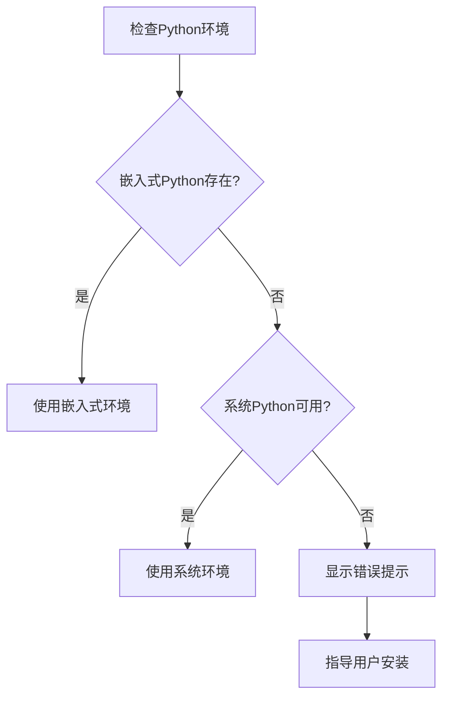

# Agent子进程配置

<cite>
**本文档引用的文件**  
- [interface.json](file://assets/interface.json)
- [setup.py](file://agent/preprocess/setup.py)
- [main.py](file://agent/main.py)
- [install.py](file://tools/install.py)
- [setup_embed_python.ps1](file://ci/setup_embed_python.ps1)
- [setup_embed_python.sh](file://ci/setup_embed_python.sh)
- [run_agent.py](file://dev/run_agent.py)
- [build_mfaa.py](file://dev/build_mfaa.py)
</cite>

## 目录
1. [简介](#简介)
2. [可执行文件路径跨平台兼容性](#可执行文件路径跨平台兼容性)
3. [启动参数传递机制](#启动参数传递机制)
4. [环境变量继承规则](#环境变量继承规则)
5. [异常退出重启策略](#异常退出重启策略)
6. [主子进程通信通道](#主子进程通信通道)
7. [Python环境未找到错误处理](#python环境未找到错误处理)

## 简介
本文档详细说明MaaDuDuL项目中Agent子进程的配置机制，包括`child_exec`可执行文件路径的跨平台兼容性、`child_args`启动参数数组的传递机制、环境变量继承规则、异常退出时的重启策略，以及与主进程的通信通道建立过程。同时提供Python环境未找到时的错误提示和解决方案。

## 可执行文件路径跨平台兼容性

Agent子进程的可执行文件路径通过`child_exec`字段配置，实现了Windows、macOS和Linux平台的兼容性。系统根据目标平台自动选择正确的Python可执行文件：

- **Windows平台**：使用`./python/python.exe`
- **macOS/Linux平台**：使用`./python/bin/python`

该配置在安装过程中由`tools/install.py`脚本根据目标操作系统自动设置。同时，系统提供嵌入式Python环境作为首选，若不存在则回退到系统Python环境。



**图示来源**
- [setup.py](file://agent/preprocess/setup.py#L28-L47)
- [install.py](file://tools/install.py#L71-L76)

**本节来源**
- [assets/interface.json](file://assets/interface.json#L35-L36)
- [setup.py](file://agent/preprocess/setup.py#L28-L47)
- [install.py](file://tools/install.py#L71-L76)

## 启动参数传递机制

`child_args`数组定义了Agent子进程的启动参数，包含以下关键参数：

- `-u`：禁用Python输出缓冲，确保日志实时输出
- `./agent/main.py`：主入口模块路径

启动参数通过命令行方式传递给Python解释器。在开发模式下，还会传递socket ID作为附加参数，用于进程间通信标识。



**图示来源**
- [main.py](file://agent/main.py#L31-L32)
- [run_agent.py](file://dev/run_agent.py#L37)

**本节来源**
- [assets/interface.json](file://assets/interface.json#L37-L38)
- [main.py](file://agent/main.py#L31-L32)
- [run_agent.py](file://dev/run_agent.py#L37)

## 环境变量继承规则

Agent子进程启动时会继承主进程的环境变量，并在此基础上进行特定配置：

1. **开发模式标识**：通过设置`MDDL_DEV_MODE=1`环境变量启用开发模式
2. **Socket ID传递**：通过`MDDL_SOCKET_ID`环境变量传递通信标识
3. **路径继承**：继承系统PATH环境变量，确保依赖库可访问

在开发调试模式下，`dev/run_agent.py`脚本会创建环境变量副本并添加开发模式标识，确保子进程在正确的环境中运行。



**图示来源**
- [run_agent.py](file://dev/run_agent.py#L24-L28)

**本节来源**
- [run_agent.py](file://dev/run_agent.py#L24-L28)
- [main.py](file://agent/main.py#L44-L46)

## 异常退出重启策略

系统采用健壮的异常处理和重启机制确保Agent服务的稳定性：

1. **异常捕获**：在`main.py`中使用try-catch块捕获所有异常
2. **错误日志**：记录详细的错误信息便于诊断
3. **优雅退出**：发生异常时执行清理操作后退出
4. **外部监控**：由主进程或外部监控程序检测子进程状态并重启

当Agent启动失败时，系统会输出错误信息并以退出码1终止进程，触发外部重启机制。



**图示来源**
- [main.py](file://agent/main.py#L39-L41)

**本节来源**
- [main.py](file://agent/main.py#L39-L41)
- [run_agent.py](file://dev/run_agent.py#L40-L43)

## 主子进程通信通道

主进程与Agent子进程通过socket ID建立通信通道，实现双向通信：

1. **通道建立**：子进程启动时接收socket ID参数
2. **服务启动**：AgentServer使用socket ID初始化服务
3. **连接等待**：主进程等待子进程服务就绪
4. **数据交换**：通过socket进行命令和数据传输

通信通道支持心跳检测、命令执行和状态同步等功能，确保两个进程间的可靠通信。



**图示来源**
- [main.py](file://agent/main.py#L30-L32)
- [run_agent.py](file://dev/run_agent.py#L28)

**本节来源**
- [main.py](file://agent/main.py#L30-L32)
- [run_agent.py](file://dev/run_agent.py#L28)

## Python环境未找到错误处理

当Python环境未找到时，系统提供多层次的解决方案：

### 错误场景
1. **嵌入式Python缺失**：`./python/python.exe`不存在
2. **系统Python未安装**：系统PATH中找不到python/python3
3. **权限问题**：无法执行Python可执行文件

### 解决方案
1. **自动安装**：运行`ci/setup_embed_python.ps1`（Windows）或`ci/setup_embed_python.sh`（macOS/Linux）安装嵌入式Python
2. **手动安装**：确保系统已安装Python 3.12.7或更高版本
3. **环境配置**：将Python添加到系统PATH环境变量

### 配置验证
```bash
# Windows
python --version

# macOS/Linux
python3 --version
```

系统优先使用嵌入式Python环境，若不存在则使用系统Python，确保最大程度的兼容性和可靠性。



**图示来源**
- [setup.py](file://agent/preprocess/setup.py#L38-L46)
- [setup_embed_python.ps1](file://ci/setup_embed_python.ps1)
- [setup_embed_python.sh](file://ci/setup_embed_python.sh)

**本节来源**
- [setup.py](file://agent/preprocess/setup.py#L38-L46)
- [setup_embed_python.ps1](file://ci/setup_embed_python.ps1)
- [setup_embed_python.sh](file://ci/setup_embed_python.sh)