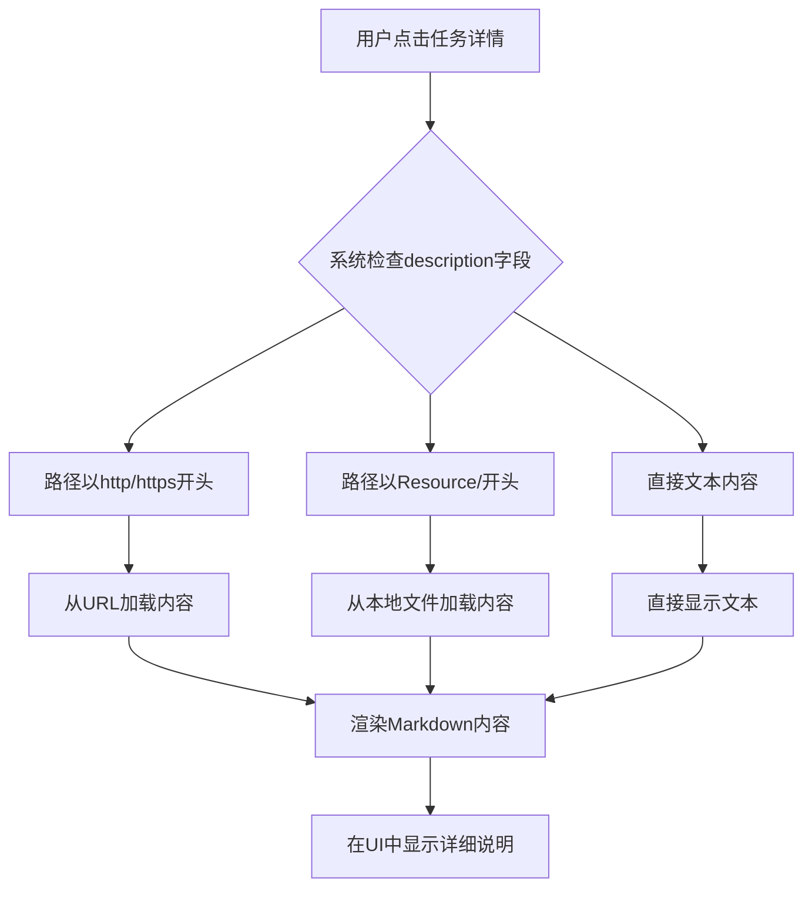
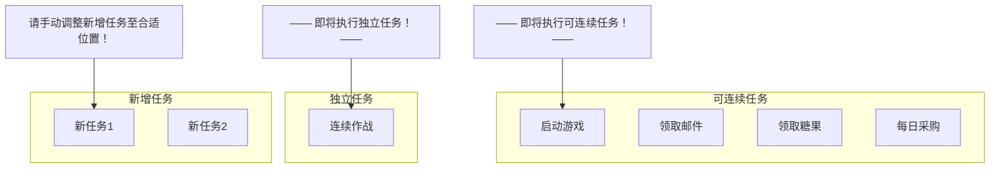
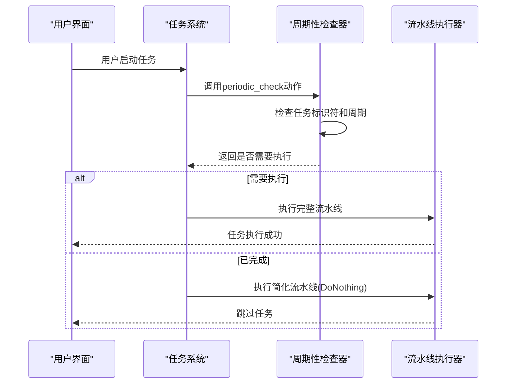

# 任务列表配置

<cite>
**本文档引用文件**   
- [interface.json](file://assets/interface.json)
- [启动游戏.json](file://assets/resource/base/pipeline/日常任务/启动游戏.json)
- [领取奖励.json](file://assets/resource/base/pipeline/日常任务/领取奖励.json)
- [连续作战.json](file://assets/resource/base/pipeline/开荒功能/连续作战.json)
- [分隔符.json](file://assets/resource/base/pipeline/其他/分隔符.json)
- [illustrate.md](file://descs/others/illustrate.md)
- [guide.md](file://descs/others/guide.md)
- [continuous_task.md](file://descs/others/continuous_task.md)
- [independent_task.md](file://descs/others/independent_task.md)
- [new_task.md](file://descs/others/new_task.md)
- [start_game.md](file://descs/daily/start_game.md)
- [claim_mail.md](file://descs/daily/claim_mail.md)
- [claim_candy.md](file://descs/daily/claim_candy.md)
- [purchase.md](file://descs/daily/purchase.md)
- [saint_tour.md](file://descs/daily/saint_tour.md)
- [clear_purple_candy.md](file://descs/daily/clear_purple_candy.md)
- [peak_battle.md](file://descs/daily/peak_battle.md)
- [claim_reward.md](file://descs/daily/claim_reward.md)
- [activity_daily.md](file://descs/daily/activity_daily.md)
- [close_game.md](file://descs/daily/close_game.md)
- [continuous_battle.md](file://descs/single/continuous_battle.md)
- [periodic_check.py](file://agent/customs/global_func/periodic_check.py)
- [pipeline_helper.py](file://agent/customs/global_func/pipeline_helper.py)
- [tasker.py](file://agent/customs/maahelper/tasker.py)
- [process_guard.py](file://agent/customs/global_func/process_guard.py)
- [3.3-ProjectInterfaceV2协议.md](file://instructions/maafw-guide/3.3-ProjectInterfaceV2协议.md)
</cite>

## 目录
1. [任务结构定义](#任务结构定义)
2. [任务名称与标签](#任务名称与标签)
3. [入口标识符映射](#入口标识符映射)
4. [描述文档加载机制](#描述文档加载机制)
5. [默认勾选状态初始化](#默认勾选状态初始化)
6. [分隔符任务渲染](#分隔符任务渲染)
7. [任务状态控制](#任务状态控制)

## 任务结构定义

在 `interface.json` 文件中，`task` 数组定义了所有可执行任务的配置。每个任务对象包含多个关键属性，用于描述任务的行为和UI表现。任务配置遵循 ProjectInterfaceV2 协议规范，确保与 MAA 框架的兼容性。

任务数组中的每个条目都必须包含 `name`（任务唯一标识符）和 `entry`（任务入口）字段。`name` 用于在系统内部唯一标识任务，而 `entry` 指向资源目录中具体的流水线文件中的任务节点名称。这种设计实现了UI任务列表与底层执行逻辑的解耦，允许灵活的任务配置和管理。

**任务结构示例：**
```json
{
    "name": "启动游戏",
    "label": "启动游戏",
    "entry": "启动游戏_开始",
    "default_check": true,
    "description": "Resource/descs/daily/start_game.md"
}
```

**本节来源**
- [interface.json](file://assets/interface.json#L39-L162)
- [3.3-ProjectInterfaceV2协议.md](file://instructions/maafw-guide/3.3-ProjectInterfaceV2协议.md#L254-L303)

## 任务名称与标签

任务的 `name` 字段在UI任务列表中作为显示名称呈现给用户。当 `label` 字段未设置时，系统会直接使用 `name` 的值作为显示文本。`label` 字段支持国际化字符串（以 `$` 开头），通过多语言配置实现本地化支持。

在本项目中，大多数任务的 `label` 与 `name` 保持一致，确保了中文环境下的清晰显示。例如，"启动游戏" 任务的 `name` 和 `label` 均为 "启动游戏"，直接在UI中显示为中文。对于分隔符任务，如 " ——— 可连续任务 ———"，其 `name` 和 `label` 包含特殊字符和空格，用于在UI中创建视觉分隔效果。

国际化支持通过 `languages` 配置实现，允许为不同语言环境提供对应的翻译文件。虽然本项目当前主要使用中文，但其结构已为多语言支持做好准备，体现了良好的可扩展性设计。

**本节来源**
- [interface.json](file://assets/interface.json#L41-L161)
- [3.3-ProjectInterfaceV2协议.md](file://instructions/maafw-guide/3.3-ProjectInterfaceV2协议.md#L41-L54)

## 入口标识符映射

`entry` 字段作为任务的入口标识符，与内部流水线文件中的具体节点名称建立映射关系。这种映射机制将UI层的任务配置与底层的执行逻辑连接起来，实现了配置与实现的分离。

例如，"启动游戏" 任务的 `entry` 为 "启动游戏_开始"，这对应于 `assets/resource/base/pipeline/日常任务/启动游戏.json` 文件中的 `"启动游戏_开始"` 节点。该节点作为流水线的起始点，触发一系列后续操作，如启动应用、识别界面、处理弹窗等。

这种设计允许任务配置的灵活性：通过修改 `entry` 字段，可以轻松切换任务的执行流程，而无需更改UI配置。同时，它也支持任务的模块化设计，不同的 `entry` 可以指向同一流水线文件中的不同起始节点，实现功能的复用和组合。

**本节来源**
- [interface.json](file://assets/interface.json#L61-L154)
- [启动游戏.json](file://assets/resource/base/pipeline/日常任务/启动游戏.json#L79-L97)

## 描述文档加载机制

`description` 字段指向一个Markdown说明文档的路径，该路径相对于项目根目录。系统在用户查看任务详情时，会自动加载并渲染该路径指向的Markdown文件，为用户提供详细的任务说明。

文档路径遵循统一的命名规范：`Resource/descs/[分类]/[任务名].md`。例如，"启动游戏" 任务的描述文档路径为 `Resource/descs/daily/start_game.md`，位于 `descs/daily/` 目录下。这种分类存储方式便于管理和维护大量的说明文档。

加载机制支持多种内容源，包括文件路径、URL和直接文本。在本项目中，主要使用文件路径方式，确保文档内容与代码版本同步。Markdown文档通常包含任务的功能说明、起止界面、使用建议等信息，帮助用户理解任务的作用和配置方法。



**图示来源**
- [interface.json](file://assets/interface.json#L63-L161)
- [start_game.md](file://descs/daily/start_game.md#L1-L17)

**本节来源**
- [interface.json](file://assets/interface.json#L63-L161)
- [start_game.md](file://descs/daily/start_game.md#L1-L17)
- [3.3-ProjectInterfaceV2协议.md](file://instructions/maafw-guide/3.3-ProjectInterfaceV2协议.md#L274-L276)

## 默认勾选状态初始化

`default_check` 字段控制任务在UI中的默认勾选状态，决定任务是否在初始化时被自动选中。该字段为布尔类型，`true` 表示默认勾选，`false` 表示默认不勾选。

在本项目中，核心的日常任务如"启动游戏"、"领取邮件"、"领取糖果"等均设置 `default_check` 为 `true`，确保用户在首次使用时这些关键任务会被自动包含在执行计划中。这种设计提升了用户体验，减少了用户的手动配置工作。

默认勾选状态的初始化逻辑在客户端启动时执行，系统遍历所有任务配置，根据 `default_check` 字段的值设置UI中复选框的状态。对于未设置该字段的任务，默认行为为不勾选，这符合安全和保守的设计原则。

**本节来源**
- [interface.json](file://assets/interface.json#L62-L142)
- [3.3-ProjectInterfaceV2协议.md](file://instructions/maafw-guide/3.3-ProjectInterfaceV2协议.md#L270-L272)

## 分隔符任务渲染

分隔符任务（如" ——— 可连续任务 ———"）是一种特殊的任务类型，用于在UI中创建视觉分隔，组织任务列表的结构。这些任务通过特殊的 `name` 和 `label` 值实现分隔效果，并通过 `entry` 字段映射到特定的分隔符节点。

在 `assets/resource/base/pipeline/其他/分隔符.json` 文件中定义了三种分隔符：
- "可连续任务分隔符"：显示为"—— 即将执行可连续任务！——"
- "独立任务分隔符"：显示为"—— 即将执行独立任务！——"
- "新增任务分隔符"：显示为"请手动调整新增任务至合适位置！"

这些分隔符在UI中渲染为醒目的文本行，将任务列表划分为逻辑区域。"可连续任务"区域包含可以自动串联执行的任务，"独立任务"区域包含需要单独执行的任务，而"新增任务"区域作为临时存放位置，提醒用户对新任务进行分类和调整。



**图示来源**
- [interface.json](file://assets/interface.json#L53-L56)
- [分隔符.json](file://assets/resource/base/pipeline/其他/分隔符.json#L1-L11)

**本节来源**
- [interface.json](file://assets/interface.json#L53-L161)
- [分隔符.json](file://assets/resource/base/pipeline/其他/分隔符.json#L1-L11)
- [new_task.md](file://descs/others/new_task.md#L1-L17)

## 任务状态控制

任务的启用/禁用状态通过 `option` 配置项和周期性检查机制实现，对执行流程进行精细控制。`option` 字段允许为任务配置可选的开关，用户可以根据需要启用或禁用特定功能。

核心的控制机制是周期性任务检查，由 `periodic_check.py` 中的 `PeriodicCheck` 类实现。该机制支持按天、按周、按月三种周期模式，通过 `custom_action` 参数传递任务标识符和周期类型。例如，"领取邮件"任务通过 `option` 配置了"每日仅检查一次邮箱"开关，当启用时，系统会检查该任务是否已在当天执行，避免重复执行。

任务状态控制还体现在流水线的动态覆盖上。通过 `pipeline_override` 机制，可以在运行时修改任务的行为。例如，当某个功能被禁用时，系统会将相关节点的动作设置为 `DoNothing`，从而跳过该步骤。这种设计实现了灵活的流程控制，同时保持了配置的清晰性。



**图示来源**
- [interface.json](file://assets/interface.json#L165-L1195)
- [periodic_check.py](file://agent/customs/global_func/periodic_check.py#L183-L254)
- [pipeline_helper.py](file://agent/customs/global_func/pipeline_helper.py#L9-L24)

**本节来源**
- [interface.json](file://assets/interface.json#L165-L1195)
- [periodic_check.py](file://agent/customs/global_func/periodic_check.py#L183-L254)
- [pipeline_helper.py](file://agent/customs/global_func/pipeline_helper.py#L9-L24)
- [tasker.py](file://agent/customs/maahelper/tasker.py#L51-L80)
- [process_guard.py](file://agent/customs/global_func/process_guard.py#L72-L87)