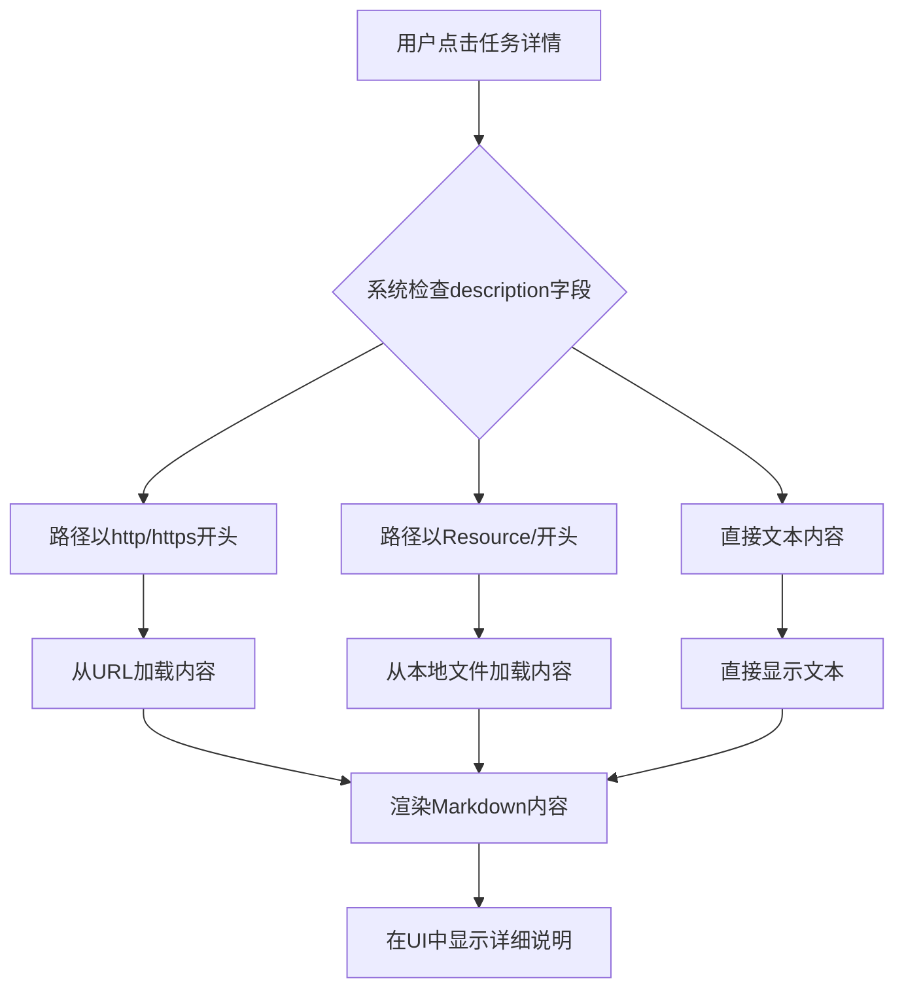
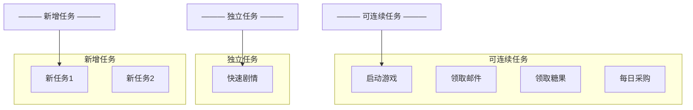
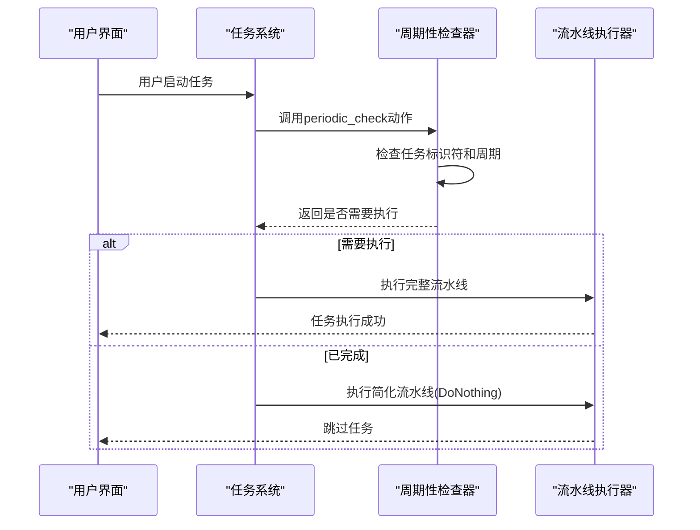

# 任务列表配置

<cite>
**本文档引用文件**   
- [interface.json](file://assets/interface.json)
- [启动游戏.json](file://assets/resource/tasks/daily/启动游戏.json)
- [说明.json](file://assets/resource/tasks/daily/说明.json)
- [操作指南.json](file://assets/resource/tasks/daily/操作指南.json)
- [领取邮件.json](file://assets/resource/tasks/daily/领取邮件.json)
- [可连续任务分隔符.json](file://assets/resource/tasks/separators/可连续任务分隔符.json)
- [独立任务分隔符.json](file://assets/resource/tasks/separators/独立任务分隔符.json)
- [新增任务分隔符.json](file://assets/resource/tasks/separators/新增任务分隔符.json)
- [快速剧情.json](file://assets/resource/tasks/single/快速剧情.json)
- [start_game.md](file://assets/resource/descs/daily/start_game.md)
- [illustrate.md](file://assets/resource/descs/others/illustrate.md)
- [guide.md](file://assets/resource/descs/others/guide.md)
- [continuous_task.md](file://assets/resource/descs/others/continuous_task.md)
- [independent_task.md](file://assets/resource/descs/others/independent_task.md)
- [new_task.md](file://assets/resource/descs/others/new_task.md)
- [quick_plot.md](file://assets/resource/descs/single/quick_plot.md)
- [periodic_check.py](file://agent/customs/global_func/periodic_check.py)
- [pipeline_helper.py](file://agent/customs/global_func/pipeline_helper.py)
- [tasker.py](file://agent/customs/maahelper/tasker.py)
- [process_guard.py](file://agent/customs/global_func/process_guard.py)
</cite>

## 更新摘要
**所做更改**   
- 更新了任务定义系统从内联配置迁移到外部JSON文件的架构
- 新增了每日任务、独立任务、分隔符任务的模块化组织结构说明
- 修正了任务导入机制和文件组织结构的描述
- 更新了任务状态控制和周期性检查的实现细节

## 目录
1. [任务结构定义](#任务结构定义)
2. [任务名称与标签](#任务名称与标签)
3. [入口标识符映射](#入口标识符映射)
4. [描述文档加载机制](#描述文档加载机制)
5. [默认勾选状态初始化](#默认勾选状态初始化)
6. [分隔符任务渲染](#分隔符任务渲染)
7. [任务状态控制](#任务状态控制)
8. [任务导入机制](#任务导入机制)
9. [模块化组织结构](#模块化组织结构)

## 任务结构定义

在重构后的任务定义系统中，任务配置已从 `interface.json` 的内联结构迁移到独立的外部JSON文件中。每个任务现在都有自己的JSON文件，包含完整的任务定义和选项配置。

任务配置遵循 ProjectInterfaceV2 协议规范，采用模块化设计，每个任务文件包含两个主要部分：`task` 数组和 `option` 对象。`task` 数组定义了任务的基本属性，而 `option` 对象提供了任务的可选配置和状态控制。

**任务结构示例：**
```json
{
    "task": [
        {
            "name": "启动游戏",
            "label": "🟢启动游戏",
            "entry": "启动游戏_开始",
            "default_check": true,
            "description": "Resource/descs/daily/start_game.md"
        }
    ],
    "option": {}
}
```

**本节来源**
- [interface.json:39-61](file://assets/interface.json#L39-L61)
- [启动游戏.json:1-13](file://assets/resource/tasks/daily/启动游戏.json#L1-L13)

## 任务名称与标签

任务的 `name` 字段在UI任务列表中作为显示名称呈现给用户。当 `label` 字段未设置时，系统会直接使用 `name` 的值作为显示文本。`label` 字段支持国际化字符串（以 `$` 开头），通过多语言配置实现本地化支持。

在重构后的系统中，标签字段增强了视觉表达能力，通过emoji表情符号提供直观的视觉提示。例如，"🟢启动游戏" 使用绿色圆点表示任务状态，"📬领取邮件" 使用信封图标表示邮件相关任务，"🍿快速剧情" 使用爆米花图标表示剧情类任务。

对于分隔符任务，如 " ——— 可连续任务 ———"，其 `name` 和 `label` 包含特殊字符和空格，用于在UI中创建视觉分隔效果。这些分隔符通过统一的格式化样式在UI中渲染为醒目的文本行。

**本节来源**
- [启动游戏.json:4-8](file://assets/resource/tasks/daily/启动游戏.json#L4-L8)
- [快速剧情.json:4-8](file://assets/resource/tasks/single/快速剧情.json#L4-L8)
- [可连续任务分隔符.json:4-8](file://assets/resource/tasks/separators/可连续任务分隔符.json#L4-L8)

## 入口标识符映射

`entry` 字段作为任务的入口标识符，与内部流水线文件中的具体节点名称建立映射关系。这种映射机制将UI层的任务配置与底层的执行逻辑连接起来，实现了配置与实现的分离。

在重构后的系统中，每个任务文件都独立管理其入口标识符，确保任务定义的模块化和可维护性。例如，"启动游戏" 任务的 `entry` 为 "启动游戏_开始"，这对应于 `assets/resource/base/pipeline/日常任务/启动游戏.json` 文件中的节点。

这种设计允许任务配置的灵活性：通过修改 `entry` 字段，可以轻松切换任务的执行流程，而无需更改UI配置。同时，它也支持任务的模块化设计，不同的 `entry` 可以指向同一流水线文件中的不同起始节点，实现功能的复用和组合。

**本节来源**
- [启动游戏.json](file://assets/resource/tasks/daily/启动游戏.json#L6)
- [快速剧情.json](file://assets/resource/tasks/single/快速剧情.json#L6)

## 描述文档加载机制

`description` 字段指向一个Markdown说明文档的路径，该路径相对于项目根目录。系统在用户查看任务详情时，会自动加载并渲染该路径指向的Markdown文件，为用户提供详细的任务说明。

在重构后的系统中，描述文档的组织更加规范化，按照任务类型进行分类存储。文档路径遵循统一的命名规范：`Resource/descs/[分类]/[任务名].md`。例如，"启动游戏" 任务的描述文档路径为 `Resource/descs/daily/start_game.md`，位于 `assets/resource/descs/daily/` 目录下。

加载机制支持多种内容源，包括文件路径、URL和直接文本。在本项目中，主要使用文件路径方式，确保文档内容与代码版本同步。Markdown文档通常包含任务的功能说明、起止界面、使用建议等信息，帮助用户理解任务的作用和配置方法。


```mermaid
flowchart TD
A[用户点击任务详情] --> B{系统检查description字段}
B --> C[路径以http/https开头]
B --> D[路径以Resource/开头]
B --> E[直接文本内容]
C --> F[从URL加载内容]
D --> G[从本地文件加载内容]
E --> H[直接显示文本]
F --> I[渲染Markdown内容]
G --> I
H --> I
I --> J[在UI中显示详细说明]
```

**图示来源**
- [start_game.md:1-17](file://assets/resource/descs/daily/start_game.md#L1-L17)
- [illustrate.md:1-17](file://assets/resource/descs/others/illustrate.md#L1-L17)

**本节来源**
- [启动游戏.json](file://assets/resource/tasks/daily/启动游戏.json#L8)
- [说明.json](file://assets/resource/tasks/daily/说明.json#L7)
- [guide.md:1-17](file://assets/resource/descs/others/guide.md#L1-L17)

## 默认勾选状态初始化

`default_check` 字段控制任务在UI中的默认勾选状态，决定任务是否在初始化时被自动选中。该字段为布尔类型，`true` 表示默认勾选，`false` 表示默认不勾选。

在重构后的系统中，默认勾选状态主要应用于核心的日常任务，确保用户在首次使用时这些关键任务会被自动包含在执行计划中。例如，"启动游戏"、"领取邮件"、"领取糖果"等基础任务均设置 `default_check` 为 `true`。

这种设计提升了用户体验，减少了用户的手动配置工作。默认勾选状态的初始化逻辑在客户端启动时执行，系统遍历所有任务配置，根据 `default_check` 字段的值设置UI中复选框的状态。对于未设置该字段的任务，默认行为为不勾选，这符合安全和保守的设计原则。

**本节来源**
- [启动游戏.json](file://assets/resource/tasks/daily/启动游戏.json#L7)
- [领取邮件.json](file://assets/resource/tasks/daily/领取邮件.json#L7)

## 分隔符任务渲染

分隔符任务（如" ——— 可连续任务 ———"）是一种特殊的任务类型，用于在UI中创建视觉分隔，组织任务列表的结构。这些任务通过特殊的 `name` 和 `label` 值实现分隔效果，并通过 `entry` 字段映射到特定的分隔符节点。

在重构后的系统中，分隔符任务被专门组织在 `assets/resource/tasks/separators/` 目录下，包含三种类型的分隔符：
- "可连续任务分隔符"：显示为"——— 可连续任务 ———"
- "独立任务分隔符"：显示为"——— 独立任务 ———"
- "新增任务分隔符"：显示为"——— 新增任务 ———"

这些分隔符在UI中渲染为醒目的文本行，将任务列表划分为逻辑区域。"可连续任务"区域包含可以自动串联执行的任务，"独立任务"区域包含需要单独执行的任务，而"新增任务"区域作为临时存放位置，提醒用户对新任务进行分类和调整。


```mermaid
graph TB
subgraph "可连续任务"
A[启动游戏]
B[领取邮件]
C[领取糖果]
D[每日采购]
end
subgraph "独立任务"
E[快速剧情]
end
subgraph "新增任务"
F[新任务1]
G[新任务2]
end
Separator1["——— 可连续任务 ———"] --> A
Separator2["——— 独立任务 ———"] --> E
Separator3["——— 新增任务 ———"] --> F
```

**图示来源**
- [可连续任务分隔符.json:4-8](file://assets/resource/tasks/separators/可连续任务分隔符.json#L4-L8)
- [独立任务分隔符.json:4-8](file://assets/resource/tasks/separators/独立任务分隔符.json#L4-L8)
- [新增任务分隔符.json:4-8](file://assets/resource/tasks/separators/新增任务分隔符.json#L4-L8)

**本节来源**
- [可连续任务分隔符.json:1-12](file://assets/resource/tasks/separators/可连续任务分隔符.json#L1-L12)
- [独立任务分隔符.json:1-12](file://assets/resource/tasks/separators/独立任务分隔符.json#L1-L12)
- [新增任务分隔符.json:1-12](file://assets/resource/tasks/separators/新增任务分隔符.json#L1-L12)

## 任务状态控制

任务的启用/禁用状态通过 `option` 配置项和周期性检查机制实现，对执行流程进行精细控制。`option` 字段允许为任务配置可选的开关，用户可以根据需要启用或禁用特定功能。

在重构后的系统中，状态控制机制得到了增强，特别是在"领取邮件"任务中实现了完整的周期性检查功能。该任务通过 `option` 配置了"每日仅检查一次邮箱"开关，当启用时，系统会检查该任务是否已在当天执行，避免重复执行。

任务状态控制还体现在流水线的动态覆盖上。通过 `pipeline_override` 机制，可以在运行时修改任务的行为。例如，当"每日仅检查一次邮箱"选项启用时，系统会将相关节点的动作设置为 `DoNothing`，从而跳过该步骤。


```mermaid
sequenceDiagram
participant UI as "用户界面"
participant Task as "任务系统"
participant Check as "周期性检查器"
participant Pipeline as "流水线执行器"
UI->>Task : 用户启动任务
Task->>Check : 调用periodic_check动作
Check->>Check : 检查任务标识符和周期
Check-->>Task : 返回是否需要执行
alt 需要执行
Task->>Pipeline : 执行完整流水线
Pipeline-->>UI : 任务执行成功
else 已完成
Task->>Pipeline : 执行简化流水线(DoNothing)
Pipeline-->>UI : 跳过任务
end
```

**图示来源**
- [领取邮件.json:9-31](file://assets/resource/tasks/daily/领取邮件.json#L9-L31)
- [periodic_check.py:183-254](file://agent/customs/global_func/periodic_check.py#L183-L254)

**本节来源**
- [领取邮件.json:9-31](file://assets/resource/tasks/daily/领取邮件.json#L9-L31)
- [periodic_check.py:183-254](file://agent/customs/global_func/periodic_check.py#L183-L254)
- [pipeline_helper.py:9-24](file://agent/customs/global_func/pipeline_helper.py#L9-L24)

## 任务导入机制

重构后的任务系统采用了全新的导入机制，通过 `interface.json` 文件中的 `import` 数组来引用外部JSON文件。这种设计实现了任务配置的模块化和可维护性提升。

导入机制的工作原理如下：
1. `interface.json` 中的 `import` 数组列出所有需要加载的任务文件路径
2. 系统启动时自动加载这些外部JSON文件
3. 每个外部文件包含完整的任务定义和选项配置
4. 所有任务被合并到统一的任务列表中供UI使用

导入的文件类型包括：
- **每日任务**：`resource/tasks/daily/*.json` - 包含日常例行任务
- **分隔符任务**：`resource/tasks/separators/*.json` - 包含任务分隔符
- **独立任务**：`resource/tasks/single/*.json` - 包含独立执行任务

这种导入机制确保了任务配置的清晰分离，每个任务都有独立的文件进行管理，便于维护和扩展。

**本节来源**
- [interface.json:39-61](file://assets/interface.json#L39-L61)

## 模块化组织结构

重构后的任务系统采用了全新的模块化组织结构，将不同类型的任务按照功能和用途进行分类管理。这种结构提高了系统的可维护性和扩展性。

**每日任务模块** (`assets/resource/tasks/daily/`)
包含日常例行任务，如启动游戏、领取邮件、叶子互换、领取糖果、每日采购等。这些任务通常具有固定的执行频率和标准的执行流程。

**分隔符模块** (`assets/resource/tasks/separators/`)
包含用于UI布局的分隔符任务，提供视觉分隔和任务分类功能。包括可连续任务分隔符、独立任务分隔符、新增任务分隔符等。

**独立任务模块** (`assets/resource/tasks/single/`)
包含需要独立执行的任务，如快速剧情、连续作战、领取关卡奖励等。这些任务通常具有复杂的执行逻辑或特殊的执行条件。

**说明文档模块** (`assets/resource/tasks/daily/说明.json`, `assets/resource/tasks/daily/操作指南.json`)
提供系统性的说明和指导文档，帮助用户理解和使用各种任务功能。

这种模块化结构使得任务管理更加清晰，便于添加新任务、修改现有任务或删除不再使用的任务。

**本节来源**
- [interface.json:40-60](file://assets/interface.json#L40-L60)
- [说明.json:1-12](file://assets/resource/tasks/daily/说明.json#L1-L12)
- [操作指南.json:1-12](file://assets/resource/tasks/daily/操作指南.json#L1-L12)