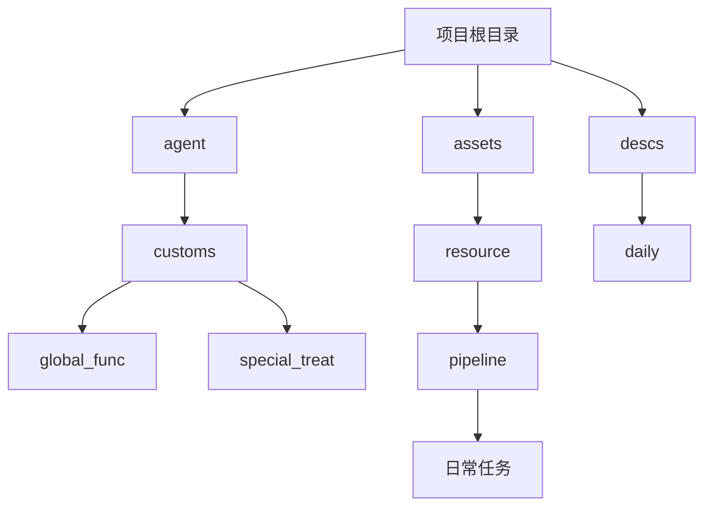
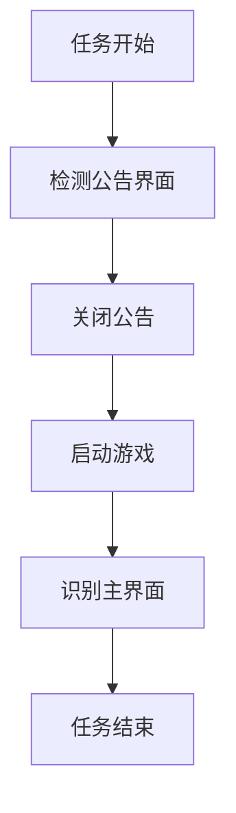
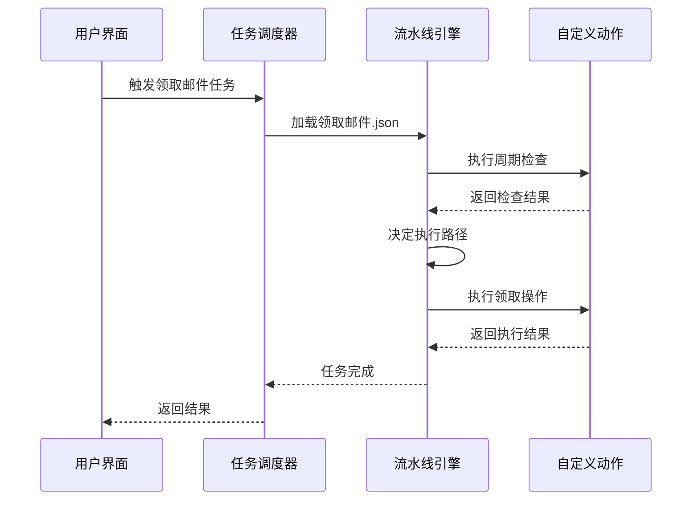
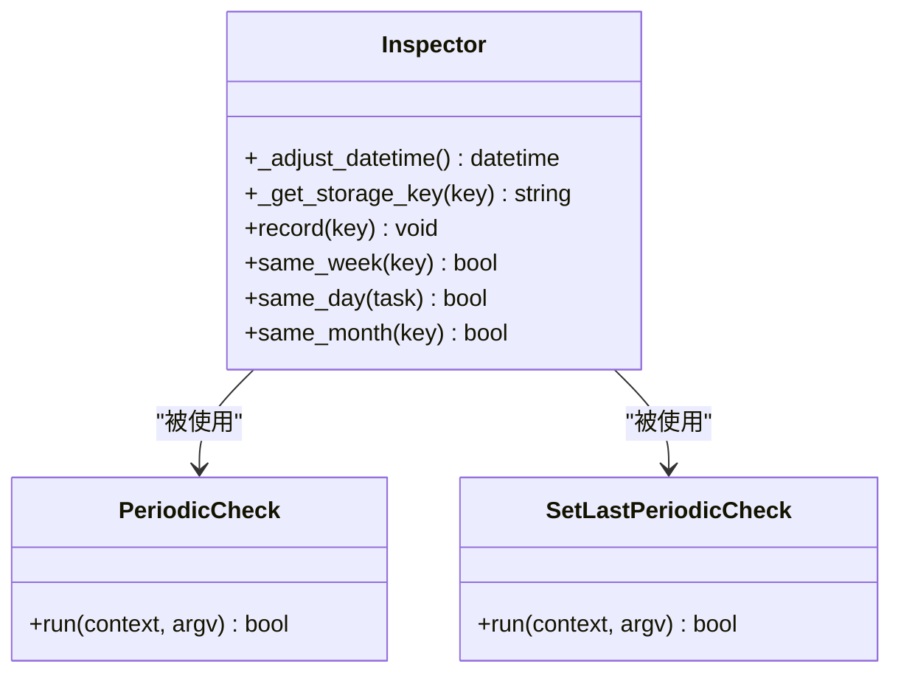
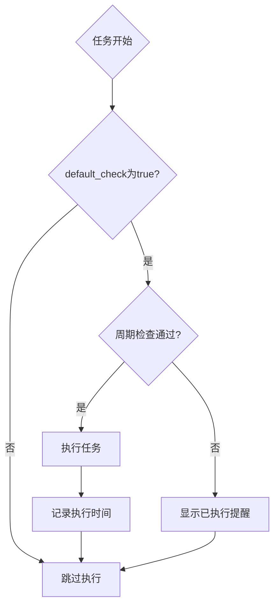
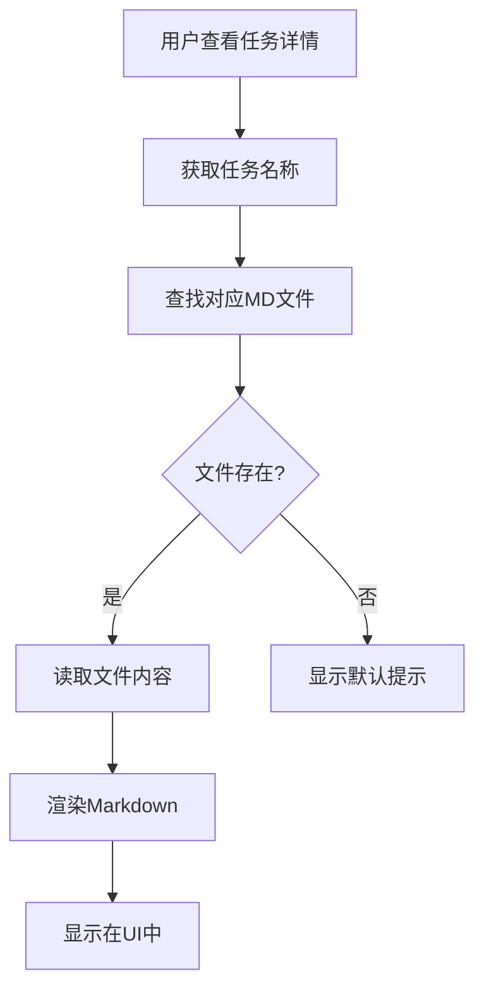
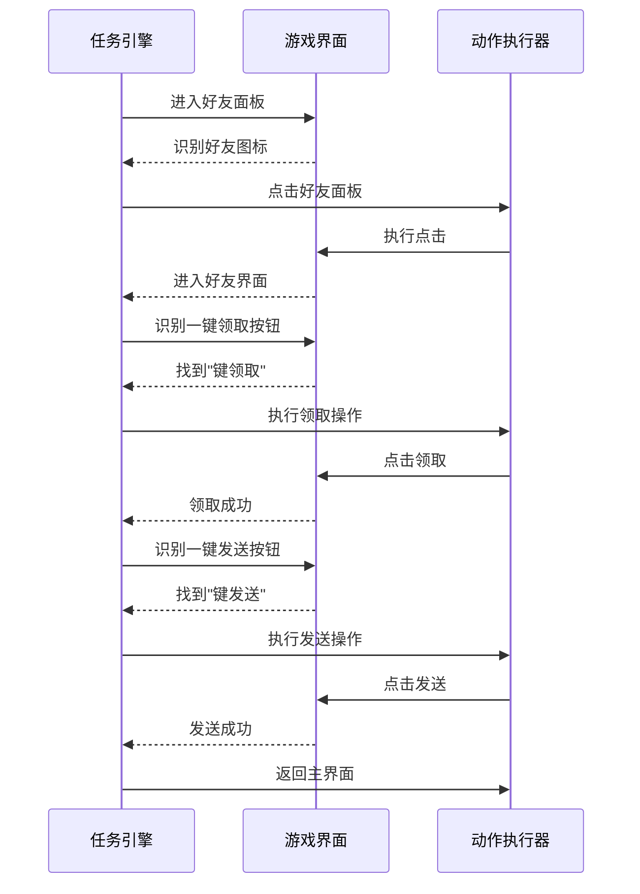
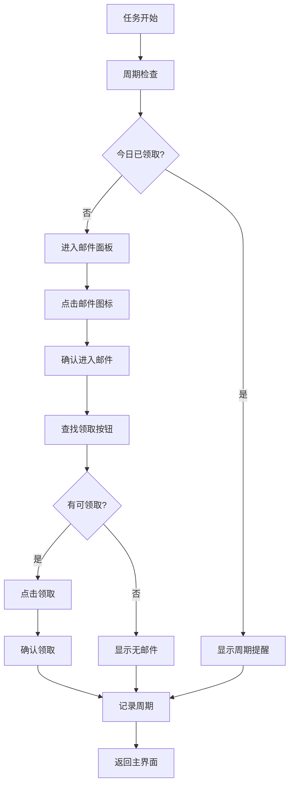
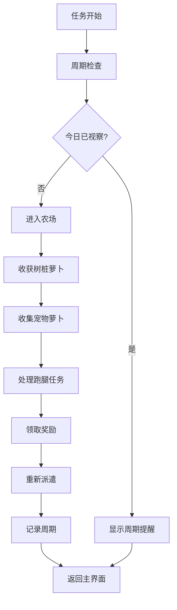
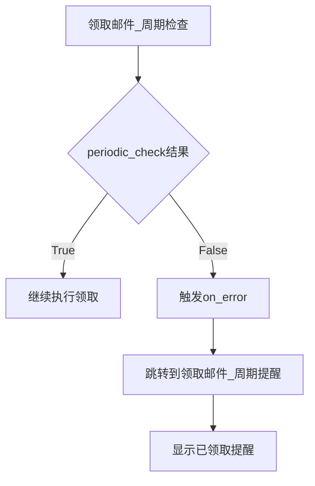

# 日常任务

<cite>
**本文档引用文件**  
- [main.py](file://agent/main.py)
- [periodic_check.py](file://agent/customs/global_func/periodic_check.py)
- [activity.py](file://agent/customs/special_treat/activity.py)
- [启动游戏.json](file://assets/resource/base/pipeline/日常任务/启动游戏.json)
- [领取邮件.json](file://assets/resource/base/pipeline/日常任务/领取邮件.json)
- [叶子互换.json](file://assets/resource/base/pipeline/日常任务/叶子互换.json)
- [领取糖果.json](file://assets/resource/base/pipeline/日常任务/领取糖果.json)
- [领取奖励.json](file://assets/resource/base/pipeline/日常任务/领取奖励.json)
- [每日活动作战.json](file://assets/resource/base/pipeline/日常任务/每日活动作战.json)
- [start_game.md](file://descs/daily/start_game.md)
- [claim_mail.md](file://descs/daily/claim_mail.md)
- [leaf_change.md](file://descs/daily/leaf_change.md)
- [claim_candy.md](file://descs/daily/claim_candy.md)
- [claim_reward.md](file://descs/daily/claim_reward.md)
- [activity_daily.md](file://descs/daily/activity_daily.md)
- [农场视察.json](file://assets/resource/base/pipeline/日常任务/农场视察.json)
- [clear_purple_candy.md](file://descs/daily/clear_purple_candy.md)
- [farm.md](file://descs/daily/farm.md)
</cite>

## 更新摘要
**变更内容**  
- 新增了'农场视察'日常任务的详细说明，包括其功能、执行流程和配置结构
- 更新了'清紫糖'和'领取糖果'任务的周期性检查机制说明，详细解释了其与`periodic_check`模块的交互方式
- 在`interface.json`中添加了相关配置选项的说明，包括新增的任务入口和默认启用状态
- 为新增的'农场视察'任务添加了对应的UI描述文档引用
- 更新了周期性任务检查机制的实现原理，基于对`periodic_check.py`源码的分析

## 目录
1. [项目结构](#项目结构)
2. [核心组件](#核心组件)
3. [日常任务配置结构](#日常任务配置结构)
4. [任务入口与流水线映射机制](#任务入口与流水线映射机制)
5. [周期性任务检查机制](#周期性任务检查机制)
6. [任务默认启用状态控制](#任务默认启用状态控制)
7. [UI描述文档动态加载](#ui描述文档动态加载)
8. [典型任务执行流程分析](#典型任务执行流程分析)
9. [特殊任务实现方式](#特殊任务实现方式)

## 项目结构

本项目采用模块化设计，主要分为代理模块（agent）、资源模块（assets）和描述文档模块（descs）。代理模块负责核心逻辑处理，资源模块包含任务流水线配置，描述文档模块提供UI界面的Markdown说明。



**图源**  
- [项目结构](file://)

## 核心组件

系统核心由任务执行引擎、自定义动作处理器和周期性检查器组成。任务执行引擎通过加载JSON配置文件驱动自动化流程，自定义动作处理器扩展了基础操作能力，周期性检查器确保任务按预期频率执行。

**本节引用**  
- [main.py](file://agent/main.py#L1-L48)
- [periodic_check.py](file://agent/customs/global_func/periodic_check.py#L1-L286)

## 日常任务配置结构

日常任务在task数组中的定义遵循统一的JSON Schema规范，每个任务由一系列节点组成，每个节点包含识别、动作、前后延迟、超时等属性。任务配置文件位于`assets/resource/base/pipeline/日常任务/`目录下。

以"启动游戏"任务为例，其配置包含多个关键节点：
- 启动游戏_启动游戏：执行启动应用操作
- 启动游戏_关闭公告：处理公告弹窗
- 启动游戏_识别主界面：确认已进入主界面



**图源**  
- [启动游戏.json](file://assets/resource/base/pipeline/日常任务/启动游戏.json#L1-L362)

**本节引用**  
- [启动游戏.json](file://assets/resource/base/pipeline/日常任务/启动游戏.json#L1-L362)

## 任务入口与流水线映射机制

任务入口通过`entry`字段与agent/customs模块中的实际流水线建立映射关系。当任务被触发时，系统会根据配置文件中的节点顺序执行相应的操作。

以"领取邮件"任务为例，其执行流程如下：
1. 通过`领取邮件_开始`节点触发任务
2. 执行`领取邮件_周期检查`进行状态判断
3. 根据检查结果决定是否进入邮件面板
4. 完成后通过`领取邮件_周期记录`记录执行时间



**图源**  
- [领取邮件.json](file://assets/resource/base/pipeline/日常任务/领取邮件.json#L1-L240)

**本节引用**  
- [领取邮件.json](file://assets/resource/base/pipeline/日常任务/领取邮件.json#L1-L240)

## 周期性任务检查机制

周期性任务检查机制通过`periodic_check.py`模块实现，支持按天、周、月三种周期模式。该机制考虑了游戏凌晨4点刷新的特性，对日期进行了特殊调整。

关键类和方法：
- `Inspector`类：提供周期判断核心功能
- `same_day`方法：判断是否为同一天
- `same_week`方法：判断是否为同一周
- `same_month`方法：判断是否为同一月



**图源**  
- [periodic_check.py](file://agent/customs/global_func/periodic_check.py#L29-L286)

**本节引用**  
- [periodic_check.py](file://agent/customs/global_func/periodic_check.py#L29-L286)
- [领取邮件.json](file://assets/resource/base/pipeline/日常任务/领取邮件.json#L45-L67)

## 任务默认启用状态控制

`default_check`字段控制任务的默认启用状态。该字段通常在UI层读取，决定任务是否在任务列表中默认勾选。虽然配置文件中未直接体现该字段，但系统通过任务元数据进行管理。

对于周期性任务，即使默认启用，也会通过`periodic_check`机制避免重复执行。例如"领取邮件"任务，当日已领取后，即使任务被选中也不会重复执行。



**本节引用**  
- [领取邮件.json](file://assets/resource/base/pipeline/日常任务/领取邮件.json#L45-L67)
- [periodic_check.py](file://agent/customs/global_func/periodic_check.py#L183-L253)

## UI描述文档动态加载

`description`字段指向`descs/daily/`目录下的Markdown文档，这些文档在UI中动态加载并渲染。系统通过任务名称匹配对应的描述文件，提供详细的使用说明和功能介绍。

例如：
- "启动游戏" → `descs/daily/start_game.md`
- "领取邮件" → `descs/daily/claim_mail.md`
- "叶子互换" → `descs/daily/leaf_change.md`



**本节引用**  
- [start_game.md](file://descs/daily/start_game.md#L1-L17)
- [claim_mail.md](file://descs/daily/claim_mail.md#L1-L13)
- [leaf_change.md](file://descs/daily/leaf_change.md#L1-L13)

## 典型任务执行流程分析

### 叶子互换任务流程

"叶子互换"任务的执行流程包括进入好友面板、一键领取、一键发送等步骤。该任务通过OCR识别"键领取"和"键发送"按钮来判断可执行操作。



**图源**  
- [叶子互换.json](file://assets/resource/base/pipeline/日常任务/叶子互换.json#L1-L158)

**本节引用**  
- [叶子互换.json](file://assets/resource/base/pipeline/日常任务/叶子互换.json#L1-L158)

### 领取邮件任务流程

"领取邮件"任务包含周期检查、进入邮件面板、领取奖励等环节。通过`pipeline_override`可以控制执行跳过逻辑。



**图源**  
- [领取邮件.json](file://assets/resource/base/pipeline/日常任务/领取邮件.json#L1-L240)

**本节引用**  
- [领取邮件.json](file://assets/resource/base/pipeline/日常任务/领取邮件.json#L1-L240)

### 农场视察任务流程

新增的"农场视察"任务实现了自动收取农场萝卜并重新派遣的功能。其执行流程如下：

1. 通过`农场视察_开始`节点触发任务
2. 执行`农场视察_周期检查`进行状态判断
3. 进入农场界面，依次执行树桩萝卜收获、宠物萝卜收集
4. 处理跑腿任务，包括领取奖励和重新派遣
5. 最后通过`农场视察_周期记录`记录执行时间



**图源**  
- [农场视察.json](file://assets/resource/base/pipeline/日常任务/农场视察.json#L1-L458)

**本节引用**  
- [农场视察.json](file://assets/resource/base/pipeline/日常任务/农场视察.json#L1-L458)
- [farm.md](file://descs/daily/farm.md#L1-L13)

## 特殊任务实现方式

### 活动任务实现

`agent/customs/special_treat/activity.py`文件中的活动任务通过自定义动作实现复杂逻辑。以`ClaimCandy`类为例，它根据时间段参数选择不同的ROI区域进行操作。

```mermaid
classDiagram
class EnterActivity {
+run(context, argv) bool
}
class ClaimCandy {
+run(context, argv) bool
}
EnterActivity --> Tasker : "使用"
ClaimCandy --> Tasker : "使用"
ClaimCandy --> ParamAnalyzer : "使用"
note right of EnterActivity
进入指定活动界面
参数 : title/t
end note
note right of ClaimCandy
领取指定时间段糖果
参数 : time/t (早饭/晚饭)
end note
```

**图源**  
- [activity.py](file://agent/customs/special_treat/activity.py#L1-L102)

**本节引用**  
- [activity.py](file://agent/customs/special_treat/activity.py#L1-L102)
- [领取糖果.json](file://assets/resource/base/pipeline/日常任务/领取糖果.json#L1-L318)

### 管道覆盖控制

周期检查类选项通过`pipeline_override`参数控制执行跳过逻辑。当`on_error`指向周期提醒节点时，若检查发现任务已完成，则直接跳转到提醒节点而不执行后续操作。

例如在"领取邮件"任务中：
- `领取邮件_周期检查`的`on_error`指向`领取邮件_周期提醒`
- 当`periodic_check`返回False时，触发错误处理流程
- 直接跳转到提醒节点，跳过领取流程



**本节引用**  
- [领取邮件.json](file://assets/resource/base/pipeline/日常任务/领取邮件.json#L60-L61)
- [periodic_check.py](file://agent/customs/global_func/periodic_check.py#L250-L251)