# 日常任务

<cite>
**本文档引用文件**  
- [main.py](file://agent/main.py)
- [periodic_check.py](file://agent/customs/global_func/periodic_check.py)
- [activity.py](file://agent/customs/special_treat/activity.py)
- [启动游戏.json](file://assets/resource/base/pipeline/日常任务/启动游戏.json)
- [领取邮件.json](file://assets/resource/base/pipeline/日常任务/领取邮件.json)
- [叶子互换.json](file://assets/resource/base/pipeline/日常任务/叶子互换.json)
- [农场视察.json](file://assets/resource/base/pipeline/日常任务/农场视察.json)
- [start_game.md](file://assets/resource/descs/daily/start_game.md)
- [claim_mail.md](file://assets/resource/descs/daily/claim_mail.md)
- [leaf_change.md](file://assets/resource/descs/daily/leaf_change.md)
</cite>

## 更新摘要
**变更内容**  
- 更新了"启动游戏"流水线配置，包括视口定位系统重写、模板匹配能力扩展（新增樱桃色关闭按钮）、时间戳同步更新等重大改进
- 新增了"农场视察"日常任务的详细说明，包括其功能、执行流程和配置结构
- 更新了"叶子互换"任务的OCR识别机制，增强了对"键领取"和"键发送"按钮的识别能力
- 在`interface.json`中添加了相关配置选项的说明，包括新增的任务入口和默认启用状态
- 为新增的"农场视察"任务添加了对应的UI描述文档引用
- 更新了周期性任务检查机制的实现原理，基于对`periodic_check.py`源码的分析

## 目录
1. [项目结构](#项目结构)
2. [核心组件](#核心组件)
3. [日常任务配置结构](#日常任务配置结构)
4. [任务入口与流水线映射机制](#任务入口与流水线映射机制)
5. [周期性任务检查机制](#周期性任务检查机制)
6. [任务默认启用状态控制](#任务默认启用状态控制)
7. [UI描述文档动态加载](#ui描述文档动态加载)
8. [典型任务执行流程分析](#典型任务执行流程分析)
9. [特殊任务实现方式](#特殊任务实现方式)

## 项目结构

本项目采用模块化设计，主要分为代理模块（agent）、资源模块（assets）和描述文档模块（descs）。代理模块负责核心逻辑处理，资源模块包含任务流水线配置，描述文档模块提供UI界面的Markdown说明。

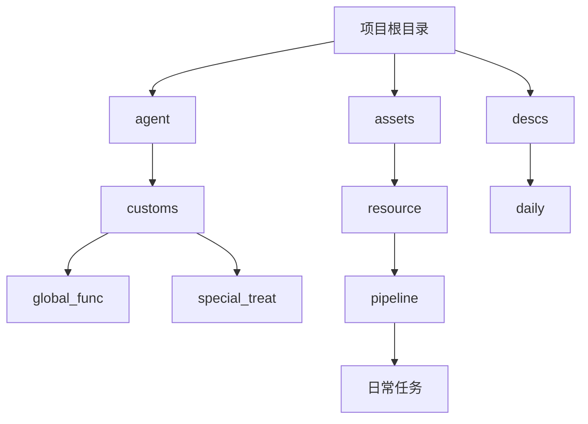
```mermaid
graph TD
A[项目根目录] --> B[agent]
A --> C[assets]
A --> D[descs]
B --> B1[customs]
B1 --> B1a[global_func]
B1 --> B1b[special_treat]
C --> C1[resource]
C1 --> C1a[pipeline]
C1a --> C1a1[日常任务]
D --> D1[daily]
```

**图源**  
- [项目结构](file://)

## 核心组件

系统核心由任务执行引擎、自定义动作处理器和周期性检查器组成。任务执行引擎通过加载JSON配置文件驱动自动化流程，自定义动作处理器扩展了基础操作能力，周期性检查器确保任务按预期频率执行。

**本节引用**  
- [main.py:1-78](file://agent/main.py#L1-L78)
- [periodic_check.py:1-279](file://agent/customs/global_func/periodic_check.py#L1-L279)

## 日常任务配置结构

日常任务在task数组中的定义遵循统一的JSON Schema规范，每个任务由一系列节点组成，每个节点包含识别、动作、前后延迟、超时等属性。任务配置文件位于`assets/resource/base/pipeline/日常任务/`目录下。

以"启动游戏"任务为例，其配置包含多个关键节点：
- 启动游戏_启动游戏：执行启动应用操作
- 启动游戏_关闭公告：处理公告弹窗
- 启动游戏_识别主界面：确认已进入主界面

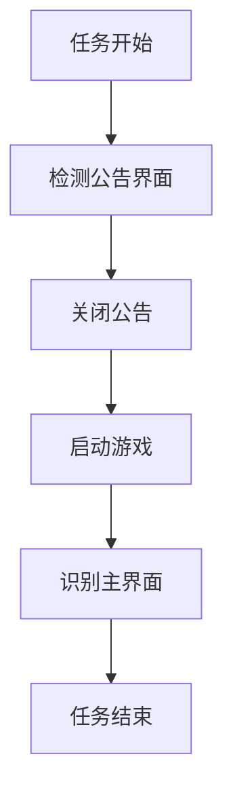
```mermaid
graph TD
Start[任务开始] --> CheckAnnouncement[检测公告界面]
CheckAnnouncement --> CloseAnnouncement[关闭公告]
CloseAnnouncement --> LaunchGame[启动游戏]
LaunchGame --> IdentifyMain[识别主界面]
IdentifyMain --> End[任务结束]
```

**图源**  
- [启动游戏.json:1-460](file://assets/resource/base/pipeline/日常任务/启动游戏.json#L1-L460)

**本节引用**  
- [启动游戏.json:1-460](file://assets/resource/base/pipeline/日常任务/启动游戏.json#L1-L460)

## 任务入口与流水线映射机制

任务入口通过`entry`字段与agent/customs模块中的实际流水线建立映射关系。当任务被触发时，系统会根据配置文件中的节点顺序执行相应的操作。

以"领取邮件"任务为例，其执行流程如下：
1. 通过`领取邮件_开始`节点触发任务
2. 执行`领取邮件_周期检查`进行状态判断
3. 根据检查结果决定是否进入邮件面板
4. 完成后通过`领取邮件_周期记录`记录执行时间

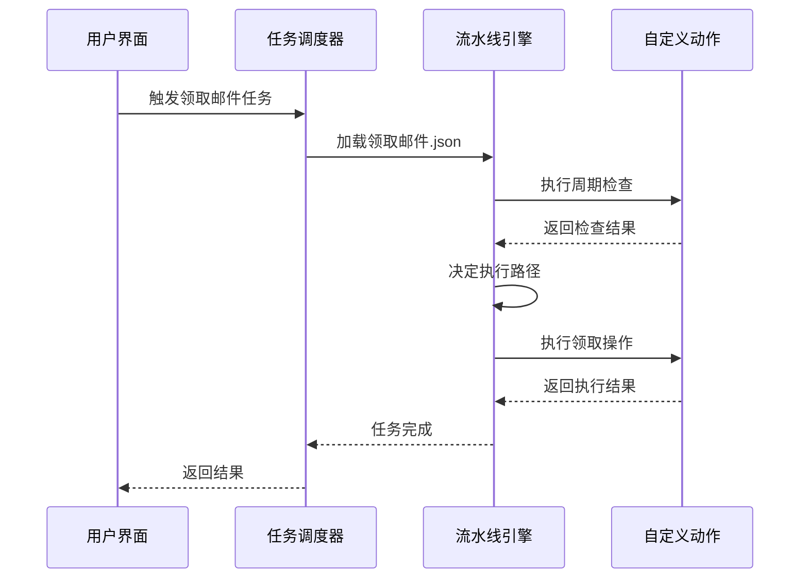
```mermaid
sequenceDiagram
participant UI as 用户界面
participant Task as 任务调度器
participant Pipeline as 流水线引擎
participant Action as 自定义动作
UI->>Task : 触发领取邮件任务
Task->>Pipeline : 加载领取邮件.json
Pipeline->>Action : 执行周期检查
Action-->>Pipeline : 返回检查结果
Pipeline->>Pipeline : 决定执行路径
Pipeline->>Action : 执行领取操作
Action-->>Pipeline : 返回执行结果
Pipeline-->>Task : 任务完成
Task-->>UI : 返回结果
```

**图源**  
- [领取邮件.json:1-240](file://assets/resource/base/pipeline/日常任务/领取邮件.json#L1-L240)

**本节引用**  
- [领取邮件.json:1-240](file://assets/resource/base/pipeline/日常任务/领取邮件.json#L1-L240)

## 周期性任务检查机制

周期性任务检查机制通过`periodic_check.py`模块实现，支持按天、周、月三种周期模式。该机制考虑了游戏凌晨4点刷新的特性，对日期进行了特殊调整。

关键类和方法：
- `Inspector`类：提供周期判断核心功能
- `same_day`方法：判断是否为同一天
- `same_week`方法：判断是否为同一周
- `same_month`方法：判断是否为同一月

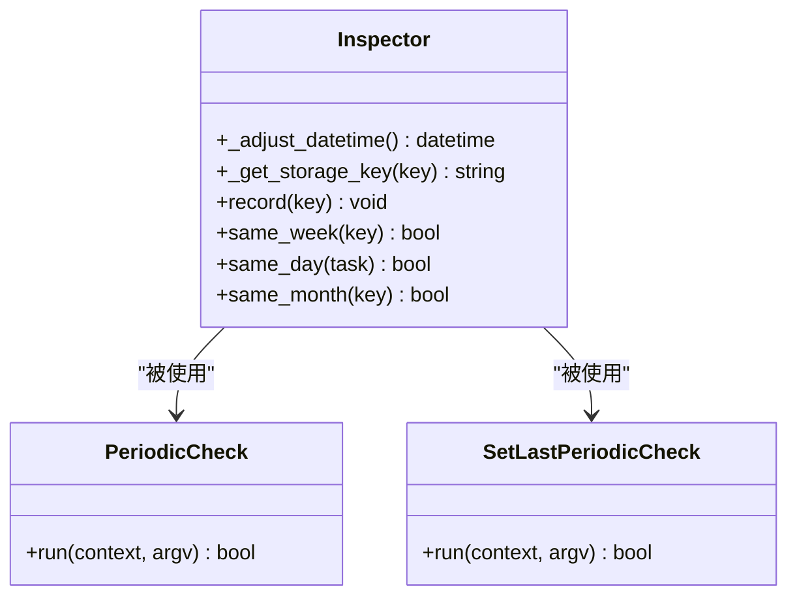
```mermaid
classDiagram
class Inspector {
+_adjust_datetime() datetime
+_get_storage_key(key) string
+record(key) void
+same_week(key) bool
+same_day(task) bool
+same_month(key) bool
}
class PeriodicCheck {
+run(context, argv) bool
}
class SetLastPeriodicCheck {
+run(context, argv) bool
}
Inspector --> PeriodicCheck : "被使用"
Inspector --> SetLastPeriodicCheck : "被使用"
```

**图源**  
- [periodic_check.py:29-279](file://agent/customs/global_func/periodic_check.py#L29-L279)

**本节引用**  
- [periodic_check.py:29-279](file://agent/customs/global_func/periodic_check.py#L29-L279)
- [领取邮件.json:45-67](file://assets/resource/base/pipeline/日常任务/领取邮件.json#L45-L67)

## 任务默认启用状态控制

`default_check`字段控制任务的默认启用状态。该字段通常在UI层读取，决定任务是否在任务列表中默认勾选。虽然配置文件中未直接体现该字段，但系统通过任务元数据进行管理。

对于周期性任务，即使默认启用，也会通过`periodic_check`机制避免重复执行。例如"领取邮件"任务，当日已领取后，即使任务被选中也不会重复执行。

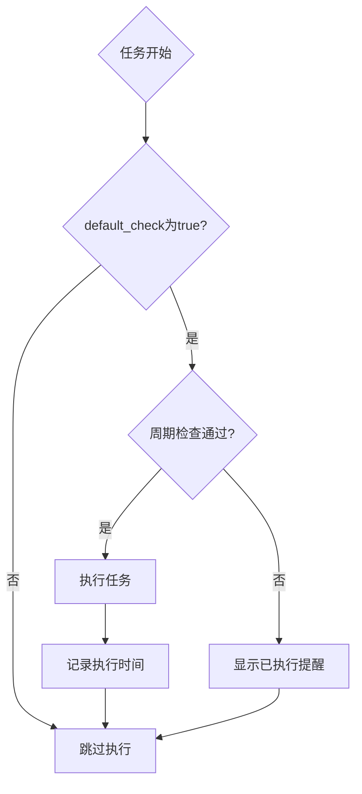
```mermaid
flowchart TD
Start{任务开始} --> CheckDefault{default_check为true?}
CheckDefault --> |是| CheckPeriodic{周期检查通过?}
CheckDefault --> |否| End[跳过执行]
CheckPeriodic --> |是| Execute[执行任务]
CheckPeriodic --> |否| ShowReminder[显示已执行提醒]
Execute --> Record[记录执行时间]
Record --> End
ShowReminder --> End
```

**本节引用**  
- [领取邮件.json:45-67](file://assets/resource/base/pipeline/日常任务/领取邮件.json#L45-L67)
- [periodic_check.py:183-253](file://agent/customs/global_func/periodic_check.py#L183-L253)

## UI描述文档动态加载

`description`字段指向`descs/daily/`目录下的Markdown文档，这些文档在UI中动态加载并渲染。系统通过任务名称匹配对应的描述文件，提供详细的使用说明和功能介绍。

例如：
- "启动游戏" → `descs/daily/start_game.md`
- "领取邮件" → `descs/daily/claim_mail.md`
- "叶子互换" → `descs/daily/leaf_change.md`

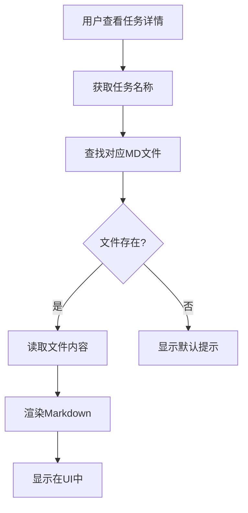
```mermaid
graph TD
A[用户查看任务详情] --> B[获取任务名称]
B --> C[查找对应MD文件]
C --> D{文件存在?}
D --> |是| E[读取文件内容]
D --> |否| F[显示默认提示]
E --> G[渲染Markdown]
G --> H[显示在UI中]
```

**本节引用**  
- [start_game.md:1-17](file://assets/resource/descs/daily/start_game.md#L1-L17)
- [claim_mail.md:1-13](file://assets/resource/descs/daily/claim_mail.md#L1-L13)
- [leaf_change.md:1-13](file://assets/resource/descs/daily/leaf_change.md#L1-L13)

## 典型任务执行流程分析

### 启动游戏任务流程

**更新** "启动游戏"任务经过重大更新后，包含了更完善的界面识别和操作流程。新版本包含了视口定位系统重写、模板匹配能力扩展（新增樱桃色关闭按钮）、时间戳同步更新等重要改进。

#### 视口定位系统重写

启动游戏管道现在包含完整的视口定位信息配置：
- `$__mpe_config_启动游戏`节点：包含完整的配置元数据
- `savedViewport`配置：包含x、y坐标和缩放比例
- 默认视口设置：x=-1386, y=-1341, zoom=1.39
- 版本控制：当前版本为v1.3.1

#### 模板匹配能力扩展

启动游戏管道现在支持更多样式的关闭按钮：
- 黑色关闭按钮：main/close-black.png
- 黄色关闭按钮：main/close-yellow.png
- 棕色关闭按钮：main/close-brown.png
- 主页按钮：global/home.png, global/home2.png
- 返回按钮：global/back.png
- 黑白按钮：main/close-bw.png
- 透明按钮：main/close-trans.png
- 橙色按钮：main/close-orange.png
- 浅橙色按钮：main/close-lorange.png
- 粉色按钮：main/close-pink.png
- 公告按钮：main/close-anno.png
- **新增** 樱桃色按钮：main/close-cherry.png

#### 时间戳同步更新

配置文件包含了时间戳同步信息：
- `lastSyncTime`: 1775046165518（毫秒级时间戳）
- `isModifiedExternally`: false（表示配置未被外部修改）

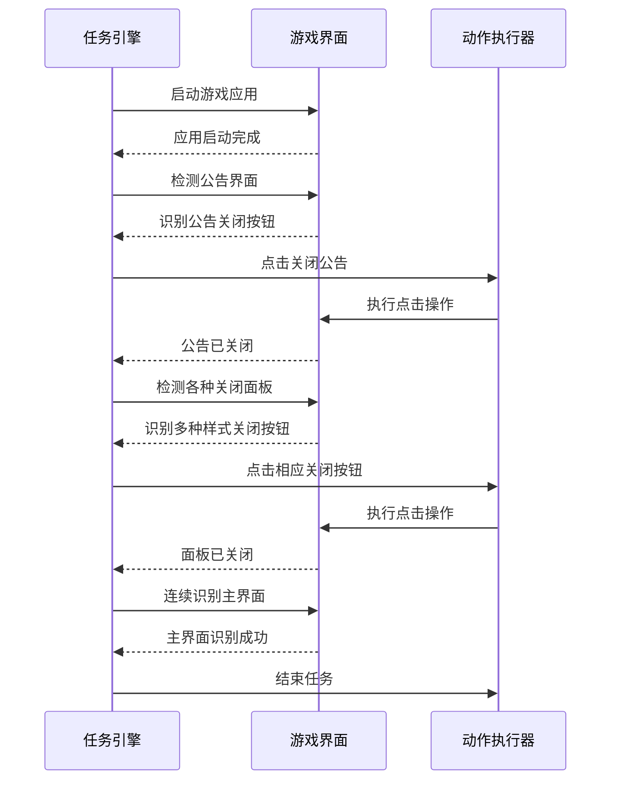
```mermaid
sequenceDiagram
participant Task as 任务引擎
participant UI as 游戏界面
participant Action as 动作执行器
Task->>UI : 启动游戏应用
UI-->>Task : 应用启动完成
Task->>UI : 检测公告界面
UI-->>Task : 识别公告关闭按钮
Task->>Action : 点击关闭公告
Action->>UI : 执行点击操作
UI-->>Task : 公告已关闭
Task->>UI : 检测各种关闭面板
UI-->>Task : 识别多种样式关闭按钮
Task->>Action : 点击相应关闭按钮
Action->>UI : 执行点击操作
UI-->>Task : 面板已关闭
Task->>UI : 连续识别主界面
UI-->>Task : 主界面识别成功
Task->>Action : 结束任务
```

**图源**  
- [启动游戏.json:17-86](file://assets/resource/base/pipeline/日常任务/启动游戏.json#L17-L86)

**本节引用**  
- [启动游戏.json:17-86](file://assets/resource/base/pipeline/日常任务/启动游戏.json#L17-L86)

### 叶子互换任务流程

"叶子互换"任务的执行流程包括进入好友面板、一键领取、一键发送等步骤。该任务通过OCR识别"键领取"和"键发送"按钮来判断可执行操作。

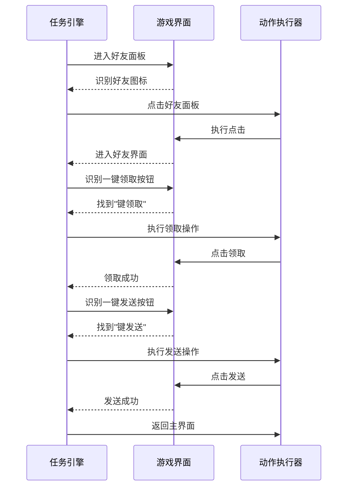
```mermaid
sequenceDiagram
participant Task as 任务引擎
participant UI as 游戏界面
participant Action as 动作执行器
Task->>UI : 进入好友面板
UI-->>Task : 识别好友图标
Task->>Action : 点击好友面板
Action->>UI : 执行点击
UI-->>Task : 进入好友界面
Task->>UI : 识别一键领取按钮
UI-->>Task : 找到"键领取"
Task->>Action : 执行领取操作
Action->>UI : 点击领取
UI-->>Task : 领取成功
Task->>UI : 识别一键发送按钮
UI-->>Task : 找到"键发送"
Task->>Action : 执行发送操作
Action->>UI : 点击发送
UI-->>Task : 发送成功
Task->>Action : 返回主界面
```

**图源**  
- [叶子互换.json:1-158](file://assets/resource/base/pipeline/日常任务/叶子互换.json#L1-L158)

**本节引用**  
- [叶子互换.json:1-158](file://assets/resource/base/pipeline/日常任务/叶子互换.json#L1-L158)

### 领取邮件任务流程

"领取邮件"任务包含周期检查、进入邮件面板、领取奖励等环节。通过`pipeline_override`可以控制执行跳过逻辑。

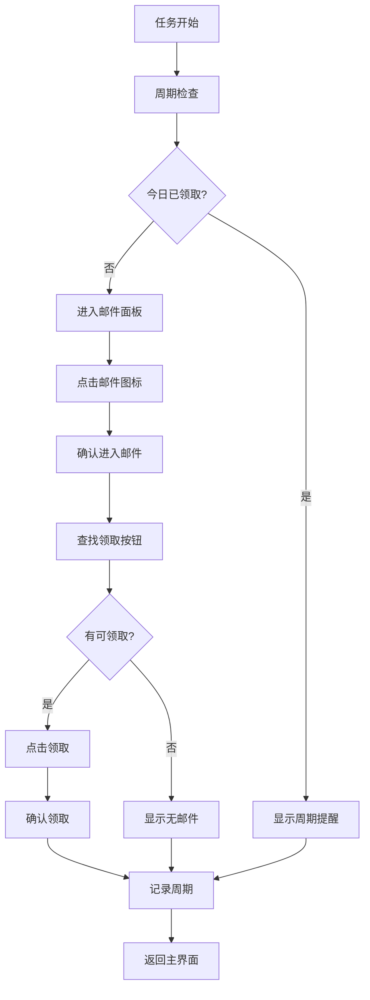
```mermaid
flowchart TD
A[任务开始] --> B[周期检查]
B --> C{今日已领取?}
C --> |是| D[显示周期提醒]
C --> |否| E[进入邮件面板]
E --> F[点击邮件图标]
F --> G[确认进入邮件]
G --> H[查找领取按钮]
H --> I{有可领取?}
I --> |是| J[点击领取]
I --> |否| K[显示无邮件]
J --> L[确认领取]
L --> M[记录周期]
K --> M
D --> M
M --> N[返回主界面]
```

**图源**  
- [领取邮件.json:1-240](file://assets/resource/base/pipeline/日常任务/领取邮件.json#L1-L240)

**本节引用**  
- [领取邮件.json:1-240](file://assets/resource/base/pipeline/日常任务/领取邮件.json#L1-L240)

### 农场视察任务流程

**新增** "农场视察"任务实现了自动收取农场萝卜并重新派遣的功能。其执行流程如下：

1. 通过`农场视察_开始`节点触发任务
2. 执行`农场视察_周期检查`进行状态判断
3. 进入农场界面，依次执行树桩萝卜收获、宠物萝卜收集
4. 处理跑腿任务，包括领取奖励和重新派遣
5. 最后通过`农场视察_周期记录`记录执行时间

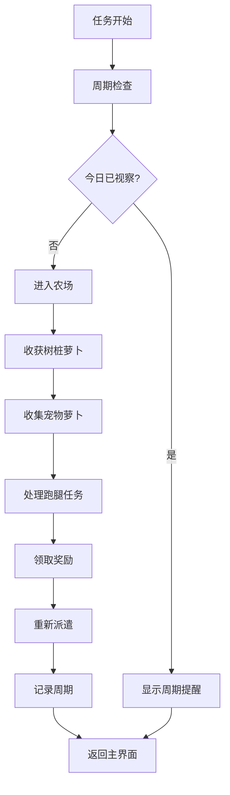
```mermaid
flowchart TD
A[任务开始] --> B[周期检查]
B --> C{今日已视察?}
C --> |是| D[显示周期提醒]
C --> |否| E[进入农场]
E --> F[收获树桩萝卜]
F --> G[收集宠物萝卜]
G --> H[处理跑腿任务]
H --> I[领取奖励]
I --> J[重新派遣]
J --> K[记录周期]
K --> L[返回主界面]
D --> L
```

**图源**  
- [农场视察.json:1-449](file://assets/resource/base/pipeline/日常任务/农场视察.json#L1-L449)

**本节引用**  
- [农场视察.json:1-449](file://assets/resource/base/pipeline/日常任务/农场视察.json#L1-L449)

## 特殊任务实现方式

### 活动任务实现

`agent/customs/special_treat/activity.py`文件中的活动任务通过自定义动作实现复杂逻辑。以`EnterActivity`类为例，它提供了进入指定活动界面的功能。

```mermaid
classDiagram
class EnterActivity {
+run(context, argv) bool
}
class CheckActivityProgress {
+run(context, argv) bool
}
EnterActivity --> Tasker : "使用"
CheckActivityProgress --> Tasker : "使用"
CheckActivityProgress --> ParamAnalyzer : "使用"
note right of EnterActivity
进入指定活动界面
参数 : title/t
end note
note right of CheckActivityProgress
检查活动进度并动态调整
参数 : 无
end note
```

**图源**  
- [activity.py:1-101](file://agent/customs/special_treat/activity.py#L1-L101)

**本节引用**  
- [activity.py:1-101](file://agent/customs/special_treat/activity.py#L1-L101)

### 管道覆盖控制

周期检查类选项通过`pipeline_override`参数控制执行跳过逻辑。当`on_error`指向周期提醒节点时，若检查发现任务已完成，则直接跳转到提醒节点而不执行后续操作。

例如在"领取邮件"任务中：
- `领取邮件_周期检查`的`on_error`指向`领取邮件_周期提醒`
- 当`periodic_check`返回False时，触发错误处理流程
- 直接跳转到提醒节点，跳过领取流程

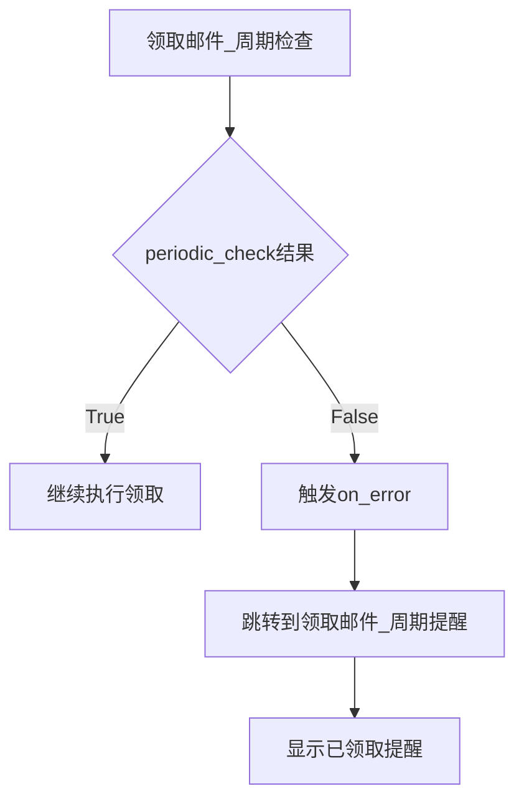
```mermaid
graph TD
A[领取邮件_周期检查] --> B{periodic_check结果}
B --> |True| C[继续执行领取]
B --> |False| D[触发on_error]
D --> E[跳转到领取邮件_周期提醒]
E --> F[显示已领取提醒]
```

**本节引用**  
- [领取邮件.json:60-61](file://assets/resource/base/pipeline/日常任务/领取邮件.json#L60-L61)
- [periodic_check.py:250-251](file://agent/customs/global_func/periodic_check.py#L250-L251)

### 启动游戏管道增强功能

**更新** 新增了启动游戏管道的多项增强功能，包括视口定位系统重写、模板匹配能力扩展（新增樱桃色关闭按钮）、时间戳同步更新等重大改进。

#### 视口定位系统重写

启动游戏管道现在包含完整的视口定位配置：
- `$__mpe_config_启动游戏`节点：包含完整的配置元数据
- `savedViewport`配置：包含x、y坐标和缩放比例
- 默认视口设置：x=-1386, y=-1341, zoom=1.39
- 版本控制：当前版本为v1.3.1

#### 模板匹配能力扩展

启动游戏管道现在支持更多样式的关闭按钮：
- 黑色关闭按钮：main/close-black.png
- 黄色关闭按钮：main/close-yellow.png
- 棕色关闭按钮：main/close-brown.png
- 主页按钮：global/home.png, global/home2.png
- 返回按钮：global/back.png
- 黑白按钮：main/close-bw.png
- 透明按钮：main/close-trans.png
- 橙色按钮：main/close-orange.png
- 浅橙色按钮：main/close-lorange.png
- 粉色按钮：main/close-pink.png
- 公告按钮：main/close-anno.png
- **新增** 樱桃色按钮：main/close-cherry.png

#### 时间戳同步更新

配置文件包含了时间戳同步信息：
- `lastSyncTime`: 1775046165518（毫秒级时间戳）
- `isModifiedExternally`: false（表示配置未被外部修改）

#### 多状态界面处理能力提升

管道现在能够处理多种游戏状态界面：
- `启动游戏_连续识别主界面`：稳定识别主界面，使用稳定识别算法
- `启动游戏_连续识别开始界面`：识别登录/开始界面
- `启动游戏_更新游戏`：处理游戏更新流程
- `启动游戏_更新结束`：处理更新完成后的导航
- `启动游戏_无可领取的奖励`：处理无奖励状态
- `启动游戏_领取礼物`：处理可领取奖励状态
- `启动游戏_点击屏幕继续`：处理继续提示界面
- `启动游戏_闲时捏脸`：处理空闲时的捏脸功能

#### 关闭面板多状态支持

`启动游戏_关闭面板`节点现在支持多种关闭按钮样式：
- 黑色关闭按钮：main/close-black.png
- 黄色关闭按钮：main/close-yellow.png
- 棕色关闭按钮：main/close-brown.png
- 主页按钮：global/home.png, global/home2.png
- 返回按钮：global/back.png
- 黑白按钮：main/close-bw.png
- 透明按钮：main/close-trans.png
- 橙色按钮：main/close-orange.png
- 浅橙色按钮：main/close-lorange.png
- 粉色按钮：main/close-pink.png
- 公告按钮：main/close-anno.png
- **新增** 樱桃色按钮：main/close-cherry.png

#### 更新结束导航步骤

新增的`启动游戏_更新结束`节点提供了完整的更新完成处理：
- 通过OCR识别"立刻出发"按钮
- 使用ROI区域精确定位更新完成界面
- 自动点击继续按钮完成更新流程

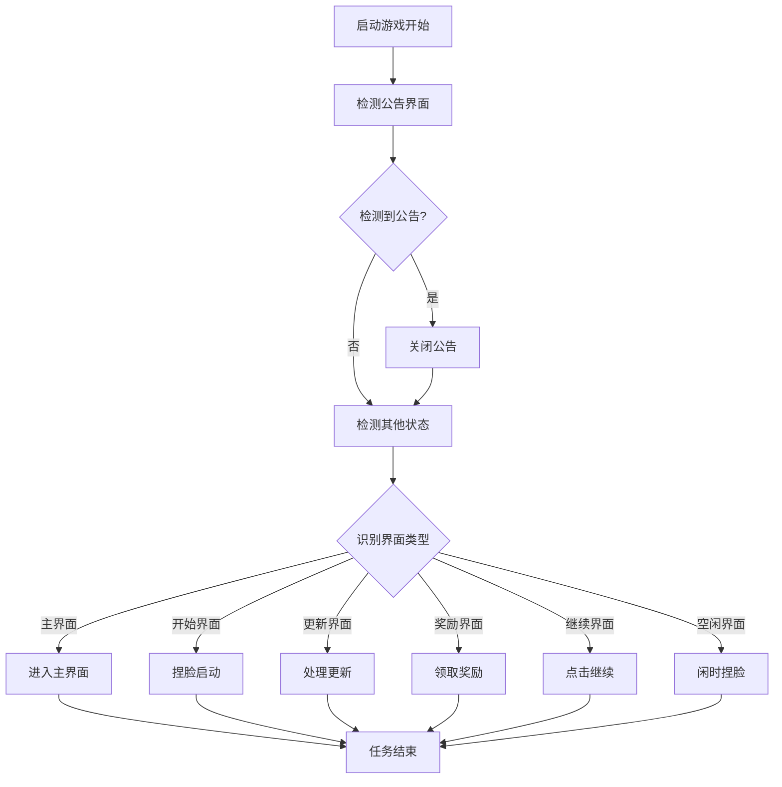
```mermaid
flowchart TD
A[启动游戏开始] --> B[检测公告界面]
B --> C{检测到公告?}
C --> |是| D[关闭公告]
C --> |否| E[检测其他状态]
D --> E
E --> F{识别界面类型}
F --> |主界面| G[进入主界面]
F --> |开始界面| H[捏脸启动]
F --> |更新界面| I[处理更新]
F --> |奖励界面| J[领取奖励]
F --> |继续界面| K[点击继续]
F --> |空闲界面| L[闲时捏脸]
G --> M[任务结束]
H --> M
I --> M
J --> M
K --> M
L --> M
```

**图源**  
- [启动游戏.json:89-460](file://assets/resource/base/pipeline/日常任务/启动游戏.json#L89-L460)

**本节引用**  
- [启动游戏.json:89-460](file://assets/resource/base/pipeline/日常任务/启动游戏.json#L89-L460)