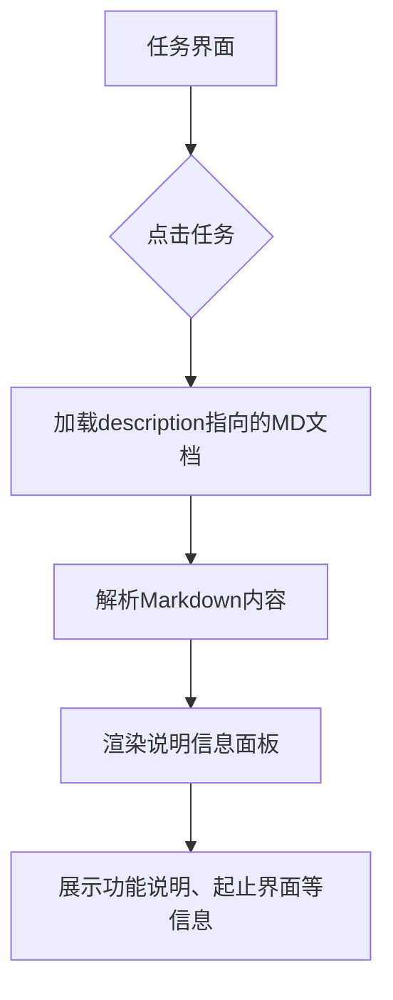
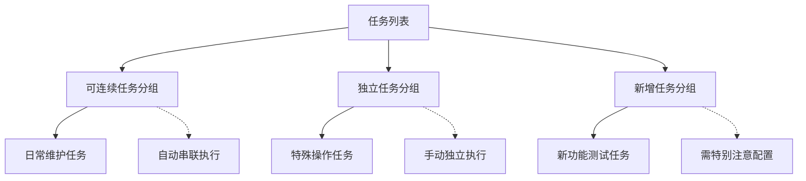

# 独立任务

<cite>
**本文档引用文件**  
- [interface.json](file://assets/interface.json)
- [continuous_battle.md](file://descs/single/continuous_battle.md)
- [independent_task.md](file://descs/others/independent_task.md)
- [continuous_task.md](file://descs/others/continuous_task.md)
- [连续作战.json](file://assets/resource/base/pipeline/开荒功能/连续作战.json)
- [分隔符.json](file://assets/resource/base/pipeline/其他/分隔符.json)
- [tasker.py](file://agent/customs/maahelper/tasker.py)
- [pipeline_helper.py](file://agent/customs/global_func/pipeline_helper.py)
</cite>

## 目录
1. [独立任务配置特点](#独立任务配置特点)
2. [独立功能入口定义机制](#独立功能入口定义机制)
3. [与日常任务的执行模式差异](#与日常任务的执行模式差异)
4. [任务说明信息展示规则](#任务说明信息展示规则)
5. [UI任务列表分类展示逻辑](#ui任务列表分类展示逻辑)

## 独立任务配置特点

独立任务分组在系统中用于管理无法与其他任务自动串联执行的特殊任务类型。这类任务通常具有界面独立、需手动触发和流程特殊等特点。从配置角度看，独立任务通过在 `interface.json` 文件中设置特定的分隔符和任务项来实现逻辑隔离。

在 `interface.json` 中，独立任务分组以 `"——— 独立任务 ———"` 作为视觉分隔标识，其对应的配置项为：
```json
{
    "name": " ——— 独立任务 ———",
    "label": "——— 独立任务 ———",
    "entry": "独立任务分隔符",
    "description": "Resource/descs/others/independent_task.md"
}
```
该配置不仅提供了UI上的分组视觉效果，还通过 `entry` 字段关联到特定的管道节点 `独立任务分隔符`，用于在任务执行流程中标记独立任务的开始。

**Section sources**
- [interface.json](file://assets/interface.json#L145-L150)
- [independent_task.md](file://descs/others/independent_task.md#L1-L15)

## 独立功能入口定义机制

独立任务在 `interface.json` 中作为独立功能入口的定义方式遵循统一的结构规范，包含 `name` 显示名称、`entry` 启动标识符和后端处理逻辑的关联机制。

以连续作战任务为例，其定义如下：
```json
{
    "name": "连续作战",
    "label": "连续作战",
    "entry": "连续作战_开始",
    "description": "Resource/descs/single/continuous_battle.md"
}
```

- **name 显示名称**：在UI界面中显示的任务名称，用于用户识别
- **entry 启动标识符**：关联到任务管道中的具体节点名称，作为任务执行的入口点
- **description 说明文档**：指向任务说明文档的路径，提供详细的功能描述

后端处理逻辑的关联机制通过 `entry` 字段与管道配置文件中的节点名称建立映射关系。当用户触发任务时，系统调用 `Tasker.run(entry)` 方法，以 `entry` 值作为参数启动相应的任务流程。这种设计实现了前端界面与后端执行逻辑的解耦，使得任务配置更加灵活。

**Section sources**
- [interface.json](file://assets/interface.json#L151-L156)
- [tasker.py](file://agent/customs/maahelper/tasker.py#L51-L80)
- [pipeline_helper.py](file://agent/customs/global_func/pipeline_helper.py#L9-L24)

## 与日常任务的执行模式差异

独立任务与日常任务在执行模式上存在显著差异，主要体现在任务串联能力、触发方式和应用场景等方面。

### 执行模式对比

| 特性 | 独立任务 | 日常任务 |
|------|---------|---------|
| **界面衔接** | 开始/结束界面非主界面，无法自动衔接 | 收尾相接，开始和结束均为主界面 |
| **触发方式** | 需手动触发，不建议加入自动化任务链 | 可自动串联执行，形成完整流程 |
| **执行场景** | 非周期性、特殊流程任务 | 周期性、常规维护任务 |
| **任务链位置** | 不应放在可连续任务链中 | 适合组成连续任务链 |

### 设计意图分析

独立任务通常用于非周期性、手动触发的场景，这种设计意图体现在：
1. **防止误执行**：避免在自动化任务流中意外触发可能影响游戏状态的特殊操作
2. **确保用户确认**：需要用户明确意图后才执行，降低操作风险
3. **处理特殊流程**：适应那些无法标准化、需要特定前置条件的任务

例如，连续作战任务被设计为独立任务，因为它需要用户在特定关卡界面手动启动，且执行流程依赖于当前游戏进度和资源状况，不适合纳入常规的每日自动化任务序列。

**Section sources**
- [independent_task.md](file://descs/others/independent_task.md#L3-L8)
- [continuous_task.md](file://descs/others/continuous_task.md#L3-L7)
- [interface.json](file://assets/interface.json#L52-L57)

## 任务说明信息展示规则

任务说明信息的展示规则通过 `description` 字段与 Markdown 文档的关联机制实现。以连续作战任务为例，其说明信息展示遵循以下规则：

### 信息展示机制

1. **文档关联**：每个任务通过 `description` 字段指向特定的 `.md` 说明文档
2. **内容结构**：说明文档采用标准化的 Markdown 格式，包含功能说明、起止界面等关键信息
3. **元数据标记**：使用 `【独立任务】【开荒功能】` 等标签标识任务属性

### 连续作战任务说明示例

根据 `continuous_battle.md` 文档内容，连续作战任务的说明信息包括：
- **功能定位**：明确标注为"独立任务"和"开荒功能"
- **功能说明**：描述自动进行关卡连续挑战的用途，适用于开荒推图等场景
- **起止界面**：详细说明启动界面为关卡选择界面，结束界面为战斗结算或失败界面

这种结构化的说明信息展示方式，使用户能够快速理解任务的功能定位、适用场景和操作要求。



**Diagram sources**
- [continuous_battle.md](file://descs/single/continuous_battle.md#L1-L13)
- [interface.json](file://assets/interface.json#L155-L156)

**Section sources**
- [continuous_battle.md](file://descs/single/continuous_battle.md#L1-L13)
- [interface.json](file://assets/interface.json#L155-L156)

## UI任务列表分类展示逻辑

UI任务列表的特殊分类展示逻辑通过分隔符配置和任务分组机制实现，为用户提供清晰的任务组织视图。

### 分类展示机制

系统通过在 `interface.json` 中定义分隔符来实现任务列表的分类展示：
```json
{
    "task": [
        {
            "name": " ——— 可连续任务 ———",
            "label": "——— 可连续任务 ———",
            "entry": "可连续任务分隔符",
            "description": "Resource/descs/others/continuous_task.md"
        },
        // ... 可连续任务列表
        {
            "name": " ——— 独立任务 ———",
            "label": "——— 独立任务 ———",
            "entry": "独立任务分隔符",
            "description": "Resource/descs/others/independent_task.md"
        },
        // ... 独立任务列表
    ]
}
```

### 分隔符配置逻辑

分隔符的配置不仅提供视觉分隔，还通过 `entry` 字段关联到管道配置中的特殊节点：
```json
{
    "可连续任务分隔符": {
        "focus": "—— 即将执行可连续任务！——"
    },
    "独立任务分隔符": {
        "focus": "—— 即将执行独立任务！——"
    }
}
```

这种设计实现了：
1. **视觉分组**：在UI上清晰划分不同类型的任务
2. **执行提示**：在任务执行日志中提供明确的阶段标识
3. **逻辑隔离**：强调不同类型任务的执行特性和注意事项

### 展示效果分析

任务列表的分类展示逻辑遵循以下原则：
- **功能相关性**：将功能相似的任务组织在一起
- **执行模式**：按可连续任务和独立任务进行主要分类
- **使用频率**：将常用任务放在前面，新增任务单独分组
- **用户引导**：通过分隔符的说明文档提供使用建议

这种分类展示方式帮助用户快速定位所需任务，理解不同任务类型的特性和使用场景，提高了系统的可用性和用户体验。



**Diagram sources**
- [interface.json](file://assets/interface.json#L52-L162)
- [分隔符.json](file://assets/resource/base/pipeline/其他/分隔符.json#L1-L11)

**Section sources**
- [interface.json](file://assets/interface.json#L52-L162)
- [分隔符.json](file://assets/resource/base/pipeline/其他/分隔符.json#L1-L11)
- [independent_task.md](file://descs/others/independent_task.md#L1-L15)