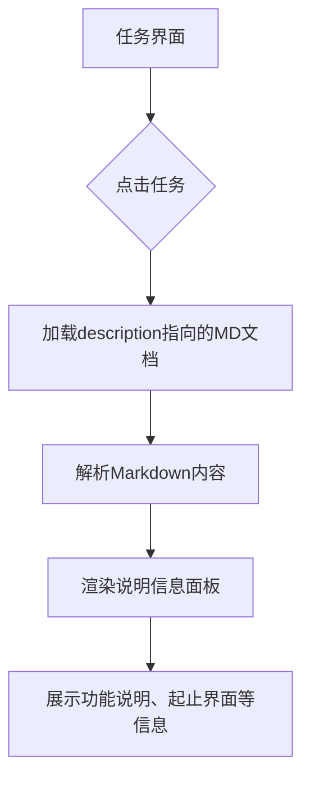
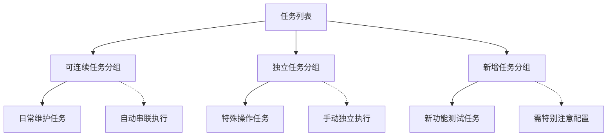

# 独立任务

<cite>
**本文档引用文件**
- [interface.json](file://assets/interface.json)
- [independent_task.json](file://assets/resource/tasks/separators/independent_task.json)
- [continuous_battle.json](file://assets/resource/tasks/single/continuous_battle.json)
- [level_rewards.json](file://assets/resource/tasks/single/level_rewards.json)
- [quick_plot.json](file://assets/resource/tasks/single/quick_plot.json)
- [continuous_battle.md](file://assets/resource/descs/single/continuous_battle.md)
- [level_rewards.md](file://assets/resource/descs/single/level_rewards.md)
- [quick_plot.md](file://assets/resource/descs/single/quick_plot.md)
- [independent_task.md](file://assets/resource/descs/others/independent_task.md)
- [continuous_task.md](file://assets/resource/descs/others/continuous_task.md)
- [分隔符.json](file://assets/resource/base/pipeline/其他/分隔符.json)
- [tasker.py](file://agent/customs/maahelper/tasker.py)
- [pipeline_helper.py](file://agent/customs/global_func/pipeline_helper.py)
</cite>

## 目录
1. [独立任务配置特点](#独立任务配置特点)
2. [独立功能入口定义机制](#独立功能入口定义机制)
3. [与日常任务的执行模式差异](#与日常任务的执行模式差异)
4. [任务说明信息展示规则](#任务说明信息展示规则)
5. [UI任务列表分类展示逻辑](#ui任务列表分类展示逻辑)

## 独立任务配置特点

独立任务分组在系统中用于管理无法与其他任务自动串联执行的特殊任务类型。根据最新的配置更新，独立任务现在通过新增的 `independent` 组来实现更精确的分类管理。

### 组配置结构

系统现在支持三种主要任务组：
- **continuous组**：可连续执行的日常任务
- **independent组**：独立执行的特殊任务
- **others组**：分隔符和其他辅助功能

在 `interface.json` 中，独立任务组的配置为：
```json
{
    "name": "independent",
    "label": "独立任务/开荒任务",
    "description": "无法与其他任务自动串联执行",
    "default_expand": true
}
```

### 独立任务分类范围

新增的独立任务包括以下核心功能：
- **连续作战**：自动进行关卡连续挑战
- **领取关卡奖励**：领取通关奖励
- **快速剧情**：快速跳过系列剧情

这些任务都通过 `"group": ["independent"]` 属性明确标识为独立任务类型。

**Section sources**
- [interface.json:46-51](file://assets/interface.json#L46-L51)
- [continuous_battle.json](file://assets/resource/tasks/single/continuous_battle.json#L8)
- [level_rewards.json](file://assets/resource/tasks/single/level_rewards.json#L8)
- [quick_plot.json](file://assets/resource/tasks/single/quick_plot.json#L8)

## 独立功能入口定义机制

独立任务在 `interface.json` 中作为独立功能入口的定义方式遵循统一的结构规范，包含 `name` 显示名称、`entry` 启动标识符和后端处理逻辑的关联机制。

### 核心任务定义模式

以连续作战任务为例，其定义如下：
```json
{
    "name": "连续作战",
    "label": "🚀连续作战",
    "entry": "连续作战_开始",
    "description": "Resource/descs/single/continuous_battle.md",
    "group": ["independent"]
}
```

### 任务属性详解

- **name 显示名称**：在UI界面中显示的任务名称，如"连续作战"
- **label 标签**：带图标前缀的显示格式，如"🚀连续作战"
- **entry 启动标识符**：关联到任务管道中的具体节点名称，如"连续作战_开始"
- **description 说明文档**：指向任务说明文档的路径
- **group 组别**：指定任务所属的组别，如["independent"]

### 后端处理逻辑关联

后端处理逻辑通过 `entry` 字段与管道配置文件中的节点名称建立映射关系。当用户触发任务时，系统调用 `Tasker.run(entry)` 方法，以 `entry` 值作为参数启动相应的任务流程。

**Section sources**
- [continuous_battle.json:3-10](file://assets/resource/tasks/single/continuous_battle.json#L3-L10)
- [level_rewards.json:3-10](file://assets/resource/tasks/single/level_rewards.json#L3-L10)
- [quick_plot.json:3-10](file://assets/resource/tasks/single/quick_plot.json#L3-L10)
- [tasker.py:51-80](file://agent/customs/maahelper/tasker.py#L51-L80)
- [pipeline_helper.py:9-24](file://agent/customs/global_func/pipeline_helper.py#L9-L24)

## 与日常任务的执行模式差异

独立任务与日常任务在执行模式上存在显著差异，主要体现在任务串联能力、触发方式和应用场景等方面。

### 执行模式对比

| 特性 | 独立任务 | 日常任务 |
|------|---------|---------|
| **界面衔接** | 开始/结束界面非主界面，无法自动衔接 | 收尾相接，开始和结束均为主界面 |
| **触发方式** | 需手动触发，不建议加入自动化任务链 | 可自动串联执行，形成完整流程 |
| **执行场景** | 非周期性、特殊流程任务 | 周期性、常规维护任务 |
| **任务链位置** | 不应放在可连续任务链中 | 适合组成连续任务链 |

### 独立任务设计原则

独立任务通常用于非周期性、手动触发的场景，这种设计原则体现在：
1. **防止误执行**：避免在自动化任务流中意外触发可能影响游戏状态的特殊操作
2. **确保用户确认**：需要用户明确意图后才执行，降低操作风险
3. **处理特殊流程**：适应那些无法标准化、需要特定前置条件的任务

### 典型独立任务示例

- **连续作战**：需要用户在特定关卡界面手动启动
- **领取关卡奖励**：需要用户在特定关卡选择界面手动启动  
- **快速剧情**：需要用户在剧情内手动启动

这些任务的执行流程都依赖于当前游戏进度和资源状况，不适合纳入常规的每日自动化任务序列。

**Section sources**
- [independent_task.md:3-8](file://assets/resource/descs/others/independent_task.md#L3-L8)
- [continuous_task.md:3-7](file://assets/resource/descs/others/continuous_task.md#L3-L7)
- [interface.json:52-57](file://assets/interface.json#L52-L57)

## 任务说明信息展示规则

任务说明信息的展示规则通过 `description` 字段与 Markdown 文档的关联机制实现。独立任务的说明信息展示遵循统一的结构化格式。

### 信息展示机制

1. **文档关联**：每个任务通过 `description` 字段指向特定的 `.md` 说明文档
2. **内容结构**：说明文档采用标准化的 Markdown 格式，包含功能说明、起止界面等关键信息
3. **元数据标记**：使用 `【独立任务】【开荒功能】` 等标签标识任务属性

### 独立任务说明模板

所有独立任务都遵循相同的说明格式：
```markdown
## **任务名称**

**【独立任务】【开荒功能】**

#### **⭐ 功能说明**

[任务功能的具体描述]

#### **🖥️ 起止界面**

- **启动界面**：[启动时的游戏界面描述]
- **结束界面**：[结束时的游戏界面描述]
```

### 具体任务说明示例

#### 连续作战任务说明
- **功能定位**：标注为"独立任务"和"开荒功能"
- **功能说明**：描述自动进行关卡连续挑战的用途
- **起止界面**：启动界面为关卡选择界面，结束界面为战斗结算或失败界面

#### 领取关卡奖励任务说明
- **功能定位**：标注为"独立任务"和"开荒功能"  
- **功能说明**：描述领取关卡通关奖励的功能
- **起止界面**：启动界面为最后未领取奖励的关卡选择界面，结束界面为第一个关卡选择界面

#### 快速剧情任务说明
- **功能定位**：标注为"独立任务"和"开荒功能"
- **功能说明**：描述快速跳过系列剧情的功能
- **起止界面**：启动界面为剧情内，结束界面为剧情选择界面


```mermaid
flowchart TD
A[任务界面] --> B{点击任务}
B --> C[加载description指向的MD文档]
C --> D[解析Markdown内容]
D --> E[渲染说明信息面板]
E --> F[展示功能说明、起止界面等信息]
```

**Diagram sources**
- [continuous_battle.md:1-13](file://assets/resource/descs/single/continuous_battle.md#L1-L13)
- [level_rewards.md:1-13](file://assets/resource/descs/single/level_rewards.md#L1-L13)
- [quick_plot.md:1-13](file://assets/resource/descs/single/quick_plot.md#L1-L13)
- [interface.json:155-156](file://assets/interface.json#L155-L156)

**Section sources**
- [continuous_battle.md:1-13](file://assets/resource/descs/single/continuous_battle.md#L1-L13)
- [level_rewards.md:1-13](file://assets/resource/descs/single/level_rewards.md#L1-L13)
- [quick_plot.md:1-13](file://assets/resource/descs/single/quick_plot.md#L1-L13)
- [interface.json:155-156](file://assets/interface.json#L155-L156)

## UI任务列表分类展示逻辑

UI任务列表的分类展示逻辑通过分隔符配置和任务分组机制实现，为用户提供清晰的任务组织视图。根据最新的配置，系统现在支持三种主要的分组方式。

### 分类展示机制

系统通过在 `interface.json` 中定义分隔符来实现任务列表的分类展示：
```json
{
    "task": [
        {
            "name": " ——— 可连续任务 ———",
            "label": "——— 可连续任务 ———",
            "entry": "可连续任务分隔符",
            "description": "Resource/descs/others/continuous_task.md",
            "group": ["others"]
        },
        // ... 可连续任务列表
        {
            "name": " ——— 独立任务 ———", 
            "label": "——— 独立任务 ———",
            "entry": "独立任务分隔符",
            "description": "Resource/descs/others/independent_task.md",
            "group": ["others"]
        },
        // ... 独立任务列表
    ]
}
```

### 组别配置逻辑

系统现在支持三种组别配置：
```json
{
    "continuous": {
        "name": "continuous",
        "label": "可连续任务/日常任务",
        "description": "在完成当前任务后，可以连续执行下一个任务",
        "default_expand": true
    },
    "independent": {
        "name": "independent", 
        "label": "独立任务/开荒任务",
        "description": "无法与其他任务自动串联执行",
        "default_expand": true
    },
    "others": {
        "name": "others",
        "label": "其他",
        "description": "分割线等，一般无需添加",
        "default_expand": true
    }
}
```

### 分隔符配置逻辑

分隔符的配置不仅提供视觉分隔，还通过 `entry` 字段关联到管道配置中的特殊节点：
```json
{
    "可连续任务分隔符": {
        "focus": "—— 即将执行可连续任务！——"
    },
    "独立任务分隔符": {
        "focus": "—— 即将执行独立任务！——"
    },
    "新增任务分隔符": {
        "focus": "请手动调整新增任务至合适位置！"
    }
}
```

### 展示效果分析

任务列表的分类展示逻辑遵循以下原则：
- **功能相关性**：将功能相似的任务组织在一起
- **执行模式**：按可连续任务和独立任务进行主要分类
- **使用频率**：将常用任务放在前面，新增任务单独分组
- **用户引导**：通过分隔符的说明文档提供使用建议

这种分类展示方式帮助用户快速定位所需任务，理解不同任务类型的特性和使用场景，提高了系统的可用性和用户体验。


```mermaid
graph TB
A[任务列表] --> B[可连续任务分组]
A --> C[独立任务分组]
A --> D[新增任务分组]
B --> E[日常维护任务]
C --> F[特殊操作任务]
D --> G[新功能测试任务]
B -.-> H[自动串联执行]
C -.-> I[手动独立执行]
D -.-> J[需特别注意配置]
```

**Diagram sources**
- [interface.json:52-162](file://assets/interface.json#L52-L162)
- [分隔符.json:1-11](file://assets/resource/base/pipeline/其他/分隔符.json#L1-L11)
- [independent_task.json:1-13](file://assets/resource/tasks/separators/independent_task.json#L1-L13)

**Section sources**
- [interface.json:52-162](file://assets/interface.json#L52-L162)
- [分隔符.json:1-11](file://assets/resource/base/pipeline/其他/分隔符.json#L1-L11)
- [independent_task.json:1-13](file://assets/resource/tasks/separators/independent_task.json#L1-L13)
- [independent_task.md:1-15](file://assets/resource/descs/others/independent_task.md#L1-L15)