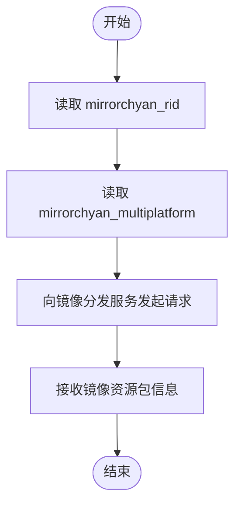

# 基础信息配置

<cite>
**本文引用的文件**
- [assets/interface.json](file://assets/interface.json)
- [instructions/maafw-guide/3.3-ProjectInterfaceV2协议.md](file://instructions/maafw-guide/3.3-ProjectInterfaceV2协议.md)
- [README.md](file://README.md)
- [tools/requirements.txt](file://tools/requirements.txt)
</cite>

## 目录
1. [简介](#简介)
2. [项目结构](#项目结构)
3. [核心组件](#核心组件)
4. [架构总览](#架构总览)
5. [详细组件分析](#详细组件分析)
6. [依赖关系分析](#依赖关系分析)
7. [性能考量](#性能考量)
8. [故障排查指南](#故障排查指南)
9. [结论](#结论)

## 简介
本文件聚焦于 interface.json 的基础字段，系统性解析以下主题：
- 协议版本与兼容性：interface_version 的固定值与版本演进
- 项目标识符：name 的唯一性与用途
- UI 展示：title 的窗口标题生成逻辑、label 的回退策略
- 图标：icon 的路径引用规则与国际化支持
- 描述：description 的渲染位置与国际化
- 版本号：version 的展示与更新检查策略
- 欢迎语：welcome 的首次展示与更新提示机制
- 联系方式：contact 的呈现方式与内容来源
- 许可证：license 的关联机制与呈现位置
- GitHub 主页：github 的跳转行为与更新约定
- 镜像分发：mirrorchyan_rid 的资源包标识作用
- 多平台支持：mirrorchyan_multiplatform 对资源加载的影响
- 字段缺失的默认处理与校验规则

## 项目结构
interface.json 位于 assets 目录，是 MaaFramework 标准化项目结构的声明文件，承载基础信息与 UI 展示元数据。项目 README 提供了镜像分发链接与社区信息，便于理解资源分发与社区协作模式。

**图表来源**
- [assets/interface.json](file://assets/interface.json#L1-L14)
- [README.md](file://README.md#L81-L88)

**章节来源**
- [assets/interface.json](file://assets/interface.json#L1-L14)
- [README.md](file://README.md#L81-L88)

## 核心组件
本节逐条解析 interface.json 的基础字段及其行为规范。

- interface_version
  - 规格：固定为 2，必须设置，用于标识 ProjectInterface 协议版本
  - 兼容性：V1 已废弃；V2 为当前推荐协议
  - 影响：客户端据此启用 V2 解析与渲染逻辑

- name
  - 规格：字符串，项目唯一标识符，用作项目ID
  - 作用：作为系统内唯一标识，用于资源包、控制器、任务等的索引与关联

- title
  - 规格：字符串，窗口标题，客户端直接显示，不附加修饰
  - 默认：若未设置，将使用 name 与 version 拼接生成
  - 国际化：支持以 $ 开头的国际化键

- icon
  - 规格：字符串，应用图标文件路径，相对项目根目录
  - 默认：若未设置，使用默认图标
  - 国际化：支持以 $ 开头的国际化键

- description
  - 规格：字符串，项目描述信息，显示在“关于”页面
  - 内容来源：支持文件路径、URL 或直接文本，内容支持 Markdown
  - 国际化：支持以 $ 开头的国际化键

- version
  - 规格：字符串，项目版本号
  - 用途：展示给用户，并用于版本更新检查

- welcome
  - 规格：字符串，欢迎消息，首次使用时弹窗显示，亦可作为公告使用
  - 行为：系统记录显示内容，当内容更新时会再次弹窗显示
  - 内容来源：支持文件路径、URL 或直接文本，内容支持 Markdown
  - 国际化：支持以 $ 开头的国际化键

- contact
  - 规格：字符串，联系方式信息，显示在“关于”页面
  - 内容来源：支持文件路径、URL 或直接文本，内容支持 Markdown
  - 国际化：支持以 $ 开头的国际化键

- license
  - 规格：字符串，项目许可证信息，显示在“关于”页面
  - 内容来源：支持文件路径、URL 或直接文本，内容支持 Markdown
  - 国际化：支持以 $ 开头的国际化键

- github
  - 规格：字符串，项目 GitHub 仓库地址
  - 行为：用于版本更新检查与问题反馈
  - 更新约定：通用 UI 仅提供对该 github release 的更新功能，不要提供单独更新 UI 本体 / MaaFW 的功能；资源作者发版时自行打包其指定的 UI / MaaFW，以实现用户侧的资源版本对应唯一的 UI 和 MaaFW 版本

- mirrorchyan_rid
  - 规格：字符串，MirrorChyan 资源包标识符，用于资源管理和分发
  - 作用：作为镜像分发的资源包标识，便于客户端与镜像服务联动

- mirrorchyan_multiplatform
  - 规格：布尔值，是否支持多平台
  - 影响：影响资源包的打包和分发策略（如平台维度的资源选择）

**章节来源**
- [instructions/maafw-guide/3.3-ProjectInterfaceV2协议.md](file://instructions/maafw-guide/3.3-ProjectInterfaceV2协议.md#L25-L98)
- [assets/interface.json](file://assets/interface.json#L1-L14)

## 架构总览
下面的序列图展示了客户端如何读取 interface.json 并渲染基础信息（标题、图标、描述、关于页内容、欢迎语、更新检查）。

**图表来源**
- [assets/interface.json](file://assets/interface.json#L1-L14)
- [instructions/maafw-guide/3.3-ProjectInterfaceV2协议.md](file://instructions/maafw-guide/3.3-ProjectInterfaceV2协议.md#L72-L98)

## 详细组件分析

### 字段解析与 UI 渲染逻辑
- 标题生成
  - 优先级：title > name + version（未设置 title 时）
  - 国际化：title 支持以 $ 开头的国际化键
- 图标引用
  - 路径：相对项目根目录
  - 国际化：icon 支持以 $ 开头的国际化键
- 描述与关于页
  - description、contact、license 均支持文件路径、URL 或直接文本，内容支持 Markdown
  - 国际化：均支持以 $ 开头的国际化键
- 欢迎语
  - 首次使用弹窗显示
  - 系统记录显示内容，内容更新时再次弹窗
  - 国际化：支持以 $ 开头的国际化键

**图表来源**
- [assets/interface.json](file://assets/interface.json#L1-L14)
- [instructions/maafw-guide/3.3-ProjectInterfaceV2协议.md](file://instructions/maafw-guide/3.3-ProjectInterfaceV2协议.md#L56-L98)

**章节来源**
- [assets/interface.json](file://assets/interface.json#L1-L14)
- [instructions/maafw-guide/3.3-ProjectInterfaceV2协议.md](file://instructions/maafw-guide/3.3-ProjectInterfaceV2协议.md#L56-L98)

### 版本号与更新策略
- version 字段用于展示与更新检查
- github 字段用于指向项目仓库，客户端据此检查更新
- 更新约定：通用 UI 仅提供对该 github release 的更新功能；资源作者发版时自行打包其指定的 UI / MaaFW，以实现用户侧的资源版本对应唯一的 UI 和 MaaFW 版本

**图表来源**
- [assets/interface.json](file://assets/interface.json#L7-L11)
- [instructions/maafw-guide/3.3-ProjectInterfaceV2协议.md](file://instructions/maafw-guide/3.3-ProjectInterfaceV2协议.md#L72-L82)

**章节来源**
- [assets/interface.json](file://assets/interface.json#L7-L11)
- [instructions/maafw-guide/3.3-ProjectInterfaceV2协议.md](file://instructions/maafw-guide/3.3-ProjectInterfaceV2协议.md#L72-L82)

### 镜像分发与多平台支持
- mirrorchyan_rid：作为镜像分发的资源包标识，客户端可据此请求镜像服务的资源包
- mirrorchyan_multiplatform：布尔值，指示资源包是否支持多平台，影响资源包的打包与分发策略

**图表来源**
- [assets/interface.json](file://assets/interface.json#L11-L13)
- [README.md](file://README.md#L81-L88)

**章节来源**
- [assets/interface.json](file://assets/interface.json#L11-L13)
- [README.md](file://README.md#L81-L88)

### 字段缺失的默认处理与校验规则
- 默认处理
  - title：未设置时，使用 name 与 version 拼接生成
  - icon：未设置时，使用默认图标
  - label：未设置时，显示 name 字段的值
  - languages：未指定时，默认仅支持中文
- 校验规则
  - interface_version 固定为 2，必须设置
  - 支持以 $ 开头的国际化键，客户端需从翻译文件中读取实际值
  - 支持文件路径、URL 或直接文本的字符串字段，内容支持 Markdown
  - 选项类型（switch/select/input）与验证规则（如正则）由上层 option 定义，基础字段本身不强制校验输入合法性

**图表来源**
- [instructions/maafw-guide/3.3-ProjectInterfaceV2协议.md](file://instructions/maafw-guide/3.3-ProjectInterfaceV2协议.md#L25-L54)

**章节来源**
- [instructions/maafw-guide/3.3-ProjectInterfaceV2协议.md](file://instructions/maafw-guide/3.3-ProjectInterfaceV2协议.md#L25-L54)

## 依赖关系分析
- interface.json 与客户端的耦合
  - 客户端依据 interface_version 判断协议版本，加载相应解析逻辑
  - 客户端读取 title/icon/description/version/welcome/contact/license/github 等字段，驱动 UI 渲染与更新检查
- 与镜像分发服务的耦合
  - 客户端读取 mirrorchyan_rid 与 mirrorchyan_multiplatform，向镜像服务请求资源包
- 与 GitHub 的耦合
  - 客户端读取 github，检查 release 以进行更新提示

**图表来源**
- [assets/interface.json](file://assets/interface.json#L1-L14)
- [instructions/maafw-guide/3.3-ProjectInterfaceV2协议.md](file://instructions/maafw-guide/3.3-ProjectInterfaceV2协议.md#L72-L98)

**章节来源**
- [assets/interface.json](file://assets/interface.json#L1-L14)
- [instructions/maafw-guide/3.3-ProjectInterfaceV2协议.md](file://instructions/maafw-guide/3.3-ProjectInterfaceV2协议.md#L72-L98)

## 性能考量
- 字段读取与缓存
  - 客户端应在启动阶段一次性读取并缓存基础字段，避免重复 IO
- 国际化与资源加载
  - 国际化键的解析应在 UI 渲染前完成，减少渲染阻塞
- 更新检查
  - 版本更新检查应采用异步与节流策略，避免频繁网络请求
- 镜像分发
  - 资源包请求应结合 mirrorchyan_multiplatform 进行平台筛选，减少无效请求

## 故障排查指南
- 字段缺失
  - title 未设置：确认 name 与 version 是否正确，以拼接标题
  - icon 未设置：确认是否提供默认图标或在客户端中配置默认行为
  - label 未设置：确认 name 是否符合预期
- 国际化未生效
  - 确认字符串以 $ 开头，且翻译文件存在并可访问
- 更新检查失败
  - 确认 github 字段指向正确的仓库地址
  - 确认版本号格式与 GitHub Release 对应
- 镜像分发异常
  - 确认 mirrorchyan_rid 与 mirrorchyan_multiplatform 设置正确
  - 确认镜像服务可达且返回有效资源包信息

**章节来源**
- [instructions/maafw-guide/3.3-ProjectInterfaceV2协议.md](file://instructions/maafw-guide/3.3-ProjectInterfaceV2协议.md#L500-L526)
- [assets/interface.json](file://assets/interface.json#L1-L14)

## 结论
interface.json 的基础字段是客户端渲染与资源管理的关键入口。遵循 V2 协议规范，合理设置 interface_version、name、title、icon、description、version、welcome、contact、license、github、mirrorchyan_rid、mirrorchyan_multiplatform 等字段，可确保：
- UI 展示准确、一致
- 版本更新与资源分发顺畅
- 国际化与多平台支持完善
- 字段缺失时具备明确的默认处理与校验规则