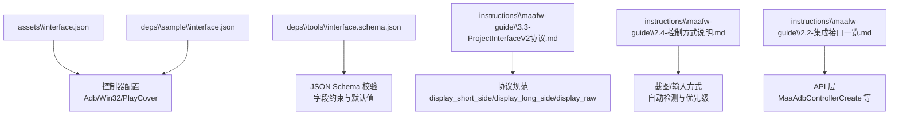
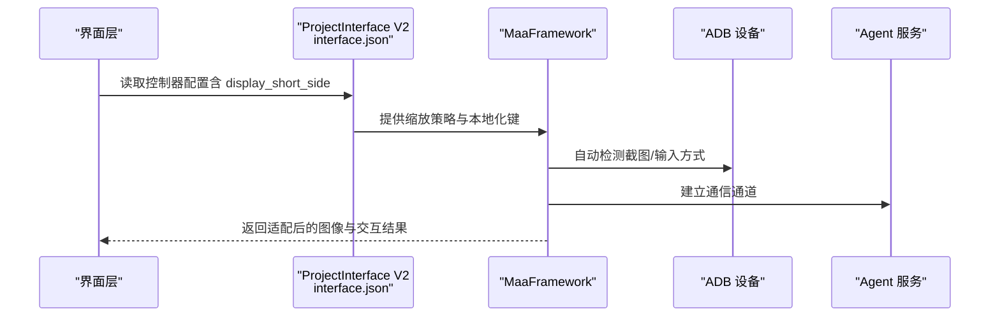
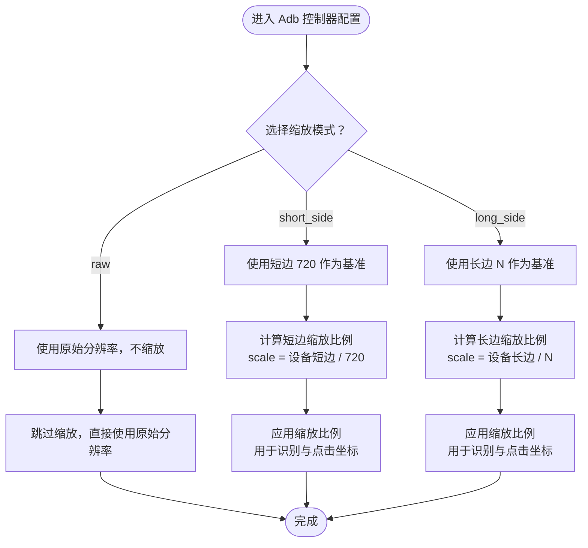
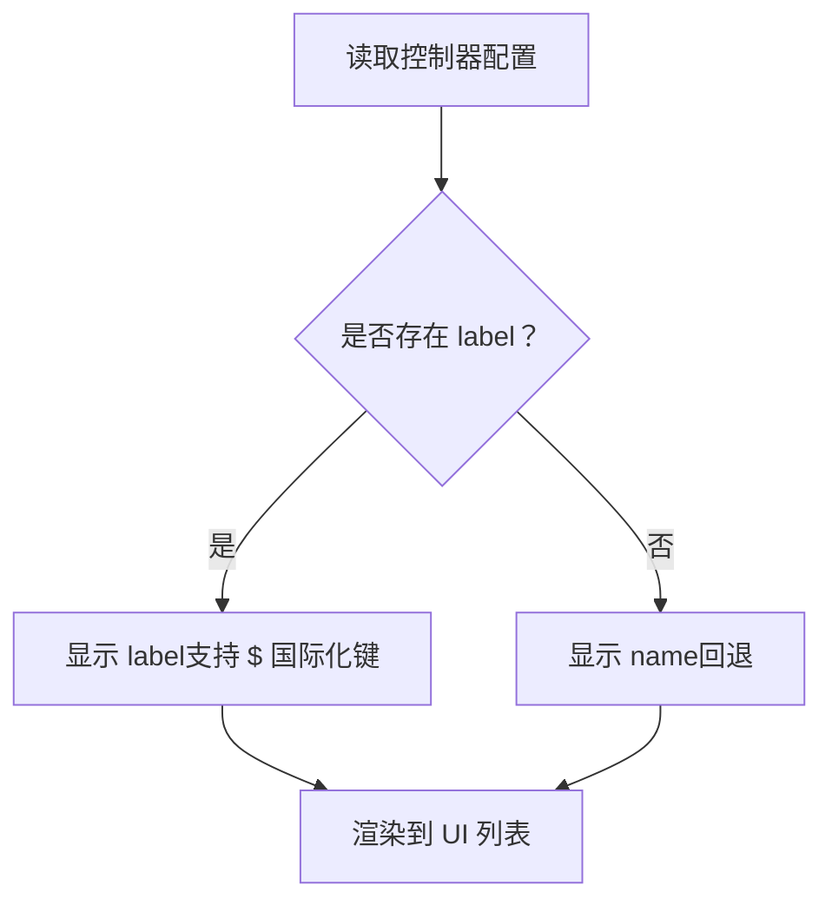
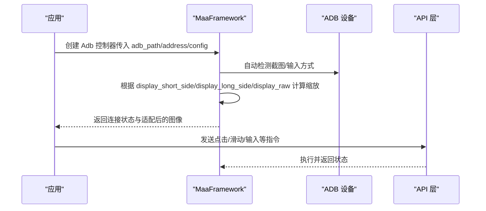
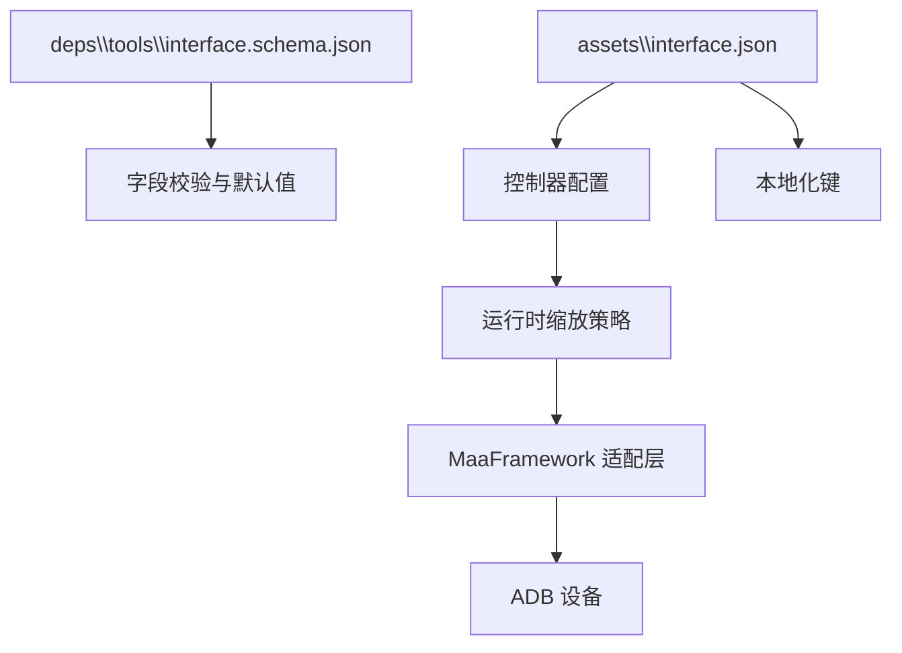
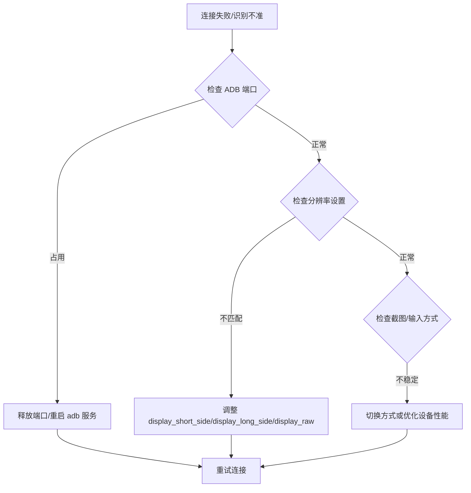

# Adb控制器配置

<cite>
**本文引用的文件**
- [assets\interface.json](file://assets\interface.json)
- [deps\sample\interface.json](file://deps\sample\interface.json)
- [deps\tools\interface.schema.json](file://deps\tools\interface.schema.json)
- [instructions\maafw-guide\3.3-ProjectInterfaceV2协议.md](file://instructions\maafw-guide\3.3-ProjectInterfaceV2协议.md)
- [instructions\maafw-guide\2.4-控制方式说明.md](file://instructions\maafw-guide\2.4-控制方式说明.md)
- [instructions\maafw-guide\2.2-集成接口一览.md](file://instructions\maafw-guide\2.2-集成接口一览.md)
</cite>

## 目录
1. [简介](#简介)
2. [项目结构](#项目结构)
3. [核心组件](#核心组件)
4. [架构总览](#架构总览)
5. [详细组件分析](#详细组件分析)
6. [依赖关系分析](#依赖关系分析)
7. [性能考量](#性能考量)
8. [故障排查指南](#故障排查指南)
9. [结论](#结论)

## 简介
本文件聚焦于 Adb 类型控制器的配置参数，尤其是 display_short_side 参数在模拟器画面适配中的作用机制，解释其如何根据短边分辨率自动调整图像缩放比例以保证识别精度；同时说明 name 字段在 UI 界面中作为控制器选项显示的规则及其本地化处理方式。结合 MaaFramework 的设备连接流程，阐述 Adb 控制器在不同分辨率设备（如 720p、1080p）下的适配策略，并提供常见连接问题（如 adb 端口占用、分辨率不匹配）的排查方法与解决方案。

## 项目结构
本项目采用 ProjectInterface V2 协议，控制器配置集中于 interface.json 文件中，其中包含 Adb 控制器的默认缩放策略与本地化显示规则。示例工程与工具链提供了 schema 校验与文档说明，便于理解与扩展。

图表来源
- [assets\interface.json](file://assets\interface.json#L14-L28)
- [deps\sample\interface.json](file://deps\sample\interface.json#L27-L53)
- [deps\tools\interface.schema.json](file://deps\tools\interface.schema.json#L246-L387)
- [instructions\maafw-guide\3.3-ProjectInterfaceV2协议.md](file://instructions\maafw-guide\3.3-ProjectInterfaceV2协议.md#L99-L134)
- [instructions\maafw-guide\2.4-控制方式说明.md](file://instructions\maafw-guide\2.4-控制方式说明.md#L1-L54)
- [instructions\maafw-guide\2.2-集成接口一览.md](file://instructions\maafw-guide\2.2-集成接口一览.md#L219-L231)

章节来源
- [assets\interface.json](file://assets\interface.json#L1-L1196)
- [deps\sample\interface.json](file://deps\sample\interface.json#L1-L346)
- [deps\tools\interface.schema.json](file://deps\tools\interface.schema.json#L1-L670)

## 核心组件
- Adb 控制器配置项
  - name：控制器唯一标识符，用于 UI 显示与内部引用
  - label：显示名称，支持国际化（以 $ 开头），未设置时回退到 name
  - type：控制器类型，此处为 Adb
  - display_short_side：默认缩放分辨率的短边长度，用于屏幕适配，与 display_long_side、display_raw 互斥
  - display_long_side：默认缩放分辨率的长边长度，与 short_side、raw 互斥
  - display_raw：是否使用原始分辨率进行截图，不进行缩放，与缩放设置互斥
  - adb：Adb 控制器具体配置（V2 协议中 input/screencap 由 MaaFramework 自动检测）

- 本地化规则
  - name 字段用于唯一标识与回退显示
  - label 字段优先用于 UI 显示；若未设置，则显示 name
  - 支持以 $ 开头的国际化键，指向翻译文件

章节来源
- [instructions\maafw-guide\3.3-ProjectInterfaceV2协议.md](file://instructions\maafw-guide\3.3-ProjectInterfaceV2协议.md#L103-L134)
- [deps\tools\interface.schema.json](file://deps\tools\interface.schema.json#L246-L387)
- [assets\interface.json](file://assets\interface.json#L14-L28)
- [deps\sample\interface.json](file://deps\sample\interface.json#L27-L53)

## 架构总览
Adb 控制器在 ProjectInterface V2 协议中通过接口配置确定默认缩放策略，MaaFramework 在运行时根据设备实际分辨率与配置计算缩放比例，从而保证识别精度与交互稳定性。

图表来源
- [instructions\maafw-guide\3.3-ProjectInterfaceV2协议.md](file://instructions\maafw-guide\3.3-ProjectInterfaceV2协议.md#L99-L139)
- [instructions\maafw-guide\2.4-控制方式说明.md](file://instructions\maafw-guide\2.4-控制方式说明.md#L1-L54)
- [instructions\maafw-guide\2.2-集成接口一览.md](file://instructions\maafw-guide\2.2-集成接口一览.md#L219-L231)

## 详细组件分析

### Adb 控制器缩放策略与 display_short_side 机制
- 参数互斥关系
  - display_short_side 与 display_long_side、display_raw 三者互斥，仅能启用其一
  - 默认值：display_short_side 默认 720（短边）
- 适配原理
  - MaaFramework 会根据设备实际分辨率与配置计算缩放比例，使识别与点击坐标在不同设备上保持一致
  - 若设备分辨率短边为 720，则通常不缩放；若短边为 1080，则按比例放大，确保识别区域像素密度稳定
- 不同分辨率设备的适配策略
  - 720p：display_short_side=720，通常无需缩放
  - 1080p：display_short_side=720，按 1080/720=1.5 的比例放大，保证识别精度
  - 更高分辨率：按短边 720 的基准进行等比缩放，避免识别算法受分辨率波动影响

图表来源
- [instructions\maafw-guide\3.3-ProjectInterfaceV2协议.md](file://instructions\maafw-guide\3.3-ProjectInterfaceV2协议.md#L123-L134)
- [deps\tools\interface.schema.json](file://deps\tools\interface.schema.json#L279-L295)

章节来源
- [instructions\maafw-guide\3.3-ProjectInterfaceV2协议.md](file://instructions\maafw-guide\3.3-ProjectInterfaceV2协议.md#L123-L134)
- [deps\tools\interface.schema.json](file://deps\tools\interface.schema.json#L279-L295)

### UI 显示规则与本地化处理（name 与 label）
- 显示优先级
  - label 优先显示；若未设置，则显示 name
  - name 用于唯一标识与回退显示
- 本地化键
  - 支持以 $ 开头的国际化键，指向翻译文件
  - 示例：label: "$安卓端" 表示从翻译文件读取对应键值
- 控制器选项显示
  - 在 UI 中，控制器列表会显示 label；若未设置 label，则显示 name
  - 适用于 Adb/Win32/PlayCover 等控制器类型

图表来源
- [instructions\maafw-guide\3.3-ProjectInterfaceV2协议.md](file://instructions\maafw-guide\3.3-ProjectInterfaceV2协议.md#L107-L109)
- [deps\tools\interface.schema.json](file://deps\tools\interface.schema.json#L255-L259)

章节来源
- [instructions\maafw-guide\3.3-ProjectInterfaceV2协议.md](file://instructions\maafw-guide\3.3-ProjectInterfaceV2协议.md#L103-L109)
- [deps\tools\interface.schema.json](file://deps\tools\interface.schema.json#L255-L259)

### MaaFramework 设备连接流程与自动适配
- 自动检测与选择
  - Adb 控制器的 input/screencap 由 MaaFramework 自动检测与选择最优方式，无需手动配置
  - 截图与输入方式会进行测速，优先选择最快且可用的方案
- 运行时适配
  - 根据设备分辨率与 display_short_side/display_long_side/display_raw 计算缩放比例
  - 保证识别与交互在不同设备上的一致性

图表来源
- [instructions\maafw-guide\2.2-集成接口一览.md](file://instructions\maafw-guide\2.2-集成接口一览.md#L219-L231)
- [instructions\maafw-guide\2.4-控制方式说明.md](file://instructions\maafw-guide\2.4-控制方式说明.md#L1-L54)

章节来源
- [instructions\maafw-guide\2.2-集成接口一览.md](file://instructions\maafw-guide\2.2-集成接口一览.md#L219-L231)
- [instructions\maafw-guide\2.4-控制方式说明.md](file://instructions\maafw-guide\2.4-控制方式说明.md#L1-L54)

## 依赖关系分析
- 配置依赖
  - interface.json 决定 Adb 控制器的缩放策略与 UI 显示
  - schema.json 提供字段约束与默认值，确保配置正确性
- 运行时依赖
  - MaaFramework 负责自动检测与选择最优截图/输入方式
  - Agent 服务负责与设备建立通信通道

图表来源
- [deps\tools\interface.schema.json](file://deps\tools\interface.schema.json#L246-L387)
- [assets\interface.json](file://assets\interface.json#L14-L28)
- [instructions\maafw-guide\3.3-ProjectInterfaceV2协议.md](file://instructions\maafw-guide\3.3-ProjectInterfaceV2协议.md#L123-L134)

章节来源
- [deps\tools\interface.schema.json](file://deps\tools\interface.schema.json#L246-L387)
- [assets\interface.json](file://assets\interface.json#L14-L28)

## 性能考量
- 截图方式优先级
  - Adb Screencap 默认尝试除 RawByNetcat、MinicapDirect、MinicapStream 外的所有方式
  - MinicapDirect/MinicapStream 为有损编码，可能降低模板匹配效果，不建议使用
- 输入方式优先级
  - Adb Input 默认尝试除 EmulatorExtras 外所有方式
  - 优先级：EmulatorExtras > Maatouch > MinitouchAndAdbKey > AdbShell
- 缩放策略
  - 以短边 720 为基准的等比缩放，避免高分辨率带来的计算负担与识别误差
  - 原始分辨率（display_raw=true）可减少缩放开销，但需确保识别模型对分辨率鲁棒

章节来源
- [instructions\maafw-guide\2.4-控制方式说明.md](file://instructions\maafw-guide\2.4-控制方式说明.md#L29-L47)
- [instructions\maafw-guide\2.4-控制方式说明.md](file://instructions\maafw-guide\2.4-控制方式说明.md#L12-L27)

## 故障排查指南

### 常见问题与排查步骤
- ADB 端口占用
  - 现象：设备连接失败或端口冲突
  - 排查：检查 adb 服务状态与端口占用情况，必要时重启 adb 服务或释放端口
  - 解决：停止占用端口的进程或更换 adb 端口
- 分辨率不匹配导致识别不准
  - 现象：点击/识别位置偏移
  - 排查：确认 display_short_side/display_long_side/display_raw 设置是否合理
  - 解决：根据设备短边分辨率调整 display_short_side；或启用 display_raw 以避免缩放
- 截图/输入方式不稳定
  - 现象：截图延迟高或输入响应慢
  - 排查：查看 MaaFramework 自动检测结果与优先级
  - 解决：尝试切换截图/输入方式，或在设备端优化模拟器性能

图表来源
- [instructions\maafw-guide\2.4-控制方式说明.md](file://instructions\maafw-guide\2.4-控制方式说明.md#L1-L54)
- [instructions\maafw-guide\3.3-ProjectInterfaceV2协议.md](file://instructions\maafw-guide\3.3-ProjectInterfaceV2协议.md#L123-L134)

章节来源
- [instructions\maafw-guide\2.4-控制方式说明.md](file://instructions\maafw-guide\2.4-控制方式说明.md#L1-L54)
- [instructions\maafw-guide\3.3-ProjectInterfaceV2协议.md](file://instructions\maafw-guide\3.3-ProjectInterfaceV2协议.md#L123-L134)

## 结论
- display_short_side 通过短边 720 的基准实现等比缩放，确保不同分辨率设备上的识别与交互稳定性
- name 与 label 的显示规则与本地化机制，使 UI 展示灵活且国际化友好
- MaaFramework 在 V2 协议下自动检测截图/输入方式并进行运行时适配，简化了配置复杂度
- 针对常见问题（端口占用、分辨率不匹配、方式不稳定），建议按“端口—分辨率—方式”的顺序排查并优化