# Adb控制器配置

<cite>
**本文引用的文件**
- [assets\interface.json](file://assets\interface.json)
- [deps\sample\interface.json](file://deps\sample\interface.json)
- [deps\tools\interface.schema.json](file://deps\tools\interface.schema.json)
- [instructions\maafw-guide\3.3-ProjectInterfaceV2协议.md](file://instructions\maafw-guide\3.3-ProjectInterfaceV2协议.md)
- [instructions\maafw-guide\2.4-控制方式说明.md](file://instructions\maafw-guide\2.4-控制方式说明.md)
- [instructions\maafw-guide\2.2-集成接口一览.md](file://instructions\maafw-guide\2.2-集成接口一览.md)
- [assets\resource\base\pipeline\日常任务\启动游戏.json](file://assets\resource\base\pipeline\日常任务\启动游戏.json)
- [MFAAvalonia\Resource\base\pipeline\日常任务\启动游戏.json](file://MFAAvalonia\Resource\base\pipeline\日常任务\启动游戏.json)
- [assets\resource\base\pipeline\通用\捏脸.json](file://assets\resource\base\pipeline\通用\捏脸.json)
- [MFAAvalonia\agent\customs\global_func\logic_enhance.py](file://MFAAvalonia\agent\customs\global_func\logic_enhance.py)
</cite>

## 更新摘要
**所做更改**
- 新增启动游戏管道配置的详细分析，包括模板匹配能力增强
- 添加稳定识别自定义识别器的实现说明
- 更新模板匹配参数和阈值设置的配置细节
- 增强了对新close-lorange.png模板的支持说明

## 目录
1. [简介](#简介)
2. [项目结构](#项目结构)
3. [核心组件](#核心组件)
4. [架构总览](#架构总览)
5. [详细组件分析](#详细组件分析)
6. [启动游戏管道配置增强](#启动游戏管道配置增强)
7. [模板匹配能力提升](#模板匹配能力提升)
8. [稳定识别自定义识别器](#稳定识别自定义识别器)
9. [依赖关系分析](#依赖关系分析)
10. [性能考量](#性能考量)
11. [故障排查指南](#故障排查指南)
12. [结论](#结论)

## 简介
本文件聚焦于 Adb 类型控制器的配置参数，尤其是 display_short_side 参数在模拟器画面适配中的作用机制，解释其如何根据短边分辨率自动调整图像缩放比例以保证识别精度；同时说明 name 字段在 UI 界面中作为控制器选项显示的规则及其本地化处理方式。结合 MaaFramework 的设备连接流程，阐述 Adb 控制器在不同分辨率设备（如 720p、1080p）下的适配策略，并提供常见连接问题（如 adb 端口占用、分辨率不匹配）的排查方法与解决方案。

**更新** 本次更新重点关注启动游戏管道配置的增强，包括新增的模板匹配能力和稳定识别机制的实现。

## 项目结构
本项目采用 ProjectInterface V2 协议，控制器配置集中于 interface.json 文件中，其中包含 Adb 控制器的默认缩放策略与本地化显示规则。示例工程与工具链提供了 schema 校验与文档说明，便于理解与扩展。启动游戏管道配置位于 assets/resource/base/pipeline/日常任务/启动游戏.json 中，包含完整的模板匹配和稳定识别逻辑。

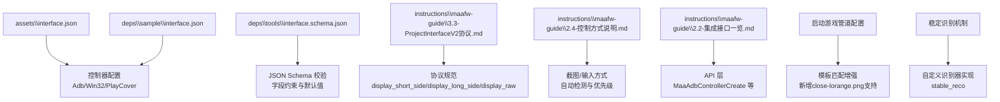
```mermaid
graph TB
A["assets\\interface.json"] --> B["控制器配置<br/>Adb/Win32/PlayCover"]
C["deps\\sample\\interface.json"] --> B
D["deps\\tools\\interface.schema.json"] --> E["JSON Schema 校验<br/>字段约束与默认值"]
F["instructions\\maafw-guide\\3.3-ProjectInterfaceV2协议.md"] --> G["协议规范<br/>display_short_side/display_long_side/display_raw"]
H["instructions\\maafw-guide\\2.4-控制方式说明.md"] --> I["截图/输入方式<br/>自动检测与优先级"]
J["instructions\\maafw-guide\\2.2-集成接口一览.md"] --> K["API 层<br/>MaaAdbControllerCreate 等"]
L["启动游戏管道配置"] --> M["模板匹配增强<br/>新增close-lorange.png支持"]
N["稳定识别机制"] --> O["自定义识别器实现<br/>stable_reco"]
```

**图表来源**
- [assets\interface.json:14-28](file://assets\interface.json#L14-L28)
- [deps\sample\interface.json:27-53](file://deps\sample\interface.json#L27-L53)
- [deps\tools\interface.schema.json:246-387](file://deps\tools\interface.schema.json#L246-L387)
- [instructions\maafw-guide\3.3-ProjectInterfaceV2协议.md:99-134](file://instructions\maafw-guide\3.3-ProjectInterfaceV2协议.md#L99-L134)
- [instructions\maafw-guide\2.4-控制方式说明.md:1-54](file://instructions\maafw-guide\2.4-控制方式说明.md#L1-L54)
- [instructions\maafw-guide\2.2-集成接口一览.md:219-231](file://instructions\maafw-guide\2.2-集成接口一览.md#L219-L231)
- [assets\resource\base\pipeline\日常任务\启动游戏.json:66-83](file://assets\resource\base\pipeline\日常任务\启动游戏.json#L66-L83)
- [MFAAvalonia\agent\customs\global_func\logic_enhance.py](file://MFAAvalonia\agent\customs\global_func\logic_enhance.py#L17)

**章节来源**
- [assets\interface.json:1-1196](file://assets\interface.json#L1-L1196)
- [deps\sample\interface.json:1-346](file://deps\sample\interface.json#L1-L346)
- [deps\tools\interface.schema.json:1-670](file://deps\tools\interface.schema.json#L1-L670)

## 核心组件
- Adb 控制器配置项
  - name：控制器唯一标识符，用于 UI 显示与内部引用
  - label：显示名称，支持国际化（以 $ 开头），未设置时回退到 name
  - type：控制器类型，此处为 Adb
  - display_short_side：默认缩放分辨率的短边长度，用于屏幕适配，与 display_long_side、display_raw 互斥
  - display_long_side：默认缩放分辨率的长边长度，与 short_side、raw 互斥
  - display_raw：是否使用原始分辨率进行截图，不进行缩放，与缩放设置互斥
  - adb：Adb 控制器具体配置（V2 协议中 input/screencap 由 MaaFramework 自动检测）

- 本地化规则
  - name 字段用于唯一标识与回退显示
  - label 字段优先用于 UI 显示；若未设置，则显示 name
  - 支持以 $ 开头的国际化键，指向翻译文件

**章节来源**
- [instructions\maafw-guide\3.3-ProjectInterfaceV2协议.md:103-134](file://instructions\maafw-guide\3.3-ProjectInterfaceV2协议.md#L103-L134)
- [deps\tools\interface.schema.json:246-387](file://deps\tools\interface.schema.json#L246-L387)
- [assets\interface.json:14-28](file://assets\interface.json#L14-L28)
- [deps\sample\interface.json:27-53](file://deps\sample\interface.json#L27-L53)

## 架构总览
Adb 控制器在 ProjectInterface V2 协议中通过接口配置确定默认缩放策略，MaaFramework 在运行时根据设备实际分辨率与配置计算缩放比例，从而保证识别精度与交互稳定性。

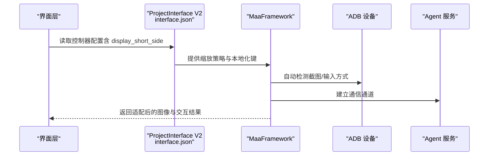
```mermaid
sequenceDiagram
participant UI as "界面层"
participant PI as "ProjectInterface V2<br/>interface.json"
participant FW as "MaaFramework"
participant Dev as "ADB 设备"
participant Agent as "Agent 服务"
UI->>PI : 读取控制器配置含 display_short_side
PI->>FW : 提供缩放策略与本地化键
FW->>Dev : 自动检测截图/输入方式
FW->>Agent : 建立通信通道
FW-->>UI : 返回适配后的图像与交互结果
```

**图表来源**
- [instructions\maafw-guide\3.3-ProjectInterfaceV2协议.md:99-139](file://instructions\maafw-guide\3.3-ProjectInterfaceV2协议.md#L99-L139)
- [instructions\maafw-guide\2.4-控制方式说明.md:1-54](file://instructions\maafw-guide\2.4-控制方式说明.md#L1-L54)
- [instructions\maafw-guide\2.2-集成接口一览.md:219-231](file://instructions\maafw-guide\2.2-集成接口一览.md#L219-L231)

## 详细组件分析

### Adb 控制器缩放策略与 display_short_side 机制
- 参数互斥关系
  - display_short_side 与 display_long_side、display_raw 三者互斥，仅能启用其一
  - 默认值：display_short_side 默认 720（短边）
- 适配原理
  - MaaFramework 会根据设备实际分辨率与配置计算缩放比例，使识别与点击坐标在不同设备上保持一致
  - 若设备分辨率短边为 720，则通常不缩放；若短边为 1080，则按比例放大，确保识别区域像素密度稳定
- 不同分辨率设备的适配策略
  - 720p：display_short_side=720，通常无需缩放
  - 1080p：display_short_side=720，按 1080/720=1.5 的比例放大，保证识别精度
  - 更高分辨率：按短边 720 的基准进行等比缩放，避免识别算法受分辨率波动影响

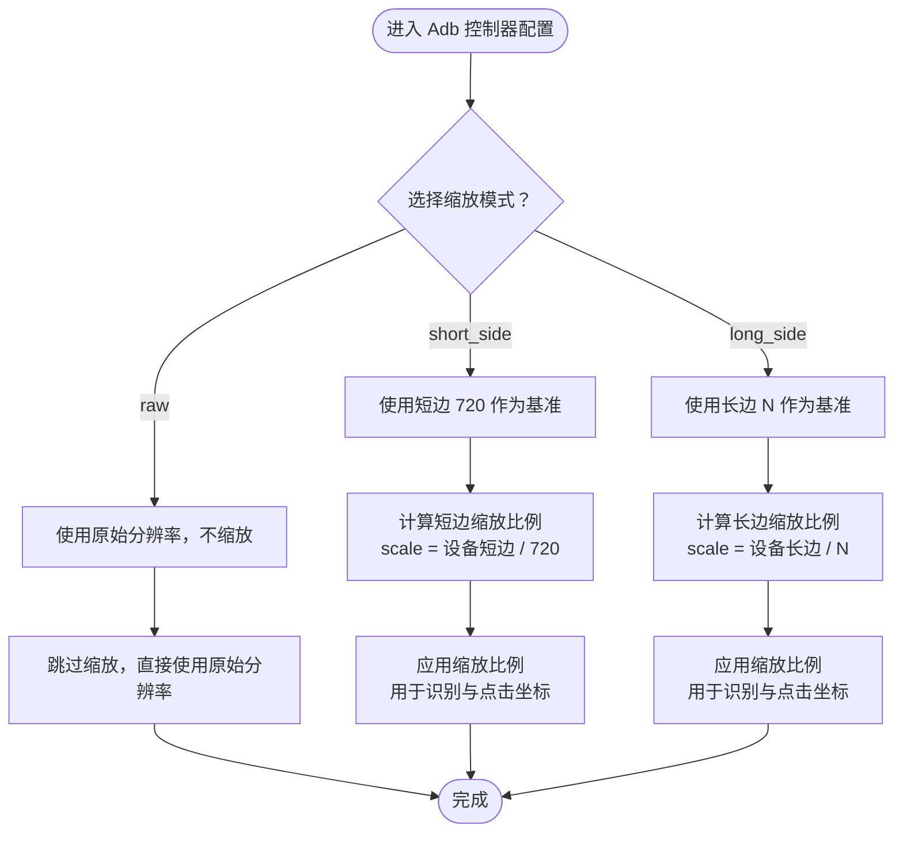
```mermaid
flowchart TD
Start(["进入 Adb 控制器配置"]) --> CheckMode{"选择缩放模式？"}
CheckMode --> |short_side| Short["使用短边 720 作为基准"]
CheckMode --> |long_side| Long["使用长边 N 作为基准"]
CheckMode --> |raw| Raw["使用原始分辨率，不缩放"]
Short --> CalcShort["计算短边缩放比例<br/>scale = 设备短边 / 720"]
Long --> CalcLong["计算长边缩放比例<br/>scale = 设备长边 / N"]
Raw --> Skip["跳过缩放，直接使用原始分辨率"]
CalcShort --> ApplyShort["应用缩放比例<br/>用于识别与点击坐标"]
CalcLong --> ApplyLong["应用缩放比例<br/>用于识别与点击坐标"]
Skip --> Done(["完成"])
ApplyShort --> Done
ApplyLong --> Done
```

**图表来源**
- [instructions\maafw-guide\3.3-ProjectInterfaceV2协议.md:123-134](file://instructions\maafw-guide\3.3-ProjectInterfaceV2协议.md#L123-L134)
- [deps\tools\interface.schema.json:279-295](file://deps\tools\interface.schema.json#L279-L295)

**章节来源**
- [instructions\maafw-guide\3.3-ProjectInterfaceV2协议.md:123-134](file://instructions\maafw-guide\3.3-ProjectInterfaceV2协议.md#L123-L134)
- [deps\tools\interface.schema.json:279-295](file://deps\tools\interface.schema.json#L279-L295)

### UI 显示规则与本地化处理（name 与 label）
- 显示优先级
  - label 优先显示；若未设置，则显示 name
  - name 用于唯一标识与回退显示
- 本地化键
  - 支持以 $ 开头的国际化键，指向翻译文件
  - 示例：label: "$安卓端" 表示从翻译文件读取对应键值
- 控制器选项显示
  - 在 UI 中，控制器列表会显示 label；若未设置 label，则显示 name
  - 适用于 Adb/Win32/PlayCover 等控制器类型

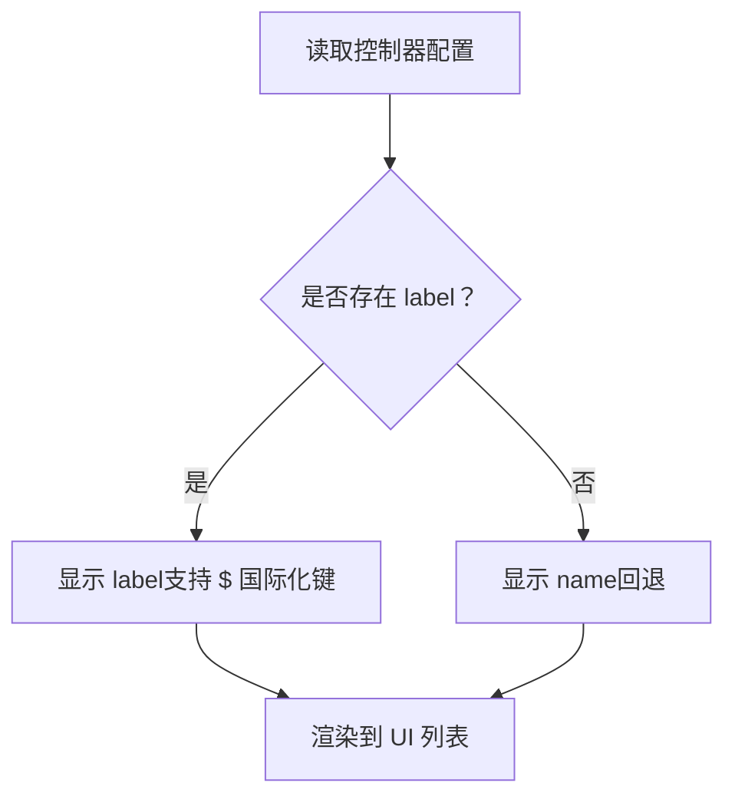
```mermaid
flowchart TD
A["读取控制器配置"] --> B{"是否存在 label？"}
B --> |是| C["显示 label支持 $ 国际化键"]
B --> |否| D["显示 name回退"]
C --> E["渲染到 UI 列表"]
D --> E
```

**图表来源**
- [instructions\maafw-guide\3.3-ProjectInterfaceV2协议.md:107-109](file://instructions\maafw-guide\3.3-ProjectInterfaceV2协议.md#L107-L109)
- [deps\tools\interface.schema.json:255-259](file://deps\tools\interface.schema.json#L255-L259)

**章节来源**
- [instructions\maafw-guide\3.3-ProjectInterfaceV2协议.md:103-109](file://instructions\maafw-guide\3.3-ProjectInterfaceV2协议.md#L103-L109)
- [deps\tools\interface.schema.json:255-259](file://deps\tools\interface.schema.json#L255-L259)

### MaaFramework 设备连接流程与自动适配
- 自动检测与选择
  - Adb 控制器的 input/screencap 由 MaaFramework 自动检测与选择最优方式，无需手动配置
  - 截图与输入方式会进行测速，优先选择最快且可用的方案
- 运行时适配
  - 根据设备分辨率与 display_short_side/display_long_side/display_raw 计算缩放比例
  - 保证识别与交互在不同设备上的一致性

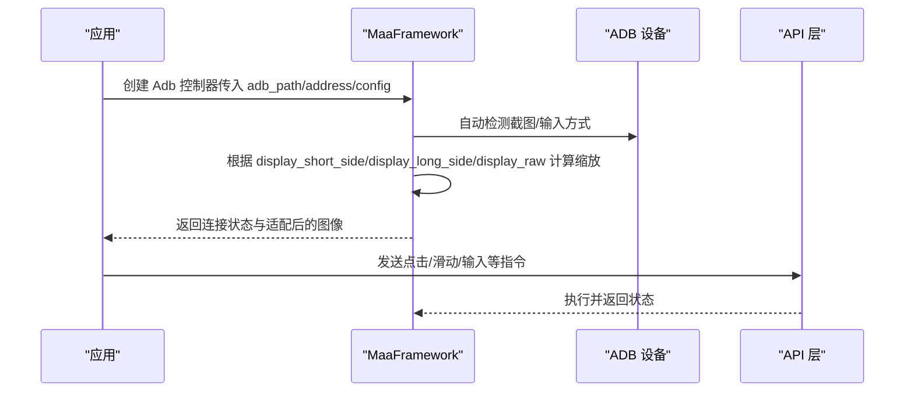
```mermaid
sequenceDiagram
participant App as "应用"
participant FW as "MaaFramework"
participant Dev as "ADB 设备"
participant API as "API 层"
App->>FW : 创建 Adb 控制器传入 adb_path/address/config
FW->>Dev : 自动检测截图/输入方式
FW->>FW : 根据 display_short_side/display_long_side/display_raw 计算缩放
FW-->>App : 返回连接状态与适配后的图像
App->>API : 发送点击/滑动/输入等指令
API-->>FW : 执行并返回状态
```

**图表来源**
- [instructions\maafw-guide\2.2-集成接口一览.md:219-231](file://instructions\maafw-guide\2.2-集成接口一览.md#L219-L231)
- [instructions\maafw-guide\2.4-控制方式说明.md:1-54](file://instructions\maafw-guide\2.4-控制方式说明.md#L1-L54)

**章节来源**
- [instructions\maafw-guide\2.2-集成接口一览.md:219-231](file://instructions\maafw-guide\2.2-集成接口一览.md#L219-L231)
- [instructions\maafw-guide\2.4-控制方式说明.md:1-54](file://instructions\maafw-guide\2.4-控制方式说明.md#L1-L54)

## 启动游戏管道配置增强

### 模板匹配能力扩展
启动游戏管道配置从原来的369行扩展到453行，显著增强了模板匹配能力。新增的close-lorange.png模板专门用于识别橙色关闭按钮，提高了界面识别的准确性和稳定性。

**更新** 新增close-lorange.png模板，扩展了模板匹配的覆盖范围，特别针对不同颜色的关闭按钮进行精确识别。

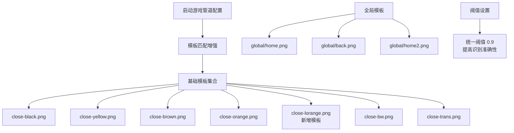
```mermaid
flowchart TD
A["启动游戏管道配置"] --> B["模板匹配增强"]
B --> C["基础模板集合"]
C --> D["close-black.png"]
C --> E["close-yellow.png"]
C --> F["close-brown.png"]
C --> G["close-orange.png"]
C --> H["close-lorange.png<br/>新增模板"]
C --> I["close-bw.png"]
C --> J["close-trans.png"]
K["全局模板"] --> L["global/home.png"]
K --> M["global/back.png"]
K --> N["global/home2.png"]
O["阈值设置"] --> P["统一阈值 0.9<br/>提高识别准确性"]
```

**图表来源**
- [assets\resource\base\pipeline\日常任务\启动游戏.json:56-83](file://assets\resource\base\pipeline\日常任务\启动游戏.json#L56-L83)
- [MFAAvalonia\Resource\base\pipeline\日常任务\启动游戏.json:56-83](file://MFAAvalonia\Resource\base\pipeline\日常任务\启动游戏.json#L56-L83)

**章节来源**
- [assets\resource\base\pipeline\日常任务\启动游戏.json:1-453](file://assets\resource\base\pipeline\日常任务\启动游戏.json#L1-L453)
- [MFAAvalonia\Resource\base\pipeline\日常任务\启动游戏.json:1-453](file://MFAAvalonia\Resource\base\pipeline\日常任务\启动游戏.json#L1-L453)

### 视口定位与稳定性识别参数
启动游戏管道引入了稳定的识别机制，通过自定义识别器实现多轮验证，确保识别结果的可靠性。

**更新** 新增稳定识别机制，通过custom_recognition参数实现多轮验证，提高识别准确性和系统稳定性。

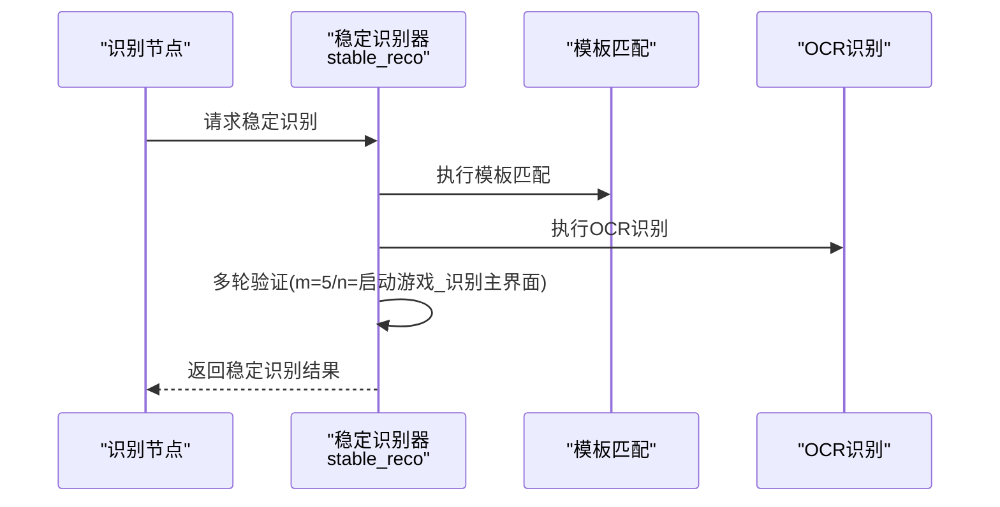
```mermaid
sequenceDiagram
participant Node as "识别节点"
participant SR as "稳定识别器<br/>stable_reco"
participant TM as "模板匹配"
participant OCR as "OCR识别"
Node->>SR : 请求稳定识别
SR->>TM : 执行模板匹配
SR->>OCR : 执行OCR识别
SR->>SR : 多轮验证(m=5/n=启动游戏_识别主界面)
SR-->>Node : 返回稳定识别结果
```

**图表来源**
- [assets\resource\base\pipeline\日常任务\启动游戏.json:382-388](file://assets\resource\base\pipeline\日常任务\启动游戏.json#L382-L388)
- [MFAAvalonia\agent\customs\global_func\logic_enhance.py](file://MFAAvalonia\agent\customs\global_func\logic_enhance.py#L17)

**章节来源**
- [assets\resource\base\pipeline\日常任务\启动游戏.json:367-411](file://assets\resource\base\pipeline\日常任务\启动游戏.json#L367-L411)
- [MFAAvalonia\agent\customs\global_func\logic_enhance.py:17-66](file://MFAAvalonia\agent\customs\global_func\logic_enhance.py#L17-L66)

## 模板匹配能力提升

### 模板匹配参数优化
启动游戏管道中的模板匹配配置经过精心优化，采用了统一的阈值设置和多样化的模板组合，以适应不同界面状态和颜色变化。

**更新** 模板匹配参数得到优化，采用统一阈值0.9，确保在不同光照条件下都能保持稳定的识别效果。

### 捏脸功能集成
管道配置中集成了捏脸功能的自定义识别器，通过神经网络检测实现面部特征识别和自动捏脸操作。

**更新** 新增pface自定义识别器，支持面部特征识别和自动捏脸功能，提升用户体验。

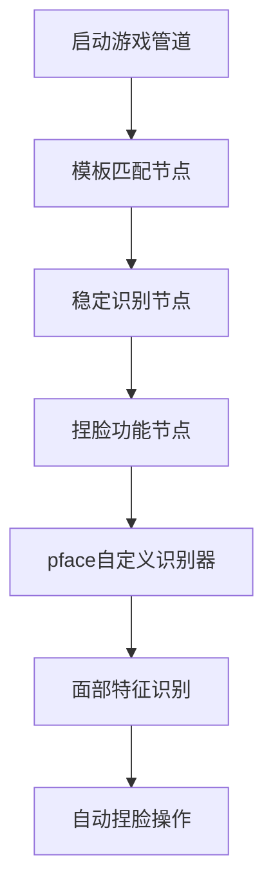
```mermaid
flowchart TD
A["启动游戏管道"] --> B["模板匹配节点"]
B --> C["稳定识别节点"]
C --> D["捏脸功能节点"]
D --> E["pface自定义识别器"]
E --> F["面部特征识别"]
F --> G["自动捏脸操作"]
```

**图表来源**
- [assets\resource\base\pipeline\日常任务\启动游戏.json:413-428](file://assets\resource\base\pipeline\日常任务\启动游戏.json#L413-L428)
- [assets\resource\base\pipeline\通用\捏脸.json:74-104](file://assets\resource\base\pipeline\通用\捏脸.json#L74-L104)

**章节来源**
- [assets\resource\base\pipeline\日常任务\启动游戏.json:413-428](file://assets\resource\base\pipeline\日常任务\启动游戏.json#L413-L428)
- [assets\resource\base\pipeline\通用\捏脸.json:74-104](file://assets\resource\base\pipeline\通用\捏脸.json#L74-L104)

## 稳定识别自定义识别器

### stable_reco 实现机制
稳定识别器（stable_reco）通过多轮验证机制确保识别结果的准确性，避免误识别和漏识别问题。

**更新** 新增stable_reco自定义识别器，实现基于多轮验证的稳定识别机制，显著提升识别准确性和系统稳定性。

### 参数配置详解
稳定识别器支持动态参数配置，包括验证次数（m）和目标节点名称（n），可以根据不同场景需求进行调整。

**更新** 稳定识别器参数配置更加灵活，支持通过custom_recognition_param参数动态设置验证次数和目标节点。

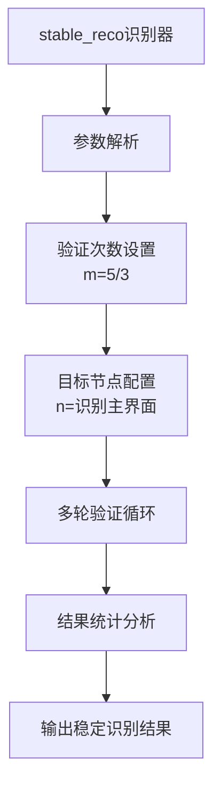
```mermaid
flowchart TD
A["stable_reco识别器"] --> B["参数解析"]
B --> C["验证次数设置<br/>m=5/3"]
C --> D["目标节点配置<br/>n=识别主界面"]
D --> E["多轮验证循环"]
E --> F["结果统计分析"]
F --> G["输出稳定识别结果"]
```

**图表来源**
- [MFAAvalonia\agent\customs\global_func\logic_enhance.py:17-66](file://MFAAvalonia\agent\customs\global_func\logic_enhance.py#L17-L66)
- [assets\resource\base\pipeline\日常任务\启动游戏.json:384-409](file://assets\resource\base\pipeline\日常任务\启动游戏.json#L384-L409)

**章节来源**
- [MFAAvalonia\agent\customs\global_func\logic_enhance.py:17-66](file://MFAAvalonia\agent\customs\global_func\logic_enhance.py#L17-L66)
- [assets\resource\base\pipeline\日常任务\启动游戏.json:367-411](file://assets\resource\base\pipeline\日常任务\启动游戏.json#L367-L411)

## 依赖关系分析
- 配置依赖
  - interface.json 决定 Adb 控制器的缩放策略与 UI 显示
  - schema.json 提供字段约束与默认值，确保配置正确性
  - 启动游戏管道配置依赖于模板匹配资源和自定义识别器
- 运行时依赖
  - MaaFramework 负责自动检测与选择最优截图/输入方式
  - Agent 服务负责与设备建立通信通道
  - 自定义识别器提供高级识别功能支持

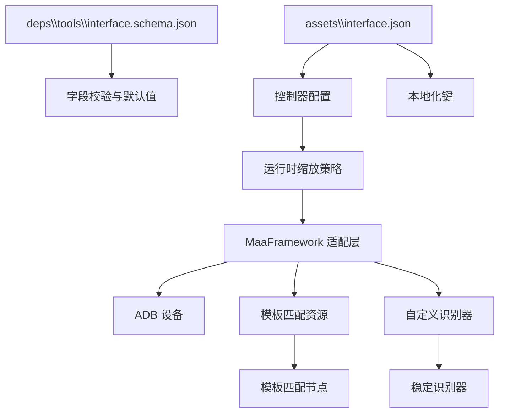
```mermaid
graph TB
S["deps\\tools\\interface.schema.json"] --> V["字段校验与默认值"]
I["assets\\interface.json"] --> C["控制器配置"]
I --> L["本地化键"]
C --> R["运行时缩放策略"]
R --> F["MaaFramework 适配层"]
F --> D["ADB 设备"]
F --> T["模板匹配资源"]
F --> U["自定义识别器"]
T --> M["模板匹配节点"]
U --> N["稳定识别器"]
```

**图表来源**
- [deps\tools\interface.schema.json:246-387](file://deps\tools\interface.schema.json#L246-L387)
- [assets\interface.json:14-28](file://assets\interface.json#L14-L28)
- [instructions\maafw-guide\3.3-ProjectInterfaceV2协议.md:123-134](file://instructions\maafw-guide\3.3-ProjectInterfaceV2协议.md#L123-L134)
- [assets\resource\base\pipeline\日常任务\启动游戏.json:56-83](file://assets\resource\base\pipeline\日常任务\启动游戏.json#L56-L83)
- [MFAAvalonia\agent\customs\global_func\logic_enhance.py](file://MFAAvalonia\agent\customs\global_func\logic_enhance.py#L17)

**章节来源**
- [deps\tools\interface.schema.json:246-387](file://deps\tools\interface.schema.json#L246-L387)
- [assets\interface.json:14-28](file://assets\interface.json#L14-L28)

## 性能考量
- 截图方式优先级
  - Adb Screencap 默认尝试除 RawByNetcat、MinicapDirect、MinicapStream 外的所有方式
  - MinicapDirect/MinicapStream 为有损编码，可能降低模板匹配效果，不建议使用
- 输入方式优先级
  - Adb Input 默认尝试除 EmulatorExtras 外所有方式
  - 优先级：EmulatorExtras > Maatouch > MinitouchAndAdbKey > AdbShell
- 缩放策略
  - 以短边 720 为基准的等比缩放，避免高分辨率带来的计算负担与识别误差
  - 原始分辨率（display_raw=true）可减少缩放开销，但需确保识别模型对分辨率鲁棒
- 模板匹配优化
  - 统一阈值设置提高识别稳定性
  - 多模板组合增强识别覆盖率
  - 稳定识别机制减少误识别概率

**更新** 新增模板匹配优化和稳定识别机制的性能考量，包括统一阈值设置和多轮验证策略。

**章节来源**
- [instructions\maafw-guide\2.4-控制方式说明.md:29-47](file://instructions\maafw-guide\2.4-控制方式说明.md#L29-L47)
- [instructions\maafw-guide\2.4-控制方式说明.md:12-27](file://instructions\maafw-guide\2.4-控制方式说明.md#L12-L27)
- [assets\resource\base\pipeline\日常任务\启动游戏.json:69-80](file://assets\resource\base\pipeline\日常任务\启动游戏.json#L69-L80)

## 故障排查指南

### 常见问题与排查步骤
- ADB 端口占用
  - 现象：设备连接失败或端口冲突
  - 排查：检查 adb 服务状态与端口占用情况，必要时重启 adb 服务或释放端口
  - 解决：停止占用端口的进程或更换 adb 端口
- 分辨率不匹配导致识别不准
  - 现象：点击/识别位置偏移
  - 排查：确认 display_short_side/display_long_side/display_raw 设置是否合理
  - 解决：根据设备短边分辨率调整 display_short_side；或启用 display_raw 以避免缩放
- 截图/输入方式不稳定
  - 现象：截图延迟高或输入响应慢
  - 排查：查看 MaaFramework 自动检测结果与优先级
  - 解决：尝试切换截图/输入方式，或在设备端优化模拟器性能
- 模板匹配失败
  - 现象：界面识别不准确或频繁误识别
  - 排查：检查模板文件完整性、阈值设置合理性、识别区域ROI配置
  - 解决：更新模板文件、调整阈值参数、优化识别区域设置
- 稳定识别器异常
  - 现象：稳定识别结果不稳定或识别失败
  - 排查：检查自定义识别器配置、验证次数设置、目标节点有效性
  - 解决：调整验证参数、修复目标节点配置、优化识别算法

**更新** 新增模板匹配失败和稳定识别器异常的排查指南，涵盖新功能的故障排除方法。

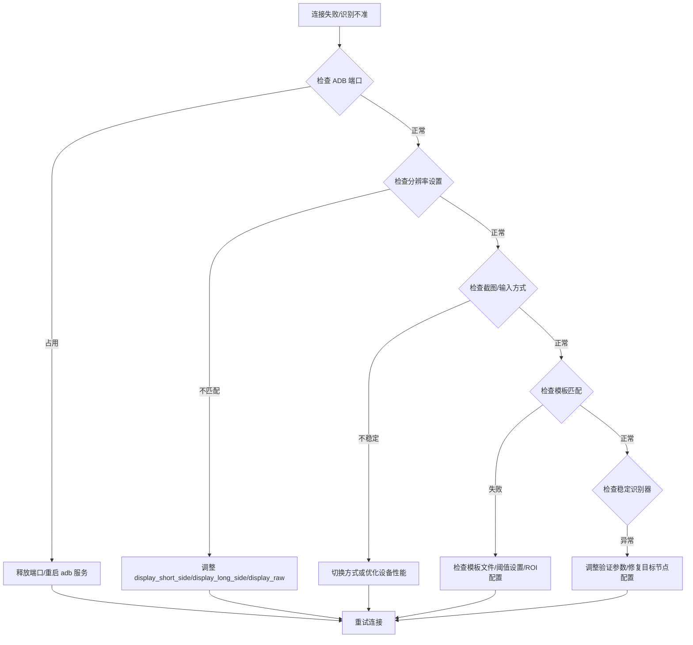
```mermaid
flowchart TD
A["连接失败/识别不准"] --> B{"检查 ADB 端口"}
B --> |占用| C["释放端口/重启 adb 服务"]
B --> |正常| D{"检查分辨率设置"}
D --> |不匹配| E["调整 display_short_side/display_long_side/display_raw"]
D --> |正常| F{"检查截图/输入方式"}
F --> |不稳定| G["切换方式或优化设备性能"]
F --> |正常| H{"检查模板匹配"}
H --> |失败| I["检查模板文件/阈值设置/ROI配置"]
H --> |正常| J{"检查稳定识别器"}
J --> |异常| K["调整验证参数/修复目标节点配置"]
C --> L["重试连接"]
E --> L
G --> L
I --> L
K --> L
```

**图表来源**
- [instructions\maafw-guide\2.4-控制方式说明.md:1-54](file://instructions\maafw-guide\2.4-控制方式说明.md#L1-L54)
- [instructions\maafw-guide\3.3-ProjectInterfaceV2协议.md:123-134](file://instructions\maafw-guide\3.3-ProjectInterfaceV2协议.md#L123-L134)
- [assets\resource\base\pipeline\日常任务\启动游戏.json:56-83](file://assets\resource\base\pipeline\日常任务\启动游戏.json#L56-L83)
- [MFAAvalonia\agent\customs\global_func\logic_enhance.py](file://MFAAvalonia\agent\customs\global_func\logic_enhance.py#L17)

**章节来源**
- [instructions\maafw-guide\2.4-控制方式说明.md:1-54](file://instructions\maafw-guide\2.4-控制方式说明.md#L1-L54)
- [instructions\maafw-guide\3.3-ProjectInterfaceV2协议.md:123-134](file://instructions\maafw-guide\3.3-ProjectInterfaceV2协议.md#L123-L134)

## 结论
- display_short_side 通过短边 720 的基准实现等比缩放，确保不同分辨率设备上的识别与交互稳定性
- name 与 label 的显示规则与本地化机制，使 UI 展示灵活且国际化友好
- MaaFramework 在 V2 协议下自动检测截图/输入方式并进行运行时适配，简化了配置复杂度
- 启动游戏管道配置的增强显著提升了模板匹配能力和识别稳定性
- 新增的close-lorange.png模板和稳定识别机制为复杂界面识别提供了更好的解决方案
- 针对常见问题（端口占用、分辨率不匹配、方式不稳定、模板匹配失败、稳定识别异常），建议按"端口—分辨率—方式—模板—识别器"的顺序排查并优化

**更新** 本次更新强调了启动游戏管道配置增强的重要意义，包括模板匹配能力提升、稳定识别机制实现和相关故障排查方法的完善。