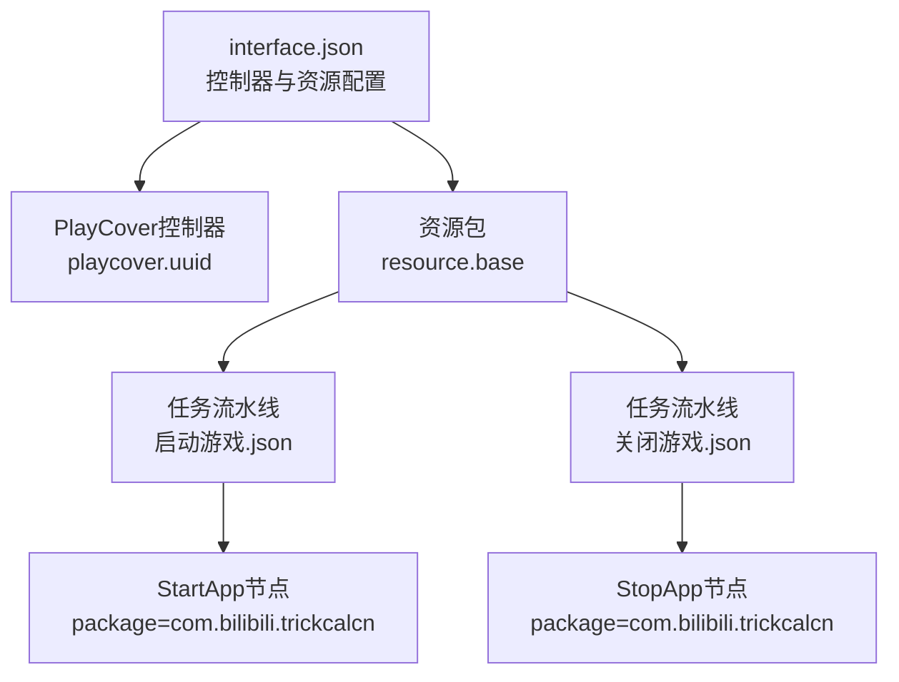
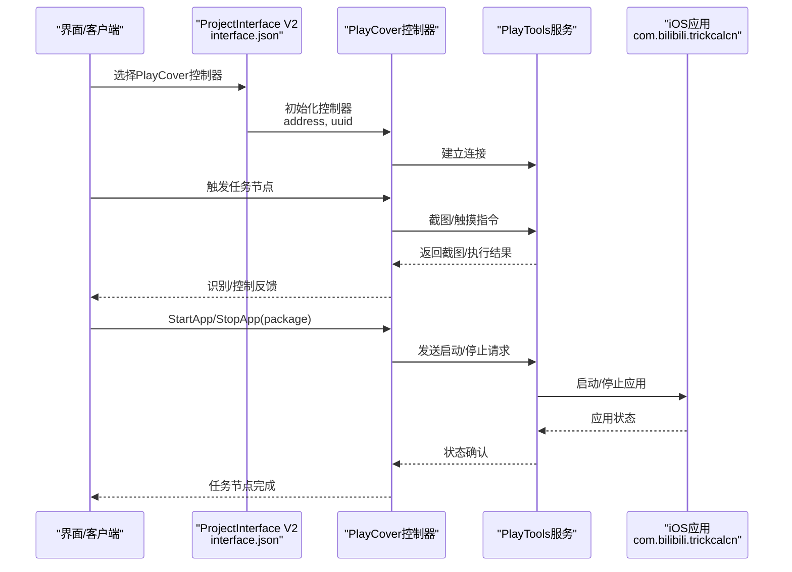
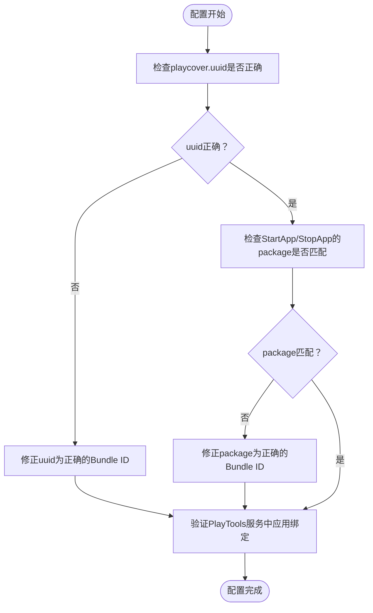
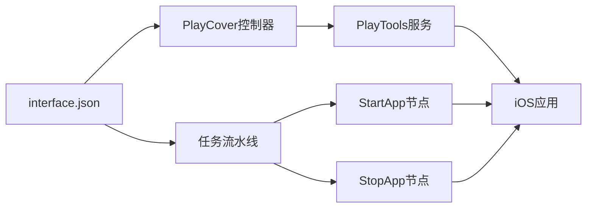
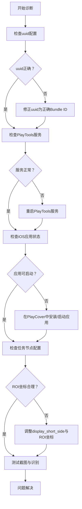

# PlayCover控制器配置

<cite>
**本文引用的文件**
- [assets/interface.json](file://assets/interface.json)
- [assets/resource/base/pipeline/日常任务/启动游戏.json](file://assets/resource/base/pipeline/日常任务/启动游戏.json)
- [assets/resource/base/pipeline/日常任务/关闭游戏.json](file://assets/resource/base/pipeline/日常任务/关闭游戏.json)
- [instructions/maafw-guide/2.4-控制方式说明.md](file://instructions/maafw-guide/2.4-控制方式说明.md)
- [instructions/maafw-guide/3.1-任务流水线协议.md](file://instructions/maafw-guide/3.1-任务流水线协议.md)
- [instructions/maafw-guide/3.3-ProjectInterfaceV2协议.md](file://instructions/maafw-guide/3.3-ProjectInterfaceV2协议.md)
</cite>

## 目录
1. [简介](#简介)
2. [项目结构](#项目结构)
3. [核心组件](#核心组件)
4. [架构总览](#架构总览)
5. [详细组件分析](#详细组件分析)
6. [依赖关系分析](#依赖关系分析)
7. [性能考量](#性能考量)
8. [故障排查指南](#故障排查指南)
9. [结论](#结论)

## 简介
本文件聚焦于PlayCover控制器在本项目的配置与使用，围绕以下目标展开：
- 解析PlayCover控制器的配置结构，重点说明playcover.uuid字段如何绑定iOS应用的包标识符（Bundle ID），确保正确启动目标游戏实例。
- 阐述display_short_side参数在iOS设备不同屏幕尺寸（如iPhone、iPad）下的适配逻辑，确保OCR识别区域的一致性。
- 说明PlayCover控制器在Mac平台上的运行依赖环境（如PlayCover版本、iOS应用架构兼容性）。
- 提供uuid配置错误、应用启动失败等常见问题的诊断步骤与修复建议。

## 项目结构
本项目采用MaaFramework的ProjectInterface V2协议组织资源与任务。PlayCover控制器的配置位于顶层接口文件中，配合任务流水线中的StartApp/StopApp节点实现对iOS应用的控制。

图表来源
- [assets/interface.json](file://assets/interface.json#L14-L28)
- [assets/resource/base/pipeline/日常任务/启动游戏.json](file://assets/resource/base/pipeline/日常任务/启动游戏.json#L60-L107)
- [assets/resource/base/pipeline/日常任务/关闭游戏.json](file://assets/resource/base/pipeline/日常任务/关闭游戏.json#L16-L36)

章节来源
- [assets/interface.json](file://assets/interface.json#L14-L28)

## 核心组件
- PlayCover控制器配置
  - 类型：PlayCover（仅macOS）
  - 关键参数：
    - playcover.uuid：目标iOS应用的Bundle Identifier
    - display_short_side：默认缩放分辨率短边长度，用于屏幕适配
- 任务流水线中的应用控制节点
  - StartApp：启动应用（package为iOS应用包名）
  - StopApp：停止应用（package为iOS应用包名）

章节来源
- [assets/interface.json](file://assets/interface.json#L14-L28)
- [assets/resource/base/pipeline/日常任务/启动游戏.json](file://assets/resource/base/pipeline/日常任务/启动游戏.json#L60-L107)
- [assets/resource/base/pipeline/日常任务/关闭游戏.json](file://assets/resource/base/pipeline/日常任务/关闭游戏.json#L16-L36)

## 架构总览
PlayCover控制器通过PlayTools服务与macOS上的PlayCover桥接，实现对iOS应用的截图与触摸控制。任务流水线中的StartApp/StopApp节点通过package参数指定目标应用，与PlayCover控制器的playcover.uuid共同确保正确的应用识别与控制。

图表来源
- [assets/interface.json](file://assets/interface.json#L14-L28)
- [assets/resource/base/pipeline/日常任务/启动游戏.json](file://assets/resource/base/pipeline/日常任务/启动游戏.json#L60-L107)
- [assets/resource/base/pipeline/日常任务/关闭游戏.json](file://assets/resource/base/pipeline/日常任务/关闭游戏.json#L16-L36)
- [instructions/maafw-guide/2.4-控制方式说明.md](file://instructions/maafw-guide/2.4-控制方式说明.md#L99-L149)

## 详细组件分析

### PlayCover控制器配置结构
- 控制器类型：PlayCover（仅macOS）
- 关键字段
  - playcover.uuid：目标iOS应用的Bundle Identifier
  - display_short_side：默认缩放分辨率短边长度，用于屏幕适配
- 作用
  - 通过uuid绑定目标iOS应用，确保PlayTools服务正确路由控制指令
  - 通过display_short_side统一缩放基准，保障OCR识别区域在不同设备上的一致性

章节来源
- [assets/interface.json](file://assets/interface.json#L14-L28)
- [instructions/maafw-guide/3.3-ProjectInterfaceV2协议.md](file://instructions/maafw-guide/3.3-ProjectInterfaceV2协议.md#L119-L134)
- [instructions/maafw-guide/3.3-ProjectInterfaceV2协议.md](file://instructions/maafw-guide/3.3-ProjectInterfaceV2协议.md#L165-L172)

### playcover.uuid与iOS应用包标识符绑定
- uuid字段用于标识PlayTools服务中目标iOS应用的Bundle ID
- 任务流水线中的StartApp/StopApp节点通过package参数指定应用包名，与uuid形成双重绑定
- 二者需保持一致，否则会出现应用识别失败或控制无效

图表来源
- [assets/resource/base/pipeline/日常任务/启动游戏.json](file://assets/resource/base/pipeline/日常任务/启动游戏.json#L60-L107)
- [assets/resource/base/pipeline/日常任务/关闭游戏.json](file://assets/resource/base/pipeline/日常任务/关闭游戏.json#L16-L36)

章节来源
- [assets/resource/base/pipeline/日常任务/启动游戏.json](file://assets/resource/base/pipeline/日常任务/启动游戏.json#L60-L107)
- [assets/resource/base/pipeline/日常任务/关闭游戏.json](file://assets/resource/base/pipeline/日常任务/关闭游戏.json#L16-L36)

### display_short_side参数的屏幕适配逻辑
- display_short_side用于设置默认缩放分辨率的短边长度，与display_long_side/display_raw互斥
- 作用
  - 统一不同设备（iPhone/iPad）的识别区域坐标基准
  - 保障OCR识别区域在不同屏幕尺寸下的一致性
- 建议
  - 根据目标应用的UI基准分辨率设置合适的短边长度
  - 与任务流水线中的ROI坐标配合使用，确保跨设备稳定性

章节来源
- [instructions/maafw-guide/3.3-ProjectInterfaceV2协议.md](file://instructions/maafw-guide/3.3-ProjectInterfaceV2协议.md#L123-L134)

### PlayCover控制器在Mac平台的运行依赖
- PlayCover版本：需要fork版PlayCover
- iOS应用要求：目标应用需在PlayCover中启用MaaTools功能
- 控制器特性
  - 仅支持单点触摸（contact=0）
  - 不支持按键操作、文本输入、滚动等
  - 截图通过PlayTools协议获取RGBA原始数据
  - 点击使用touch_down+touch_up实现

章节来源
- [instructions/maafw-guide/2.4-控制方式说明.md](file://instructions/maafw-guide/2.4-控制方式说明.md#L99-L149)

### 任务流水线中的应用控制节点
- StartApp节点
  - param.package：目标iOS应用的Bundle ID
  - 说明：PlayCover控制器不支持启动应用，需手动在PlayCover中启动
- StopApp节点
  - param.package：目标iOS应用的Bundle ID
  - 说明：通过PlayTools协议发送停止命令

章节来源
- [assets/resource/base/pipeline/日常任务/启动游戏.json](file://assets/resource/base/pipeline/日常任务/启动游戏.json#L60-L107)
- [assets/resource/base/pipeline/日常任务/关闭游戏.json](file://assets/resource/base/pipeline/日常任务/关闭游戏.json#L16-L36)
- [instructions/maafw-guide/3.1-任务流水线协议.md](file://instructions/maafw-guide/3.1-任务流水线协议.md#L1046-L1069)

## 依赖关系分析
PlayCover控制器配置与任务流水线之间存在强耦合关系：
- interface.json中的playcover.uuid与任务节点的package必须一致
- display_short_side影响任务节点中ROI坐标的有效性
- PlayTools服务的可用性直接影响控制器的截图与控制功能

图表来源
- [assets/interface.json](file://assets/interface.json#L14-L28)
- [assets/resource/base/pipeline/日常任务/启动游戏.json](file://assets/resource/base/pipeline/日常任务/启动游戏.json#L60-L107)
- [assets/resource/base/pipeline/日常任务/关闭游戏.json](file://assets/resource/base/pipeline/日常任务/关闭游戏.json#L16-L36)

章节来源
- [assets/interface.json](file://assets/interface.json#L14-L28)
- [assets/resource/base/pipeline/日常任务/启动游戏.json](file://assets/resource/base/pipeline/日常任务/启动游戏.json#L60-L107)
- [assets/resource/base/pipeline/日常任务/关闭游戏.json](file://assets/resource/base/pipeline/日常任务/关闭游戏.json#L16-L36)

## 性能考量
- 截图性能
  - PlayTools协议提供RGBA原始数据，避免有损编码，有利于OCR识别
  - 建议合理设置display_short_side，避免过大缩放导致CPU/GPU压力
- 控制精度
  - 触摸使用三次样条插值实现平滑轨迹，适合精细操作
  - 单点触摸限制了复杂手势操作，需在任务设计中考虑

## 故障排查指南

### 常见问题与诊断步骤
- uuid配置错误
  - 现象：控制器无法识别目标应用，控制无效
  - 诊断：核对playcover.uuid与iOS应用Bundle ID是否一致
  - 修复：将uuid修改为正确的Bundle ID
- 应用启动失败
  - 现象：StartApp节点执行后应用未启动
  - 诊断：确认PlayCover中已启用MaaTools功能；确认iOS应用已在PlayCover中安装并可启动
  - 修复：在PlayCover中启用MaaTools；手动启动应用后再执行任务
- OCR识别不稳定
  - 现象：OCR识别区域在不同设备上不一致
  - 诊断：检查display_short_side设置；核对任务节点ROI坐标
  - 修复：调整display_short_side；使用相对坐标或动态ROI策略
- 控制器不响应
  - 现象：点击/滑动无响应
  - 诊断：确认PlayTools服务正常运行；检查PlayCover版本兼容性
  - 修复：重启PlayTools服务；升级到兼容版本的PlayCover

### 诊断流程图

章节来源
- [instructions/maafw-guide/2.4-控制方式说明.md](file://instructions/maafw-guide/2.4-控制方式说明.md#L99-L149)
- [instructions/maafw-guide/3.1-任务流水线协议.md](file://instructions/maafw-guide/3.1-任务流水线协议.md#L1046-L1069)

## 结论
PlayCover控制器通过uuid与iOS应用的Bundle ID绑定，结合任务流水线中的StartApp/StopApp节点实现对iOS应用的控制。display_short_side参数在不同设备间提供了稳定的屏幕适配基础，确保OCR识别区域的一致性。正确配置uuid、确保PlayTools服务与PlayCover兼容，并合理设置display_short_side与ROI坐标，是保证PlayCover控制器稳定运行的关键。