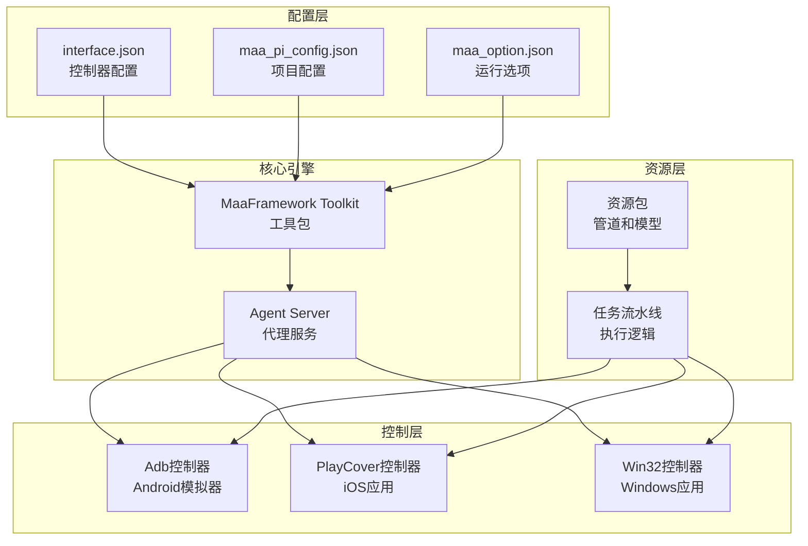
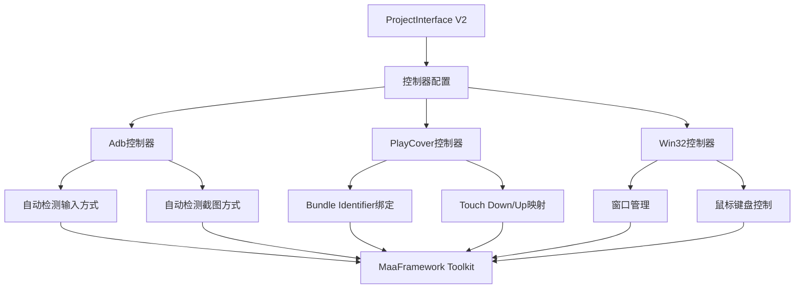
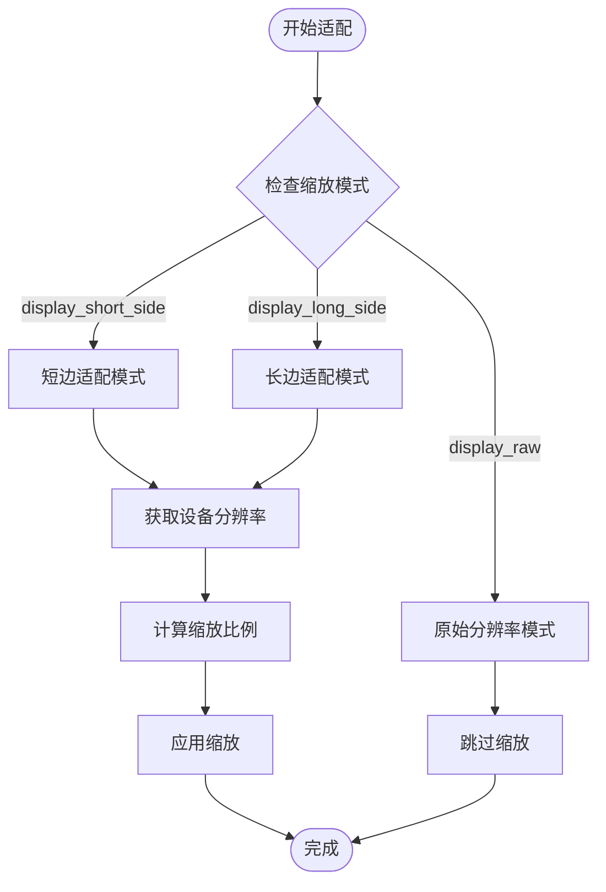
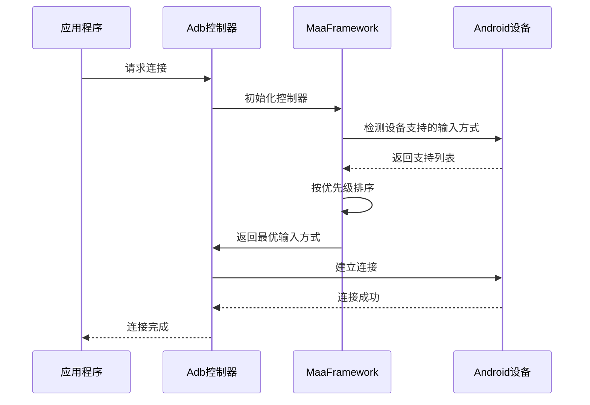
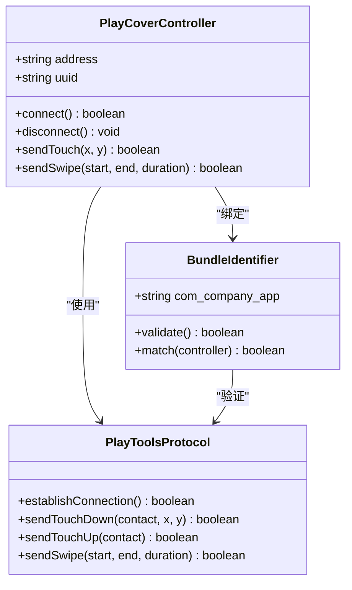
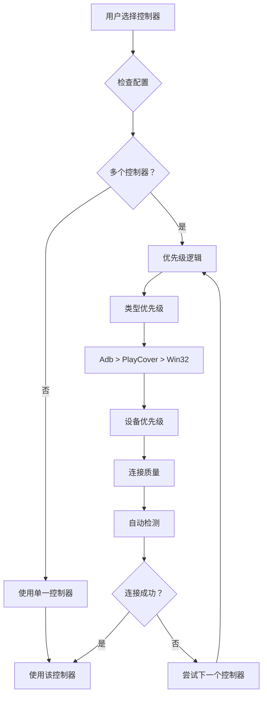
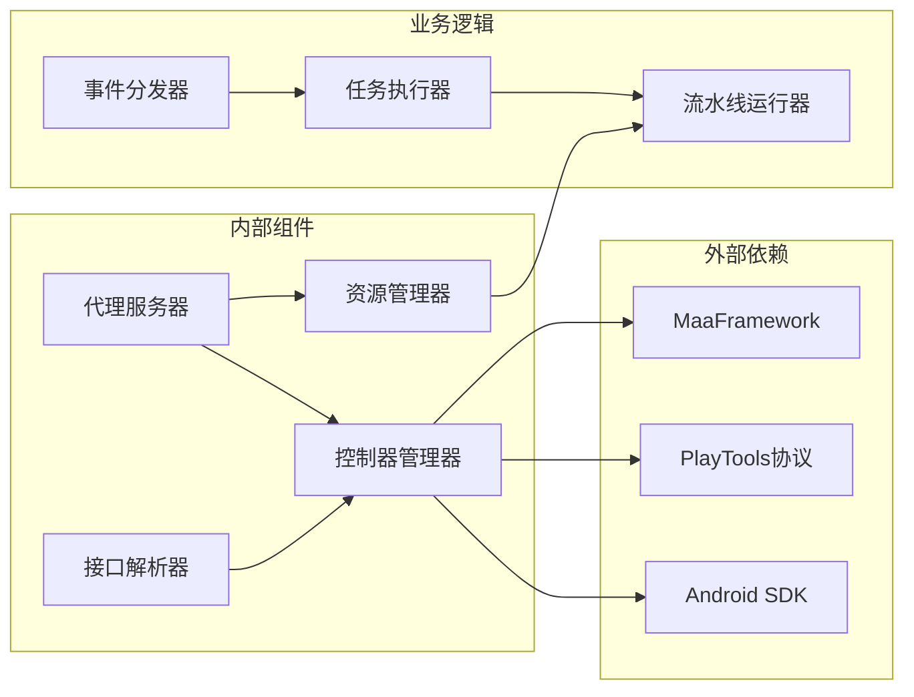
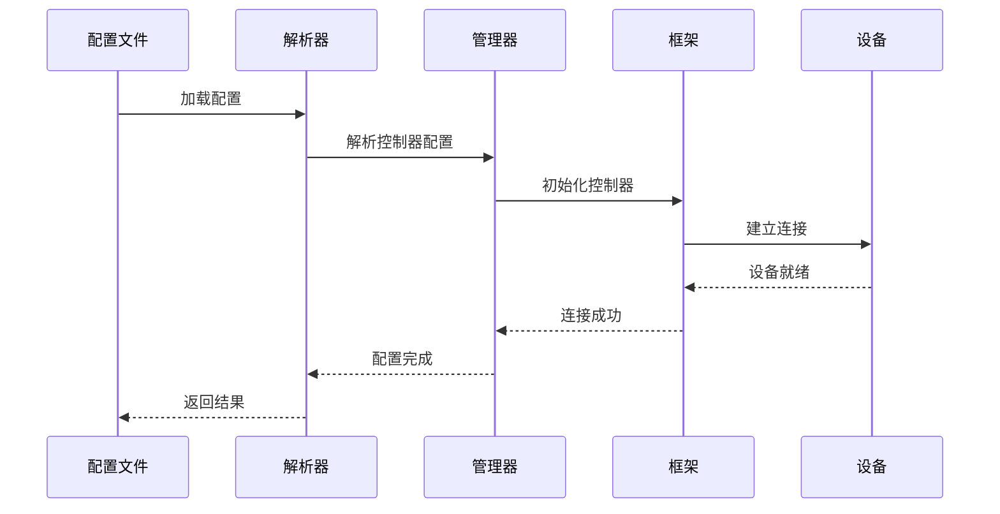
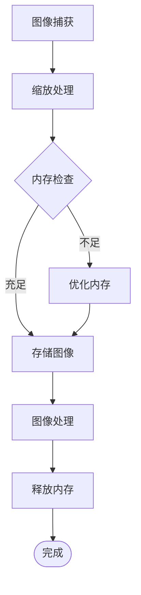
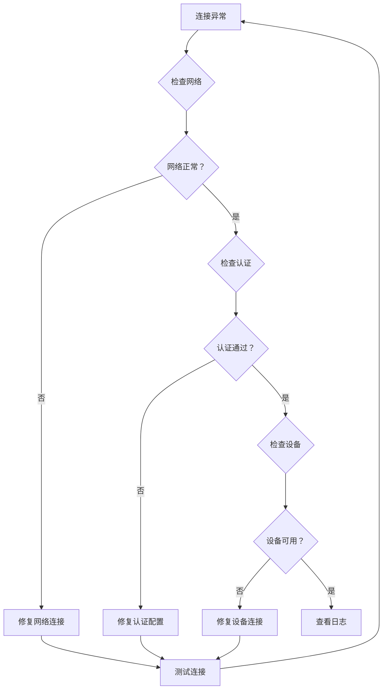

# 控制器配置

<cite>
**本文档引用的文件**
- [assets/interface.json](file://assets/interface.json)
- [instructions/maafw-guide/2.4-控制方式说明.md](file://instructions/maafw-guide/2.4-控制方式说明.md)
- [instructions/maafw-guide/3.3-ProjectInterfaceV2协议.md](file://instructions/maafw-guide/3.3-ProjectInterfaceV2协议.md)
- [agent/main.py](file://agent/main.py)
- [ci/config/maa_option.json](file://ci/config/maa_option.json)
</cite>

## 目录
1. [简介](#简介)
2. [项目结构](#项目结构)
3. [核心组件](#核心组件)
4. [架构概览](#架构概览)
5. [详细组件分析](#详细组件分析)
6. [依赖关系分析](#依赖关系分析)
7. [性能考虑](#性能考虑)
8. [故障排除指南](#故障排除指南)
9. [结论](#结论)

## 简介

本文档深入分析了MaaDuDuL项目中控制器配置的实现，特别关注Adb和PlayCover两种控制器类型的配置结构。通过对项目配置文件的详细解读，本文将阐明控制器参数的含义、适配逻辑以及在实际使用中的最佳实践。

该项目基于MaaFramework构建，提供了完整的控制器配置支持，包括Android模拟器、Windows桌面应用和macOS iOS应用的自动化控制能力。

## 项目结构

项目采用模块化架构，主要包含以下关键组件：



**图表来源**
- [assets/interface.json](file://assets/interface.json#L14-L28)
- [agent/main.py](file://agent/main.py#L19-L36)

**章节来源**
- [assets/interface.json](file://assets/interface.json#L1-L1196)
- [agent/main.py](file://agent/main.py#L1-L48)

## 核心组件

### 控制器配置结构

项目中的控制器配置位于`assets/interface.json`文件的`controller`数组中，定义了多种控制器类型及其参数。

#### Adb控制器配置

Adb控制器专门用于Android模拟器和Android设备的自动化控制：

```json
{
    "name": "模拟器",
    "type": "Adb",
    "display_short_side": 720
}
```

#### PlayCover控制器配置

PlayCover控制器用于macOS上通过PlayCover运行的iOS应用：

```json
{
    "name": "PlayCover",
    "type": "PlayCover",
    "display_short_side": 720,
    "playcover": {
        "uuid": "com.bilibili.trickcalcn"
    }
}
```

**章节来源**
- [assets/interface.json](file://assets/interface.json#L14-L28)

## 架构概览

控制器配置系统采用分层架构设计，确保了良好的可扩展性和维护性：



**图表来源**
- [instructions/maafw-guide/3.3-ProjectInterfaceV2协议.md](file://instructions/maafw-guide/3.3-ProjectInterfaceV2协议.md#L99-L172)
- [instructions/maafw-guide/2.4-控制方式说明.md](file://instructions/maafw-guide/2.4-控制方式说明.md#L10-L149)

## 详细组件分析

### Adb控制器深度分析

#### 配置参数详解

Adb控制器的核心配置参数包括：

| 参数 | 类型 | 默认值 | 描述 |
|------|------|--------|------|
| name | string | 必填 | 控制器唯一标识符 |
| type | string | "Adb" | 控制器类型 |
| display_short_side | number | 720 | 短边缩放分辨率 |
| display_long_side | number | 可选 | 长边缩放分辨率 |
| display_raw | boolean | false | 使用原始分辨率 |

#### 屏幕适配逻辑

Adb控制器的屏幕适配采用智能缩放策略：



**图表来源**
- [instructions/maafw-guide/3.3-ProjectInterfaceV2协议.md](file://instructions/maafw-guide/3.3-ProjectInterfaceV2协议.md#L123-L133)

#### 输入方式自动检测

Adb控制器采用智能输入方式检测机制：



**图表来源**
- [instructions/maafw-guide/2.4-控制方式说明.md](file://instructions/maafw-guide/2.4-控制方式说明.md#L12-L27)

**章节来源**
- [assets/interface.json](file://assets/interface.json#L14-L19)
- [instructions/maafw-guide/3.3-ProjectInterfaceV2协议.md](file://instructions/maafw-guide/3.3-ProjectInterfaceV2协议.md#L135-L139)

### PlayCover控制器深度分析

#### 配置参数详解

PlayCover控制器具有独特的配置结构：

```json
{
    "name": "PlayCover",
    "type": "PlayCover",
    "display_short_side": 720,
    "playcover": {
        "uuid": "com.bilibili.trickcalcn"
    }
}
```

| 参数 | 类型 | 默认值 | 描述 |
|------|------|--------|------|
| name | string | 必填 | 控制器唯一标识符 |
| type | string | "PlayCover" | 控制器类型 |
| display_short_side | number | 720 | 短边缩放分辨率 |
| playcover.uuid | string | maa.playcover | iOS应用Bundle Identifier |

#### iOS应用包标识绑定机制

PlayCover控制器通过Bundle Identifier实现应用绑定：



**图表来源**
- [instructions/maafw-guide/2.4-控制方式说明.md](file://instructions/maafw-guide/2.4-控制方式说明.md#L121-L126)
- [instructions/maafw-guide/3.3-ProjectInterfaceV2协议.md](file://instructions/maafw-guide/3.3-ProjectInterfaceV2协议.md#L165-L171)

#### 设备分辨率适配策略

PlayCover控制器在不同iOS设备上的适配策略：

| 设备类型 | 分辨率特征 | 适配策略 |
|----------|------------|----------|
| iPhone SE | 750×1334 | 使用720短边适配，保持纵横比 |
| iPhone 12/13 | 1125×2436 | 使用720短边适配，自动缩放 |
| iPad | 1536×2048 | 使用720短边适配，长边自动调整 |
| iPad Pro | 1024×1366 | 使用720短边适配，保持比例 |

**章节来源**
- [assets/interface.json](file://assets/interface.json#L20-L27)
- [instructions/maafw-guide/3.3-ProjectInterfaceV2协议.md](file://instructions/maafw-guide/3.3-ProjectInterfaceV2协议.md#L165-L171)

### 多控制器配置优先级

项目支持同时配置多个控制器，具有明确的优先级选择逻辑：



**图表来源**
- [instructions/maafw-guide/3.3-ProjectInterfaceV2协议.md](file://instructions/maafw-guide/3.3-ProjectInterfaceV2协议.md#L99-L121)

## 依赖关系分析

### 组件耦合度分析



**图表来源**
- [agent/main.py](file://agent/main.py#L19-L36)

### 数据流依赖

控制器配置的数据流遵循严格的依赖关系：



**图表来源**
- [assets/interface.json](file://assets/interface.json#L14-L28)

**章节来源**
- [agent/main.py](file://agent/main.py#L25-L36)

## 性能考虑

### 缩放算法优化

控制器在处理不同分辨率时采用高效的缩放算法：

| 缩放模式 | 性能特点 | 适用场景 |
|----------|----------|----------|
| 短边适配 | 高效，保持纵横比 | 移动设备，统一适配 |
| 长边适配 | 精确，可能变形 | 桌面应用，最大化利用空间 |
| 原始分辨率 | 最佳质量，内存占用高 | 高精度识别，资源充足 |

### 内存管理策略



## 故障排除指南

### 常见连接问题及解决方案

#### Adb连接失败

**问题症状**：控制器无法连接到Android设备或模拟器

**排查步骤**：
1. 检查ADB驱动是否正确安装
2. 验证设备USB调试是否开启
3. 确认模拟器网络连接正常
4. 查看MaaFramework日志输出

**解决方案**：
- 重启ADB服务：`adb kill-server && adb start-server`
- 更新设备驱动程序
- 检查防火墙设置
- 验证USB连接质量

#### PlayCover连接失败

**问题症状**：无法连接到macOS上的iOS应用

**排查步骤**：
1. 确认PlayCover已正确安装
2. 验证iOS应用已在PlayCover中启用MaaTools
3. 检查PlayTools服务是否运行
4. 验证Bundle Identifier配置正确

**解决方案**：
- 重新启动PlayCover应用
- 在PlayCover中重新启用MaaTools功能
- 检查网络连接（localhost:1717）
- 验证UUID与目标应用匹配

#### 参数配置错误

**问题症状**：控制器参数设置导致功能异常

**常见错误及修复**：
- `display_short_side`设置过小：调整为设备分辨率的合理比例
- `display_long_side`与`display_short_side`同时设置：删除其中一个
- `playcover.uuid`格式错误：使用标准Bundle Identifier格式

**章节来源**
- [ci/config/maa_option.json](file://ci/config/maa_option.json#L1-L6)

### 连接异常排查方法



## 结论

通过对MaaDuDuL项目控制器配置的深入分析，我们可以看到该系统在设计上体现了以下特点：

1. **模块化设计**：清晰的分层架构使得各组件职责明确，易于维护和扩展
2. **智能适配**：自动检测和优化机制确保了在不同设备上的良好兼容性
3. **灵活配置**：丰富的配置选项满足了各种使用场景的需求
4. **健壮性**：完善的错误处理和回退机制提高了系统的稳定性

控制器配置系统为自动化测试和任务执行提供了强大的基础设施支持，通过合理的参数设置和配置优化，可以实现高效稳定的跨平台控制能力。