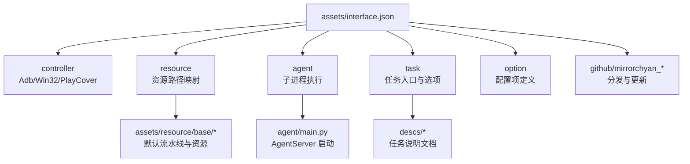
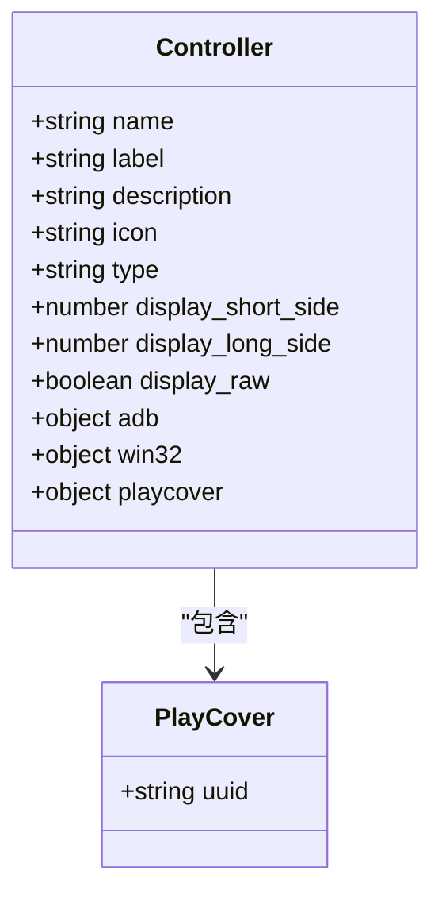
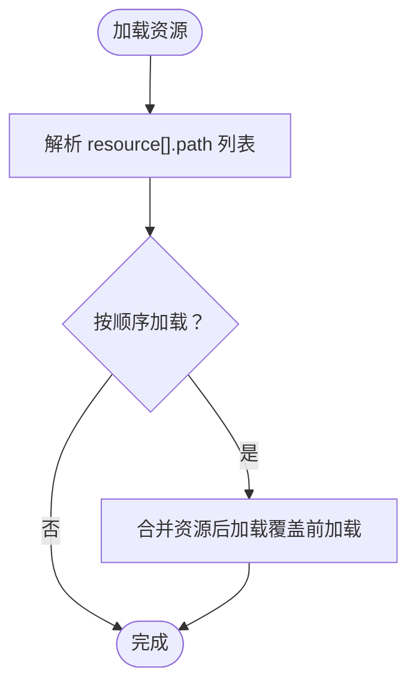
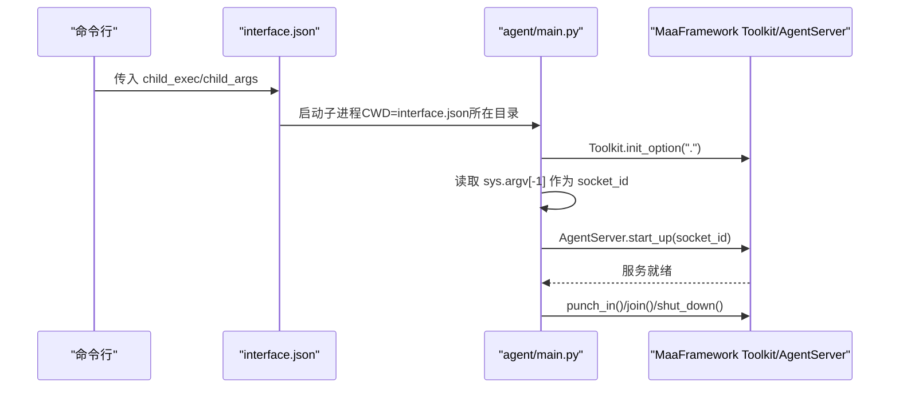
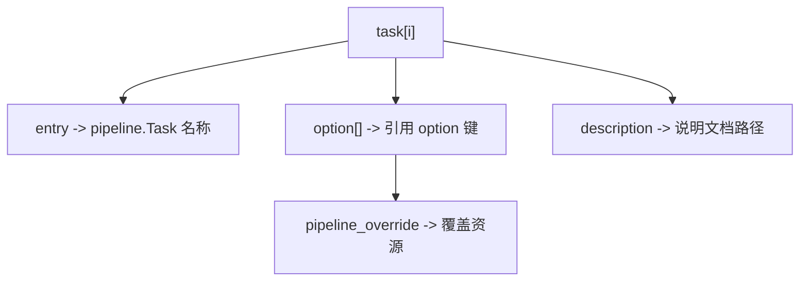
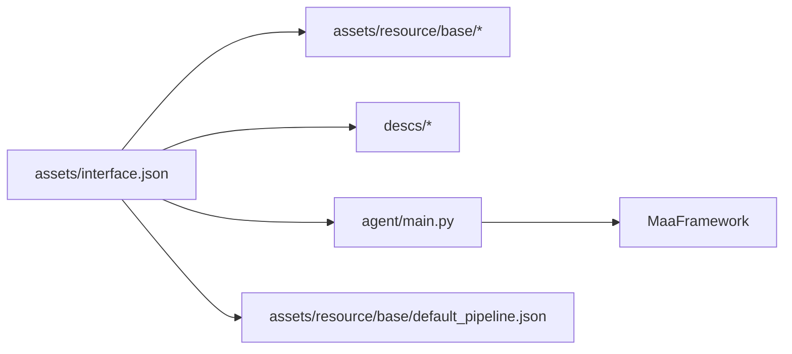

# 界面接口配置

<cite>
**本文引用的文件**
- [assets/interface.json](file://assets/interface.json)
- [instructions/maafw-guide/3.3-ProjectInterfaceV2协议.md](file://instructions/maafw-guide/3.3-ProjectInterfaceV2协议.md)
- [instructions/maafw-guide/2.4-控制方式说明.md](file://instructions/maafw-guide/2.4-控制方式说明.md)
- [agent/main.py](file://agent/main.py)
- [assets/config/maa_pi_config.json](file://assets/config/maa_pi_config.json)
- [assets/resource/base/default_pipeline.json](file://assets/resource/base/default_pipeline.json)
- [descs/daily/start_game.md](file://descs/daily/start_game.md)
- [descs/daily/claim_mail.md](file://descs/daily/claim_mail.md)
</cite>

## 目录
1. [简介](#简介)
2. [项目结构](#项目结构)
3. [核心组件](#核心组件)
4. [架构总览](#架构总览)
5. [详细组件分析](#详细组件分析)
6. [依赖关系分析](#依赖关系分析)
7. [性能考量](#性能考量)
8. [故障排查指南](#故障排查指南)
9. [结论](#结论)
10. [附录](#附录)

## 简介
本文件面向使用者与集成者，系统性解析 MaaDuDuL 项目的界面接口配置文件 interface.json 的完整结构设计与使用方法。重点涵盖：
- 基础字段（interface_version、name、title 等）的用途与约束
- controller 数组中 Adb 与 PlayCover 控制器的配置参数（如 display_short_side、playcover.uuid）及其对设备连接的影响
- resource 资源配置的路径映射机制
- agent 子进程执行配置（child_exec、child_args）的启动逻辑
- task 任务列表中各任务的 entry、option 关联关系，以及 description 指向的说明文档路径
- github、mirrorchyan_rid 等分发相关字段的作用
- 提供实际配置示例与常见错误修正方案

## 项目结构
interface.json 位于 assets 目录下，是 MaaFramework 标准化的 ProjectInterface 声明文件，配合资源、任务流水线、说明文档与 Agent 子进程共同构成完整的自动化执行体系。



图表来源
- [assets/interface.json](file://assets/interface.json#L1-L164)
- [agent/main.py](file://agent/main.py#L17-L47)

章节来源
- [assets/interface.json](file://assets/interface.json#L1-L164)
- [instructions/maafw-guide/3.3-ProjectInterfaceV2协议.md](file://instructions/maafw-guide/3.3-ProjectInterfaceV2协议.md#L17-L426)

## 核心组件
- 基础元信息：interface_version、name、title、icon、version、contact、license、welcome、description、github、mirrorchyan_rid、mirrorchyan_multiplatform
- 控制器配置：controller 数组，支持 Adb、Win32、PlayCover，关键参数包括 display_short_side、display_long_side、display_raw、playcover.uuid
- 资源配置：resource 数组，path 为资源加载路径列表，支持按控制器过滤与全局 option 注入
- Agent 子进程：agent.child_exec、agent.child_args，用于启动 AgentServer
- 任务与选项：task 数组（entry、option、description）、option 定义（select/input/switch）
- 分发与更新：github、mirrorchyan_rid、mirrorchyan_multiplatform

章节来源
- [assets/interface.json](file://assets/interface.json#L1-L164)
- [instructions/maafw-guide/3.3-ProjectInterfaceV2协议.md](file://instructions/maafw-guide/3.3-ProjectInterfaceV2协议.md#L25-L426)

## 架构总览
interface.json 作为统一的项目声明，驱动 UI 展示、资源加载、任务编排与 Agent 服务启动。其与资源、说明文档、Agent 的交互如下：

```mermaid
sequenceDiagram
participant UI as "UI/Client"
participant IF as "interface.json"
participant Res as "资源加载"
participant Task as "任务编排"
participant Opt as "选项系统"
participant Agent as "AgentServer"
participant FW as "MaaFramework"
UI->>IF : 读取基础元信息与控制器
IF->>Res : 解析 resource.path 列表
Res-->>IF : 返回资源包集合
UI->>Task : 读取 task 列表与 entry
Task->>Opt : 绑定 option 与 pipeline_override
Opt-->>Task : 返回参数与覆盖规则
UI->>Agent : 依据 agent.child_exec/args 启动子进程
Agent->>FW : 初始化 Toolkit 并启动 AgentServer
FW-->>Agent : 服务就绪
UI-->>Task : 执行任务基于 entry 与覆盖
```

图表来源
- [assets/interface.json](file://assets/interface.json#L1-L164)
- [agent/main.py](file://agent/main.py#L17-L47)

## 详细组件分析

### 基础字段与分发字段
- interface_version：固定为 2，标识 ProjectInterface V2 协议版本
- name：项目唯一标识符，用作项目ID
- title：窗口标题，可选，默认使用 name 与 version 拼接生成
- icon：应用图标文件路径（相对项目根目录），可选
- version：项目版本号，用于 UI 展示与版本更新检查
- contact、license、welcome、description：关于页信息，支持文件路径、URL 或直接文本，内容支持 Markdown
- github：项目 GitHub 仓库地址，用于版本更新检查与问题反馈
- mirrorchyan_rid：MirrorChyan 资源包标识符，用于资源管理与分发
- mirrorchyan_multiplatform：是否支持多平台，影响资源包打包与分发策略

章节来源
- [assets/interface.json](file://assets/interface.json#L1-L164)
- [instructions/maafw-guide/3.3-ProjectInterfaceV2协议.md](file://instructions/maafw-guide/3.3-ProjectInterfaceV2协议.md#L25-L97)

### 控制器配置（controller）
- 数组元素包含 name、label、description、icon、type、display_short_side、display_long_side、display_raw、adb、win32、playcover 等字段
- Adb：V2 协议中 input/screencap 由 MaaFramework 自动检测与选择最优方式，无需手动配置
- Win32：可配置 class_regex、window_regex、mouse、keyboard、screencap 等
- PlayCover（macOS）：playcover.uuid 为目标应用 Bundle Identifier，用于 PlayTools 协议连接；控制器特性标志为使用 touch_down + touch_up 替代 click



图表来源
- [assets/interface.json](file://assets/interface.json#L14-L28)
- [instructions/maafw-guide/3.3-ProjectInterfaceV2协议.md](file://instructions/maafw-guide/3.3-ProjectInterfaceV2协议.md#L119-L172)
- [instructions/maafw-guide/2.4-控制方式说明.md](file://instructions/maafw-guide/2.4-控制方式说明.md#L99-L149)

章节来源
- [assets/interface.json](file://assets/interface.json#L14-L28)
- [instructions/maafw-guide/3.3-ProjectInterfaceV2协议.md](file://instructions/maafw-guide/3.3-ProjectInterfaceV2协议.md#L99-L172)
- [instructions/maafw-guide/2.4-控制方式说明.md](file://instructions/maafw-guide/2.4-控制方式说明.md#L99-L149)

### 资源配置（resource）
- name：资源包唯一标识符，用作资源包ID
- label/description/icon：UI 展示与描述，支持国际化
- path：资源加载路径数组，相对 interface.json 所在目录；多个路径按顺序加载，后加载覆盖前加载
- controller：可选，限定该资源包支持的控制器类型列表
- option：可选，全局选项键列表，注入到所有任务的 pipeline_override



图表来源
- [assets/interface.json](file://assets/interface.json#L29-L34)
- [instructions/maafw-guide/3.3-ProjectInterfaceV2协议.md](file://instructions/maafw-guide/3.3-ProjectInterfaceV2协议.md#L173-L225)

章节来源
- [assets/interface.json](file://assets/interface.json#L29-L34)
- [instructions/maafw-guide/3.3-ProjectInterfaceV2协议.md](file://instructions/maafw-guide/3.3-ProjectInterfaceV2协议.md#L173-L225)

### Agent 子进程执行（agent）
- child_exec：子进程可执行文件路径（系统路径），CWD 为 interface.json 所在目录
- child_args：子进程参数数组（可选）
- identifier：可选，连接标识符，用于创建通信套接字

Agent 启动流程要点：
- agent/main.py 通过 Toolkit.init_option 初始化选项
- 从命令行最后一个参数获取 socket_id
- 启动 AgentServer.start_up(socket_id)，执行 devops punch_in
- join() 等待服务结束，随后 shut_down()



图表来源
- [assets/interface.json](file://assets/interface.json#L35-L38)
- [agent/main.py](file://agent/main.py#L17-L47)

章节来源
- [assets/interface.json](file://assets/interface.json#L35-L38)
- [agent/main.py](file://agent/main.py#L17-L47)

### 任务与选项（task 与 option）
- task：每个任务包含 name、label、entry、default_check、description、icon、resource、pipeline_override、option
- entry：指向 pipeline 中 Task 的名称，作为任务执行入口
- option：引用外层 option 定义中的键，形成可配置的 pipeline_override
- description：任务说明文档路径（相对 interface.json 所在目录）



图表来源
- [assets/interface.json](file://assets/interface.json#L39-L163)
- [instructions/maafw-guide/3.3-ProjectInterfaceV2协议.md](file://instructions/maafw-guide/3.3-ProjectInterfaceV2协议.md#L254-L322)

章节来源
- [assets/interface.json](file://assets/interface.json#L39-L163)
- [instructions/maafw-guide/3.3-ProjectInterfaceV2协议.md](file://instructions/maafw-guide/3.3-ProjectInterfaceV2协议.md#L254-L322)

### 说明文档路径与任务描述
- description 字段支持文件路径、URL 或直接文本，内容支持 Markdown
- 示例：任务“启动游戏”、“领取邮件”等的说明文档路径分别为 Resource/descs/daily/start_game.md、Resource/descs/daily/claim_mail.md

章节来源
- [assets/interface.json](file://assets/interface.json#L44-L50)
- [descs/daily/start_game.md](file://descs/daily/start_game.md#L1-L17)
- [descs/daily/claim_mail.md](file://descs/daily/claim_mail.md#L1-L13)

## 依赖关系分析
- interface.json 依赖资源目录（assets/resource/base）与说明文档（descs/*）
- Agent 依赖 agent/main.py 与 MaaFramework Toolkit/AgentServer
- 任务执行依赖 pipeline 资源（见 default_pipeline.json）



图表来源
- [assets/interface.json](file://assets/interface.json#L1-L164)
- [agent/main.py](file://agent/main.py#L17-L47)
- [assets/resource/base/default_pipeline.json](file://assets/resource/base/default_pipeline.json#L1-L7)

章节来源
- [assets/interface.json](file://assets/interface.json#L1-L164)
- [agent/main.py](file://agent/main.py#L17-L47)
- [assets/resource/base/default_pipeline.json](file://assets/resource/base/default_pipeline.json#L1-L7)

## 性能考量
- Adb 控制器的 input/screencap 由 MaaFramework 自动检测与选择最优方式，减少手动配置成本
- PlayCover 控制器使用 touch_down + touch_up 替代 click，提升触控稳定性
- 资源加载采用顺序合并策略，后加载覆盖前加载，便于按需扩展与覆盖

章节来源
- [instructions/maafw-guide/3.3-ProjectInterfaceV2协议.md](file://instructions/maafw-guide/3.3-ProjectInterfaceV2协议.md#L135-L139)
- [instructions/maafw-guide/2.4-控制方式说明.md](file://instructions/maafw-guide/2.4-控制方式说明.md#L147-L149)

## 故障排查指南
- 控制器连接失败
  - 检查 Adb/Win32/PlayCover 的 type 与参数配置是否正确
  - PlayCover：确认 uuid 与 PlayTools 服务地址匹配，且目标应用已在 PlayCover 中启用 MaaTools
- 资源加载异常
  - 确认 resource.path 的相对路径正确，且资源目录包含 pipeline、image、model 等必要文件
  - 如需按控制器过滤，确保 controller.name 与 resource.controller[] 匹配
- Agent 启动失败
  - 检查 child_exec 是否为系统可执行文件路径，child_args 是否正确传递
  - 确认 CWD 为 interface.json 所在目录，且 agent/main.py 可正常导入依赖
- 任务执行异常
  - 检查 task.entry 是否与 pipeline 中 Task 名称一致
  - 确认 option 的 pipeline_override 语法正确，变量替换格式符合要求

章节来源
- [assets/interface.json](file://assets/interface.json#L14-L38)
- [agent/main.py](file://agent/main.py#L17-L47)
- [instructions/maafw-guide/3.3-ProjectInterfaceV2协议.md](file://instructions/maafw-guide/3.3-ProjectInterfaceV2协议.md#L254-L322)

## 结论
interface.json 通过标准化的字段与结构，将控制器、资源、任务、选项与 Agent 子进程有机整合，形成可配置、可扩展、可维护的自动化执行体系。遵循 V2 协议规范，合理配置控制器参数、资源路径与 Agent 启动参数，可有效提升任务执行的稳定性与可移植性。

## 附录

### 实际配置示例（路径引用）
- 控制器配置示例路径
  - [assets/interface.json](file://assets/interface.json#L14-L28)
- 资源配置示例路径
  - [assets/interface.json](file://assets/interface.json#L29-L34)
  - [assets/resource/base/default_pipeline.json](file://assets/resource/base/default_pipeline.json#L1-L7)
- Agent 启动配置示例路径
  - [assets/interface.json](file://assets/interface.json#L35-L38)
  - [agent/main.py](file://agent/main.py#L17-L47)
- 任务与说明文档示例路径
  - [assets/interface.json](file://assets/interface.json#L39-L163)
  - [descs/daily/start_game.md](file://descs/daily/start_game.md#L1-L17)
  - [descs/daily/claim_mail.md](file://descs/daily/claim_mail.md#L1-L13)
- 分发与更新字段示例路径
  - [assets/interface.json](file://assets/interface.json#L11-L13)
  - [assets/config/maa_pi_config.json](file://assets/config/maa_pi_config.json#L1-L3)