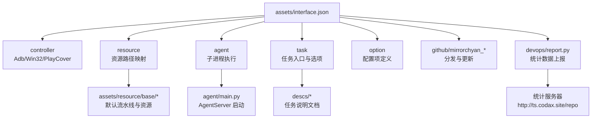
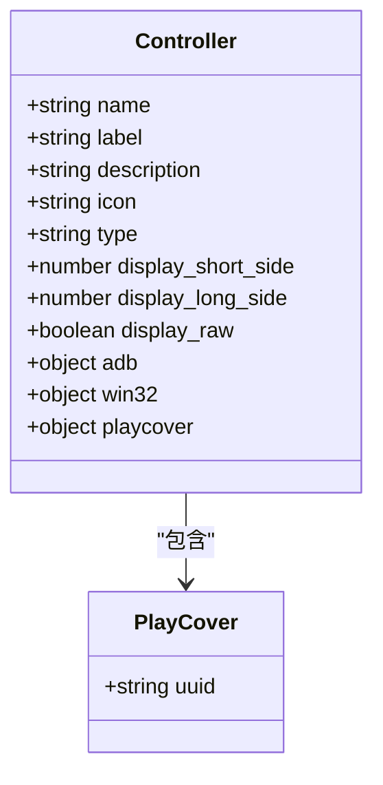
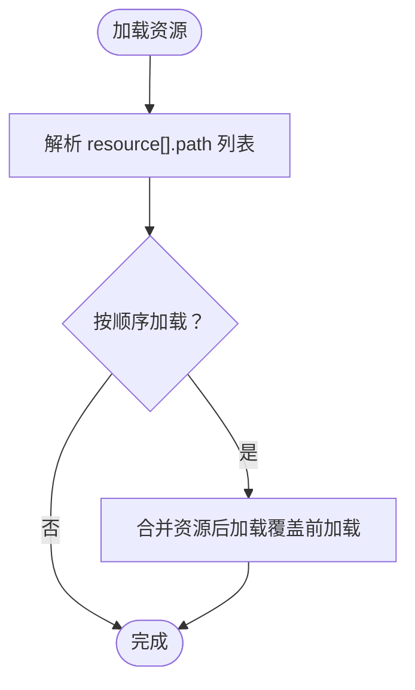
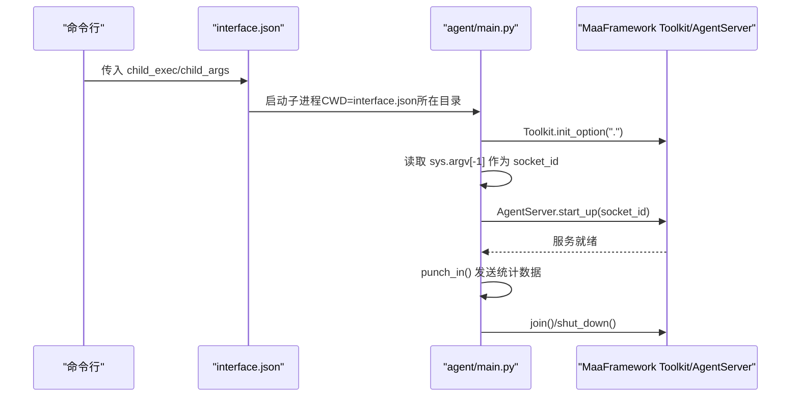
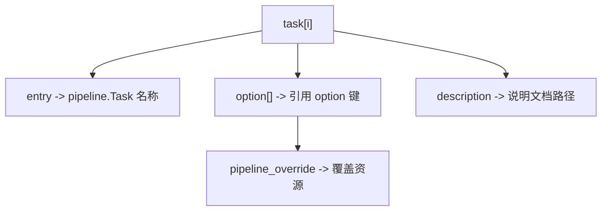
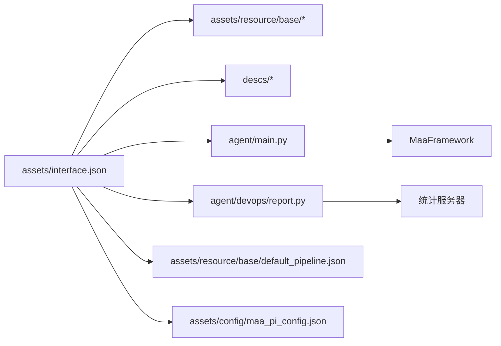

# 界面接口配置

<cite>
**本文引用的文件**
- [assets/interface.json](file://assets/interface.json)
- [instructions/maafw-guide/3.3-ProjectInterfaceV2协议.md](file://instructions/maafw-guide/3.3-ProjectInterfaceV2协议.md)
- [instructions/maafw-guide/2.4-控制方式说明.md](file://instructions/maafw-guide/2.4-控制方式说明.md)
- [agent/main.py](file://agent/main.py)
- [agent/devops/report.py](file://agent/devops/report.py)
- [assets/config/maa_pi_config.json](file://assets/config/maa_pi_config.json)
- [assets/resource/base/default_pipeline.json](file://assets/resource/base/default_pipeline.json)
- [assets/resource/Changelog.md](file://assets/resource/Changelog.md)
- [assets/resource/Announcement/90.更新记录.md](file://assets/resource/Announcement/90.更新记录.md)
- [descs/daily/start_game.md](file://descs/daily/start_game.md)
- [descs/daily/claim_mail.md](file://descs/daily/claim_mail.md)
</cite>

## 更新摘要
**所做更改**
- 更新版本信息：从 v0.1.9 升级至 v0.1.10
- 更新界面标题显示的游戏版本：从 '献给你的赞颂' 更新为 '再次绽放的蓝玫瑰'
- 更新统计数据上报模块的版本号
- 增强包管理器配置说明
- 完善版本更新记录与分发信息

## 目录
1. [简介](#简介)
2. [项目结构](#项目结构)
3. [核心组件](#核心组件)
4. [架构总览](#架构总览)
5. [详细组件分析](#详细组件分析)
6. [依赖关系分析](#依赖关系分析)
7. [性能考量](#性能考量)
8. [故障排查指南](#故障排查指南)
9. [结论](#结论)
10. [附录](#附录)

## 简介
本文件面向使用者与集成者，系统性解析 MaaDuDuL 项目的界面接口配置文件 interface.json 的完整结构设计与使用方法。重点涵盖：
- 基础字段（interface_version、name、title 等）的用途与约束
- controller 数组中 Adb 与 PlayCover 控制器的配置参数（如 display_short_side、playcover.uuid）及其对设备连接的影响
- resource 资源配置的路径映射机制
- agent 子进程执行配置（child_exec、child_args）的启动逻辑
- task 任务列表中各任务的 entry、option 关联关系，以及 description 指向的说明文档路径
- github、mirrorchyan_rid 等分发相关字段的作用
- **新增** 数据统计上报模块的配置与实现
- **新增** 包管理器配置与依赖管理机制
- 提供实际配置示例与常见错误修正方案

## 项目结构
interface.json 位于 assets 目录下，是 MaaFramework 标准化的 ProjectInterface 声明文件，配合资源、任务流水线、说明文档、Agent 子进程和统计数据上报模块共同构成完整的自动化执行体系。

```mermaid
graph TB
A["assets/interface.json"] --> B["controller<br/>Adb/Win32/PlayCover"]
A --> C["resource<br/>资源路径映射"]
A --> D["agent<br/>子进程执行"]
A --> E["task<br/>任务入口与选项"]
A --> F["option<br/>配置项定义"]
A --> G["github/mirrorchyan_*<br/>分发与更新"]
A --> H["devops/report.py<br/>统计数据上报"]
C --> I["assets/resource/base/*<br/>默认流水线与资源"]
E --> J["descs/*<br/>任务说明文档"]
D --> K["agent/main.py<br/>AgentServer 启动"]
H --> L["统计服务器<br/>http://ts.codax.site/repo"]
```

**图表来源**
- [assets/interface.json:1-1456](file://assets/interface.json#L1-L1456)
- [agent/main.py:1-78](file://agent/main.py#L1-L78)
- [agent/devops/report.py:1-34](file://agent/devops/report.py#L1-L34)

**章节来源**
- [assets/interface.json:1-1456](file://assets/interface.json#L1-L1456)
- [instructions/maafw-guide/3.3-ProjectInterfaceV2协议.md:17-426](file://instructions/maafw-guide/3.3-ProjectInterfaceV2协议.md#L17-L426)

## 核心组件
- 基础元信息：interface_version、name、title、icon、version、contact、license、welcome、description、github、mirrorchyan_rid、mirrorchyan_multiplatform
- 控制器配置：controller 数组，支持 Adb、Win32、PlayCover，关键参数包括 display_short_side、display_long_side、display_raw、playcover.uuid
- 资源配置：resource 数组，path 为资源加载路径列表，支持按控制器过滤与全局 option 注入
- Agent 子进程：agent.child_exec、agent.child_args，用于启动 AgentServer
- 任务与选项：task 数组（entry、option、description）、option 定义（select/input/switch）
- 分发与更新：github、mirrorchyan_rid、mirrorchyan_multiplatform
- **新增** 数据统计上报：devops.report.punch_in() 函数，向远程服务器发送使用统计信息
- **新增** 包管理器配置：assets/config/maa_pi_config.json，定义资源包选择

**章节来源**
- [assets/interface.json:1-1456](file://assets/interface.json#L1-L1456)
- [instructions/maafw-guide/3.3-ProjectInterfaceV2协议.md:25-426](file://instructions/maafw-guide/3.3-ProjectInterfaceV2协议.md#L25-L426)
- [agent/devops/report.py:1-34](file://agent/devops/report.py#L1-L34)
- [assets/config/maa_pi_config.json:1-3](file://assets/config/maa_pi_config.json#L1-L3)

## 架构总览
interface.json 作为统一的项目声明，驱动 UI 展示、资源加载、任务编排、Agent 服务启动和统计数据上报。其与资源、说明文档、Agent 和统计模块的交互如下：

```mermaid
sequenceDiagram
participant UI as "UI/Client"
participant IF as "interface.json"
participant Res as "资源加载"
participant Task as "任务编排"
participant Opt as "选项系统"
participant Agent as "AgentServer"
participant DevOps as "统计数据上报"
participant FW as "MaaFramework"
UI->>IF : 读取基础元信息与控制器
IF->>Res : 解析 resource.path 列表
Res-->>IF : 返回资源包集合
UI->>Task : 读取 task 列表与 entry
Task->>Opt : 绑定 option 与 pipeline_override
Opt-->>Task : 返回参数与覆盖规则
UI->>Agent : 依据 agent.child_exec/args 启动子进程
Agent->>FW : 初始化 Toolkit 并启动 AgentServer
FW-->>Agent : 服务就绪
Agent->>DevOps : punch_in() 发送统计信息
DevOps-->>Agent : 返回响应或异常
UI-->>Task : 执行任务基于 entry 与覆盖
```

**图表来源**
- [assets/interface.json:1-1456](file://assets/interface.json#L1-L1456)
- [agent/main.py:1-78](file://agent/main.py#L1-L78)
- [agent/devops/report.py:1-34](file://agent/devops/report.py#L1-L34)

## 详细组件分析

### 基础字段与分发字段
- interface_version：固定为 2，标识 ProjectInterface V2 协议版本
- name：项目唯一标识符，用作项目ID
- title：窗口标题，显示格式为 "MDDL 嘟嘟脸小助手(kqcoxn/MaaDuDuL) v0.1.10 - MFAA | 游戏版本：再次绽放的蓝玫瑰"
- icon：应用图标文件路径（相对项目根目录），可选
- version：项目版本号，用于 UI 展示与版本更新检查，当前为 v0.1.10
- contact、license、welcome、description：关于页信息，支持文件路径、URL 或直接文本，内容支持 Markdown
- github：项目 GitHub 仓库地址，用于版本更新检查与问题反馈
- mirrorchyan_rid：MirrorChyan 资源包标识符，用于资源管理与分发
- mirrorchyan_multiplatform：是否支持多平台，影响资源包打包与分发策略

**更新** 版本信息已从 v0.1.9 升级至 v0.1.10，界面标题中的游戏版本已从 '献给你的赞颂' 更新为 '再次绽放的蓝玫瑰'，统计数据上报模块也相应更新

**章节来源**
- [assets/interface.json:1-1456](file://assets/interface.json#L1-L1456)
- [instructions/maafw-guide/3.3-ProjectInterfaceV2协议.md:25-97](file://instructions/maafw-guide/3.3-ProjectInterfaceV2协议.md#L25-L97)
- [agent/devops/report.py:23-25](file://agent/devops/report.py#L23-L25)

### 控制器配置（controller）
- 数组元素包含 name、label、description、icon、type、display_short_side、display_long_side、display_raw、adb、win32、playcover 等字段
- Adb：V2 协议中 input/screencap 由 MaaFramework 自动检测与选择最优方式，无需手动配置
- Win32：可配置 class_regex、window_regex、mouse、keyboard、screencap 等
- PlayCover（macOS）：playcover.uuid 为目标应用 Bundle Identifier，用于 PlayTools 协议连接；控制器特性标志为使用 touch_down + touch_up 替代 click

```mermaid
classDiagram
class Controller {
+string name
+string label
+string description
+string icon
+string type
+number display_short_side
+number display_long_side
+boolean display_raw
+object adb
+object win32
+object playcover
}
class PlayCover {
+string uuid
}
Controller --> PlayCover : "包含"
```

**图表来源**
- [assets/interface.json:14-28](file://assets/interface.json#L14-L28)
- [instructions/maafw-guide/3.3-ProjectInterfaceV2协议.md:119-172](file://instructions/maafw-guide/3.3-ProjectInterfaceV2协议.md#L119-L172)
- [instructions/maafw-guide/2.4-控制方式说明.md:99-149](file://instructions/maafw-guide/2.4-控制方式说明.md#L99-L149)

**章节来源**
- [assets/interface.json:14-28](file://assets/interface.json#L14-L28)
- [instructions/maafw-guide/3.3-ProjectInterfaceV2协议.md:99-172](file://instructions/maafw-guide/3.3-ProjectInterfaceV2协议.md#L99-L172)
- [instructions/maafw-guide/2.4-控制方式说明.md:99-149](file://instructions/maafw-guide/2.4-控制方式说明.md#L99-L149)

### 资源配置（resource）
- name：资源包唯一标识符，用作资源包ID
- label/description/icon：UI 展示与描述，支持国际化
- path：资源加载路径数组，相对 interface.json 所在目录；多个路径按顺序加载，后加载覆盖前加载
- controller：可选，限定该资源包支持的控制器类型列表
- option：可选，全局选项键列表，注入到所有任务的 pipeline_override

```mermaid
flowchart TD
Start(["加载资源"]) --> Resolve["解析 resource[].path 列表"]
Resolve --> LoadOrder{"按顺序加载？"}
LoadOrder --> |是| Merge["合并资源后加载覆盖前加载"]
LoadOrder --> |否| End(["完成"])
Merge --> End
```

**图表来源**
- [assets/interface.json:29-34](file://assets/interface.json#L29-L34)
- [instructions/maafw-guide/3.3-ProjectInterfaceV2协议.md:173-225](file://instructions/maafw-guide/3.3-ProjectInterfaceV2协议.md#L173-L225)

**章节来源**
- [assets/interface.json:29-34](file://assets/interface.json#L29-L34)
- [instructions/maafw-guide/3.3-ProjectInterfaceV2协议.md:173-225](file://instructions/maafw-guide/3.3-ProjectInterfaceV2协议.md#L173-L225)

### Agent 子进程执行（agent）
- child_exec：子进程可执行文件路径（系统路径），CWD 为 interface.json 所在目录
- child_args：子进程参数数组（可选）
- identifier：可选，连接标识符，用于创建通信套接字

Agent 启动流程要点：
- agent/main.py 通过 Toolkit.init_option 初始化选项
- 从命令行最后一个参数获取 socket_id
- 启动 AgentServer.start_up(socket_id)，执行 devops punch_in
- join() 等待服务结束，随后 shut_down()

```mermaid
sequenceDiagram
participant CLI as "命令行"
participant IF as "interface.json"
participant Py as "agent/main.py"
participant FW as "MaaFramework Toolkit/AgentServer"
CLI->>IF : 传入 child_exec/child_args
IF->>Py : 启动子进程CWD=interface.json所在目录
Py->>FW : Toolkit.init_option(".")
Py->>Py : 读取 sys.argv[-1] 作为 socket_id
Py->>FW : AgentServer.start_up(socket_id)
FW-->>Py : 服务就绪
Py->>Py : punch_in() 发送统计数据
Py->>FW : join()/shut_down()
```

**图表来源**
- [assets/interface.json:35-38](file://assets/interface.json#L35-L38)
- [agent/main.py:1-78](file://agent/main.py#L1-L78)

**章节来源**
- [assets/interface.json:35-38](file://assets/interface.json#L35-L38)
- [agent/main.py:1-78](file://agent/main.py#L1-L78)

### 任务与选项（task 与 option）
- task：每个任务包含 name、label、entry、default_check、description、icon、resource、pipeline_override、option
- entry：指向 pipeline 中 Task 的名称，作为任务执行入口
- option：引用外层 option 定义中的键，形成可配置的 pipeline_override
- description：任务说明文档路径（相对 interface.json 所在目录）

```mermaid
flowchart TD
T["task[i]"] --> E["entry -> pipeline.Task 名称"]
T --> Opts["option[] -> 引用 option 键"]
Opts --> P["pipeline_override -> 覆盖资源"]
T --> D["description -> 说明文档路径"]
```

**图表来源**
- [assets/interface.json:39-1456](file://assets/interface.json#L39-L1456)
- [instructions/maafw-guide/3.3-ProjectInterfaceV2协议.md:254-322](file://instructions/maafw-guide/3.3-ProjectInterfaceV2协议.md#L254-L322)

**章节来源**
- [assets/interface.json:39-1456](file://assets/interface.json#L39-L1456)
- [instructions/maafw-guide/3.3-ProjectInterfaceV2协议.md:254-322](file://instructions/maafw-guide/3.3-ProjectInterfaceV2协议.md#L254-L322)

### 说明文档路径与任务描述
- description 字段支持文件路径、URL 或直接文本，内容支持 Markdown
- 示例：任务"启动游戏"、"领取邮件"等的说明文档路径分别为 Resource/descs/daily/start_game.md、Resource/descs/daily/claim_mail.md

**章节来源**
- [assets/interface.json:44-50](file://assets/interface.json#L44-L50)
- [descs/daily/start_game.md:1-17](file://descs/daily/start_game.md#L1-L17)
- [descs/daily/claim_mail.md:1-13](file://descs/daily/claim_mail.md#L1-L13)

### **新增** 数据统计上报模块
- punch_in() 函数负责向远程服务器发送使用统计信息
- 请求地址：http://ts.codax.site/repo
- 发送数据：{"from": "mddl", "version": "v0.1.10"}
- 超时设置：3秒，失败时不中断程序执行
- 调用时机：Agent 启动后立即执行

**更新** 版本号已从 v0.1.9 更新为 v0.1.10

**章节来源**
- [agent/devops/report.py:1-34](file://agent/devops/report.py#L1-L34)
- [agent/main.py:64-64](file://agent/main.py#L64-L64)

### **新增** 包管理器配置
- maa_pi_config.json 定义资源包选择
- 默认资源包："B服"
- 影响范围：资源包加载与版本管理

**章节来源**
- [assets/config/maa_pi_config.json:1-3](file://assets/config/maa_pi_config.json#L1-L3)

## 依赖关系分析
- interface.json 依赖资源目录（assets/resource/base）与说明文档（descs/*）
- Agent 依赖 agent/main.py 与 MaaFramework Toolkit/AgentServer
- 任务执行依赖 pipeline 资源（见 default_pipeline.json）
- **新增** 统计数据上报依赖 requests 库和远程服务器
- **新增** 包管理器依赖 assets/config/maa_pi_config.json

```mermaid
graph LR
IF["assets/interface.json"] --> RES["assets/resource/base/*"]
IF --> DES["descs/*"]
IF --> AG["agent/main.py"]
IF --> DEVOPS["agent/devops/report.py"]
AG --> FW["MaaFramework"]
DEVOPS --> SERVER["统计服务器"]
IF --> PIPE["assets/resource/base/default_pipeline.json"]
IF --> CFG["assets/config/maa_pi_config.json"]
```

**图表来源**
- [assets/interface.json:1-1456](file://assets/interface.json#L1-L1456)
- [agent/main.py:1-78](file://agent/main.py#L1-L78)
- [agent/devops/report.py:1-34](file://agent/devops/report.py#L1-L34)
- [assets/resource/base/default_pipeline.json:1-7](file://assets/resource/base/default_pipeline.json#L1-L7)
- [assets/config/maa_pi_config.json:1-3](file://assets/config/maa_pi_config.json#L1-L3)

**章节来源**
- [assets/interface.json:1-1456](file://assets/interface.json#L1-L1456)
- [agent/main.py:1-78](file://agent/main.py#L1-L78)
- [agent/devops/report.py:1-34](file://agent/devops/report.py#L1-L34)
- [assets/resource/base/default_pipeline.json:1-7](file://assets/resource/base/default_pipeline.json#L1-L7)
- [assets/config/maa_pi_config.json:1-3](file://assets/config/maa_pi_config.json#L1-L3)

## 性能考量
- Adb 控制器的 input/screencap 由 MaaFramework 自动检测与选择最优方式，减少手动配置成本
- PlayCover 控制器使用 touch_down + touch_up 替代 click，提升触控稳定性
- 资源加载采用顺序合并策略，后加载覆盖前加载，便于按需扩展与覆盖
- **新增** 统计数据上报采用异步请求（超时3秒），不影响主程序执行
- **新增** 包管理器配置简化资源包选择流程

**章节来源**
- [instructions/maafw-guide/3.3-ProjectInterfaceV2协议.md:135-139](file://instructions/maafw-guide/3.3-ProjectInterfaceV2协议.md#L135-L139)
- [instructions/maafw-guide/2.4-控制方式说明.md:147-149](file://instructions/maafw-guide/2.4-控制方式说明.md#L147-L149)
- [agent/devops/report.py:27-27](file://agent/devops/report.py#L27-L27)

## 故障排查指南
- 控制器连接失败
  - 检查 Adb/Win32/PlayCover 的 type 与参数配置是否正确
  - PlayCover：确认 uuid 与 PlayTools 服务地址匹配，且目标应用已在 PlayCover 中启用 MaaTools
- 资源加载异常
  - 确认 resource.path 的相对路径正确，且资源目录包含 pipeline、image、model 等必要文件
  - 如需按控制器过滤，确保 controller.name 与 resource.controller[] 匹配
- Agent 启动失败
  - 检查 child_exec 是否为系统可执行文件路径，child_args 是否正确传递
  - 确认 CWD 为 interface.json 所在目录，且 agent/main.py 可正常导入依赖
- 任务执行异常
  - 检查 task.entry 是否与 pipeline 中 Task 名称一致
  - 确认 option 的 pipeline_override 语法正确，变量替换格式符合要求
- **新增** 统计数据上报失败
  - 检查网络连接是否正常
  - 确认统计服务器地址 http://ts.codax.site/repo 可访问
  - 查看请求超时设置（3秒）是否过短
- **新增** 包管理器配置错误
  - 检查 maa_pi_config.json 中的资源包名称是否正确
  - 确认对应资源包目录存在且包含必要文件

**章节来源**
- [assets/interface.json:14-38](file://assets/interface.json#L14-L38)
- [agent/main.py:1-78](file://agent/main.py#L1-L78)
- [agent/devops/report.py:21-33](file://agent/devops/report.py#L21-L33)
- [assets/config/maa_pi_config.json:1-3](file://assets/config/maa_pi_config.json#L1-L3)
- [instructions/maafw-guide/3.3-ProjectInterfaceV2协议.md:254-322](file://instructions/maafw-guide/3.3-ProjectInterfaceV2协议.md#L254-L322)

## 结论
interface.json 通过标准化的字段与结构，将控制器、资源、任务、选项、Agent 子进程和统计数据上报模块有机整合，形成可配置、可扩展、可维护的自动化执行体系。随着 v0.1.10 版本的更新，新增的数据统计上报和包管理器配置进一步增强了系统的完整性和用户体验。遵循 V2 协议规范，合理配置控制器参数、资源路径、Agent 启动参数和统计上报配置，可有效提升任务执行的稳定性与可移植性。

## 附录

### 实际配置示例（路径引用）
- 控制器配置示例路径
  - [assets/interface.json:14-28](file://assets/interface.json#L14-L28)
- 资源配置示例路径
  - [assets/interface.json:29-34](file://assets/interface.json#L29-L34)
  - [assets/resource/base/default_pipeline.json:1-7](file://assets/resource/base/default_pipeline.json#L1-L7)
- Agent 启动配置示例路径
  - [assets/interface.json:35-38](file://assets/interface.json#L35-L38)
  - [agent/main.py:1-78](file://agent/main.py#L1-L78)
- 任务与说明文档示例路径
  - [assets/interface.json:39-1456](file://assets/interface.json#L39-L1456)
  - [descs/daily/start_game.md:1-17](file://descs/daily/start_game.md#L1-L17)
  - [descs/daily/claim_mail.md:1-13](file://descs/daily/claim_mail.md#L1-L13)
- 分发与更新字段示例路径
  - [assets/interface.json:11-13](file://assets/interface.json#L11-L13)
  - [assets/config/maa_pi_config.json:1-3](file://assets/config/maa_pi_config.json#L1-L3)
- **新增** 统计数据上报配置示例路径
  - [agent/devops/report.py:23-25](file://agent/devops/report.py#L23-L25)
  - [agent/main.py:64-64](file://agent/main.py#L64-L64)
- **新增** 版本更新记录示例路径
  - [assets/resource/Changelog.md:1-20](file://assets/resource/Changelog.md#L1-L20)
  - [assets/resource/Announcement/90.更新记录.md:1-153](file://assets/resource/Announcement/90.更新记录.md#L1-L153)