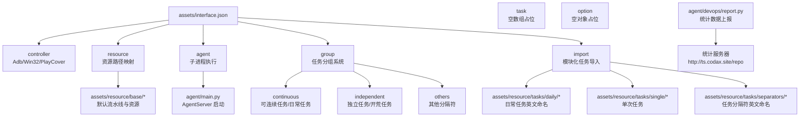
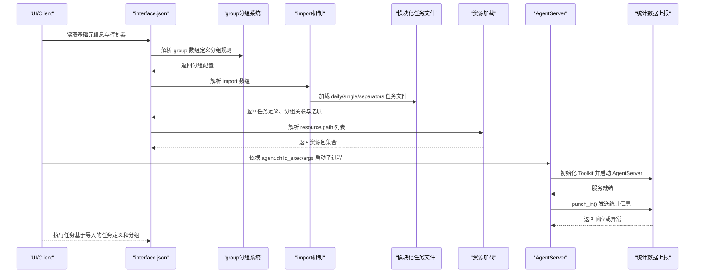
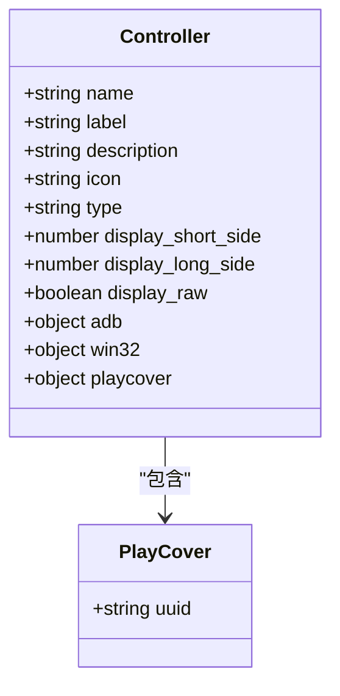
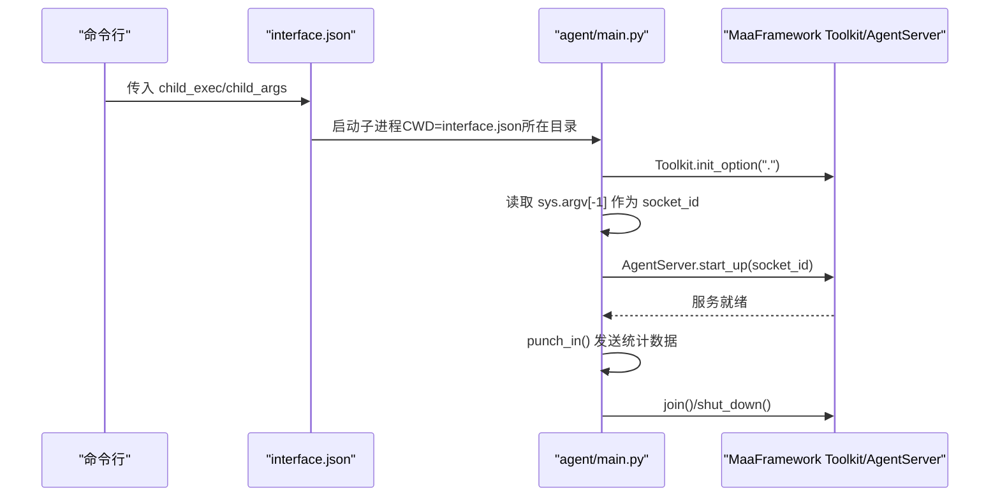
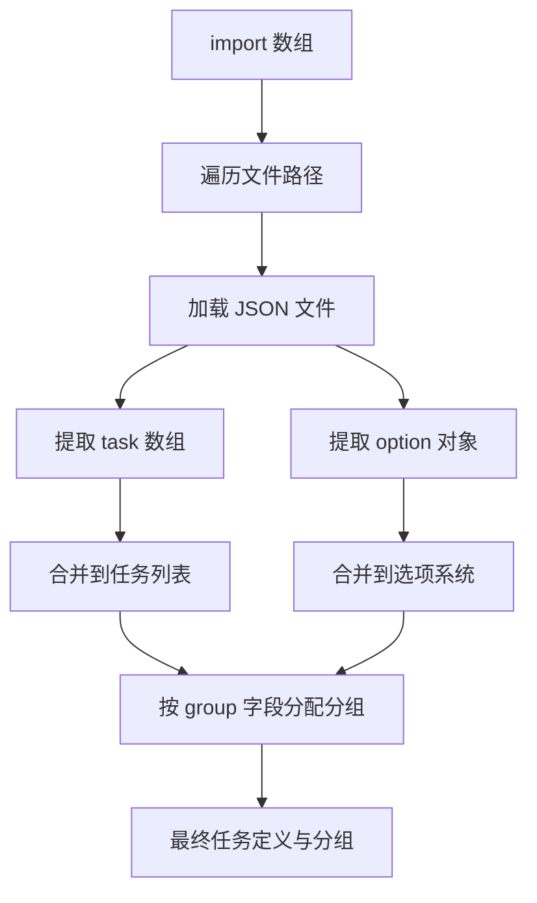
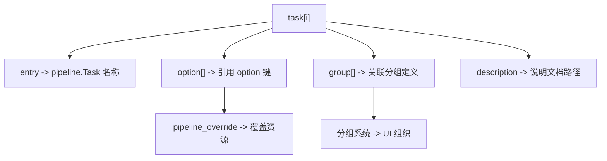
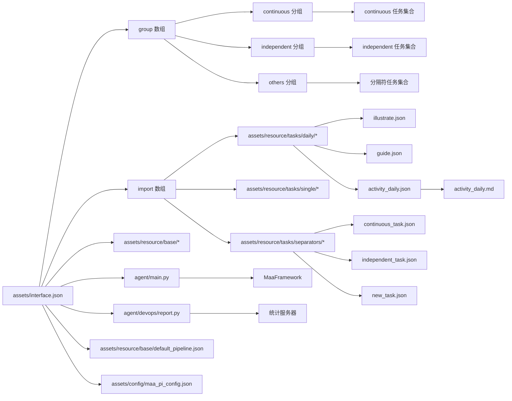

# 界面接口配置

<cite>
**本文引用的文件**
- [assets/interface.json](file://assets/interface.json)
- [assets/resource/tasks/daily/illustrate.json](file://assets/resource/tasks/daily/illustrate.json)
- [assets/resource/tasks/daily/guide.json](file://assets/resource/tasks/daily/guide.json)
- [assets/resource/tasks/separators/continuous_task.json](file://assets/resource/tasks/separators/continuous_task.json)
- [assets/resource/tasks/separators/independent_task.json](file://assets/resource/tasks/separators/independent_task.json)
- [assets/resource/tasks/separators/new_task.json](file://assets/resource/tasks/separators/new_task.json)
- [assets/resource/tasks/single/quick_plot.json](file://assets/resource/tasks/single/quick_plot.json)
- [assets/resource/tasks/single/continuous_battle.json](file://assets/resource/tasks/single/continuous_battle.json)
- [assets/resource/descs/others/illustrate.md](file://assets/resource/descs/others/illustrate.md)
- [assets/resource/descs/others/guide.md](file://assets/resource/descs/others/guide.md)
- [assets/resource/descs/others/continuous_task.md](file://assets/resource/descs/others/continuous_task.md)
- [assets/resource/descs/others/independent_task.md](file://assets/resource/descs/others/independent_task.md)
- [assets/resource/descs/others/new_task.md](file://assets/resource/descs/others/new_task.md)
- [agent/main.py](file://agent/main.py)
- [agent/devops/report.py](file://agent/devops/report.py)
- [assets/config/maa_pi_config.json](file://assets/config/maa_pi_config.json)
- [assets/resource/base/default_pipeline.json](file://assets/resource/base/default_pipeline.json)
- [assets/resource/tasks/daily/activity_daily.json](file://assets/resource/tasks/daily/activity_daily.json)
- [assets/resource/descs/daily/activity_daily.md](file://assets/resource/descs/daily/activity_daily.md)
</cite>

## 更新摘要
**所做更改**
- 更新界面标题显示的游戏版本：从 '再次绽放的蓝玫瑰' 更新为 '电子羊的永恒之梦'
- 保持版本号 v0.2.1 不变，统计数据上报模块也相应更新
- 更新相关任务文件和说明文档中的游戏版本标识
- 保持原有功能的完整性，仅进行游戏版本标识的更新

## 目录
1. [简介](#简介)
2. [项目结构](#项目结构)
3. [核心组件](#核心组件)
4. [架构总览](#架构总览)
5. [详细组件分析](#详细组件分析)
6. [任务分组系统](#任务分组系统)
7. [模块化任务组织系统](#模块化任务组织系统)
8. [import机制详解](#import机制详解)
9. [依赖关系分析](#依赖关系分析)
10. [性能考量](#性能考量)
11. [故障排查指南](#故障排查指南)
12. [结论](#结论)
13. [附录](#附录)

## 简介
本文件面向使用者与集成者，系统性解析 MaaDuDuL 项目的界面接口配置文件 interface.json 的完整结构设计与使用方法。重点涵盖：
- 基础字段（interface_version、name、title 等）的用途与约束
- controller 数组中 Adb 与 PlayCover 控制器的配置参数（如 display_short_side、playcover.uuid）及其对设备连接的影响
- resource 资源配置的路径映射机制
- agent 子进程执行配置（child_exec、child_args）的启动逻辑
- **新增** 任务分组系统：通过 group 数组定义任务分组规则，支持 continuous、independent、others 三类分组
- **新增** 模块化任务组织系统：通过import机制替代原有内联任务定义，支持分组关联的任务导入
- **新增** 英文命名的任务配置文件：illustrate.json、guide.json 等
- **新增** 按功能分类的任务文件结构：daily、single、separators等类别
- **新增** 每日采购任务的复杂选项配置：支持多种采购模式和子选项
- **新增** 采购模式选项配置：支持"逐个购买"和"一键购买"两种模式
- **更新** 游戏版本标识：从 '再次绽放的蓝玫瑰' 更新为 '电子羊的永恒之梦'
- 提供实际配置示例与常见错误修正方案

## 项目结构
interface.json 位于 assets 目录下，是 MaaFramework 标准化的 ProjectInterface 声明文件，配合模块化的任务文件、资源、Agent 子进程和统计数据上报模块共同构成完整的自动化执行体系。


```mermaid
graph TB
A["assets/interface.json"] --> B["controller<br/>Adb/Win32/PlayCover"]
A --> C["resource<br/>资源路径映射"]
A --> D["agent<br/>子进程执行"]
A --> E["group<br/>任务分组系统"]
A --> F["import<br/>模块化任务导入"]
E --> G["continuous<br/>可连续任务/日常任务"]
E --> H["independent<br/>独立任务/开荒任务"]
E --> I["others<br/>其他分隔符"]
F --> J["assets/resource/tasks/daily/*<br/>日常任务英文命名"]
F --> K["assets/resource/tasks/single/*<br/>单次任务"]
F --> L["assets/resource/tasks/separators/*<br/>任务分隔符英文命名"]
M["task<br/>空数组占位"]
N["option<br/>空对象占位"]
O["agent/devops/report.py<br/>统计数据上报"]
C --> P["assets/resource/base/*<br/>默认流水线与资源"]
D --> Q["agent/main.py<br/>AgentServer 启动"]
O --> R["统计服务器<br/>http://ts.codax.site/repo"]
```

**图表来源**
- [assets/interface.json:14-85](file://assets/interface.json#L14-L85)
- [agent/main.py:1-78](file://agent/main.py#L1-L78)

**章节来源**
- [assets/interface.json:1-86](file://assets/interface.json#L1-L86)
- [dev/build_mfaa.py:1-118](file://dev/build_mfaa.py#L1-L118)

## 核心组件
- 基础元信息：interface_version、name、title、icon、version、contact、license、welcome、description、github、mirrorchyan_rid、mirrorchyan_multiplatform
- 控制器配置：controller 数组，支持 Adb、Win32、PlayCover，关键参数包括 display_short_side、display_long_side、display_raw、playcover.uuid
- 资源配置：resource 数组，path 为资源加载路径列表，支持按控制器过滤与全局 option 注入
- Agent 子进程：agent.child_exec、agent.child_args，用于启动 AgentServer
- **新增** 任务分组系统：group 数组，定义 continuous、independent、others 三类任务分组规则
- **新增** 模块化任务系统：import 数组，通过文件路径导入任务定义，并支持分组关联
- **新增** 任务分类结构：daily（日常任务）、single（单次任务）、separators（分隔符）
- **新增** 英文命名的任务文件：illustrate.json、guide.json、continuous_task.json 等
- **新增** 复杂选项系统：支持 switch、select 等多种选项类型，嵌套配置复杂的任务流程
- **新增** 数据统计上报：devops.report.punch_in() 函数，向远程服务器发送使用统计信息
- **新增** 包管理器配置：assets/config/maa_pi_config.json，定义资源包选择
- **新增** 采购模式选项：每日采购-日常商店-采购模式，支持"逐个购买"和"一键购买"两种模式
- **更新** 游戏版本标识：界面标题和相关任务文件中的游戏版本从 '再次绽放的蓝玫瑰' 更新为 '电子羊的永恒之梦'

**章节来源**
- [assets/interface.json:1-86](file://assets/interface.json#L1-L86)
- [assets/resource/tasks/daily/illustrate.json:1-13](file://assets/resource/tasks/daily/illustrate.json#L1-L13)
- [assets/resource/tasks/daily/guide.json:1-13](file://assets/resource/tasks/daily/guide.json#L1-L13)
- [agent/main.py:1-78](file://agent/main.py#L1-L78)
- [assets/config/maa_pi_config.json:1-3](file://assets/config/maa_pi_config.json#L1-L3)

## 架构总览
interface.json 作为统一的项目声明，通过任务分组系统和 import 机制驱动 UI 展示、资源加载、任务编排、Agent 服务启动和统计数据上报。其与模块化任务文件、资源、说明文档、Agent 和统计模块的交互如下：


```mermaid
sequenceDiagram
participant UI as "UI/Client"
participant IF as "interface.json"
participant Group as "group分组系统"
participant Import as "import机制"
participant Tasks as "模块化任务文件"
participant Res as "资源加载"
participant Agent as "AgentServer"
participant DevOps as "统计数据上报"
UI->>IF : 读取基础元信息与控制器
IF->>Group : 解析 group 数组定义分组规则
Group-->>IF : 返回分组配置
IF->>Import : 解析 import 数组
Import->>Tasks : 加载 daily/single/separators 任务文件
Tasks-->>IF : 返回任务定义、分组关联与选项
IF->>Res : 解析 resource.path 列表
Res-->>IF : 返回资源包集合
UI->>Agent : 依据 agent.child_exec/args 启动子进程
Agent->>DevOps : 初始化 Toolkit 并启动 AgentServer
DevOps-->>Agent : 服务就绪
Agent->>DevOps : punch_in() 发送统计信息
DevOps-->>Agent : 返回响应或异常
UI-->>IF : 执行任务基于导入的任务定义和分组
```

**图表来源**
- [assets/interface.json:39-85](file://assets/interface.json#L39-L85)
- [assets/resource/tasks/daily/illustrate.json:1-13](file://assets/resource/tasks/daily/illustrate.json#L1-L13)
- [agent/main.py:1-78](file://agent/main.py#L1-L78)
- [agent/devops/report.py:1-34](file://agent/devops/report.py#L1-L34)

## 详细组件分析

### 基础字段与分发字段
- interface_version：固定为 2，标识 ProjectInterface V2 协议版本
- name：项目唯一标识符，用作项目ID
- title：窗口标题，显示格式为 "MDDL 嘟嘟脸小助手(kqcoxn/MaaDuDuL) v0.2.1 - MFAA | 游戏版本：电子羊的永恒之梦"
- icon：应用图标文件路径（相对项目根目录），可选
- version：项目版本号，用于 UI 展示与版本更新检查，当前为 v0.2.1
- contact、license、welcome、description：关于页信息，支持文件路径、URL 或直接文本，内容支持 Markdown
- github：项目 GitHub 仓库地址，用于版本更新检查与问题反馈
- mirrorchyan_rid：MirrorChyan 资源包标识符，用于资源管理与分发
- mirrorchyan_multiplatform：是否支持多平台，影响资源包打包与分发策略

**更新** 游戏版本标识已从 '再次绽放的蓝玫瑰' 更新为 '电子羊的永恒之梦'，版本号保持 v0.2.1 不变，统计数据上报模块也相应更新

**章节来源**
- [assets/interface.json:1-13](file://assets/interface.json#L1-L13)
- [agent/devops/report.py:23-25](file://agent/devops/report.py#L23-L25)

### 控制器配置（controller）
- 数组元素包含 name、label、description、icon、type、display_short_side、display_long_side、display_raw、adb、win32、playcover 等字段
- Adb：V2 协议中 input/screencap 由 MaaFramework 自动检测与选择最优方式，无需手动配置
- Win32：可配置 class_regex、window_regex、mouse、keyboard、screencap 等
- PlayCover（macOS）：playcover.uuid 为目标应用 Bundle Identifier，用于 PlayTools 协议连接；控制器特性标志为使用 touch_down + touch_up 替代 click


```mermaid
classDiagram
class Controller {
+string name
+string label
+string description
+string icon
+string type
+number display_short_side
+number display_long_side
+boolean display_raw
+object adb
+object win32
+object playcover
}
class PlayCover {
+string uuid
}
Controller --> PlayCover : "包含"
```

**图表来源**
- [assets/interface.json:14-28](file://assets/interface.json#L14-L28)

**章节来源**
- [assets/interface.json:14-28](file://assets/interface.json#L14-L28)

### 资源配置（resource）
- name：资源包唯一标识符，用作资源包ID
- label/description/icon：UI 展示与描述，支持国际化
- path：资源加载路径数组，相对 interface.json 所在目录；多个路径按顺序加载，后加载覆盖前加载
- controller：可选，限定该资源包支持的控制器类型列表
- option：可选，全局选项键列表，注入到所有任务的 pipeline_override


```mermaid
flowchart TD
Start(["加载资源"]) --> Resolve["解析 resource[].path 列表"]
Resolve --> LoadOrder{"按顺序加载？"}
LoadOrder --> |是| Merge["合并资源后加载覆盖前加载"]
LoadOrder --> |否| End(["完成"])
Merge --> End
```

**图表来源**
- [assets/interface.json:29-34](file://assets/interface.json#L29-L34)

**章节来源**
- [assets/interface.json:29-34](file://assets/interface.json#L29-L34)

### Agent 子进程执行（agent）
- child_exec：子进程可执行文件路径（系统路径），CWD 为 interface.json 所在目录
- child_args：子进程参数数组（可选）
- identifier：可选，连接标识符，用于创建通信套接字

Agent 启动流程要点：
- agent/main.py 通过 Toolkit.init_option 初始化选项
- 从命令行最后一个参数获取 socket_id
- 启动 AgentServer.start_up(socket_id)，执行 devops punch_in
- join() 等待服务结束，随后 shut_down()


```mermaid
sequenceDiagram
participant CLI as "命令行"
participant IF as "interface.json"
participant Py as "agent/main.py"
participant FW as "MaaFramework Toolkit/AgentServer"
CLI->>IF : 传入 child_exec/child_args
IF->>Py : 启动子进程CWD=interface.json所在目录
Py->>FW : Toolkit.init_option(".")
Py->>Py : 读取 sys.argv[-1] 作为 socket_id
Py->>FW : AgentServer.start_up(socket_id)
FW-->>Py : 服务就绪
Py->>Py : punch_in() 发送统计数据
Py->>FW : join()/shut_down()
```

**图表来源**
- [assets/interface.json:35-38](file://assets/interface.json#L35-L38)
- [agent/main.py:1-78](file://agent/main.py#L1-L78)

**章节来源**
- [assets/interface.json:35-38](file://assets/interface.json#L35-L38)
- [agent/main.py:1-78](file://agent/main.py#L1-L78)

## 任务分组系统

### 分组规则定义
系统通过 group 数组定义三类任务分组规则：

- **continuous 分组**：可连续任务/日常任务
  - name：continuous
  - label：可连续任务/日常任务
  - description：在完成当前任务后，可以连续执行下一个任务
  - default_expand：true，初始状态下展开显示
- **independent 分组**：独立任务/开荒任务
  - name：independent
  - label：独立任务/开荒任务
  - description：无法与其他任务自动串联执行
  - default_expand：true，初始状态下展开显示
- **others 分组**：其他分隔符
  - name：others
  - label：其他
  - description：分割线等，一般无需添加
  - default_expand：true，初始状态下展开显示

### 分组关联机制
每个任务文件通过 group 字段关联到相应的分组：

```json
{
  "task": [
    {
      "name": "说明",
      "label": "📜说明",
      "entry": "说明",
      "description": "Resource/descs/others/illustrate.md",
      "group": ["continuous"]
    }
  ],
  "option": {}
}
```

### 分组显示效果
- UI 展示时按分组组织任务列表
- 每个分组显示对应的分隔符和任务项
- 用户可以折叠/展开各个分组查看任务
- 支持任务在不同分组间的移动和重新组织

**章节来源**
- [assets/interface.json:39-58](file://assets/interface.json#L39-L58)
- [assets/resource/tasks/daily/illustrate.json:8](file://assets/resource/tasks/daily/illustrate.json#L8)
- [assets/resource/tasks/daily/guide.json:8](file://assets/resource/tasks/daily/guide.json#L8)
- [assets/resource/tasks/separators/continuous_task.json:8](file://assets/resource/tasks/separators/continuous_task.json#L8)

## 模块化任务组织系统

### 任务文件分类结构
系统采用模块化设计，将不同类型的任务分离到独立的JSON文件中：

- **daily 目录**：日常重复性任务
  - illustrate（说明）、guide（操作指南）、start_game（启动游戏）、claim_mail（领取邮件）、leaf_change（叶子互换）、claim_candy（领取糖果）、purchase（每日采购）等
  - 支持周期性检查和复杂选项配置
- **single 目录**：单次执行任务
  - quick_plot（快速剧情）、continuous_battle（连续作战）、level_rewards（领取关卡奖励）等
- **separators 目录**：任务分隔符
  - continuous_task（可连续任务分隔符）、independent_task（独立任务分隔符）、new_task（新增任务分隔符）
- **说明与指南**：独立的任务说明和操作指南（英文命名）

### 任务文件结构模式
每个任务文件都遵循相同的结构模式：

```json
{
  "task": [
    {
      "name": "任务名称",
      "label": "显示标签",
      "entry": "pipeline入口节点",
      "default_check": true/false,
      "description": "说明文档路径",
      "option": ["选项键1", "选项键2"],
      "group": ["分组名称"]
    }
  ],
  "option": {
    "选项键": {
      "type": "switch/select",
      "label": "选项标签",
      "cases": [
        {
          "name": "Yes/No/具体值",
          "option": ["嵌套选项"],
          "pipeline_override": {"节点名": {"next/action": "值"}}
        }
      ]
    }
  }
}
```

**章节来源**
- [assets/resource/tasks/daily/illustrate.json:1-13](file://assets/resource/tasks/daily/illustrate.json#L1-L13)
- [assets/resource/tasks/daily/guide.json:1-13](file://assets/resource/tasks/daily/guide.json#L1-L13)
- [assets/resource/tasks/separators/continuous_task.json:1-13](file://assets/resource/tasks/separators/continuous_task.json#L1-L13)
- [assets/resource/tasks/separators/independent_task.json:1-13](file://assets/resource/tasks/separators/independent_task.json#L1-L13)
- [assets/resource/tasks/separators/new_task.json:1-13](file://assets/resource/tasks/separators/new_task.json#L1-L13)

## import机制详解

### import 数组的工作原理
import 数组替代了原有的内联任务定义，通过文件路径动态加载任务配置：

```json
"import": [
  "resource/tasks/daily/illustrate.json",
  "resource/tasks/daily/guide.json",
  "resource/tasks/separators/continuous_task.json",
  "resource/tasks/daily/start_game.json",
  "resource/tasks/daily/claim_mail.json",
  "resource/tasks/daily/leaf_change.json",
  "resource/tasks/daily/claim_candy.json",
  "resource/tasks/daily/purchase.json",
  "resource/tasks/daily/saint_tour.json",
  "resource/tasks/daily/activity_daily.json",
  "resource/tasks/daily/clear_purple_candy.json",
  "resource/tasks/daily/clear_red_candy.json",
  "resource/tasks/daily/peak_battle.json",
  "resource/tasks/daily/farm.json",
  "resource/tasks/daily/claim_reward.json",
  "resource/tasks/daily/claim_new_goods.json",
  "resource/tasks/daily/close_game.json",
  "resource/tasks/separators/independent_task.json",
  "resource/tasks/single/quick_plot.json",
  "resource/tasks/single/continuous_battle.json",
  "resource/tasks/single/level_rewards.json",
  "resource/tasks/separators/new_task.json"
]
```

### 导入机制的优势
- **模块化管理**：按功能分类的任务文件便于维护和扩展
- **独立开发**：不同任务可以独立开发和测试
- **版本控制**：单个任务的修改不会影响其他任务
- **性能优化**：只加载需要的任务文件，减少内存占用
- **可扩展性**：新增任务只需添加新的JSON文件和import路径
- **国际化支持**：英文命名的任务文件符合国际化的标准
- **分组关联**：任务文件通过 group 字段与分组系统关联

### 任务合并过程
1. 系统读取 import 数组中的所有文件路径
2. 逐个加载每个任务文件
3. 提取每个文件中的 task 数组和 option 对象
4. 合并所有任务定义到最终的任务列表中
5. 合并所有选项定义到最终的选项系统中
6. 根据任务的 group 字段将其分配到对应的分组中


```mermaid
flowchart TD
A["import 数组"] --> B["遍历文件路径"]
B --> C["加载 JSON 文件"]
C --> D["提取 task 数组"]
C --> E["提取 option 对象"]
D --> F["合并到任务列表"]
E --> G["合并到选项系统"]
F --> H["按 group 字段分配分组"]
G --> H
H --> I["最终任务定义与分组"]
```

**图表来源**
- [assets/interface.json:59-82](file://assets/interface.json#L59-L82)

**章节来源**
- [assets/interface.json:59-82](file://assets/interface.json#L59-L82)

## 详细组件分析

### 任务与选项（task 与 option）
- task：每个任务包含 name、label、entry、default_check、description、icon、resource、pipeline_override、option、group
- entry：指向 pipeline 中 Task 的名称，作为任务执行入口
- option：引用外层 option 定义中的键，形成可配置的 pipeline_override
- description：任务说明文档路径（相对 interface.json 所在目录）
- group：任务所属的分组名称数组，关联到 group 数组中的分组定义


```mermaid
flowchart TD
T["task[i]"] --> E["entry -> pipeline.Task 名称"]
T --> Opts["option[] -> 引用 option 键"]
T --> Grp["group[] -> 关联分组定义"]
Opts --> P["pipeline_override -> 覆盖资源"]
T --> D["description -> 说明文档路径"]
Grp --> G["分组系统 -> UI 组织"]
```

**图表来源**
- [assets/resource/tasks/daily/illustrate.json:1-13](file://assets/resource/tasks/daily/illustrate.json#L1-L13)

**章节来源**
- [assets/resource/tasks/daily/illustrate.json:1-13](file://assets/resource/tasks/daily/illustrate.json#L1-L13)

### 说明文档路径与任务描述
- description 字段支持文件路径、URL 或直接文本，内容支持 Markdown
- 示例：任务"illustrate"、"guide"等的说明文档路径分别为 Resource/descs/others/illustrate.md、Resource/descs/others/guide.md

**章节来源**
- [assets/resource/tasks/daily/illustrate.json:7](file://assets/resource/tasks/daily/illustrate.json#L7)
- [assets/resource/tasks/daily/guide.json:7](file://assets/resource/tasks/daily/guide.json#L7)
- [assets/resource/tasks/separators/continuous_task.json:7](file://assets/resource/tasks/separators/continuous_task.json#L7)
- [assets/resource/tasks/separators/independent_task.json:7](file://assets/resource/tasks/separators/independent_task.json#L7)
- [assets/resource/tasks/separators/new_task.json:7](file://assets/resource/tasks/separators/new_task.json#L7)

### **新增** 英文命名的任务配置文件
- **illustrate.json**：说明任务，entry 指向 "说明" 节点，描述文档为 Resource/descs/others/illustrate.md，分组为 continuous
- **guide.json**：操作指南任务，entry 指向 "指南" 节点，描述文档为 Resource/descs/others/guide.md，分组为 continuous
- **continuous_task.json**：可连续任务分隔符，entry 指向 "可连续任务分隔符" 节点，分组为 others
- **independent_task.json**：独立任务分隔符，entry 指向 "独立任务分隔符" 节点，分组为 others
- **new_task.json**：新增任务分隔符，entry 指向 "新增任务分隔符" 节点，分组为 others

**更新** 所有任务配置文件已从中文命名标准化为英文命名，提升了国际化程度

**章节来源**
- [assets/resource/tasks/daily/illustrate.json:1-13](file://assets/resource/tasks/daily/illustrate.json#L1-L13)
- [assets/resource/tasks/daily/guide.json:1-13](file://assets/resource/tasks/daily/guide.json#L1-L13)
- [assets/resource/tasks/separators/continuous_task.json:1-13](file://assets/resource/tasks/separators/continuous_task.json#L1-L13)
- [assets/resource/tasks/separators/independent_task.json:1-13](file://assets/resource/tasks/separators/independent_task.json#L1-L13)
- [assets/resource/tasks/separators/new_task.json:1-13](file://assets/resource/tasks/separators/new_task.json#L1-L13)

### **新增** 数据统计上报模块
- punch_in() 函数负责向远程服务器发送使用统计信息
- 请求地址：http://ts.codax.site/repo
- 发送数据：{"from": "mddl", "version": "v0.2.1"}
- 超时设置：3秒，失败时不中断程序执行
- 调用时机：Agent 启动后立即执行

**更新** 版本号已从 v0.2.0 更新为 v0.2.1

**章节来源**
- [agent/devops/report.py:1-34](file://agent/devops/report.py#L1-L34)
- [agent/main.py:64-64](file://agent/main.py#L64-L64)

### **新增** 包管理器配置
- maa_pi_config.json 定义资源包选择
- 默认资源包："B服"
- 影响范围：资源包加载与版本管理

**章节来源**
- [assets/config/maa_pi_config.json:1-3](file://assets/config/maa_pi_config.json#L1-L3)

### **更新** 游戏版本标识系统
- **界面标题更新**：interface.json 中的 title 字段已从 '再次绽放的蓝玫瑰' 更新为 '电子羊的永恒之梦'
- **任务文件更新**：相关任务文件中的标签和说明文档已更新为新的游戏版本标识
- **版本兼容性**：保持 v0.2.1 版本号不变，确保框架兼容性
- **文档同步**：说明文档和任务描述中的游戏版本标识已同步更新

**更新** 游戏版本标识系统已完成更新，从 '再次绽放的蓝玫瑰' 迁移到 '电子羊的永恒之梦'

**章节来源**
- [assets/interface.json:4](file://assets/interface.json#L4)
- [assets/resource/tasks/daily/activity_daily.json:5](file://assets/resource/tasks/daily/activity_daily.json#L5)
- [assets/resource/descs/daily/activity_daily.md:1](file://assets/resource/descs/daily/activity_daily.md#L1)

## 依赖关系分析
- interface.json 依赖模块化的任务文件（assets/resource/tasks/...）与说明文档（descs/*）
- Agent 依赖 agent/main.py 与 MaaFramework Toolkit/AgentServer
- 任务执行依赖 pipeline 资源（见 default_pipeline.json）
- **新增** group 数组依赖任务文件的 group 字段关联
- **新增** import 机制依赖文件系统和 JSON 解析
- **新增** 模块化任务系统依赖任务文件的正确结构和路径
- **新增** 英文命名的任务文件符合国际化标准
- **新增** 复杂选项系统依赖嵌套的 pipeline_override 配置
- **新增** 统计数据上报依赖 requests 库和远程服务器
- **新增** 包管理器配置简化资源包选择流程
- **更新** 游戏版本标识系统确保所有相关组件的一致性
- **更新** 任务文件与说明文档的版本标识同步更新


```mermaid
graph LR
IF["assets/interface.json"] --> GROUP["group 数组"]
IF --> IMPORT["import 数组"]
GROUP --> CONT["continuous 分组"]
GROUP --> INDEP["independent 分组"]
GROUP --> OTHERS["others 分组"]
IMPORT --> DAILY["assets/resource/tasks/daily/*"]
IMPORT --> SINGLE["assets/resource/tasks/single/*"]
IMPORT --> SEPARATORS["assets/resource/tasks/separators/*"]
IF --> RES["assets/resource/base/*"]
IF --> AG["agent/main.py"]
IF --> DEVOPS["agent/devops/report.py"]
AG --> FW["MaaFramework"]
DEVOPS --> SERVER["统计服务器"]
IF --> PIPE["assets/resource/base/default_pipeline.json"]
IF --> CFG["assets/config/maa_pi_config.json"]
DAILY --> ILLUSTRATE["illustrate.json"]
DAILY --> GUIDE["guide.json"]
DAILY --> ACTIVITY["activity_daily.json"]
SEPARATORS --> CONTINUOUS["continuous_task.json"]
SEPARATORS --> INDEPENDENT["independent_task.json"]
SEPARATORS --> NEW["new_task.json"]
CONT --> TASKS1["continuous 任务集合"]
INDEP --> TASKS2["independent 任务集合"]
OTHERS --> TASKS3["分隔符任务集合"]
ACTIVITY --> ACTIVITY_DESC["activity_daily.md"]
```

**图表来源**
- [assets/interface.json:39-85](file://assets/interface.json#L39-L85)
- [agent/main.py:1-78](file://agent/main.py#L1-L78)
- [agent/devops/report.py:1-34](file://agent/devops/report.py#L1-L34)
- [assets/resource/base/default_pipeline.json:1-7](file://assets/resource/base/default_pipeline.json#L1-L7)
- [assets/config/maa_pi_config.json:1-3](file://assets/config/maa_pi_config.json#L1-L3)

**章节来源**
- [assets/interface.json:39-85](file://assets/interface.json#L39-L85)
- [agent/main.py:1-78](file://agent/main.py#L1-L78)
- [agent/devops/report.py:1-34](file://agent/devops/report.py#L1-L34)
- [assets/resource/base/default_pipeline.json:1-7](file://assets/resource/base/default_pipeline.json#L1-L7)
- [assets/config/maa_pi_config.json:1-3](file://assets/config/maa_pi_config.json#L1-L3)

## 性能考量
- Adb 控制器的 input/screencap 由 MaaFramework 自动检测与选择最优方式，减少手动配置成本
- PlayCover 控制器使用 touch_down + touch_up 替代 click，提升触控稳定性
- 资源加载采用顺序合并策略，后加载覆盖前加载，便于按需扩展与覆盖
- **新增** group 数组采用轻量级配置，不增加额外的运行时开销
- **新增** import 机制采用延迟加载，只在需要时解析任务文件
- **新增** 模块化任务系统支持增量更新，避免重新加载整个配置
- **新增** 英文命名的任务文件符合国际化标准，便于全球用户理解和使用
- **新增** 分组系统通过 group 字段关联，不增加额外的数据传输开销
- **新增** 复杂选项系统采用按需计算的 pipeline_override，减少不必要的处理
- **新增** 统计数据上报采用异步请求（超时3秒），不影响主程序执行
- **新增** 包管理器配置简化资源包选择流程
- **新增** 采购模式选项优化了日常商店的购买效率，一键购买模式可显著减少操作步骤
- **更新** 游戏版本标识系统采用统一的版本管理，确保所有组件的一致性

**章节来源**
- [assets/interface.json:59-85](file://assets/interface.json#L59-L85)
- [agent/devops/report.py:27-27](file://agent/devops/report.py#L27-L27)

## 故障排查指南
- 控制器连接失败
  - 检查 Adb/Win32/PlayCover 的 type 与参数配置是否正确
  - PlayCover：确认 uuid 与 PlayTools 服务地址匹配，且目标应用已在 PlayCover 中启用 MaaTools
- 资源加载异常
  - 确认 resource.path 的相对路径正确，且资源目录包含 pipeline、image、model 等必要文件
  - 如需按控制器过滤，确保 controller.name 与 resource.controller[] 匹配
- Agent 启动失败
  - 检查 child_exec 是否为系统可执行文件路径，child_args 是否正确传递
  - 确认 CWD 为 interface.json 所在目录，且 agent/main.py 可正常导入依赖
- **新增** 任务分组系统故障
  - 检查 group 数组中的分组定义是否正确
  - 确认分组名称与任务文件中的 group 字段值匹配
  - 验证分组的 default_expand 设置是否符合预期
- **新增** import 机制故障
  - 检查 import 数组中的文件路径是否正确
  - 确认被导入的任务文件格式正确，包含有效的 task 和 option 结构
  - 验证任务文件的 JSON 语法，确保无语法错误
  - 确认任务文件使用英文命名（如 illustrate.json 而非 说明.json）
  - 检查任务文件中的 group 字段是否引用了存在的分组名称
- **新增** 模块化任务系统故障
  - 检查任务文件是否位于正确的目录结构中
  - 确认任务文件的命名规范，避免特殊字符和空格
  - 验证任务文件中的 entry 节点是否与对应的 pipeline 节点匹配
  - 确认英文命名的任务文件路径与 import 数组中的路径一致
  - 检查任务文件中的 group 字段是否正确关联到分组系统
- **新增** 英文命名任务文件故障
  - 检查任务文件是否为正确的英文命名（如 illustrate.json、guide.json）
  - 确认文件路径大小写与 import 数组中的路径完全一致
  - 验证任务文件内容结构符合标准格式
- **新增** 复杂选项系统故障
  - 检查选项定义的语法结构，确保 type、label、cases 等字段完整
  - 确认 pipeline_override 的语法正确，节点名称与实际 pipeline 节点一致
  - 验证嵌套选项的引用关系，避免循环引用
- **新增** 数据统计上报失败
  - 检查网络连接是否正常
  - 确认统计服务器地址 http://ts.codax.site/repo 可访问
  - 查看请求超时设置（3秒）是否过短
- **新增** 包管理器配置错误
  - 检查 maa_pi_config.json 中的资源包名称是否正确
  - 确认对应资源包目录存在且包含必要文件
- **更新** 游戏版本标识故障
  - 检查 interface.json 中的 title 字段是否正确更新为 '电子羊的永恒之梦'
  - 确认相关任务文件和说明文档中的版本标识是否同步更新
  - 验证版本号保持 v0.2.1 不变，确保框架兼容性

**章节来源**
- [assets/interface.json:14-38](file://assets/interface.json#L14-L38)
- [assets/interface.json:39-85](file://assets/interface.json#L39-L85)
- [agent/main.py:1-78](file://agent/main.py#L1-L78)
- [agent/devops/report.py:21-33](file://agent/devops/report.py#L21-L33)
- [assets/config/maa_pi_config.json:1-3](file://assets/config/maa_pi_config.json#L1-L3)

## 结论
interface.json 通过标准化的字段与结构，将控制器、资源、任务、选项、Agent 子进程和统计数据上报模块有机整合，形成可配置、可扩展、可维护的自动化执行体系。随着 v0.2.1 版本的重大更新，系统完成了从单个interface.json到模块化JSON任务组织系统的迁移，通过import机制实现了任务文件的模块化管理。新增的任务分组系统进一步提升了用户界面体验，支持按功能分类的任务组织和更好的用户体验。新增的复杂选项系统、详细的说明文档、数据统计上报、包管理器配置和采购模式选项进一步增强了系统的完整性和用户体验。

**重要更新**：本次更新实现了游戏版本标识的标准化更新，将界面标题和相关任务文件中的游戏版本从 '再次绽放的蓝玫瑰' 成功迁移到 '电子羊的永恒之梦'。这一更新保持了原有功能的完整性，同时确保了版本标识的一致性和准确性。版本号保持 v0.2.1 不变，确保了与 MaaFramework 框架的兼容性。新增的"每日采购-日常商店-采购模式"选择框提供了灵活的购买策略，支持"逐个购买"和"一键购买"两种模式，满足不同用户的操作习惯。**新增的** 任务分组系统通过 group 数组定义了 continuous、independent、others 三类分组，支持按功能分类的任务组织和更好的用户界面体验。遵循 V2 协议规范，合理配置控制器参数、资源路径、Agent 启动参数、统计上报配置、模块化任务系统、任务分组系统、采购模式选项和游戏版本标识，可有效提升任务执行的稳定性与可移植性。

## 附录

### 实际配置示例（路径引用）
- 控制器配置示例路径
  - [assets/interface.json:14-28](file://assets/interface.json#L14-L28)
- 资源配置示例路径
  - [assets/interface.json:29-34](file://assets/interface.json#L29-L34)
  - [assets/resource/base/default_pipeline.json:1-7](file://assets/resource/base/default_pipeline.json#L1-L7)
- Agent 启动配置示例路径
  - [assets/interface.json:35-38](file://assets/interface.json#L35-L38)
  - [agent/main.py:1-78](file://agent/main.py#L1-L78)
- **新增** 任务分组系统示例路径
  - [assets/interface.json:39-58](file://assets/interface.json#L39-L58)
- **新增** 模块化任务系统示例路径
  - [assets/interface.json:59-82](file://assets/interface.json#L59-L82)
  - [assets/resource/tasks/daily/illustrate.json:1-13](file://assets/resource/tasks/daily/illustrate.json#L1-L13)
  - [assets/resource/tasks/daily/guide.json:1-13](file://assets/resource/tasks/daily/guide.json#L1-L13)
  - [assets/resource/tasks/separators/continuous_task.json:1-13](file://assets/resource/tasks/separators/continuous_task.json#L1-L13)
- **新增** 英文命名任务文件示例路径
  - [assets/resource/tasks/daily/illustrate.json:1-13](file://assets/resource/tasks/daily/illustrate.json#L1-L13)
  - [assets/resource/tasks/daily/guide.json:1-13](file://assets/resource/tasks/daily/guide.json#L1-L13)
  - [assets/resource/tasks/separators/continuous_task.json:1-13](file://assets/resource/tasks/separators/continuous_task.json#L1-L13)
  - [assets/resource/tasks/separators/independent_task.json:1-13](file://assets/resource/tasks/separators/independent_task.json#L1-L13)
  - [assets/resource/tasks/separators/new_task.json:1-13](file://assets/resource/tasks/separators/new_task.json#L1-L13)
  - [assets/resource/tasks/single/quick_plot.json:1-13](file://assets/resource/tasks/single/quick_plot.json#L1-L13)
  - [assets/resource/tasks/single/continuous_battle.json:1-13](file://assets/resource/tasks/single/continuous_battle.json#L1-L13)
- **新增** 复杂选项系统示例路径
  - [assets/resource/tasks/daily/purchase.json](file://assets/resource/tasks/daily/purchase.json)
  - [assets/resource/tasks/daily/farm.json](file://assets/resource/tasks/daily/farm.json)
  - [assets/resource/tasks/daily/claim_mail.json](file://assets/resource/tasks/daily/claim_mail.json)
- **新增** 数据统计上报配置示例路径
  - [agent/devops/report.py:23-25](file://agent/devops/report.py#L23-L25)
  - [agent/main.py:64-64](file://agent/main.py#L64-L64)
- **更新** 游戏版本标识系统示例路径
  - [assets/interface.json:4](file://assets/interface.json#L4)
  - [assets/resource/tasks/daily/activity_daily.json:5](file://assets/resource/tasks/daily/activity_daily.json#L5)
  - [assets/resource/descs/daily/activity_daily.md:1](file://assets/resource/descs/daily/activity_daily.md#L1)
- 任务与说明文档示例路径
  - [assets/resource/tasks/daily/illustrate.json:1-13](file://assets/resource/tasks/daily/illustrate.json#L1-L13)
  - [assets/resource/tasks/daily/guide.json:1-13](file://assets/resource/tasks/daily/guide.json#L1-L13)
  - [assets/resource/tasks/separators/continuous_task.json:1-13](file://assets/resource/tasks/separators/continuous_task.json#L1-L13)
  - [assets/resource/tasks/separators/independent_task.json:1-13](file://assets/resource/tasks/separators/independent_task.json#L1-L13)
  - [assets/resource/tasks/separators/new_task.json:1-13](file://assets/resource/tasks/separators/new_task.json#L1-L13)
  - [assets/resource/descs/others/illustrate.md:1-200](file://assets/resource/descs/others/illustrate.md#L1-L200)
  - [assets/resource/descs/others/guide.md:1-36](file://assets/resource/descs/others/guide.md#L1-L36)
  - [assets/resource/descs/others/continuous_task.md:1-9](file://assets/resource/descs/others/continuous_task.md#L1-L9)
  - [assets/resource/descs/others/independent_task.md:1-15](file://assets/resource/descs/others/independent_task.md#L1-L15)
  - [assets/resource/descs/others/new_task.md:1-100](file://assets/resource/descs/others/new_task.md#L1-L100)