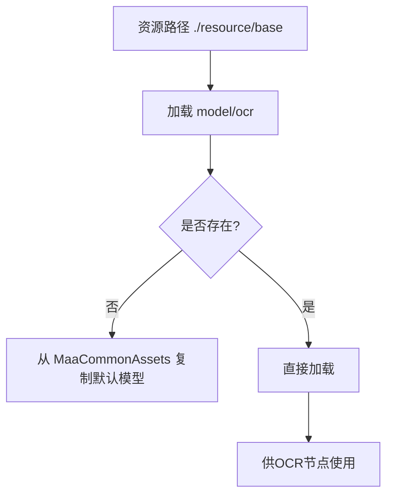
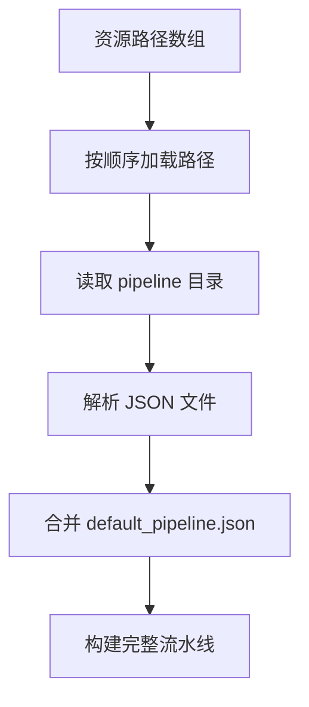

# 资源路径映射

<cite>
**本文档引用文件**  
- [maa_pi_config.json](file://assets/config/maa_pi_config.json)
- [interface.json](file://assets/interface.json)
- [default_pipeline.json](file://assets/resource/base/default_pipeline.json)
- [每日活动作战.json](file://assets/resource/base/pipeline/日常任务/每日活动作战.json)
- [README.md](file://assets/resource/base/model/ocr/README.md)
- [check_resource.py](file://check_resource.py)
- [configure.py](file://tools/configure.py)
- [3.1-任务流水线协议.md](file://instructions/maafw-guide/3.1-任务流水线协议.md)
- [2.2-集成接口一览.md](file://instructions/maafw-guide/2.2-集成接口一览.md)
- [2.3-回调协议.md](file://instructions/maafw-guide/2.3-回调协议.md)
- [1.1-快速开始.md](file://instructions/maafw-guide/1.1-快速开始.md)
- [MaaCommonAssets](file://assets/MaaCommonAssets)
</cite>

## 目录
1. [资源包名称在UI中的展示方式](#资源包名称在ui中的展示方式)
2. [多级资源加载机制与相对路径解析](#多级资源加载机制与相对路径解析)
3. [资源包切换与动态加载流程](#资源包切换与动态加载流程)
4. [路径不存在时的错误处理策略](#路径不存在时的错误处理策略)
5. [资源文件热更新检测机制](#资源文件热更新检测机制)
6. [OCR模型与任务流水线的路径配置影响](#ocr模型与任务流水线的路径配置影响)
7. [资源管理规范与最佳实践](#资源管理规范与最佳实践)

## 资源包名称在UI中的展示方式

在MaaDuDuL项目中，资源包名称通过`assets/interface.json`文件中的`resource`数组进行定义，并直接映射到用户界面（UI）中。每个资源包对象包含`name`和`path`两个关键属性，其中`name`字段的值将作为该资源包在UI中的显示名称。

例如，在`interface.json`中定义了名为"B服"的资源包：
```json
"resource": [
    {
        "name": "B服",
        "path": ["./resource/base"]
    }
]
```
该配置使得在UI的任务选择界面中，用户将看到名为"B服"的资源包选项。此名称直接来源于`name`字段，确保了资源包在界面上的可读性和用户友好性。

此外，`maa_pi_config.json`文件中的`resource`字段指定了当前激活的资源包名称，系统根据此配置加载对应的资源路径。这种设计实现了资源包名称与UI展示的直接绑定，使用户能够直观地选择和切换不同的资源配置。

**Section sources**
- [interface.json](file://assets/interface.json#L29-L34)
- [maa_pi_config.json](file://assets/config/maa_pi_config.json#L2)

## 多级资源加载机制与相对路径解析

MaaDuDuL项目采用多级资源加载机制，通过`interface.json`中的`resource.path`数组指定资源路径。路径数组支持多个路径条目，系统将按顺序加载这些路径中的资源，实现资源的分层管理和覆盖。

路径解析以项目根目录为基准，使用相对路径格式。例如，`"./resource/base"`表示从项目根目录开始的相对路径，指向`assets/resource/base`目录。该路径下包含了任务流水线、OCR模型等核心资源。

资源加载遵循以下规则：
1. **顺序加载**：路径数组中的路径按顺序被加载，后加载的资源可以覆盖先加载的同名资源。
2. **相对路径解析**：所有路径均以项目根目录为基准进行解析，确保跨平台兼容性。
3. **资源合并**：不同路径下的资源被合并到统一的资源池中，供任务执行时调用。

这种机制允许开发者将基础资源和定制资源分离，通过简单的路径配置实现资源的灵活组合和管理。

**Section sources**
- [interface.json](file://assets/interface.json#L29-L34)
- [3.1-任务流水线协议.md](file://instructions/maafw-guide/3.1-任务流水线协议.md#多-bundle-加载行为)

## 资源包切换与动态加载流程

资源包的切换和动态加载是通过MaaFramework的资源管理API实现的。当用户在UI中选择不同的资源包时，系统会根据`interface.json`中对应资源包的`path`数组，调用`MaaResourcePostPath`接口动态加载资源。

动态加载流程如下：
1. **资源创建**：调用`MaaResourceCreate`创建资源对象。
2. **路径注册**：对`resource.path`数组中的每个路径，调用`MaaResourcePostPath`进行注册。
3. **资源验证**：通过`check_resource.py`脚本验证资源目录的完整性。
4. **任务初始化**：加载完成后，资源中的任务流水线和模型文件可供任务执行器调用。

此流程确保了资源包的热切换能力，用户无需重启应用即可切换到不同的资源配置。同时，通过回调机制（`Resource.Loading.Succeeded`/`Failed`）可以监控加载状态，提供用户反馈。

**Section sources**
- [interface.json](file://assets/interface.json#L29-L34)
- [check_resource.py](file://check_resource.py#L10-L23)
- [2.2-集成接口一览.md](file://instructions/maafw-guide/2.2-集成接口一览.md#maaresourcepostbundle)
- [2.3-回调协议.md](file://instructions/maafw-guide/2.3-回调协议.md#资源加载消息)

## 路径不存在时的错误处理策略

当指定的资源路径不存在或资源加载失败时，系统采用多层次的错误处理策略以确保应用的稳定性和用户体验。

首先，`check_resource.py`脚本在启动时会验证所有指定目录的存在性和可读性。如果目录不存在，脚本将输出错误信息并终止执行，防止后续操作基于不完整的资源。

其次，在运行时加载过程中，MaaFramework通过回调机制报告加载状态：
- `Resource.Loading.Starting`：报告加载开始
- `Resource.Loading.Succeeded`：报告加载成功
- `Resource.Loading.Failed`：报告加载失败，包含路径和错误详情

对于关键资源如OCR模型，`tools/configure.py`脚本在启动时会检查`model/ocr`目录是否存在。如果不存在，脚本会自动从`MaaCommonAssets`子模块复制默认的中文OCR模型，确保核心功能的可用性。

这种预防性检查与运行时监控相结合的策略，有效降低了因资源缺失导致的运行时错误。

**Section sources**
- [check_resource.py](file://check_resource.py#L10-L23)
- [configure.py](file://tools/configure.py#L14-L22)
- [2.3-回调协议.md](file://instructions/maafw-guide/2.3-回调协议.md#资源加载消息)

## 资源文件热更新检测机制

MaaDuDuL项目通过文件系统监控和资源重载机制实现资源文件的热更新。虽然核心框架本身不直接提供文件变更监控，但通过合理的架构设计实现了准实时的资源更新能力。

热更新机制主要体现在：
1. **子模块管理**：`assets/MaaCommonAssets`作为Git子模块引入，通过`git submodule update --remote`可同步最新资源，包括OCR模型和通用资产。
2. **配置脚本**：`tools/configure.py`在每次安装或配置时检查并更新缺失的资源文件，确保本地资源与预期一致。
3. **动态加载**：通过`MaaResourcePostPath`接口重新加载资源路径，可以实现运行时资源更新，无需重启应用。

此外，`interface.json`中的资源路径配置允许开发者快速切换到包含更新资源的新路径，结合UI的资源包选择功能，用户可以手动触发资源重载，实现热更新效果。

**Section sources**
- [configure.py](file://tools/configure.py#L8-L28)
- [.gitmodules](file://.gitmodules#L1-L3)
- [2.2-集成接口一览.md](file://instructions/maafw-guide/2.2-集成接口一览.md#maaresourcepostbundle)

## OCR模型与任务流水线的路径配置影响

资源路径的配置对OCR模型和任务流水线的加载和行为有直接影响，遵循MaaFramework的资源管理规范。

### OCR模型路径配置

OCR模型位于`model/ocr`目录下，其路径配置影响模型的加载：
- **默认路径**：`model/ocr`根目录下的`det.onnx`、`rec.onnx`和`keys.txt`文件作为默认模型。
- **自定义路径**：在任务节点中可通过`model`字段指定子目录，如`"model": "zh_cn"`，实现多语言模型切换。
- **初始化**：`tools/configure.py`脚本确保`model/ocr`目录包含有效的中文模型，从`MaaCommonAssets/OCR/ppocr_v5/zh_cn`复制。



**Diagram sources**
- [configure.py](file://tools/configure.py#L14-L22)
- [README.md](file://instructions/maafw-guide/1.1-快速开始.md#文字识别模型文件)
- [model/ocr](file://assets/resource/base/model/ocr)

### 任务流水线路径配置

任务流水线文件存储在`pipeline`目录下，其结构和路径配置遵循以下规范：
- **目录结构**：支持多级目录组织，如`pipeline/日常任务/每日活动作战.json`。
- **默认配置**：`default_pipeline.json`提供全局默认参数，影响所有流水线节点。
- **继承优先级**：节点配置 > 特定算法默认 > 全局默认 > 框架内置默认。

路径配置通过`resource.path`数组生效，加载顺序决定了资源覆盖关系，允许通过后加载的资源覆盖基础配置。



**Diagram sources**
- [interface.json](file://assets/interface.json#L29-L34)
- [default_pipeline.json](file://assets/resource/base/default_pipeline.json)
- [3.1-任务流水线协议.md](file://instructions/maafw-guide/3.1-任务流水线协议.md#默认属性)

**Section sources**
- [configure.py](file://tools/configure.py#L8-L28)
- [default_pipeline.json](file://assets/resource/base/default_pipeline.json)
- [每日活动作战.json](file://assets/resource/base/pipeline/日常任务/每日活动作战.json)
- [3.1-任务流水线协议.md](file://instructions/maafw-guide/3.1-任务流水线协议.md)

## 资源管理规范与最佳实践

基于MaaFramework的资源管理规范，MaaDuDuL项目遵循以下最佳实践：

1. **资源分离**：将基础资源（`base`）与定制资源分离，便于维护和更新。
2. **版本控制**：通过Git子模块管理`MaaCommonAssets`，确保公共资源的一致性和可追溯性。
3. **配置自动化**：使用`configure.py`脚本自动配置缺失资源，降低用户使用门槛。
4. **错误防御**：在关键路径上添加存在性检查，防止因资源缺失导致的崩溃。
5. **文档同步**：在`instructions/maafw-guide`中详细记录资源结构和配置方法，便于开发者理解和维护。

这些实践确保了资源系统的稳定性、可维护性和用户友好性，为自动化任务的可靠执行提供了坚实基础。

**Section sources**
- [configure.py](file://tools/configure.py)
- [.gitmodules](file://.gitmodules)
- [instructions/maafw-guide](file://instructions/maafw-guide)