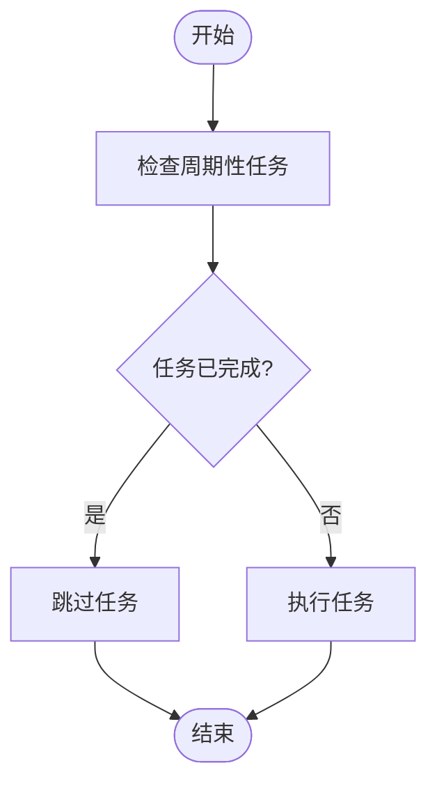
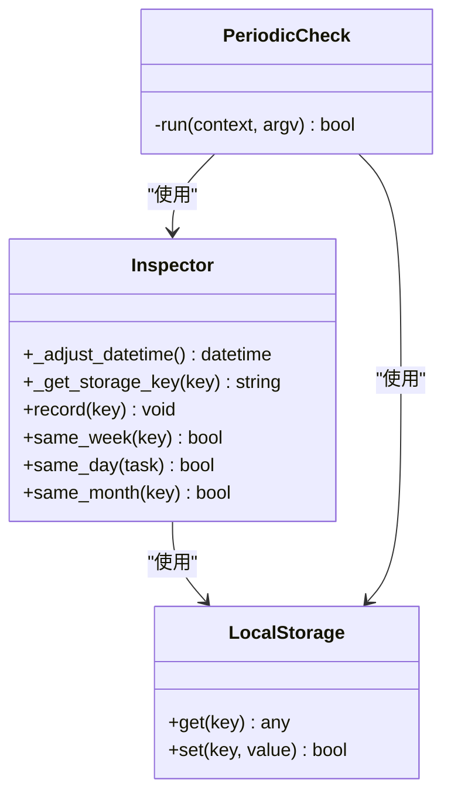
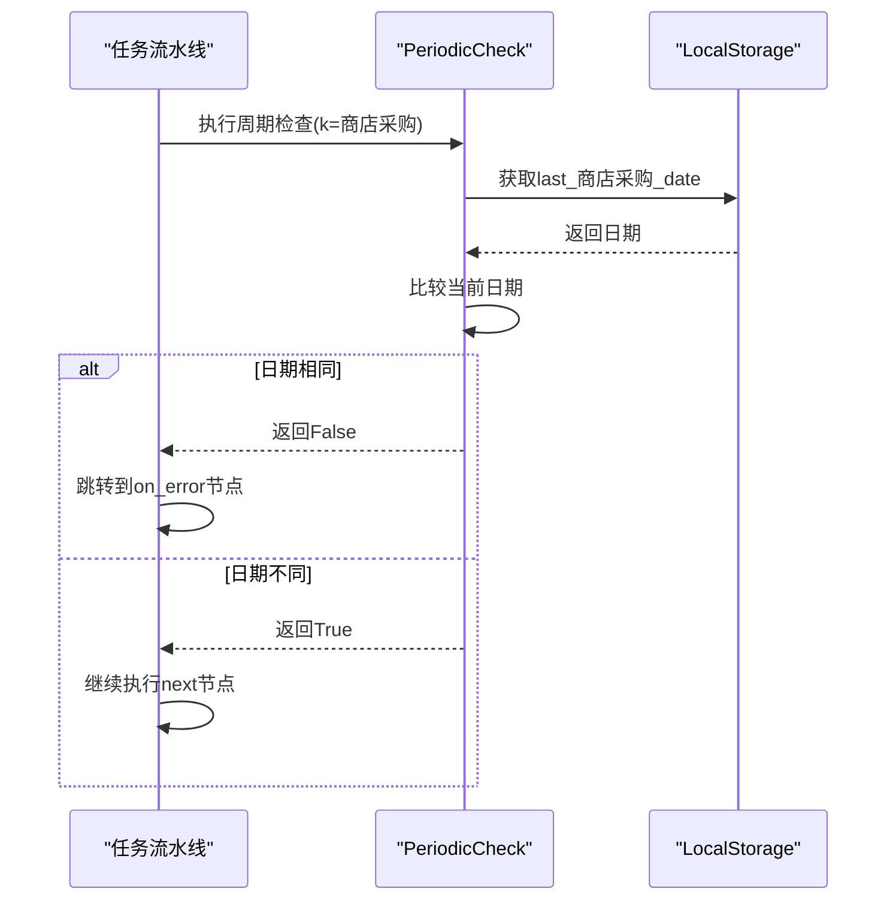
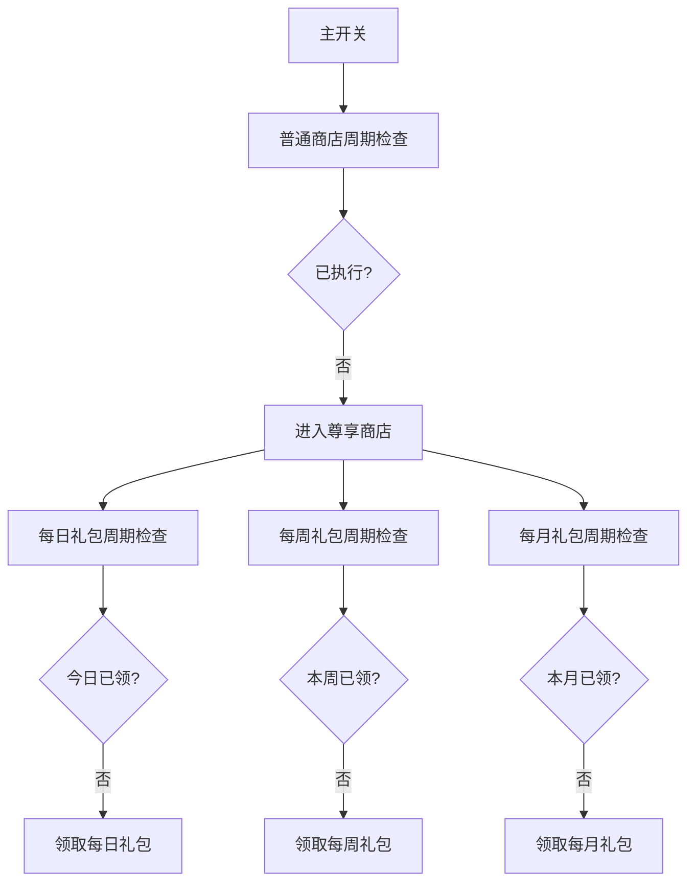

# 开关类型配置

<cite>
**本文档引用文件**  
- [领取邮件.json](file://assets/resource/base/pipeline/日常任务/领取邮件.json)
- [每日采购.json](file://assets/resource/base/pipeline/日常任务/每日采购.json)
- [periodic_check.py](file://agent/customs/global_func/periodic_check.py)
- [pipeline_helper.py](file://agent/customs/global_func/pipeline_helper.py)
- [prompter.py](file://agent/customs/utils/prompter.py)
- [local_storage.py](file://agent/customs/utils/local_storage.py)
- [store.py](file://agent/customs/special_treat/store.py)
- [3.1-任务流水线协议.md](file://instructions/maafw-guide/3.1-任务流水线协议.md)
- [2.2-集成接口一览.md](file://instructions/maafw-guide/2.2-集成接口一览.md)
</cite>

## 目录
1. [引言](#引言)
2. [开关配置工作机制](#开关配置工作机制)
3. [核心组件分析](#核心组件分析)
4. [流程控制逻辑](#流程控制逻辑)
5. [嵌套开关层级控制](#嵌套开关层级控制)
6. [UI呈现方式](#ui呈现方式)
7. [结论](#结论)

## 引言
本文档深入解析type为switch的配置项工作机制，以"领取邮件-周期检查"、"每日采购-商店采购"等为例，说明其如何通过cases中name为Yes/No的分支控制功能启用与跳过。详细阐述pipeline_override中action: DoNothing和next字段的流程控制逻辑，如跳过特定节点或直接跳转到结束节点。结合代码实例说明开关配置在任务流水线中的实际影响，以及如何通过此机制实现功能的动态启用/禁用。

## 开关配置工作机制
开关类型配置通过周期性检查机制实现功能的动态启用与禁用。系统使用`periodic_check`自定义动作来判断特定任务是否需要执行，基于任务的最后完成时间与当前时间的比较结果来决定流程走向。

在"领取邮件-周期检查"节点中，配置了`custom_action`为`periodic_check`，参数`k=领取邮件`标识了任务类型。当系统执行此节点时，会检查"领取邮件"任务的最后完成日期，如果与当前日期相同，则认为任务已完成，跳过执行；否则继续执行后续流程。

**图示来源**  
- [领取邮件.json](file://assets/resource/base/pipeline/日常任务/领取邮件.json)
- [periodic_check.py](file://agent/customs/global_func/periodic_check.py)

**本节来源**  
- [领取邮件.json](file://assets/resource/base/pipeline/日常任务/领取邮件.json)
- [periodic_check.py](file://agent/customs/global_func/periodic_check.py)

## 核心组件分析
开关配置机制的核心组件包括周期性检查器(Inspector)、自定义动作(PeriodicCheck)和本地存储(LocalStorage)。这些组件协同工作，实现了任务状态的持久化存储和条件判断。

`Inspector`类提供了核心的周期判断功能，包含`same_day`、`same_week`和`same_month`等静态方法，用于判断任务是否在指定周期内已完成。这些方法考虑了游戏凌晨4点刷新的特性，对日期进行了特殊调整。

`PeriodicCheck`类作为自定义动作，接收`key/k`参数标识任务，`periodic/p`参数指定周期类型（day/d、week/w或month/m），并根据检查结果返回布尔值控制流程走向。

**图示来源**  
- [periodic_check.py](file://agent/customs/global_func/periodic_check.py)
- [local_storage.py](file://agent/customs/utils/local_storage.py)

**本节来源**  
- [periodic_check.py](file://agent/customs/global_func/periodic_check.py)
- [local_storage.py](file://agent/customs/utils/local_storage.py)

## 流程控制逻辑
开关配置通过`pipeline_override`中的`action: DoNothing`和`next`字段实现精细的流程控制。当`periodic_check`返回False时，系统会跳转到`on_error`指定的节点，通常是标记为"周期提醒"的节点，该节点执行`DoNothing`动作并显示提示信息。

在"每日采购-商店采购"场景中，存在多个子开关的层级控制。主开关"普通商店周期检查"控制整个商店采购流程的启用，而子开关如"每日礼包周期检查"、"每周礼包周期检查"等则控制具体礼包的领取。

**图示来源**  
- [每日采购.json](file://assets/resource/base/pipeline/日常任务/每日采购.json)
- [periodic_check.py](file://agent/customs/global_func/periodic_check.py)

**本节来源**  
- [每日采购.json](file://assets/resource/base/pipeline/日常任务/每日采购.json)
- [periodic_check.py](file://agent/customs/global_func/periodic_check.py)
- [3.1-任务流水线协议.md](file://instructions/maafw-guide/3.1-任务流水线协议.md)

## 嵌套开关层级控制
嵌套开关机制通过多个层级的周期检查实现复杂的控制逻辑。以"每日采购"任务为例，存在三层开关结构：主开关控制整个采购流程，二级开关控制不同商店类型，三级开关控制具体商品的购买。

主开关"普通商店周期检查"首先判断是否已执行过商店采购任务。如果未执行，则进入尊享商店流程，依次检查每日礼包、每周礼包和每月礼包的周期状态。每个子开关都独立判断其对应任务的完成状态，实现了精细化的控制。

这种层级结构允许用户灵活配置，可以选择只开启部分功能而跳过其他功能。例如，可以只开启每日礼包的自动领取，而关闭每周和每月礼包的自动领取。

**图示来源**  
- [每日采购.json](file://assets/resource/base/pipeline/日常任务/每日采购.json)

**本节来源**  
- [每日采购.json](file://assets/resource/base/pipeline/日常任务/每日采购.json)
- [store.py](file://agent/customs/special_treat/store.py)

## UI呈现方式
开关配置在UI上的呈现方式直观地反映了其层级结构和状态信息。每个开关节点在流程图中都有明确的视觉标识，通过节点名称和位置布局展示其层级关系。

状态提示信息通过`focus`字段实现，当节点被激活时会显示相应的提示。例如，"领取邮件_周期提醒"节点的`focus`字段包含" > 今日已领取邮件"的提示，让用户清楚地了解当前状态。

流程的走向通过`next`和`on_error`箭头清晰地展示，绿色箭头表示正常执行路径，红色箭头表示错误处理或跳过路径。这种可视化设计使得复杂的流程逻辑易于理解和调试。

**本节来源**  
- [领取邮件.json](file://assets/resource/base/pipeline/日常任务/领取邮件.json)
- [每日采购.json](file://assets/resource/base/pipeline/日常任务/每日采购.json)

## 结论
开关类型配置通过`periodic_check`自定义动作和本地存储机制，实现了任务的周期性检查和动态启用/禁用。该机制利用`action: DoNothing`和`next`字段进行精细的流程控制，支持嵌套的层级结构，满足了复杂任务场景的需求。

通过合理配置开关，用户可以灵活控制自动化流程的行为，实现功能的按需启用。这种设计既保证了系统的稳定性，又提供了足够的灵活性，是自动化任务系统中重要的控制机制。