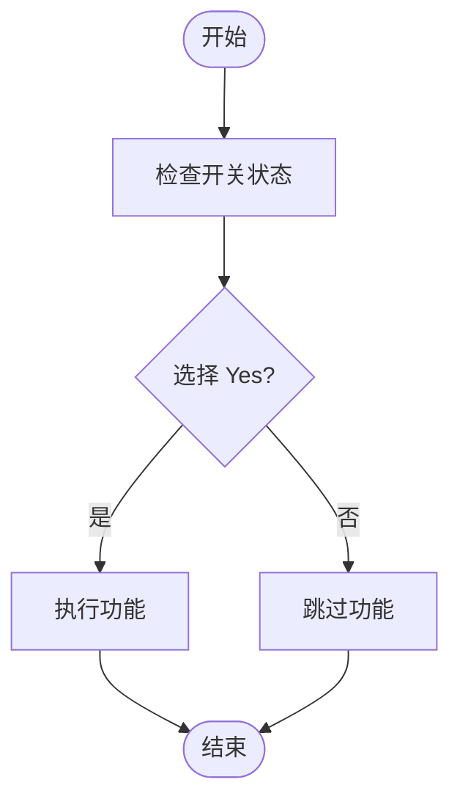
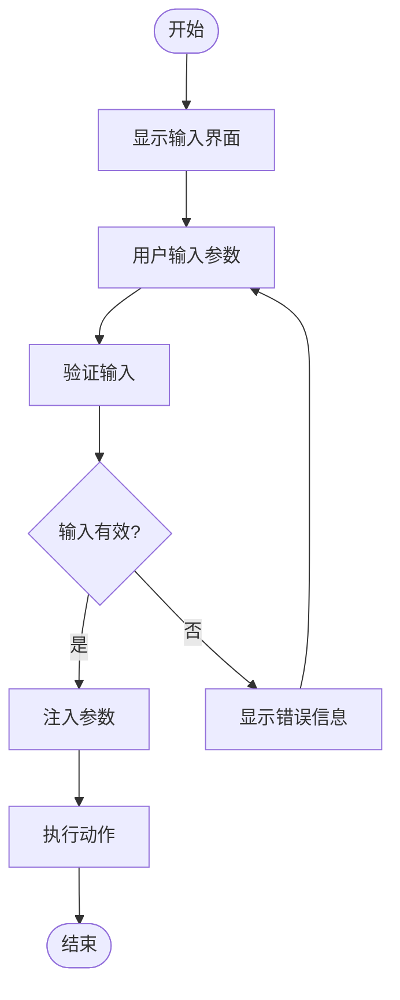
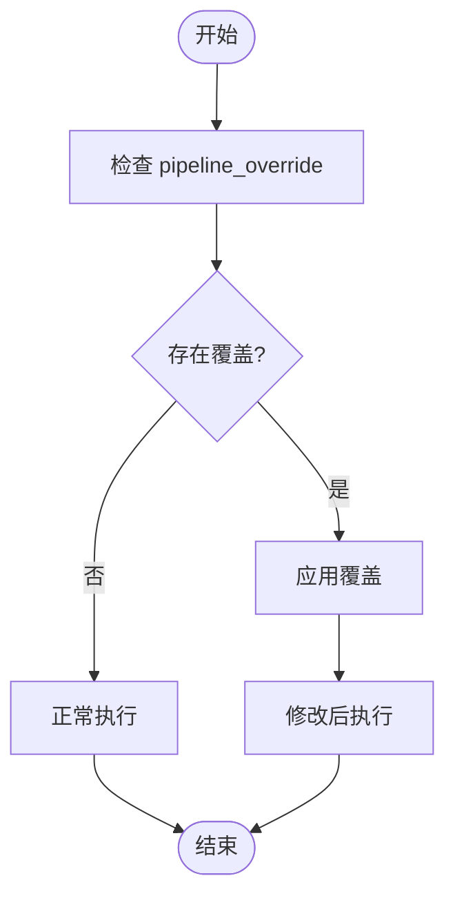
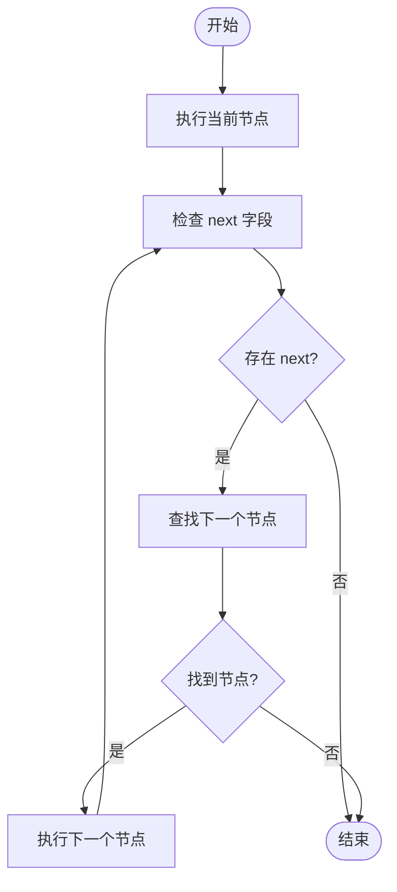

# 选项与参数配置

<cite>
**本文档引用文件**   
- [maa_option.json](file://ci/config/maa_option.json)
- [interface.json](file://assets/interface.json)
- [领取邮件.json](file://assets/resource/base/pipeline/日常任务/领取邮件.json)
- [清紫糖.json](file://assets/resource/base/pipeline/日常任务/清紫糖.json)
- [领取糖果.json](file://assets/resource/base/pipeline/日常任务/领取糖果.json)
- [每日采购.json](file://assets/resource/base/pipeline/日常任务/每日采购.json)
- [maa_pi_config.json](file://assets/config/maa_pi_config.json)
- [3.1-任务流水线协议.md](file://instructions/maafw-guide/3.1-任务流水线协议.md)
- [3.3-ProjectInterfaceV2协议.md](file://instructions/maafw-guide/3.3-ProjectInterfaceV2协议.md)
</cite>

## 目录
1. [开关类型配置项](#开关类型配置项)
2. [输入类型配置项](#输入类型配置项)
3. [流水线覆盖机制](#流水线覆盖机制)
4. [执行流程控制](#执行流程控制)

## 开关类型配置项

在 `interface.json` 文件中，`option` 对象定义了多种配置项，其中 `type` 为 `switch` 的开关类型用于控制功能的启用与禁用。这种配置项通过 `cases` 字段中的 `name` 为 "Yes" 或 "No" 的分支来实现条件判断机制。

当用户选择 "Yes" 时，对应的配置项被激活，相关功能将被执行；当用户选择 "No" 时，该功能将被跳过。例如，在 "领取邮件-周期检查" 配置项中，当选择 "No" 时，通过 `pipeline_override` 将 "领取邮件_周期检查" 节点的 `action` 设置为 `DoNothing`，从而实现功能跳过。

**图示来源**
- [interface.json](file://assets/interface.json#L166-L181)
- [3.3-ProjectInterfaceV2协议.md](file://instructions/maafw-guide/3.3-ProjectInterfaceV2协议.md#L350-L358)

## 输入类型配置项

`type` 为 `input` 的输入类型配置项允许用户自定义参数。在 `清紫糖-克隆工厂-选择关卡` 配置项中，`inputs` 字段定义了输入参数的完整工作流程。

`inputs` 中的 `name` 定义了参数名称，`label` 提供了用户界面显示标签，`default` 设置了默认值，`verify` 使用正则表达式进行输入校验。例如，关卡输入的正则校验 `^\\d+$` 确保用户只能输入数字。

当用户输入参数后，`pipeline_override` 中的 `custom_action_param` 实现了参数注入。在 "清紫糖_选择克隆工厂关卡" 节点中，`custom_action_param` 的值 `l={关卡}` 将用户输入的关卡号注入到自定义动作参数中，从而实现动态配置。

**图示来源**
- [interface.json](file://assets/interface.json#L768-L784)
- [清紫糖.json](file://assets/resource/base/pipeline/日常任务/清紫糖.json#L635-L648)

## 流水线覆盖机制

`pipeline_override` 是实现功能跳过和行为修改的核心机制。它允许在运行时覆盖流水线节点的行为，从而实现灵活的功能控制。

当 `type` 为 `switch` 的配置项选择 "No" 时，`pipeline_override` 可以将特定节点的 `action` 设置为 `DoNothing`，实现功能跳过。例如，在 "领取邮件-周期检查" 配置中，当选择 "No" 时，"领取邮件_周期检查" 节点的 `action` 被覆盖为 `DoNothing`。

此外，`pipeline_override` 还可以修改节点的其他属性，如 `next` 字段，实现执行流程的跳转控制。在 "每日采购-周期免费礼包" 配置中，当选择 "No" 时，通过设置 `next` 为 "每日采购_至尊商店结束"，实现了流程跳转。

**图示来源**
- [interface.json](file://assets/interface.json#L173-L175)
- [每日采购.json](file://assets/resource/base/pipeline/日常任务/每日采购.json#L215-L217)

## 执行流程控制

`next` 字段在流水线执行流程中起着关键的跳转控制作用。它定义了当前节点执行成功后，接下来要执行的节点列表。

在 `interface.json` 的 `option` 配置中，`next` 字段被用于实现复杂的流程控制逻辑。例如，在 "每日采购-周期免费礼包" 配置中，当选择 "No" 时，通过 `pipeline_override` 将 "每日采购_尊享商店开始" 节点的 `next` 设置为 "每日采购_至尊商店结束"，从而跳过整个尊享商店采购流程。

`next` 字段的值可以是单个节点名称，也可以是节点名称列表。当为列表时，系统会按顺序识别每个节点，只执行第一个识别到的节点。这种机制使得流水线能够根据实际运行时的状态动态调整执行路径。

**图示来源**
- [interface.json](file://assets/interface.json#L216-L217)
- [3.1-任务流水线协议.md](file://instructions/maafw-guide/3.1-任务流水线协议.md#L151-L154)