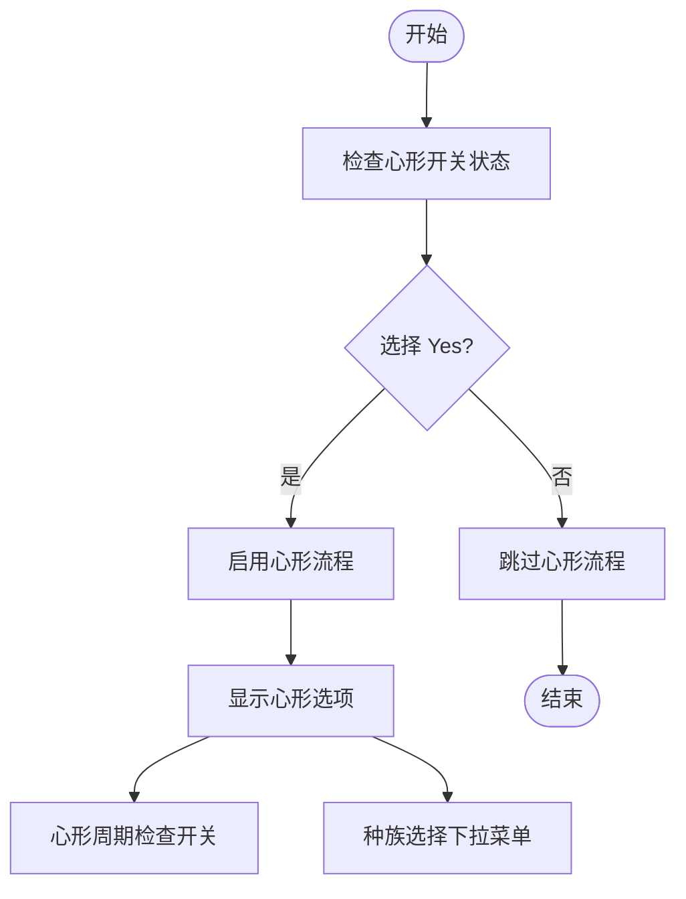
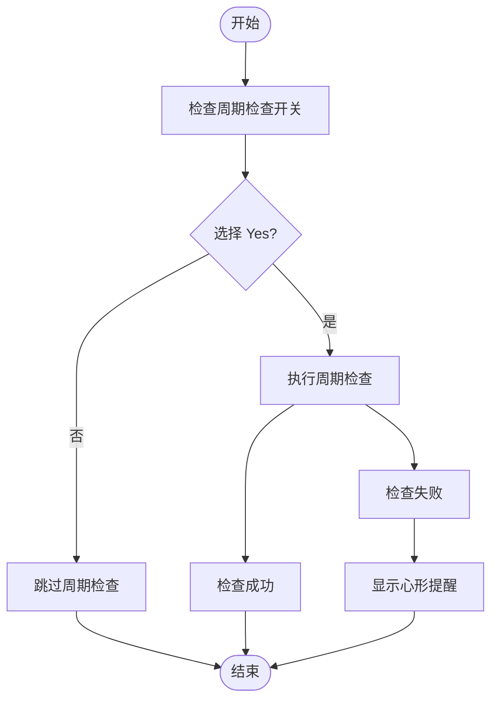
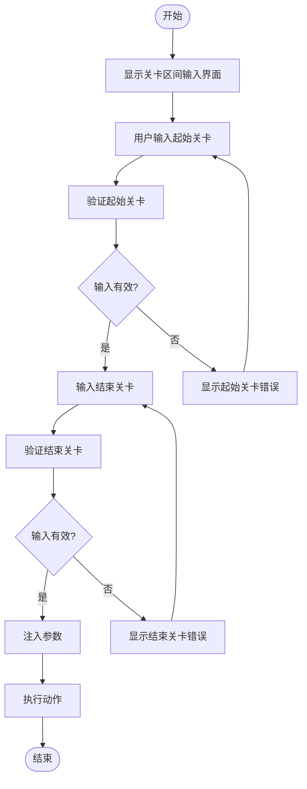
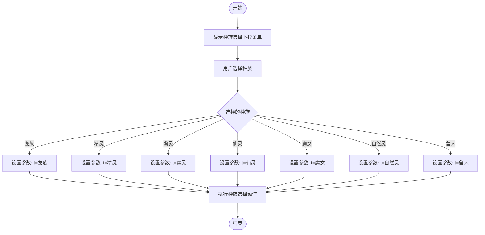
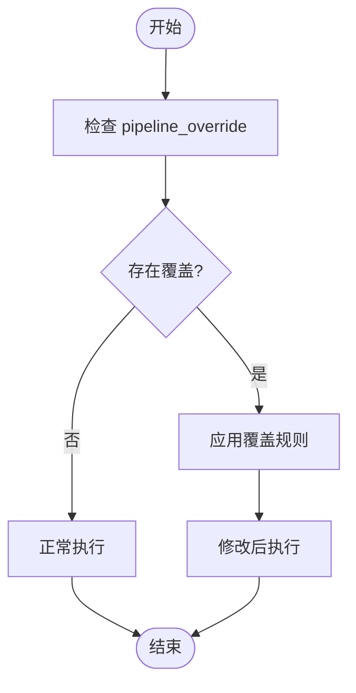
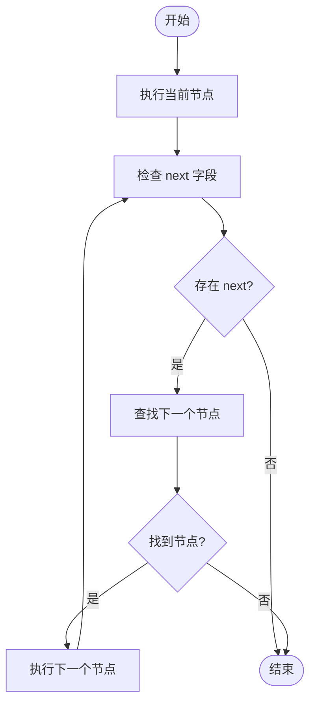

# 选项与参数配置

<cite>
**本文档引用文件**   
- [clear_red_candy.json](file://assets/resource/tasks/daily/clear_red_candy.json)
- [清红糖.json](file://assets/resource/base/pipeline/日常任务/清红糖.json)
- [领取邮件.json](file://assets/resource/base/pipeline/日常任务/领取邮件.json)
- [清紫糖.json](file://assets/resource/base/pipeline/日常任务/清紫糖.json)
- [interface.json](file://assets/interface.json)
- [clear_red_candy.md](file://assets/resource/descs/daily/clear_red_candy.md)
</cite>

## 更新摘要
**变更内容**   
- 新增"清红糖-心形"选项组的详细说明
- 补充心形周期检查开关的工作原理
- 添加种族选择下拉菜单的配置机制
- 更新流水线覆盖机制在心形关卡中的应用
- 完善输入类型配置在关卡区间设置中的使用

## 目录
1. [开关类型配置项](#开关类型配置项)
2. [输入类型配置项](#输入类型配置项)
3. [选择类型配置项](#选择类型配置项)
4. [流水线覆盖机制](#流水线覆盖机制)
5. [执行流程控制](#执行流程控制)

## 开关类型配置项

在 `clear_red_candy.json` 文件中，`option` 对象定义了多种配置项，其中 `type` 为 `switch` 的开关类型用于控制功能的启用与禁用。这种配置项通过 `cases` 字段中的 `name` 为 "Yes" 或 "No" 的分支来实现条件判断机制。

### 清红糖-心形开关

在"清红糖-心形"配置项中，当用户选择 "Yes" 时，会激活心形关卡相关的完整流程，包括心形周期检查和种族选择；当用户选择 "No" 时，通过 `pipeline_override` 将"清红糖_心形开始"节点的 `next` 设置为"清红糖_心形结束"，从而跳过整个心形关卡流程。

```mermaid
flowchart TD
Start([开始]) --> CheckHeartSwitch["检查心形开关状态"]
CheckHeartSwitch --> HeartYesBranch{"选择 Yes?"}
HeartYesBranch --> |是| EnableHeartFlow["启用心形流程"]
HeartYesBranch --> |否| SkipHeartFlow["跳过心形流程"]
EnableHeartFlow --> HeartOptions["显示心形选项"]
HeartOptions --> HeartPeriodCheck["心形周期检查开关"]
HeartOptions --> RaceSelect["种族选择下拉菜单"]
SkipHeartFlow --> End([结束])
```

**图示来源**
- [clear_red_candy.json:12-31](file://assets/resource/tasks/daily/clear_red_candy.json#L12-L31)
- [清红糖.json:190-215](file://assets/resource/base/pipeline/日常任务/清红糖.json#L190-L215)

### 心形周期检查开关

"清红糖-心形-周期检查"配置项提供每日仅检查一次的选项。当选择 "No" 时，通过 `pipeline_override` 将"清红糖_心形周期检查"节点的 `action` 设置为 `DoNothing`，实现功能跳过；当选择 "Yes" 时，正常执行周期检查逻辑。

```mermaid
flowchart TD
Start([开始]) --> CheckPeriodSwitch["检查周期检查开关"]
CheckPeriodSwitch --> PeriodYesBranch{"选择 Yes?"}
PeriodYesBranch --> |是| ExecutePeriodCheck["执行周期检查"]
PeriodYesBranch --> |否| SkipPeriodCheck["跳过周期检查"]
ExecutePeriodCheck --> PeriodSuccess["检查成功"]
ExecutePeriodCheck --> PeriodError["检查失败"]
SkipPeriodCheck --> End([结束])
PeriodSuccess --> End
PeriodError --> HeartReminder["显示心形提醒"]
HeartReminder --> End
```

**图示来源**
- [clear_red_candy.json:32-47](file://assets/resource/tasks/daily/clear_red_candy.json#L32-L47)
- [清红糖.json:147-169](file://assets/resource/base/pipeline/日常任务/清红糖.json#L147-L169)

**章节来源**   
- [clear_red_candy.json:12-47](file://assets/resource/tasks/daily/clear_red_candy.json#L12-L47)
- [清红糖.json:147-215](file://assets/resource/base/pipeline/日常任务/清红糖.json#L147-L215)

## 输入类型配置项

`type` 为 `input` 的输入类型配置项允许用户自定义参数。在"清红糖-装备-关卡区间"配置项中，`inputs` 字段定义了输入参数的完整工作流程。

### 关卡区间输入

`inputs` 中的 `name` 定义了参数名称，`label` 提供了用户界面显示标签，`default` 设置了默认值，`verify` 使用正则表达式进行输入校验。例如，关卡输入的正则校验 `^\\d{1,2}-([1-9]|10)$` 确保用户只能输入格式为"章-关"的关卡编号，其中章为1-2位数字，关为1-10的数字。

当用户输入参数后，`pipeline_override` 中的 `custom_action_param` 实现了参数注入。在"清红糖_指定关卡作战"节点中，`custom_action_param` 的值 `sl={起始关卡}&el={结束关卡}` 将用户输入的起始和结束关卡号注入到自定义动作参数中，从而实现动态配置。

```mermaid
flowchart TD
Start([开始]) --> ShowInput["显示关卡区间输入界面"]
ShowInput --> UserInput["用户输入起始关卡"]
UserInput --> ValidateStart["验证起始关卡"]
ValidateStart --> StartValid{"输入有效?"}
StartValid --> |是| InputEnd["输入结束关卡"]
StartValid --> |否| ShowStartError["显示起始关卡错误"]
ShowStartError --> UserInput
InputEnd --> ValidateEnd["验证结束关卡"]
ValidateEnd --> EndValid{"输入有效?"}
EndValid --> |是| InjectParam["注入参数"]
EndValid --> |否| ShowEndError["显示结束关卡错误"]
ShowEndError --> InputEnd
InjectParam --> ExecuteAction["执行动作"]
ExecuteAction --> End([结束])
```

**图示来源**
- [clear_red_candy.json:127-149](file://assets/resource/tasks/daily/clear_red_candy.json#L127-L149)
- [清红糖.json:216-233](file://assets/resource/base/pipeline/日常任务/清红糖.json#L216-L233)

**章节来源**   
- [clear_red_candy.json:127-149](file://assets/resource/tasks/daily/clear_red_candy.json#L127-L149)
- [清红糖.json:216-233](file://assets/resource/base/pipeline/日常任务/清红糖.json#L216-L233)

## 选择类型配置项

`type` 为 `select` 的选择类型配置项提供下拉菜单形式的选项选择。在"清红糖-心形-种族选择"配置项中，定义了多种可选的种族类型。

### 种族选择配置

该配置项提供了7种不同的种族选择：龙族、精灵、幽灵、仙灵、魔女、自然灵和兽人。每种种族都通过 `pipeline_override` 配置了相应的 `custom_action_param` 参数，值为 `t=种族名称`，用于在"清红糖_选择心形种族"节点中传递具体的种族信息。

```mermaid
flowchart TD
Start([开始]) --> ShowRaceSelect["显示种族选择下拉菜单"]
ShowRaceSelect --> UserSelect["用户选择种族"]
UserSelect --> CheckRace{"选择的种族"}
CheckRace --> |龙族| SetDragonParam["设置参数: t=龙族"]
CheckRace --> |精灵| SetElfParam["设置参数: t=精灵"]
CheckRace --> |幽灵| SetGhostParam["设置参数: t=幽灵"]
CheckRace --> |仙灵| SetFairyParam["设置参数: t=仙灵"]
CheckRace --> |魔女| SetWitchParam["设置参数: t=魔女"]
CheckRace --> |自然灵| SetNatureParam["设置参数: t=自然灵"]
CheckRace --> |兽人| SetOrcParam["设置参数: t=兽人"]
SetDragonParam --> ExecuteRaceAction["执行种族选择动作"]
SetElfParam --> ExecuteRaceAction
SetGhostParam --> ExecuteRaceAction
SetFairyParam --> ExecuteRaceAction
SetWitchParam --> ExecuteRaceAction
SetNatureParam --> ExecuteRaceAction
SetOrcParam --> ExecuteRaceAction
ExecuteRaceAction --> End([结束])
```

**图示来源**
- [clear_red_candy.json:49-107](file://assets/resource/tasks/daily/clear_red_candy.json#L49-L107)
- [清红糖.json:476-507](file://assets/resource/base/pipeline/日常任务/清红糖.json#L476-L507)

**章节来源**   
- [clear_red_candy.json:49-107](file://assets/resource/tasks/daily/clear_red_candy.json#L49-L107)
- [清红糖.json:476-507](file://assets/resource/base/pipeline/日常任务/清红糖.json#L476-L507)

## 流水线覆盖机制

`pipeline_override` 是实现功能跳过和行为修改的核心机制。它允许在运行时覆盖流水线节点的行为，从而实现灵活的功能控制。

### 心形流程跳过机制

在"清红糖-心形"配置中，当用户选择 "No" 时，通过 `pipeline_override` 将"清红糖_心形开始"节点的 `next` 设置为"清红糖_心形结束"，实现整个心形关卡流程的跳过。这种机制确保了用户可以根据需要灵活地启用或禁用特定功能。

### 周期检查跳过机制

在"清红糖-心形-周期检查"配置中，当用户选择 "No" 时，通过 `pipeline_override` 将"清红糖_心形周期检查"节点的 `action` 设置为 `DoNothing`，实现周期检查功能的跳过。这避免了重复执行不必要的检查逻辑。

```mermaid
flowchart TD
Start([开始]) --> CheckOverride["检查 pipeline_override"]
CheckOverride --> HasOverride{"存在覆盖?"}
HasOverride --> |是| ApplyOverride["应用覆盖规则"]
HasOverride --> |否| NormalExecute["正常执行"]
ApplyOverride --> ModifiedExecute["修改后执行"]
NormalExecute --> End([结束])
ModifiedExecute --> End
```

**图示来源**
- [clear_red_candy.json:19-24](file://assets/resource/tasks/daily/clear_red_candy.json#L19-L24)
- [clear_red_candy.json:37-42](file://assets/resource/tasks/daily/clear_red_candy.json#L37-L42)

**章节来源**   
- [clear_red_candy.json:19-42](file://assets/resource/tasks/daily/clear_red_candy.json#L19-L42)
- [清红糖.json:147-215](file://assets/resource/base/pipeline/日常任务/清红糖.json#L147-L215)

## 执行流程控制

`next` 字段在流水线执行流程中起着关键的跳转控制作用。它定义了当前节点执行成功后，接下来要执行的节点列表。

### 心形流程控制

在"清红糖-心形"配置中，当选择 "No" 时，通过 `pipeline_override` 将"清红糖_心形开始"节点的 `next` 设置为"清红糖_心形结束"，从而跳过整个心形关卡流程。这种机制使得用户可以选择性地启用或禁用特定的功能模块。

### 装备流程控制

在"清红糖-装备"配置中，当选择 "No" 时，通过 `pipeline_override` 将"清红糖_装备开始"节点的 `next` 设置为"清红糖_装备结束"，实现装备相关流程的跳过。

```mermaid
flowchart TD
Start([开始]) --> ExecuteNode["执行当前节点"]
ExecuteNode --> CheckNext["检查 next 字段"]
CheckNext --> HasNext{"存在 next?"}
HasNext --> |是| FindNext["查找下一个节点"]
HasNext --> |否| End([结束])
FindNext --> Found{"找到节点?"}
Found --> |是| ExecuteNext["执行下一个节点"]
Found --> |否| End
ExecuteNext --> CheckNext
```

**图示来源**
- [clear_red_candy.json:21-23](file://assets/resource/tasks/daily/clear_red_candy.json#L21-L23)
- [clear_red_candy.json:115-119](file://assets/resource/tasks/daily/clear_red_candy.json#L115-L119)

**章节来源**   
- [clear_red_candy.json:21-23](file://assets/resource/tasks/daily/clear_red_candy.json#L21-L23)
- [clear_red_candy.json:115-119](file://assets/resource/tasks/daily/clear_red_candy.json#L115-L119)
- [清红糖.json:190-215](file://assets/resource/base/pipeline/日常任务/清红糖.json#L190-L215)