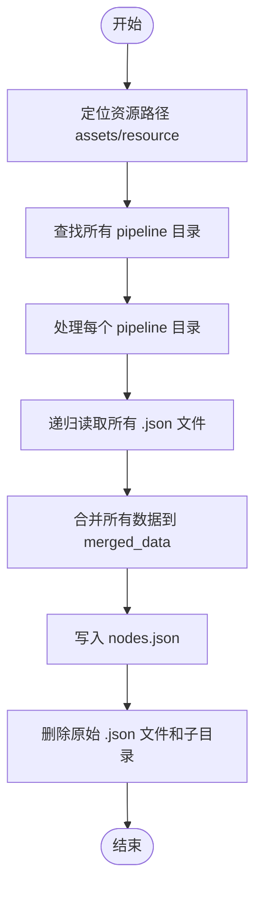

# 配置体系与资源管理

<cite>
**本文档引用文件**   
- [interface.json](file://assets/interface.json)
- [maa_pi_config.json](file://assets/config/maa_pi_config.json)
- [merge_pipeline.py](file://ci/merge_pipeline.py)
- [default_pipeline.json](file://assets/resource/base/default_pipeline.json)
- [启动游戏.json](file://assets/resource/base/pipeline/日常任务/启动游戏.json)
- [领取邮件.json](file://assets/resource/base/pipeline/日常任务/领取邮件.json)
- [每日采购.json](file://assets/resource/base/pipeline/日常任务/每日采购.json)
- [圣团巡礼.json](file://assets/resource/base/pipeline/日常任务/圣团巡礼.json)
- [清紫糖.json](file://assets/resource/base/pipeline/日常任务/清紫糖.json)
- [说明.json](file://assets/resource/base/pipeline/其他/说明.json)
- [ppocr_v3](file://assets/MaaCommonAssets/OCR/ppocr_v3)
- [ppocr_v4](file://assets/MaaCommonAssets/OCR/ppocr_v4)
- [ppocr_v5](file://assets/MaaCommonAssets/OCR/ppocr_v5)
- [README.md](file://assets/MaaCommonAssets/OCR/README.md)
- [ppocr_v5/README.md](file://assets/MaaCommonAssets/OCR/ppocr_v5/README.md)
</cite>

## 目录
1. [interface.json配置结构解析](#interfacejson配置结构解析)
2. [maa_pi_config.json核心参数配置](#maapi_configjson核心参数配置)
3. [OCR模型资源管理策略](#ocr模型资源管理策略)
4. [资源包合并流程](#资源包合并流程)
5. [配置文件版本迁移指南](#配置文件版本迁移指南)
6. [常见配置错误排查清单](#常见配置错误排查清单)

## interface.json配置结构解析

`interface.json`是MaaDuDuL的核心配置文件，定义了用户界面、设备控制器、资源路径、任务列表和选项配置等关键信息。该文件采用JSON格式，结构清晰，便于维护和扩展。

### 基础信息字段
- **interface_version**: 接口版本号，用于兼容性检查。
- **name**: 项目名称，显示为"MaaDuDuL"。
- **title**: 界面标题，包含版本信息和游戏名称。
- **icon**: 图标文件路径，使用`logo.png`。
- **description**: 项目描述，简要说明为"嘟嘟脸小助手"。
- **version**: 当前版本号，如"v0.1.2"。
- **welcome**: 欢迎语，启动时显示。
- **contact**: 联系方式，提供QQ群信息。
- **license**: 许可证文件路径。
- **github**: 项目GitHub仓库地址。
- **mirrorchyan_rid**: 镜像仓库ID。
- **mirrorchyan_multiplatform**: 是否支持多平台。

**Section sources**
- [interface.json](file://assets/interface.json#L1-L13)

### 控制器配置（controller）
`controller`字段定义了可用的设备控制方式，支持多种设备类型：
- **模拟器**: 使用ADB协议进行控制，设置`display_short_side`为720以适配屏幕分辨率。
- **PlayCover**: 专为iOS模拟器设计的控制方式，通过`uuid`指定应用包名`com.bilibili.trickcalcn`。

该配置允许用户在不同设备间切换，实现跨平台自动化操作。

**Section sources**
- [interface.json](file://assets/interface.json#L14-L27)

### 资源路径配置（resource）
`resource`字段指定了资源文件的加载路径：
- **name**: 资源名称，如"B服"。
- **path**: 资源文件夹路径数组，支持多路径加载，当前配置为`["./resource/base"]`。

此设计支持资源的模块化管理和多版本共存。

**Section sources**
- [interface.json](file://assets/interface.json#L29-L33)

### 代理配置（agent）
`agent`字段定义了后端代理的执行方式：
- **child_exec**: 子进程可执行文件路径，指向嵌入式Python解释器`./python/python.exe`。
- **child_args**: 子进程启动参数，包括`-u`（无缓冲输出）和主程序入口`./agent/main.py`。

该配置确保了自动化脚本在独立Python环境中稳定运行。

**Section sources**
- [interface.json](file://assets/interface.json#L35-L38)

### 任务列表配置（task）
`task`字段定义了用户可执行的任务列表，每个任务包含以下属性：
- **name**: 任务显示名称。
- **label**: 任务标签。
- **entry**: 任务入口节点，对应流水线中的起始节点。
- **default_check**: 是否默认选中。
- **description**: 任务描述文件路径。
- **option**: 关联的可配置选项。

任务列表按功能分组，如"可连续任务"、"独立任务"等，便于用户理解和使用。

**Section sources**
- [interface.json](file://assets/interface.json#L39-L162)

### 选项配置（option）
`option`字段定义了可配置的开关和输入项，实现动态行为控制：
- **type**: 选项类型，如`switch`（开关）或`input`（输入框）。
- **label**: 选项显示标签。
- **cases**: 不同选项值对应的行为分支。
- **pipeline_override**: 通过修改流水线节点行为来实现逻辑分支。
- **inputs**: 输入框的配置，包括默认值和验证规则。

例如，`领取邮件-周期检查`选项通过`pipeline_override`将`领取邮件_周期检查`节点的动作为`DoNothing`，实现条件跳过。

**Section sources**
- [interface.json](file://assets/interface.json#L164-L785)

## maa_pi_config.json核心参数配置

`maa_pi_config.json`是MaaFramework的核心配置文件，用于指定资源版本和运行时参数。

### 资源版本配置
```json
{
    "resource": "B服"
}
```
- **resource**: 指定当前使用的资源包名称，必须与`interface.json`中`resource`字段的`name`值匹配。此配置决定了加载哪个资源路径下的流水线和图像资源。

该文件结构简单，但作用关键，是连接MaaFramework与具体资源包的桥梁。

**Section sources**
- [maa_pi_config.json](file://assets/config/maa_pi_config.json#L1-L3)

## OCR模型资源管理策略

MaaDuDuL集成了PaddleOCR的多版本模型，存储在`assets/MaaCommonAssets/OCR/`目录下，支持多语言识别。

### 模型版本结构
- **ppocr_v3**: 支持英文(en_us)、日文(ja_jp)、韩文(ko_kr)、简体中文(zh_cn)、繁体中文(zh_tw)。
- **ppocr_v4**: 支持英文(en_us)、简体中文(zh_cn)。
- **ppocr_v5**: 支持简体中文、繁体中文、英文、日文，模型文件夹命名为`zh_cn`以保证兼容性。

### 多语言支持机制
根据`assets/MaaCommonAssets/OCR/ppocr_v5/README.md`的说明，v5模型基于PaddleOCR官方介绍，同时支持多种语言。项目通过统一的`zh_cn`文件夹名来管理多语言模型，简化了资源路径的复杂性，同时通过模型自身的多语言能力满足不同语言环境下的OCR需求。

### 模型转换与优化
项目提供了从PaddlePaddle模型到ONNX格式的转换命令：
- **det v5**: 使用`paddle2onnx`直接转换。
- **det v3/v4**: 先转换为未优化的ONNX模型，再使用`paddle2onnx.optimize`进行优化。
- **rec v5/v3/v4**: 类似处理流程。

此策略确保了模型在不同推理引擎（如ONNX Runtime）上的高效运行。

**Section sources**
- [ppocr_v3](file://assets/MaaCommonAssets/OCR/ppocr_v3)
- [ppocr_v4](file://assets/MaaCommonAssets/OCR/ppocr_v4)
- [ppocr_v5](file://assets/MaaCommonAssets/OCR/ppocr_v5)
- [README.md](file://assets/MaaCommonAssets/OCR/README.md)
- [ppocr_v5/README.md](file://assets/MaaCommonAssets/OCR/ppocr_v5/README.md)

## 资源包合并流程

`ci/merge_pipeline.py`脚本负责将分散的流水线JSON文件合并为单一的`nodes.json`文件，优化资源加载效率。

### 合并流程
1. **定位资源路径**: 脚本从项目根目录的`assets/resource`下查找所有子目录。
2. **遍历流水线目录**: 对每个资源目录下的`pipeline`子目录执行合并。
3. **递归读取JSON文件**: 遍历`pipeline`目录及其所有子目录，读取所有`.json`文件内容。
4. **合并数据**: 将所有JSON文件的内容合并到一个`merged_data`字典中。
5. **写入合并文件**: 将合并后的数据写入`pipeline/nodes.json`。
6. **清理旧文件**: 删除原始的`.json`文件和子目录，保留`nodes.json`。

### 流程图


**Diagram sources**
- [merge_pipeline.py](file://ci/merge_pipeline.py#L9-L73)

**Section sources**
- [merge_pipeline.py](file://ci/merge_pipeline.py#L1-L73)

## 配置文件版本迁移指南

当升级MaaDuDuL版本时，可能需要迁移配置文件。以下是关键步骤：

1. **备份现有配置**: 备份`interface.json`和`maa_pi_config.json`。
2. **检查新版本结构**: 对比新旧`interface.json`的`task`和`option`字段，确认新增或移除的任务。
3. **更新资源引用**: 确保`maa_pi_config.json`中的`resource`值与新版本`interface.json`中的资源名称一致。
4. **验证选项兼容性**: 检查`option`中的`pipeline_override`是否指向正确的流水线节点名，节点名可能因版本更新而改变。
5. **测试关键任务**: 运行"启动游戏"、"领取邮件"等基础任务，验证配置有效性。

## 常见配置错误排查清单

| 问题现象 | 可能原因 | 解决方案 |
| :--- | :--- | :--- |
| 任务无法启动 | `entry`节点名错误 | 检查`task`的`entry`值是否与流水线文件中的节点名完全匹配 |
| 选项开关无效 | `pipeline_override`路径错误 | 确认`pipeline_override`中指定的节点存在于对应的流水线JSON文件中 |
| OCR识别失败 | 模型资源缺失 | 检查`assets/MaaCommonAssets/OCR/`目录下对应语言的模型文件是否存在 |
| 设备连接失败 | ADB路径或端口错误 | 确认模拟器ADB服务已启动，并在MaaFramework中正确配置ADB路径和端口 |
| 资源加载失败 | `maa_pi_config.json`中`resource`名称不匹配 | 确保`maa_pi_config.json`的`resource`值与`interface.json`中`resource`的`name`值一致 |
| 流水线执行中断 | 节点超时或识别失败 | 检查`default_pipeline.json`中的`timeout`值是否过短，或调整图像识别的ROI区域 |

**Section sources**
- [interface.json](file://assets/interface.json)
- [maa_pi_config.json](file://assets/config/maa_pi_config.json)
- [default_pipeline.json](file://assets/resource/base/default_pipeline.json)
- [启动游戏.json](file://assets/resource/base/pipeline/日常任务/启动游戏.json)
- [领取邮件.json](file://assets/resource/base/pipeline/日常任务/领取邮件.json)