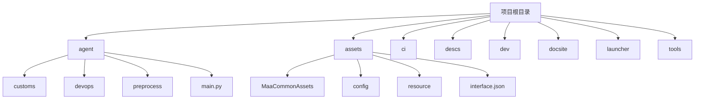
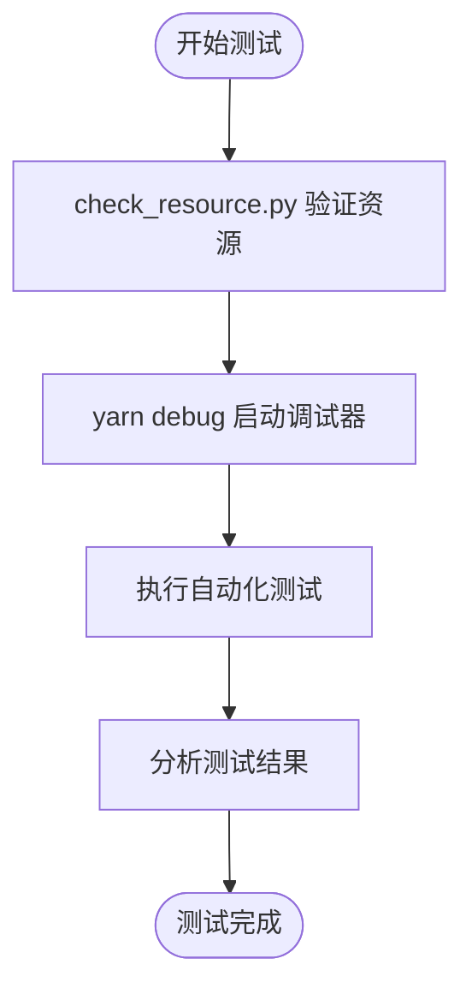

# 贡献指南

<cite>
**本文档中引用的文件**  
- [README.md](file://README.md)
- [agreement.md](file://docsite/docs/50.参与贡献/10.参与贡献/agreement.md)
- [init.md](file://docsite/docs/50.参与贡献/10.参与贡献/init.md)
- [structure.md](file://docsite/docs/50.参与贡献/10.参与贡献/structure.md)
- [package.json](file://package.json)
- [requirements.txt](file://requirements.txt)
- [main.py](file://agent/main.py)
- [setup.py](file://agent/preprocess/setup.py)
- [report.py](file://agent/devops/report.py)
- [check_resource.py](file://check_resource.py)
- [build_mfaa.py](file://dev/build_mfaa.py)
- [MaaDuDuL.py](file://launcher/MaaDuDuL.py)
</cite>

## 目录
1. [简介](#简介)
2. [贡献流程](#贡献流程)
3. [代码风格与提交规范](#代码风格与提交规范)
4. [项目模块划分](#项目模块划分)
5. [测试与质量保证](#测试与质量保证)
6. [行为准则](#行为准则)
7. [非代码贡献方式](#非代码贡献方式)
8. [新贡献者入门建议](#新贡献者入门建议)

## 简介

MaaDuDuL（MDDL）是一款基于 MaaFramework 与 MFAAvalonia 构建的自动化辅助工具，旨在帮助用户自动化完成《嘟嘟脸恶作剧》游戏中的日常任务。本项目开源、免费，采用 AGPL-3.0 协议发布，欢迎社区开发者参与贡献，共同推动项目的持续改进。

本文档旨在为社区开发者提供完整的贡献指南，涵盖从环境搭建、分支管理、代码提交到 Pull Request 审查的全流程，并明确代码风格、模块职责、测试策略及社区行为规范，确保贡献过程高效、有序。

**Section sources**
- [README.md](file://README.md#L1-L118)
- [agreement.md](file://docsite/docs/50.参与贡献/10.参与贡献/agreement.md#L1-L35)

## 贡献流程

### 1. 环境搭建

开发者需首先配置本地开发环境：

1. Fork 项目仓库至个人账户
2. 克隆仓库并拉取子模块：
   ```bash
   git clone --recursive https://github.com/<your_username>/MaaDuDuL.git
   ```
3. 安装 Python 3.12.9 及依赖：
   ```bash
   pip install maafw maadebugger
   ```
4. 下载 MaaFramework 最新稳定版并解压至 `/deps` 目录

### 2. 分支创建

建议采用功能分支开发模式：
```bash
git checkout -b feature/your-feature-name
```

### 3. 代码提交

提交代码前请确保：
- 代码通过本地测试
- 符合代码风格规范
- 提交信息格式正确

使用以下命令提交：
```bash
git add .
git commit -m "feat: add new daily task support"
```

### 4. Pull Request 审查

提交 PR 后，维护者将进行代码审查，重点关注：
- 功能完整性
- 代码可读性
- 测试覆盖情况
- 是否符合项目定位

审查通过后，PR 将被合并至主分支。

**Section sources**
- [init.md](file://docsite/docs/50.参与贡献/10.参与贡献/init.md#L1-L34)
- [build_mfaa.py](file://dev/build_mfaa.py#L1-L118)

## 代码风格与提交规范

### 代码风格

项目使用 Prettier 进行代码格式化，相关配置位于 `.prettierrc` 文件。开发者应确保代码符合以下规范：
- 使用 4 个空格缩进
- 行长度不超过 88 字符
- 字符串使用双引号
- JSON 文件格式正确

### 提交信息格式

提交信息需遵循约定式提交（Conventional Commits）规范，格式为：
```
<type>: <description>
```

常用类型包括：
- `feat`：新增功能
- `fix`：修复缺陷
- `docs`：文档更新
- `style`：代码格式调整
- `refactor`：代码重构
- `test`：测试相关
- `chore`：构建或辅助工具变动

**Section sources**
- [package.json](file://package.json#L1-L14)
- [requirements.txt](file://requirements.txt#L1-L3)

## 项目模块划分

项目采用模块化设计，主要目录结构如下：



**Diagram sources**
- [structure.md](file://docsite/docs/50.参与贡献/10.参与贡献/structure.md#L1-L51)
- [main.py](file://agent/main.py#L1-L48)

### 核心模块说明

- **agent**：核心逻辑模块，包含任务处理、依赖管理、环境初始化等功能
- **assets**：静态资源模块，存放 Pipeline 配置、OCR 模型、界面定义等
- **descs**：任务描述文档，用于生成用户界面提示
- **dev**：开发辅助脚本，如本地构建、调试启动等
- **docsite**：文档站点源码，使用 VuePress 构建
- **launcher**：启动器模块，负责启动主程序

**Section sources**
- [structure.md](file://docsite/docs/50.参与贡献/10.参与贡献/structure.md#L1-L51)
- [setup.py](file://agent/preprocess/setup.py#L1-L230)

## 测试与质量保证

### 测试策略

项目采用多层次测试策略确保代码稳定性：

1. **单元测试**：对核心函数进行独立测试
2. **集成测试**：验证模块间协作
3. **端到端测试**：模拟真实运行环境

### 质量保证机制

- 使用 `check_resource.py` 验证资源文件完整性
- 通过 `yarn debug` 启动 MaaDebugger 进行调试
- CI/CD 流程自动执行测试脚本
- 依赖版本锁定（requirements.txt）



**Diagram sources**
- [check_resource.py](file://check_resource.py#L1-L40)
- [package.json](file://package.json#L1-L14)

**Section sources**
- [check_resource.py](file://check_resource.py#L1-L40)
- [report.py](file://agent/devops/report.py#L1-L34)

## 行为准则

所有贡献者必须遵守 `agreement.md` 中规定的行为准则：

- 尊重他人，文明交流
- 贡献内容需符合项目定位（仅限日常自动化）
- 不得提交破坏性代码或恶意内容
- 遵守 AGPL-3.0 开源协议
- 在 MDDL 交流群内讨论资源相关问题

项目维护者有权拒绝不符合准则的贡献。

**Section sources**
- [agreement.md](file://docsite/docs/50.参与贡献/10.参与贡献/agreement.md#L1-L35)

## 非代码贡献方式

除代码贡献外，社区成员还可通过以下方式参与：

### 文档更新

- 完善用户手册
- 更新功能说明文档
- 修正翻译错误

### Bug 报告

通过 GitHub Issues 提交问题，需包含：
- 问题描述
- 复现步骤
- 错误日志
- 环境信息

### 功能建议

提出新功能需求时，请说明：
- 功能目的
- 使用场景
- 预期效果

### 资源更新

- 更新 OCR 识别模型
- 优化任务流程配置
- 补充界面资源

**Section sources**
- [README.md](file://README.md#L75-L80)
- [descs](file://descs)

## 新贡献者入门建议

建议新贡献者从简单任务开始参与：

1. **文档完善**：修正错别字、补充说明
2. **资源更新**：调整界面配置、优化提示文本
3. **Bug 修复**：解决标记为 `good first issue` 的问题
4. **测试验证**：在不同环境下测试功能稳定性

通过小规模贡献积累经验后，可逐步参与核心功能开发。建议在开始前先在交流群内与维护者沟通，避免重复工作。

**Section sources**
- [init.md](file://docsite/docs/50.参与贡献/10.参与贡献/init.md#L1-L34)
- [README.md](file://README.md#L75-L80)