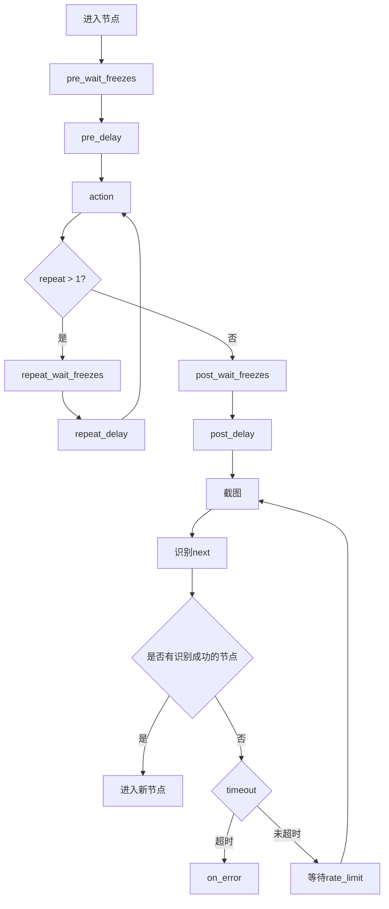

# 任务流水线配置

<cite>
**本文档引用文件**  
- [default_pipeline.json](file://assets/resource/base/default_pipeline.json)
- [巅峰对决.json](file://assets/resource/base/pipeline/日常任务/巅峰对决.json)
- [领取邮件.json](file://assets/resource/base/pipeline/日常任务/领取邮件.json)
- [回到主界面.json](file://assets/resource/base/pipeline/通用/回到主界面.json)
- [merge_pipeline.py](file://ci/merge_pipeline.py)
- [3.1-任务流水线协议.md](file://instructions/maafw-guide/3.1-任务流水线协议.md)
- [tasker.py](file://agent/customs/maahelper/tasker.py)
- [pipeline_helper.py](file://agent/customs/global_func/pipeline_helper.py)
- [peak_showdown.py](file://agent/customs/special_treat/peak_showdown.py)
- [receive_reward.py](file://agent/customs/special_treat/receive_reward.py)
</cite>

## 目录
1. [简介](#简介)
2. [任务流水线JSON结构详解](#任务流水线json结构详解)
3. [全局默认配置机制](#全局默认配置机制)
4. [多资源包合并流程](#多资源包合并流程)
5. [自定义资源包开发规范](#自定义资源包开发规范)
6. [核心组件分析](#核心组件分析)
7. [执行流程与控制逻辑](#执行流程与控制逻辑)
8. [高级功能与扩展机制](#高级功能与扩展机制)
9. [最佳实践与故障排除](#最佳实践与故障排除)

## 简介
MaaDuDuL的任务流水线（Pipeline）系统是一个基于JSON配置的自动化任务执行框架，用于定义和执行游戏自动化任务。该系统通过模块化的JSON配置文件来描述任务流程，支持复杂的条件跳转、超时处理和自定义逻辑。本文档将深入解析该系统的配置机制，以"日常任务"中的"巅峰对决.json"和"领取邮件.json"为例，详细说明其核心概念和实现原理。

## 任务流水线JSON结构详解

任务流水线配置文件采用JSON格式，由多个节点（Node）构成，每个节点包含识别、动作、跳转等核心属性。以下以"巅峰对决.json"和"领取邮件.json"为例进行详细说明。

### 节点命名与结构
每个节点在JSON中以键值对形式存在，键名为节点名称，值为节点配置对象。节点名称通常采用"功能_阶段"的命名规范，如"巅峰对决_对战开始"、"领取邮件_进入邮件面板"等，便于理解和维护。

```json
{
    "巅峰对决_对战开始": {
        "action": {
            "param": {},
            "type": "DoNothing"
        },
        "next": ["巅峰对决_对战周期检查"],
        "recognition": {
            "param": {},
            "type": "DirectHit"
        }
    }
}
```

### 识别区域坐标
识别区域坐标通过`roi`（Region of Interest）参数定义，指定在屏幕截图中需要识别的矩形区域。`roi`参数为一个包含四个元素的数组：[x, y, width, height]，表示从坐标(x,y)开始，宽度为width，高度为height的矩形区域。

在"巅峰对决.json"中，多个节点使用OCR识别来检测特定文本：
```json
"recognition": {
    "param": {
        "expected": ["请选择对手"],
        "roi": [544, 69, 195, 69]
    },
    "type": "OCR"
}
```

### 操作类型
操作类型通过`action.type`字段定义，支持多种操作：
- `Click`：点击操作
- `DoNothing`：无操作（仅用于流程控制）
- `Custom`：自定义操作
- `Swipe`：滑动操作
- `LongPress`：长按操作

在"领取邮件.json"中，"领取邮件_确认领取"节点执行点击操作：
```json
"action": {
    "param": {
        "target": [655, 682, 0, 0]
    },
    "type": "Click"
}
```

### 条件跳转逻辑
条件跳转逻辑通过`next`和`on_error`字段实现。`next`定义正常流程的下一个节点，`on_error`定义识别超时或动作执行失败后的跳转节点。

在"巅峰对决.json"中，"巅峰对决_选择对手"节点根据识别结果跳转到不同分支：
```json
"next": ["巅峰对决_开始对战", "巅峰对决_对战次数耗尽"],
"recognition": {
    "param": {
        "custom_recognition": "pick_opponent"
    },
    "type": "Custom"
}
```

### 超时设置
超时设置通过`timeout`字段定义，单位为毫秒。当节点在指定时间内未能识别成功时，将触发`on_error`流程。

在"巅峰对决.json"中，"巅峰对决_开始对战"节点设置了较长的超时时间：
```json
"timeout": 200000
```

**Section sources**
- [巅峰对决.json](file://assets/resource/base/pipeline/日常任务/巅峰对决.json)
- [领取邮件.json](file://assets/resource/base/pipeline/日常任务/领取邮件.json)

## 全局默认配置机制

### Default配置块的作用
`default_pipeline.json`文件中的`Default`配置块定义了所有任务节点的全局默认参数，避免在每个节点中重复配置相同的值。根据文件内容：

```json
{
    "Default": {
        "timeout": 30000,
        "pre_delay": 600
    }
}
```

- `timeout=30000ms`：所有节点的默认超时时间为30秒
- `pre_delay=600ms`：所有节点在识别到目标后，执行动作前的默认延迟为600毫秒

### 继承机制
全局默认配置的继承遵循优先级规则，从高到低依次为：
1. 节点中直接定义的参数
2. `default_pipeline.json`中对应算法/动作类型的默认参数
3. `default_pipeline.json`中`Default`对象的默认参数
4. 框架内置的默认值

这种继承机制允许在保持全局一致性的同时，为特定节点提供个性化的配置。例如，虽然全局默认超时为30秒，但"巅峰对决_开始对战"节点可以覆盖为200秒以适应长时间等待。

### 配置继承示例
假设`default_pipeline.json`配置如下：
```json
{
    "Default": {
        "timeout": 30000,
        "pre_delay": 600
    },
    "Click": {
        "action": "Click",
        "target": true
    }
}
```

在"领取邮件.json"中，节点可以继承这些默认值，同时覆盖特定参数：
```json
"领取邮件_确认领取": {
    "action": {
        "param": {
            "target": [655, 682, 0, 0]
        },
        "type": "Click"
    },
    "timeout": 15000,
    "recognition": {
        "param": {
            "expected": ["请点击屏幕继续"]
        },
        "type": "OCR"
    }
}
```
在此例中，`timeout`被覆盖为15秒，而`pre_delay`继承全局默认值600毫秒。

**Section sources**
- [default_pipeline.json](file://assets/resource/base/default_pipeline.json)
- [3.1-任务流水线协议.md](file://instructions/maafw-guide/3.1-任务流水线协议.md)

## 多资源包合并流程

### merge_pipeline.py实现逻辑
`merge_pipeline.py`脚本负责将分散的JSON配置文件合并为单一的`nodes.json`文件，实现模块化资源管理。其核心逻辑如下：

1. **递归扫描**：遍历`assets/resource`目录下所有子目录中的`pipeline`文件夹
2. **合并JSON**：读取所有`.json`文件，将其内容合并到一个字典中
3. **写入文件**：将合并后的数据写入`nodes.json`
4. **清理结构**：删除原始的JSON文件和目录结构

```python
def merge_json_files(pipeline_dir):
    """合并pipeline目录下所有.json文件到nodes.json"""
    merged_data = {}
    
    def collect_json(directory):
        for item in directory.iterdir():
            if item.is_dir():
                collect_json(item)
            elif item.suffix == ".json":
                with open(item, "r", encoding="utf-8") as f:
                    data = json.load(f)
                    if isinstance(data, dict):
                        merged_data.update(data)
    
    collect_json(pipeline_dir)
    
    # 写入nodes.json
    nodes_file = pipeline_dir / "nodes.json"
    with open(nodes_file, "w", encoding="utf-8") as f:
        json.dump(merged_data, f, ensure_ascii=False, indent=4)
    
    # 删除原来的文件夹和文件（保留nodes.json）
    for item in pipeline_dir.iterdir():
        if item.name == "nodes.json":
            continue
        if item.is_dir():
            shutil.rmtree(item)
        else:
            item.unlink()
```

### 执行流程
脚本的执行流程如下：
1. 确定工作目录为项目根目录
2. 定位`assets/resource`目录
3. 查找所有包含`pipeline`子目录的资源包
4. 对每个`pipeline`目录执行合并操作
5. 输出处理日志

### 模块化资源开发支持
该机制支持模块化资源开发，开发者可以将不同功能的配置文件放在不同的目录中，如：
- `日常任务/`
- `活动任务/`
- `通用/`
- `开荒功能/`

每个目录可以独立开发和测试，最终通过合并脚本集成到主系统中。

### 版本化管理
通过将不同版本的资源包放在独立目录中，可以实现版本化管理。例如：
- `base_v1/`
- `base_v2/`
- `activity_2024/`

在加载资源时，按顺序加载这些目录，后加载的配置会覆盖先加载的同名节点，实现平滑的版本升级。

**Section sources**
- [merge_pipeline.py](file://ci/merge_pipeline.py)

## 自定义资源包开发规范

### 目录结构
自定义资源包应遵循以下目录结构：
```
资源包根目录/
├── pipeline/
│   ├── 功能分类/
│   │   ├── 任务1.json
│   │   ├── 任务2.json
│   │   └── ...
│   └── 通用/
│       ├── 回到主界面.json
│       └── ...
├── image/
│   └── 模板图片.png
├── model/
│   └── OCR模型
└── default_pipeline.json
```

### 命名规范
1. **文件命名**：使用中文描述性名称，如"巅峰对决.json"、"领取邮件.json"
2. **节点命名**：采用"功能_阶段"格式，如"巅峰对决_对战开始"
3. **避免冲突**：确保节点名称在全局范围内唯一，或通过命名空间避免冲突

### 配置最佳实践
1. **合理使用默认值**：在`default_pipeline.json`中定义全局默认参数
2. **模块化设计**：将相关功能的节点放在同一文件中
3. **注释说明**：在JSON文件中添加必要的注释，说明节点功能和参数含义
4. **版本控制**：为配置文件添加版本信息，便于追踪变更

### 测试与验证
1. **独立测试**：在合并前对单个JSON文件进行功能测试
2. **冲突检查**：确保没有节点名称冲突
3. **性能优化**：合理设置`timeout`和`rate_limit`，避免不必要的等待
4. **错误处理**：为关键节点配置`on_error`流程，提高鲁棒性

**Section sources**
- [merge_pipeline.py](file://ci/merge_pipeline.py)
- [default_pipeline.json](file://assets/resource/base/default_pipeline.json)

## 核心组件分析

### 任务执行器（Tasker）
`tasker.py`是任务执行的核心组件，负责启动和监控任务流程。其主要功能包括：

1. **任务注入**：在任务开始前自动注入运行监测器
2. **流程控制**：处理`next`和`on_error`跳转逻辑
3. **状态监控**：实时监控任务执行状态

```python
def run(self, entry: str, pipeline_override: Dict = {}):
    # 为所有节点注入运行监测器
    node_list = self.context.tasker.resource.node_list
    for node_name in node_list:
        # 处理 next 字段注入
        if current_next and current_next[0] != "_run_task_monitor_inject":
            new_next = ["_run_task_monitor_inject"] + current_next
            # 更新 pipeline_override
```

### 自定义动作处理器
`pipeline_helper.py`定义了自定义动作处理器，扩展了基本操作功能：

```python
@AgentServer.custom_action("run")
class Run(CustomAction):
    def run(self, context: Context, argv: CustomAction.RunArg) -> bool:
        try:
            args = ParamAnalyzer(argv)
            entry = args.get(["task", "t", "node", "n", "entry"])
            expected_end = args.get(["expected_end", "ee", "e"], "")
            
            task_detail = Tasker(context).run(entry)
            
            if expected_end:
                if Tasker.get_last_node_name(task_detail) != expected_end:
                    return False
            return True
        except Exception as e:
            return Prompter.error("运行任务", e)
```

### 特殊处理模块
`special_treat`目录包含针对特定功能的自定义处理逻辑：

#### 巅峰对决处理
`peak_showdown.py`实现了巅峰对决的特殊逻辑，包括战斗力解析和对手选择：

```python
@AgentServer.custom_recognition("pick_opponent")
class PickOpponent(CustomRecognition):
    def analyze(self, context: Context, argv: CustomRecognition.AnalyzeArg) -> CustomRecognition.AnalyzeResult:
        try:
            args = ParamAnalyzer(argv)
            strategy = args.get(["strategy", "s"], "min_power")
            
            if strategy == "min_power":
                # 识别所有对手的战斗力，选择最低的
                rh = RecoHelper(context, argv).recognize("巅峰对决_识别战斗力")
                results = rh.filtered_results
                min_result = min(results, key=lambda res: parse_power(res.text))
                return RecoHelper.rt(min_result)
```

#### 奖励领取处理
`receive_reward.py`处理任务奖励领取逻辑：

```python
@AgentServer.custom_action("receive_task_reward")
class ReceiveTaskReward(CustomAction):
    def run(self, context: Context, argv: CustomAction.RunArg) -> bool:
        try:
            args = ParamAnalyzer(argv)
            category = args.get(["category", "c"])
            
            Tasker(context).run(
                "领取奖励_领取任务奖励开始",
                {
                    "领取奖励_进入具体任务面板": {"expected": f"{category}"},
                },
            )
            return True
        except Exception as e:
            return Prompter.error("领取任务奖励", e)
```

**Section sources**
- [tasker.py](file://agent/customs/maahelper/tasker.py)
- [pipeline_helper.py](file://agent/customs/global_func/pipeline_helper.py)
- [peak_showdown.py](file://agent/customs/special_treat/peak_showdown.py)
- [receive_reward.py](file://agent/customs/special_treat/receive_reward.py)

## 执行流程与控制逻辑

### 任务触发机制
任务通过`tasker.post_task`接口指定入口节点启动，如"巅峰对决_开始"或"领取邮件_开始"。入口节点通常执行初始化操作，如记录任务开始时间。

### 顺序检测流程
系统对当前节点的`next`列表进行顺序检测，依次尝试识别每个子节点配置的`recognition`特征。当检测到某个子节点匹配成功时，立即终止后续节点检测，并执行匹配节点的`action`操作。

### 生命周期流程
节点的完整生命周期遵循以下顺序：
1. `pre_wait_freezes`：等待画面静止
2. `pre_delay`：执行动作前的延迟
3. `action`：执行指定动作
4. `repeat_wait_freezes`：重复动作间的等待（如果`repeat > 1`）
5. `repeat_delay`：重复动作间的延迟（如果`repeat > 1`）
6. `post_wait_freezes`：动作后的等待画面静止
7. `post_delay`：动作后的延迟
8. 识别`next`节点



**Diagram sources**
- [3.1-任务流水线协议.md](file://instructions/maafw-guide/3.1-任务流水线协议.md)

## 高级功能与扩展机制

### 自定义识别与动作
系统支持通过Python扩展自定义识别算法和动作类型。通过`@AgentServer.custom_recognition`和`@AgentServer.custom_action`装饰器，可以注册自定义功能。

#### 自定义识别示例
`pick_opponent`自定义识别器根据战斗力选择对手：
```python
@AgentServer.custom_recognition("pick_opponent")
class PickOpponent(CustomRecognition):
    def analyze(self, context: Context, argv: CustomRecognition.AnalyzeArg) -> CustomRecognition.AnalyzeResult:
        # 识别所有对手的战斗力，选择最低的
        rh = RecoHelper(context, argv).recognize("巅峰对决_识别战斗力")
        results = rh.filtered_results
        min_result = min(results, key=lambda res: parse_power(res.text))
        return RecoHelper.rt(min_result)
```

#### 自定义动作示例
`receive_task_reward`自定义动作处理奖励领取：
```python
@AgentServer.custom_action("receive_task_reward")
class ReceiveTaskReward(CustomAction):
    def run(self, context: Context, argv: CustomAction.RunArg) -> bool:
        category = args.get(["category", "c"])
        Tasker(context).run(
            "领取奖励_领取任务奖励开始",
            {
                "领取奖励_进入具体任务面板": {"expected": f"{category}"},
            },
        )
        return True
```

### 参数解析与传递
`ParamAnalyzer`类提供强大的参数解析功能，支持多种参数别名：
```python
args = ParamAnalyzer(argv)
entry = args.get(["task", "t", "node", "n", "entry"])
```

### 错误处理与恢复
系统通过`on_error`机制实现错误恢复，当节点识别超时或动作执行失败时，跳转到指定的错误处理节点。这提高了自动化流程的鲁棒性，能够应对游戏界面的意外变化。

**Section sources**
- [peak_showdown.py](file://agent/customs/special_treat/peak_showdown.py)
- [receive_reward.py](file://agent/customs/special_treat/receive_reward.py)
- [tasker.py](file://agent/customs/maahelper/tasker.py)

## 最佳实践与故障排除

### 配置优化建议
1. **避免过度依赖延迟**：尽量使用中间过程节点而非`pre_delay`和`post_delay`
2. **合理设置超时**：根据操作的实际耗时设置`timeout`，避免过长或过短
3. **使用精确识别区域**：通过`roi`缩小识别范围，提高识别速度和准确性
4. **模块化设计**：将复杂流程分解为多个小任务，便于维护和调试

### 常见问题与解决方案
1. **节点无法识别**：
   - 检查`roi`区域是否正确
   - 调整识别算法参数（如OCR的`expected`文本）
   - 增加`timeout`时间

2. **流程卡死**：
   - 检查`next`列表是否为空
   - 确保有适当的`on_error`处理
   - 验证自定义识别逻辑的正确性

3. **合并失败**：
   - 检查JSON文件格式是否正确
   - 确保节点名称不冲突
   - 验证文件编码为UTF-8

4. **性能问题**：
   - 优化`rate_limit`设置
   - 减少不必要的识别操作
   - 使用更高效的识别算法

### 调试技巧
1. **启用详细日志**：查看任务执行的详细过程
2. **逐步测试**：从简单流程开始，逐步增加复杂度
3. **使用截图验证**：检查实际截图与`roi`区域的匹配情况
4. **模拟异常**：测试`on_error`流程的正确性

**Section sources**
- [tasker.py](file://agent/customs/maahelper/tasker.py)
- [3.1-任务流水线协议.md](file://instructions/maafw-guide/3.1-任务流水线协议.md)