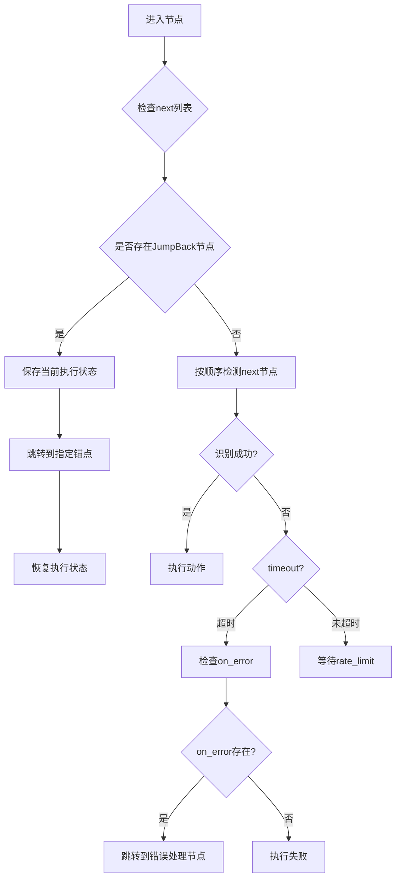
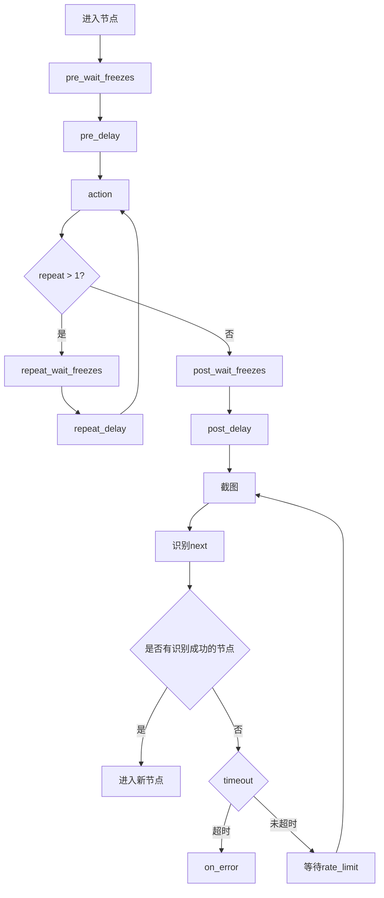

# 任务流水线配置

<cite>
**本文档引用文件**  
- [default_pipeline.json](file://assets/resource/base/default_pipeline.json)
- [每日采购.json](file://assets/resource/base/pipeline/日常任务/每日采购.json)
- [领取邮件.json](file://assets/resource/base/pipeline/日常任务/领取邮件.json)
- [purchase.md](file://assets/resource/descs/daily/purchase.md)
- [interface.json](file://assets/interface.json)
- [store.py](file://agent/customs/special_treat/store.py)
- [merge_pipeline.py](file://ci/merge_pipeline.py)
</cite>

## 目录
1. [简介](#简介)
2. [任务流水线JSON结构详解](#任务流水线json结构详解)
3. [全局默认配置机制](#全局默认配置机制)
4. [多资源包合并流程](#多资源包合并流程)
5. [自定义资源包开发规范](#自定义资源包开发规范)
6. [核心组件分析](#核心组件分析)
7. [执行流程与控制逻辑](#执行流程与控制逻辑)
8. [高级功能与扩展机制](#高级功能与扩展机制)
9. [最佳实践与故障排除](#最佳实践与故障排除)

## 简介
MaaDuDuL的任务流水线（Pipeline）系统是一个基于JSON配置的自动化任务执行框架，用于定义和执行游戏自动化任务。该系统通过模块化的JSON配置文件来描述任务流程，支持复杂的条件跳转、超时处理、自定义逻辑以及增强的错误处理与恢复策略。本文档将深入解析该系统的配置机制，以"日常任务"中的"每日采购.json"和"领取邮件.json"为例，详细说明其核心概念和实现原理，并重点介绍新增的JumpBack机制、错误处理增强与异常恢复策略。

## 任务流水线JSON结构详解

任务流水线配置文件采用JSON格式，由多个节点（Node）构成，每个节点包含识别、动作、跳转等核心属性。以下以"每日采购.json"和"领取邮件.json"为例进行详细说明。

### 节点命名与结构
每个节点在JSON中以键值对形式存在，键名为节点名称，值为节点配置对象。节点名称通常采用"功能_阶段"的命名规范，如"每日采购_一键购买日常物品"、"领取邮件_进入邮件面板"等，便于理解和维护。

```json
{
    "每日采购_一键购买日常物品": {
        "action": {
            "param": {},
            "type": "Click"
        },
        "next": [
            "每日采购_确认一键购买日常物品",
            "每日采购_今日已购日常物品"
        ],
        "on_error": [
            "每日采购_日常商店结束"
        ],
        "recognition": {
            "param": {
                "expected": ["键购买"],
                "roi": [1036, 603, 238, 113]
            },
            "type": "OCR"
        },
        "timeout": 5000
    }
}
```

### 识别区域坐标
识别区域坐标通过`roi`（Region of Interest）参数定义，指定在屏幕截图中需要识别的矩形区域。`roi`参数为一个包含四个元素的数组：[x, y, width, height]，表示从坐标(x,y)开始，宽度为width，高度为height的矩形区域。

在"每日采购.json"中，多个节点使用OCR识别来检测特定文本：
```json
"recognition": {
    "param": {
        "expected": ["请选择对手"],
        "roi": [544, 69, 195, 69]
    },
    "type": "OCR"
}
```

### 操作类型
操作类型通过`action.type`字段定义，支持多种操作：
- `Click`：点击操作
- `DoNothing`：无操作（仅用于流程控制）
- `Custom`：自定义操作
- `Swipe`：滑动操作
- `LongPress`：长按操作

在"领取邮件.json"中，"领取邮件_确认领取"节点执行点击操作：
```json
"action": {
    "param": {
        "target": [655, 682, 0, 0]
    },
    "type": "Click"
}
```

### 条件跳转逻辑
条件跳转逻辑通过`next`和`on_error`字段实现。`next`定义正常流程的下一个节点，`on_error`定义识别超时或动作执行失败后的跳转节点。

在"每日采购.json"中，"每日采购_一键购买日常物品"节点根据识别结果跳转到不同分支：
```json
"next": [
    "每日采购_确认一键购买日常物品",
    "每日采购_今日已购日常物品"
],
"on_error": [
    "每日采购_日常商店结束"
]
```

### JumpBack机制
JumpBack机制允许节点在执行过程中回跳到之前定义的锚点或特定节点，实现灵活的流程控制。在"领取邮件.json"中，可以看到JumpBack的典型用法：

```json
"next": [
    "返回主界面_检测主界面",
    {
        "jump_back": true,
        "name": "返回主界面_导航类返回"
    },
    {
        "jump_back": true,
        "name": "返回主界面_面板类返回"
    }
]
```

JumpBack机制的关键特性：
- `jump_back`: 布尔值，指示是否启用回跳
- `name`: 目标节点名称
- 支持锚点引用（anchor），通过`anchor: true`标识

### 超时设置
超时设置通过`timeout`字段定义，单位为毫秒。当节点在指定时间内未能识别成功时，将触发`on_error`流程。

在"每日采购.json"中，"每日采购_一键购买日常物品"节点设置了较短的超时时间：
```json
"timeout": 5000
```

**Section sources**
- [每日采购.json](file://assets/resource/base/pipeline/日常任务/每日采购.json)
- [领取邮件.json](file://assets/resource/base/pipeline/日常任务/领取邮件.json)

## 全局默认配置机制

### Default配置块的作用
`default_pipeline.json`文件中的`Default`配置块定义了所有任务节点的全局默认参数，避免在每个节点中重复配置相同的值。根据文件内容：

```json
{
    "Default": {
        "timeout": 30000,
        "pre_delay": 600,
        "repeat_delay": 400
    }
}
```

- `timeout=30000ms`：所有节点的默认超时时间为30秒
- `pre_delay=600ms`：所有节点在识别到目标后，执行动作前的默认延迟为600毫秒
- `repeat_delay=400ms`：所有节点重复动作间的默认延迟为400毫秒

### 继承机制
全局默认配置的继承遵循优先级规则，从高到低依次为：
1. 节点中直接定义的参数
2. `default_pipeline.json`中对应算法/动作类型的默认参数
3. `default_pipeline.json`中`Default`对象的默认参数
4. 框架内置的默认值

这种继承机制允许在保持全局一致性的同时，为特定节点提供个性化的配置。例如，虽然全局默认超时为30秒，但"每日采购_一键购买日常物品"节点可以覆盖为5秒以适应快速识别。

### 配置继承示例
假设`default_pipeline.json`配置如下：
```json
{
    "Default": {
        "timeout": 30000,
        "pre_delay": 600
    },
    "Click": {
        "action": "Click",
        "target": true
    }
}
```

在"领取邮件.json"中，节点可以继承这些默认值，同时覆盖特定参数：
```json
"领取邮件_确认领取": {
    "action": {
        "param": {
            "target": [655, 682, 0, 0]
        },
        "type": "Click"
    },
    "timeout": 15000,
    "recognition": {
        "param": {
            "expected": ["请点击屏幕继续"]
        },
        "type": "OCR"
    }
}
```
在此例中，`timeout`被覆盖为15秒，而`pre_delay`继承全局默认值600毫秒。

**Section sources**
- [default_pipeline.json](file://assets/resource/base/default_pipeline.json)

## 多资源包合并流程

### merge_pipeline.py实现逻辑
`merge_pipeline.py`脚本负责将分散的JSON配置文件合并为单一的`nodes.json`文件，实现模块化资源管理。其核心逻辑如下：

1. **递归扫描**：遍历`assets/resource`目录下所有子目录中的`pipeline`文件夹
2. **合并JSON**：读取所有`.json`文件，将其内容合并到一个字典中
3. **写入文件**：将合并后的数据写入`nodes.json`
4. **清理结构**：删除原始的JSON文件和目录结构

```python
def merge_json_files(pipeline_dir):
    """合并pipeline目录下所有.json文件到nodes.json"""
    merged_data = {}
    
    def collect_json(directory):
        for item in directory.iterdir():
            if item.is_dir():
                collect_json(item)
            elif item.suffix == ".json":
                try:
                    with open(item, "r", encoding="utf-8") as f:
                        data = json.load(f)
                        if isinstance(data, dict):
                            merged_data.update(data)
                    print(f"已读取: {item.relative_to(pipeline_dir)}", flush=True)
                except Exception as e:
                    print(f"读取文件 {item.name} 时出错: {e}", flush=True)
    
    collect_json(pipeline_dir)
    
    # 写入nodes.json
    nodes_file = pipeline_dir / "nodes.json"
    try:
        with open(nodes_file, "w", encoding="utf-8") as f:
            json.dump(merged_data, f, ensure_ascii=False, indent=4)
        print(f"已创建合并文件: {nodes_file}", flush=True)
    except Exception as e:
        print(f"写入nodes.json时出错: {e}", flush=True)
        return
    
    # 删除原来的文件夹和文件（保留nodes.json）
    for item in pipeline_dir.iterdir():
        if item.name == "nodes.json":
            continue
        try:
            if item.is_dir():
                shutil.rmtree(item)
                print(f"已删除目录: {item.name}", flush=True)
            else:
                item.unlink()
                print(f"已删除文件: {item.name}", flush=True)
        except Exception as e:
            print(f"删除 {item.name} 时出错: {e}", flush=True)
```

### 执行流程
脚本的执行流程如下：
1. 确定工作目录为项目根目录
2. 定位`assets/resource`目录
3. 查找所有包含`pipeline`子目录的资源包
4. 对每个`pipeline`目录执行合并操作
5. 输出处理日志

### 模块化资源开发支持
该机制支持模块化资源开发，开发者可以将不同功能的配置文件放在不同的目录中，如：
- `日常任务/`
- `活动任务/`
- `通用/`
- `开荒功能/`

每个目录可以独立开发和测试，最终通过合并脚本集成到主系统中。

### 版本化管理
通过将不同版本的资源包放在独立目录中，可以实现版本化管理。例如：
- `base_v1/`
- `base_v2/`
- `activity_2024/`

在加载资源时，按顺序加载这些目录，后加载的配置会覆盖先加载的同名节点，实现平滑的版本升级。

**Section sources**
- [merge_pipeline.py](file://ci/merge_pipeline.py)

## 自定义资源包开发规范

### 目录结构
自定义资源包应遵循以下目录结构：
```
资源包根目录/
├── pipeline/
│   ├── 功能分类/
│   │   ├── 任务1.json
│   │   ├── 任务2.json
│   │   └── ...
│   └── 通用/
│       ├── 回到主界面.json
│       └── ...
├── image/
│   └── 模板图片.png
├── model/
│   └── OCR模型
└── default_pipeline.json
```

### 命名规范
1. **文件命名**：使用中文描述性名称，如"每日采购.json"、"领取邮件.json"
2. **节点命名**：采用"功能_阶段"格式，如"每日采购_一键购买日常物品"
3. **避免冲突**：确保节点名称在全局范围内唯一，或通过命名空间避免冲突

### 配置最佳实践
1. **合理使用默认值**：在`default_pipeline.json`中定义全局默认参数
2. **模块化设计**：将相关功能的节点放在同一文件中
3. **注释说明**：在JSON文件中添加必要的注释，说明节点功能和参数含义
4. **版本控制**：为配置文件添加版本信息，便于追踪变更
5. **错误处理**：为关键节点配置`on_error`流程，提高鲁棒性
6. **JumpBack使用**：合理使用JumpBack机制实现灵活的流程控制

### 测试与验证
1. **独立测试**：在合并前对单个JSON文件进行功能测试
2. **冲突检查**：确保没有节点名称冲突
3. **性能优化**：合理设置`timeout`和`rate_limit`，避免不必要的等待
4. **错误处理**：为关键节点配置`on_error`流程，提高鲁棒性
5. **JumpBack验证**：测试JumpBack机制的正确性和稳定性

**Section sources**
- [merge_pipeline.py](file://ci/merge_pipeline.py)
- [default_pipeline.json](file://assets/resource/base/default_pipeline.json)

## 核心组件分析

### 商店购买与礼包领取组件
`store.py`模块提供了商店购买和礼包领取功能的自定义动作实现，扩展了基础的购买和领取能力。

#### 礼包领取动作
`Gift`自定义动作处理不同类型礼包的领取操作：
```python
@AgentServer.custom_action("gift")
class Gift(CustomAction):
    def run(self, context: Context, argv: CustomAction.RunArg) -> bool:
        try:
            args = ParamAnalyzer(argv)
            gift = args.get(["gift", "g"])
            
            Tasker(context).run(
                "每日采购_购买礼包开始",
                {
                    "每日采购_选中礼包": {"expected": gift},
                },
            )
            return True
        except Exception as e:
            return Prompter.error("领取指定礼包", e)
```

#### 商品购买动作
`Buy`自定义动作处理商店中商品的购买操作：
```python
@AgentServer.custom_action("buy")
class Buy(CustomAction):
    def run(self, context: Context, argv: CustomAction.RunArg) -> bool:
        try:
            args = ParamAnalyzer(argv)
            goods = args.get(["goods", "g", "commodity", "c"])
            
            Tasker(context).run(
                "每日采购_购买商品",
                {
                    "每日采购_查看商品详情": {"expected": goods},
                },
            )
            return True
        except Exception as e:
            return Prompter.error("购买指定商品", e)
```

### 接口配置系统
`interface.json`文件定义了每日采购任务的用户界面配置，支持多种采购模式和选项：

#### 采购模式配置
```json
"每日采购-日常商店-采购模式": {
    "type": "select",
    "label": "采购模式",
    "cases": [
        {
            "name": "逐个购买",
            "pipeline_override": {
                "每日采购_进入日常商店": {
                    "next": "每日采购_购买日常朱珠糖"
                }
            },
            "option": [
                "每日采购-日常商店-朱珠糖",
                "每日采购-日常商店-星星糖",
                "每日采购-日常商店-锻造书",
                "每日采购-日常商店-魔卡龙",
                "每日采购-日常商店-初棉",
                "每日采购-日常商店-中棉",
                "每日采购-日常商店-成长材料",
                "每日采购-日常商店-房间装扮",
                "每日采购-日常商店-料理"
            ]
        },
        {
            "name": "一键购买",
            "description": "需自行勾选好采购物品",
            "pipeline_override": {
                "每日采购_进入日常商店": {
                    "next": "每日采购_一键购买日常物品"
                }
            }
        }
    ]
}
```

#### 采购选项配置
```json
"每日采购-日常商店-朱珠糖": {
    "type": "switch",
    "label": "朱珠糖",
    "cases": [
        {
            "name": "No",
            "pipeline_override": {
                "每日采购_购买日常朱珠糖": {
                    "action": "DoNothing"
                }
            }
        },
        {
            "name": "Yes"
        }
    ]
}
```

### 任务描述文档
`purchase.md`文件提供了每日采购任务的功能说明和界面描述：
- **功能说明**：每日免费礼包领取与商店采购
- **起止界面**：任意界面到主界面
- **任务类型**：可连续任务、日常任务

**Section sources**
- [store.py](file://agent/customs/special_treat/store.py)
- [interface.json](file://assets/interface.json)
- [purchase.md](file://assets/resource/descs/daily/purchase.md)

## 执行流程与控制逻辑

### 任务触发机制
任务通过`tasker.post_task`接口指定入口节点启动，如"每日采购_开始"或"领取邮件_开始"。入口节点通常执行初始化操作，如记录任务开始时间。

### 顺序检测流程
系统对当前节点的`next`列表进行顺序检测，依次尝试识别每个子节点配置的`recognition`特征。当检测到某个子节点匹配成功时，立即终止后续节点检测，并执行匹配节点的`action`操作。

### JumpBack执行流程
JumpBack机制的执行流程如下：


```mermaid
graph TB
A[进入节点] --> B{检查next列表}
B --> C{是否存在JumpBack节点}
C --> |是| D[保存当前执行状态]
D --> E[跳转到指定锚点]
E --> F[恢复执行状态]
C --> |否| G[按顺序检测next节点]
G --> H{识别成功?}
H --> |是| I[执行动作]
H --> |否| J{timeout?}
J --> |超时| K[检查on_error]
J --> |未超时| L[等待rate_limit]
K --> M{on_error存在?}
M --> |是| N[跳转到错误处理节点]
M --> |否| O[执行失败]
```

**Diagram sources**
- [领取邮件.json](file://assets/resource/base/pipeline/日常任务/领取邮件.json)

### 生命周期流程
节点的完整生命周期遵循以下顺序：
1. `pre_wait_freezes`：等待画面静止
2. `pre_delay`：执行动作前的延迟
3. `action`：执行指定动作
4. `repeat_wait_freezes`：重复动作间的等待（如果`repeat > 1`）
5. `repeat_delay`：重复动作间的延迟（如果`repeat > 1`）
6. `post_wait_freezes`：动作后的等待画面静止
7. `post_delay`：动作后的延迟
8. 识别`next`节点


```mermaid
graph TB
A[进入节点] --> B[pre_wait_freezes]
B --> C[pre_delay]
C --> D[action]
D --> M{repeat > 1?}
M --> |是| N[repeat_wait_freezes]
N --> O[repeat_delay]
O --> D
M --> |否| E[post_wait_freezes]
E --> F[post_delay]
F --> P[截图]
P --> G[识别next]
G --> H{是否有识别成功的节点}
H --> |是| I[进入新节点]
H --> |否| J{timeout}
J --> |超时| K[on_error]
J --> |未超时| L[等待rate_limit]
L --> P
```

**Diagram sources**
- [每日采购.json](file://assets/resource/base/pipeline/日常任务/每日采购.json)

## 高级功能与扩展机制

### 自定义识别与动作
系统支持通过Python扩展自定义识别算法和动作类型。通过`@AgentServer.custom_recognition`和`@AgentServer.custom_action`装饰器，可以注册自定义功能。

#### 自定义动作示例
`Gift`和`Buy`自定义动作提供了完整的商店操作能力：
- `gift`：处理不同类型礼包的领取
- `buy`：处理商店中各种商品的购买

#### 参数解析与传递
`ParamAnalyzer`类提供强大的参数解析功能，支持多种参数别名：
```python
args = ParamAnalyzer(argv)
gift = args.get(["gift", "g"])
goods = args.get(["goods", "g", "commodity", "c"])
```

### 错误处理与恢复
系统通过`on_error`机制实现错误恢复，当节点识别超时或动作执行失败时，跳转到指定的错误处理节点。这提高了自动化流程的鲁棒性，能够应对游戏界面的意外变化。

#### 增强的错误处理
新增的错误处理机制包括：
1. **任务停止检测**：通过`process_guard`识别器检测任务是否正在停止
2. **异常捕获**：在自定义动作和识别器中添加异常处理
3. **错误日志**：详细的错误信息记录和提示
4. **回退机制**：通过`on_error`实现智能回退

**Section sources**
- [store.py](file://agent/customs/special_treat/store.py)
- [interface.json](file://assets/interface.json)

## 最佳实践与故障排除

### 配置优化建议
1. **避免过度依赖延迟**：尽量使用中间过程节点而非`pre_delay`和`post_delay`
2. **合理设置超时**：根据操作的实际耗时设置`timeout`，避免过长或过短
3. **使用精确识别区域**：通过`roi`缩小识别范围，提高识别速度和准确性
4. **模块化设计**：将复杂流程分解为多个小任务，便于维护和调试
5. **JumpBack谨慎使用**：避免过度复杂的回跳逻辑，影响流程可读性
6. **错误处理完备**：为关键节点配置`on_error`流程，提高鲁棒性

### 常见问题与解决方案
1. **节点无法识别**：
   - 检查`roi`区域是否正确
   - 调整识别算法参数（如OCR的`expected`文本）
   - 增加`timeout`时间

2. **流程卡死**：
   - 检查`next`列表是否为空
   - 确保有适当的`on_error`处理
   - 验证自定义识别逻辑的正确性
   - 检查JumpBack锚点是否正确配置

3. **JumpBack失效**：
   - 确认锚点名称拼写正确
   - 检查`jump_back`标志是否设置
   - 验证目标节点是否存在

4. **合并失败**：
   - 检查JSON文件格式是否正确
   - 确保节点名称不冲突
   - 验证文件编码为UTF-8

5. **性能问题**：
   - 优化`rate_limit`设置
   - 减少不必要的识别操作
   - 使用更高效的识别算法

6. **错误处理不生效**：
   - 检查`on_error`节点配置
   - 确认异常处理逻辑正确
   - 验证任务停止检测机制

### 调试技巧
1. **启用详细日志**：查看任务执行的详细过程
2. **逐步测试**：从简单流程开始，逐步增加复杂度
3. **使用截图验证**：检查实际截图与`roi`区域的匹配情况
4. **模拟异常**：测试`on_error`流程的正确性
5. **JumpBack验证**：测试回跳机制的稳定性和正确性

### OCR识别最佳实践
1. **模型选择**：使用合适的OCR模型，如`ppocr_v5`
2. **参数优化**：合理设置`expected`文本和`roi`区域
3. **阈值调整**：根据实际情况调整识别阈值
4. **多语言支持**：为不同语言场景配置相应的OCR模型

**Section sources**
- [每日采购.json](file://assets/resource/base/pipeline/日常任务/每日采购.json)
- [领取邮件.json](file://assets/resource/base/pipeline/日常任务/领取邮件.json)
- [store.py](file://agent/customs/special_treat/store.py)
- [interface.json](file://assets/interface.json)