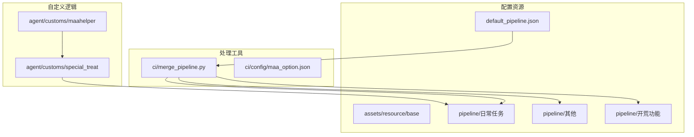
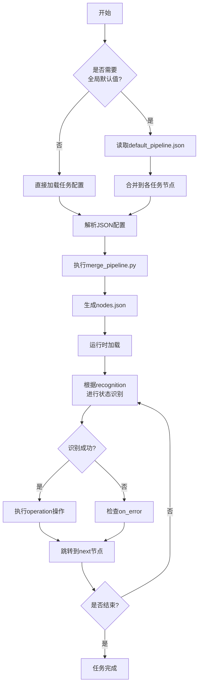
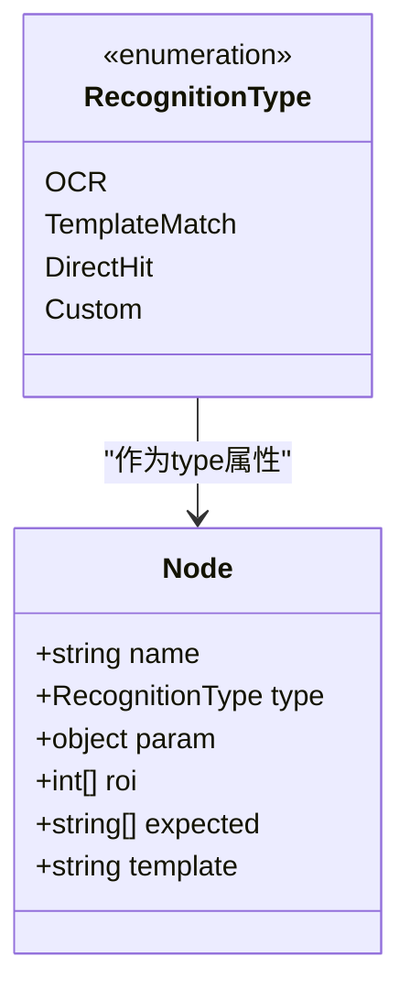
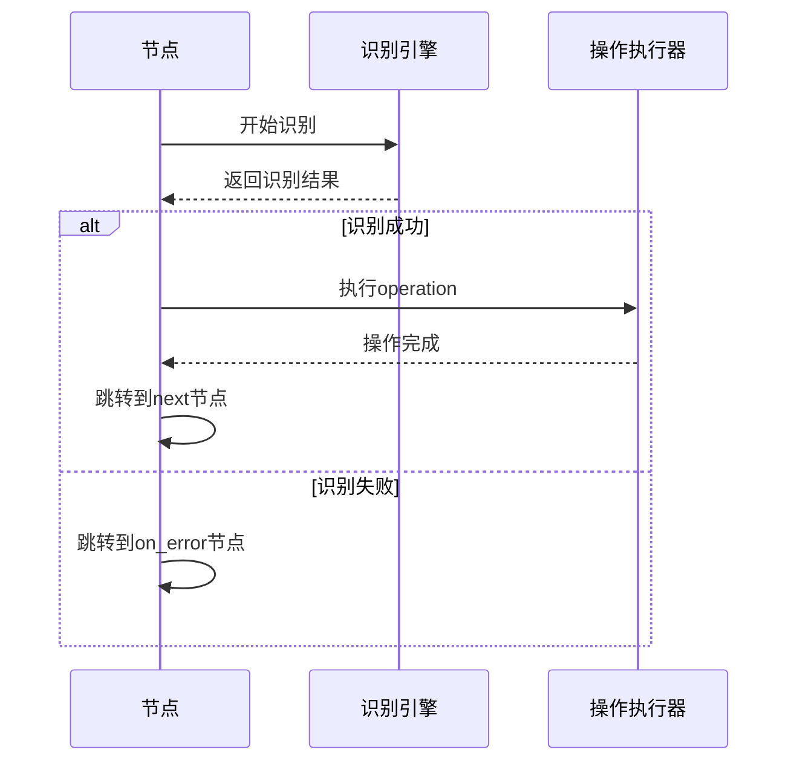
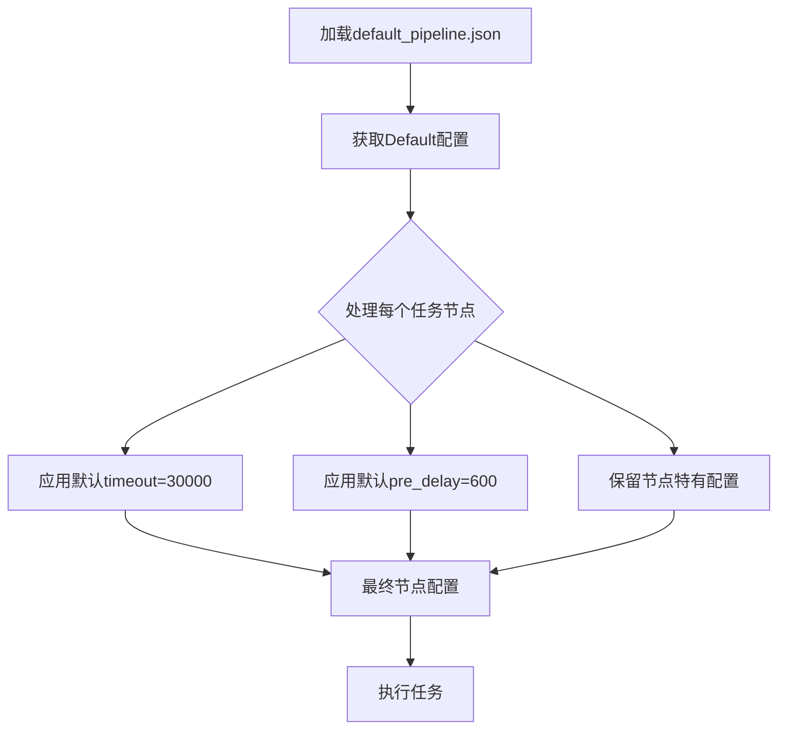
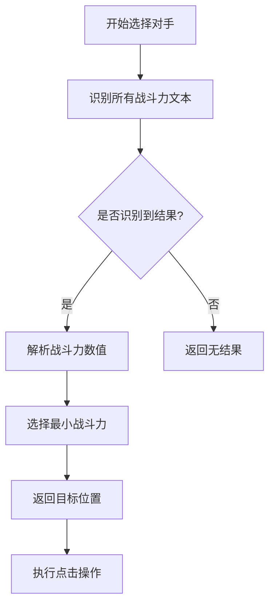
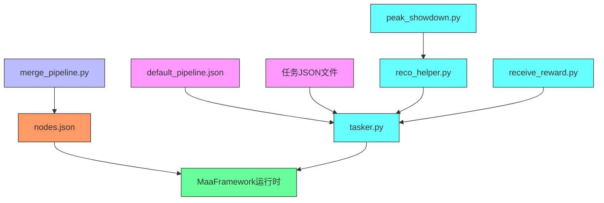

# 任务流水线配置结构

<cite>
**本文档引用文件**  
- [default_pipeline.json](file://assets/resource/base/default_pipeline.json)
- [巅峰对决.json](file://assets/resource/base/pipeline/日常任务/巅峰对决.json)
- [领取邮件.json](file://assets/resource/base/pipeline/日常任务/领取邮件.json)
- [merge_pipeline.py](file://ci/merge_pipeline.py)
- [tasker.py](file://agent/customs/maahelper/tasker.py)
- [reco_helper.py](file://agent/customs/maahelper/reco_helper.py)
- [peak_showdown.py](file://agent/customs/special_treat/peak_showdown.py)
- [receive_reward.py](file://agent/customs/special_treat/receive_reward.py)
</cite>

## 目录
1. [简介](#简介)
2. [项目结构](#项目结构)
3. [核心组件](#核心组件)
4. [架构概述](#架构概述)
5. [详细组件分析](#详细组件分析)
6. [依赖分析](#依赖分析)
7. [性能考量](#性能考量)
8. [故障排除指南](#故障排除指南)
9. [结论](#结论)

## 简介
本文档深入解析MaaDuDuL任务流水线的JSON配置结构，以“巅峰对决.json”和“领取邮件.json”为例，详细说明每个节点的字段定义及其作用机制。重点阐述default_pipeline.json中Default配置块的全局继承机制，以及如何通过自定义节点实现复杂流程控制。同时说明配置文件的编码要求与格式规范，确保兼容merge_pipeline.py的合并处理。

## 项目结构
MaaDuDuL项目的任务流水线配置文件主要位于`assets/resource/base/pipeline`目录下，按功能分类组织。核心配置包括全局默认值文件default_pipeline.json、各任务独立的JSON配置文件，以及用于合并处理的脚本merge_pipeline.py。整个结构支持模块化配置管理，便于维护和扩展。



**图示来源**  
- [default_pipeline.json](file://assets/resource/base/default_pipeline.json)
- [merge_pipeline.py](file://ci/merge_pipeline.py)
- [peak_showdown.py](file://agent/customs/special_treat/peak_showdown.py)

**本节来源**  
- [assets/resource/base](file://assets/resource/base)
- [ci](file://ci)
- [agent/customs](file://agent/customs)

## 核心组件
任务流水线的核心组件包括节点配置结构、全局默认值继承机制、条件跳转逻辑和自定义操作/识别功能。这些组件共同构成了自动化任务执行的基础框架，支持从简单点击到复杂决策的各类操作。

**本节来源**  
- [default_pipeline.json](file://assets/resource/base/default_pipeline.json#L1-L7)
- [巅峰对决.json](file://assets/resource/base/pipeline/日常任务/巅峰对决.json#L1-L566)
- [领取邮件.json](file://assets/resource/base/pipeline/日常任务/领取邮件.json#L1-L240)

## 架构概述
MaaDuDuL任务流水线采用基于JSON的声明式配置架构，通过节点（Node）构成有向图来描述任务流程。每个节点包含识别方式、操作类型、跳转条件等属性，系统按图遍历执行。全局默认值通过default_pipeline.json提供，减少重复配置。自定义逻辑通过Python模块实现复杂业务规则。



**图示来源**  
- [default_pipeline.json](file://assets/resource/base/default_pipeline.json#L1-L7)
- [merge_pipeline.py](file://ci/merge_pipeline.py#L1-L73)
- [tasker.py](file://agent/customs/maahelper/tasker.py#L51-L113)

## 详细组件分析

### 节点字段定义分析
任务流水线中的每个节点都包含一系列标准化字段，用于定义其行为特征。以下以“巅峰对决.json”和“领取邮件.json”为例进行详细分析。

#### name（节点名称）
节点的唯一标识符，用于在流程中定位和跳转。命名通常采用“任务名_功能描述”的格式，如“巅峰对决_开始对战”。

#### recognition（识别方式）
定义节点的触发条件和识别策略，支持多种识别类型：
- **OCR**: 文本识别，需指定expected（期望文本）和roi（识别区域）
- **TemplateMatch**: 模板匹配，通过图像比对识别界面元素
- **DirectHit**: 直接触发，不进行任何识别判断
- **Custom**: 自定义识别，调用Python代码实现复杂逻辑



**图示来源**  
- [巅峰对决.json](file://assets/resource/base/pipeline/日常任务/巅峰对决.json#L129-L134)
- [领取邮件.json](file://assets/resource/base/pipeline/日常任务/领取邮件.json#L145-L150)
- [reco_helper.py](file://agent/customs/maahelper/reco_helper.py#L62-L90)

#### operation（操作类型）
定义节点被激活后执行的具体操作，主要包括：
- **Click**: 点击指定坐标或识别结果
- **Swipe**: 执行滑动操作
- **DoNothing**: 空操作，仅用于流程控制
- **Custom**: 调用自定义动作

#### target（目标坐标或图像）
对于Click操作，target字段定义点击位置。可以是绝对坐标[x, y]，也可以是相对坐标[x, y, 0, 0]。在模板匹配中，template字段指定图像资源路径。

#### condition（条件跳转逻辑）
通过next和on_error字段实现条件跳转：
- **next**: 识别成功后的跳转目标
- **on_error**: 识别失败或超时后的跳转目标
- 支持多个跳转目标，形成分支逻辑



**图示来源**  
- [巅峰对决.json](file://assets/resource/base/pipeline/日常任务/巅峰对决.json#L277-L278)
- [领取邮件.json](file://assets/resource/base/pipeline/日常任务/领取邮件.json#L229-L230)
- [tasker.py](file://agent/customs/maahelper/tasker.py#L71-L89)

#### timeout（超时时间）
定义节点等待识别结果的最大时长（毫秒）。若在此时间内未满足识别条件，则视为失败并跳转到on_error节点。未指定时继承全局默认值。

#### pre_delay（前置延迟）
在节点执行前等待的时间（毫秒），用于确保界面稳定后再进行识别。同样支持继承机制。

### 全局继承机制分析
default_pipeline.json中的Default配置块为所有任务节点提供默认值，实现配置复用。

```json
{
    "Default": {
        "timeout": 30000,
        "pre_delay": 600
    }
}
```

该机制的工作原理如下：
1. 系统加载所有JSON配置文件
2. 将Default配置作为基础模板
3. 每个节点继承这些默认值
4. 节点可覆盖特定字段的默认值

这种设计既保证了配置的一致性，又保留了足够的灵活性。



**图示来源**  
- [default_pipeline.json](file://assets/resource/base/default_pipeline.json#L1-L7)
- [merge_pipeline.py](file://ci/merge_pipeline.py#L21-L34)
- [tasker.py](file://agent/customs/maahelper/tasker.py#L64-L113)

**本节来源**  
- [default_pipeline.json](file://assets/resource/base/default_pipeline.json#L1-L7)
- [巅峰对决.json](file://assets/resource/base/pipeline/日常任务/巅峰对决.json#L525-L526)
- [领取邮件.json](file://assets/resource/base/pipeline/日常任务/领取邮件.json)

### 自定义逻辑实现分析
通过Python代码实现复杂业务逻辑，如“巅峰对决”中的对手选择策略。

#### 自定义识别：选择对手
在peak_showdown.py中实现了PickOpponent类，通过OCR识别所有对手的战斗力，并选择最低者。



**图示来源**  
- [peak_showdown.py](file://agent/customs/special_treat/peak_showdown.py#L51-L94)
- [巅峰对决.json](file://assets/resource/base/pipeline/日常任务/巅峰对决.json#L497-L500)

#### 自定义动作：领取奖励
在receive_reward.py中实现了不同类型的奖励领取逻辑，支持参数化调用。

**本节来源**  
- [peak_showdown.py](file://agent/customs/special_treat/peak_showdown.py#L1-L96)
- [receive_reward.py](file://agent/customs/special_treat/receive_reward.py#L1-L65)
- [reco_helper.py](file://agent/customs/maahelper/reco_helper.py)

## 依赖分析
任务流水线系统的各组件之间存在明确的依赖关系。配置文件依赖于处理脚本进行合并，自定义逻辑模块依赖于基础辅助类，最终所有组件共同依赖于MaaFramework核心。



**图示来源**  
- [merge_pipeline.py](file://ci/merge_pipeline.py)
- [tasker.py](file://agent/customs/maahelper/tasker.py)
- [reco_helper.py](file://agent/customs/maahelper/reco_helper.py)

**本节来源**  
- [go.mod](file://go.mod)
- [ci/merge_pipeline.py](file://ci/merge_pipeline.py)
- [agent/customs](file://agent/customs)

## 性能考量
任务流水线的设计充分考虑了执行效率和资源利用。通过合理的pre_delay设置避免频繁无效识别，timeout机制防止无限等待，自定义识别优化复杂逻辑处理。配置合并过程在启动时完成，减少运行时开销。

## 故障排除指南
常见问题及解决方案：
- **节点无法识别**: 检查roi区域是否正确，调整识别参数
- **跳转逻辑异常**: 验证next和on_error配置，确保目标节点存在
- **自定义逻辑不执行**: 确认Python模块已正确注册，参数传递无误
- **合并失败**: 检查JSON格式是否正确，确保使用UTF-8编码

**本节来源**  
- [merge_pipeline.py](file://ci/merge_pipeline.py#L36-L37)
- [tasker.py](file://agent/customs/maahelper/tasker.py#L23-L24)
- [reco_helper.py](file://agent/customs/maahelper/reco_helper.py#L95-L96)

## 结论
MaaDuDuL任务流水线通过JSON配置与Python自定义逻辑相结合的方式，构建了一个灵活、可扩展的自动化框架。全局默认值机制有效减少了配置冗余，条件跳转支持复杂流程控制，自定义识别和动作满足特殊需求。整个系统设计合理，易于维护和扩展。