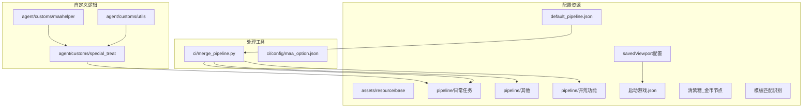
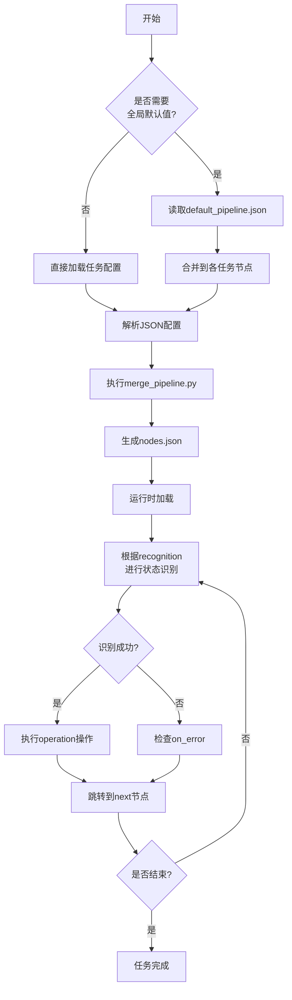
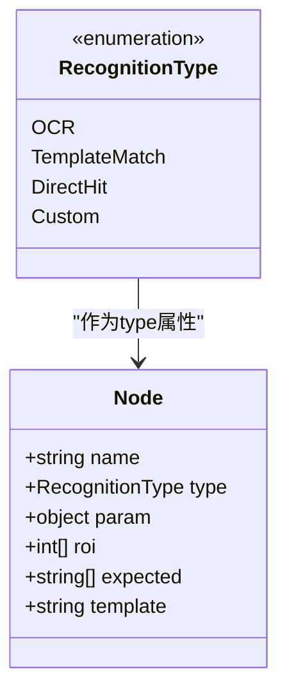
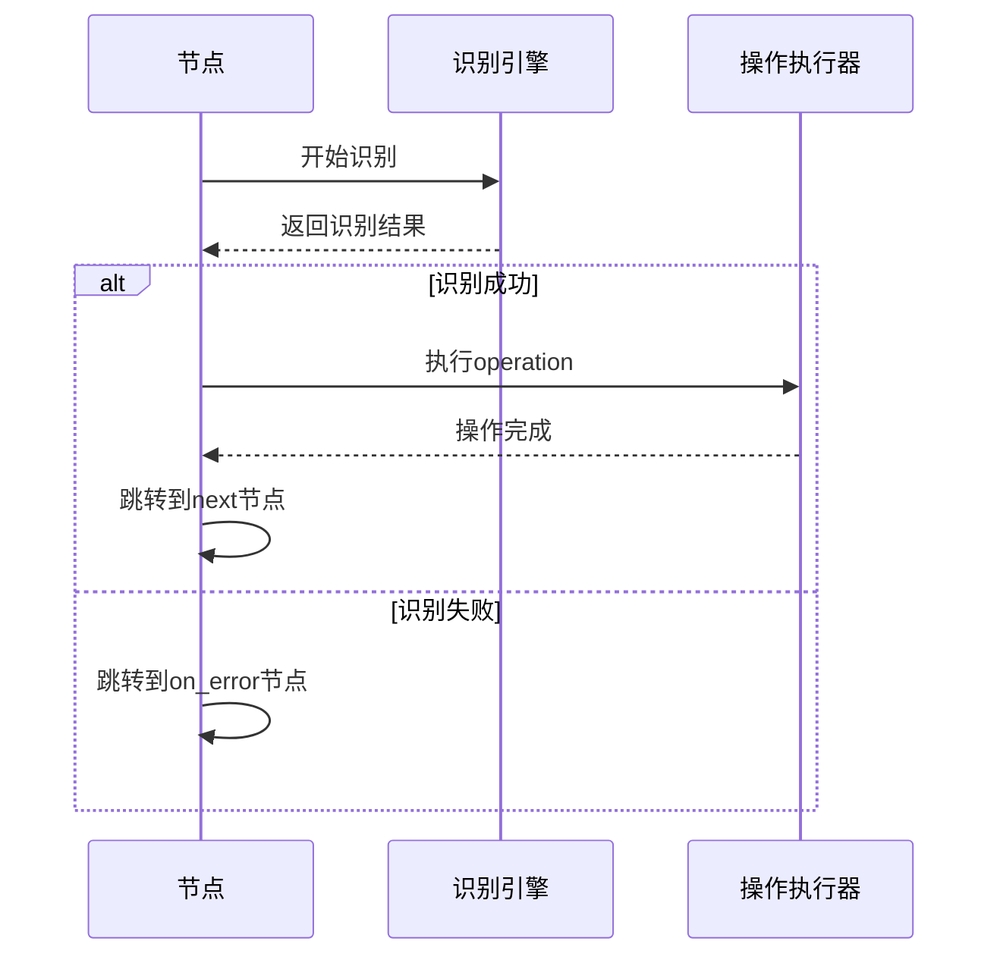
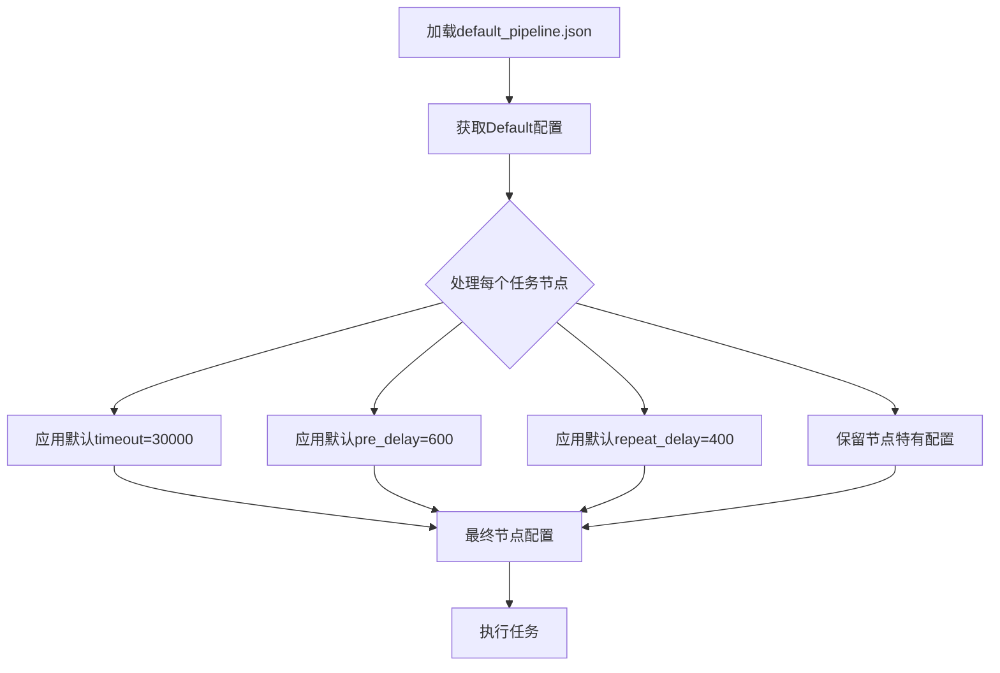
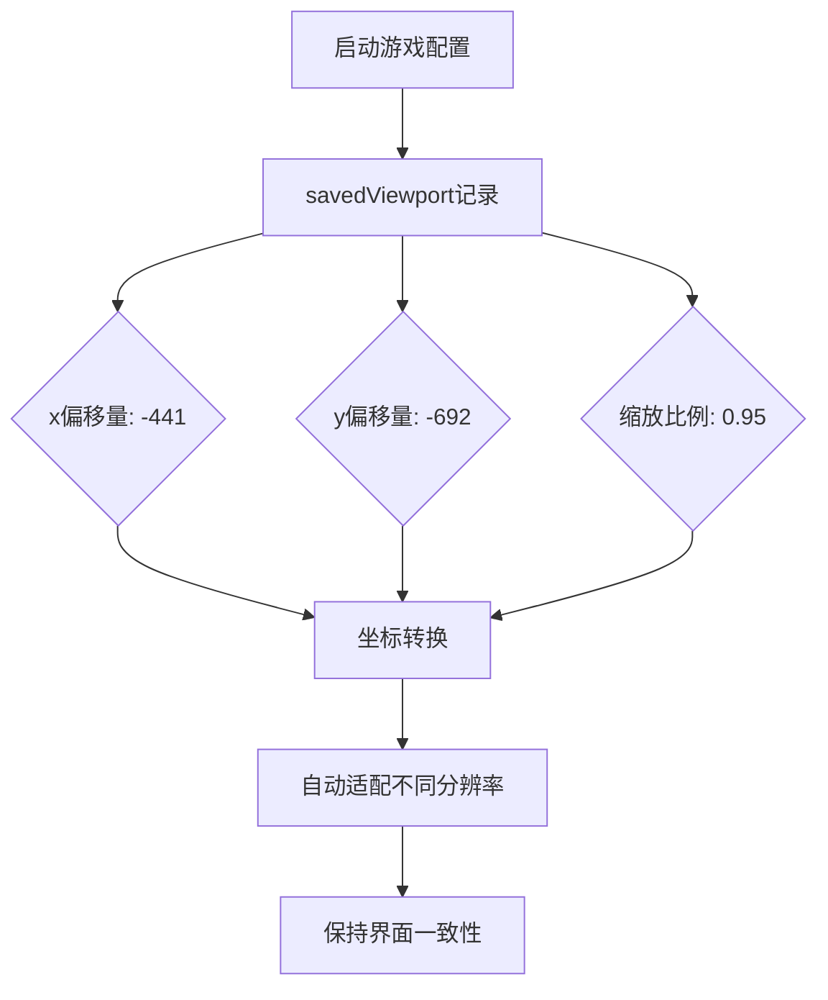
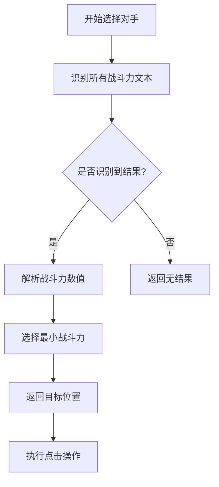
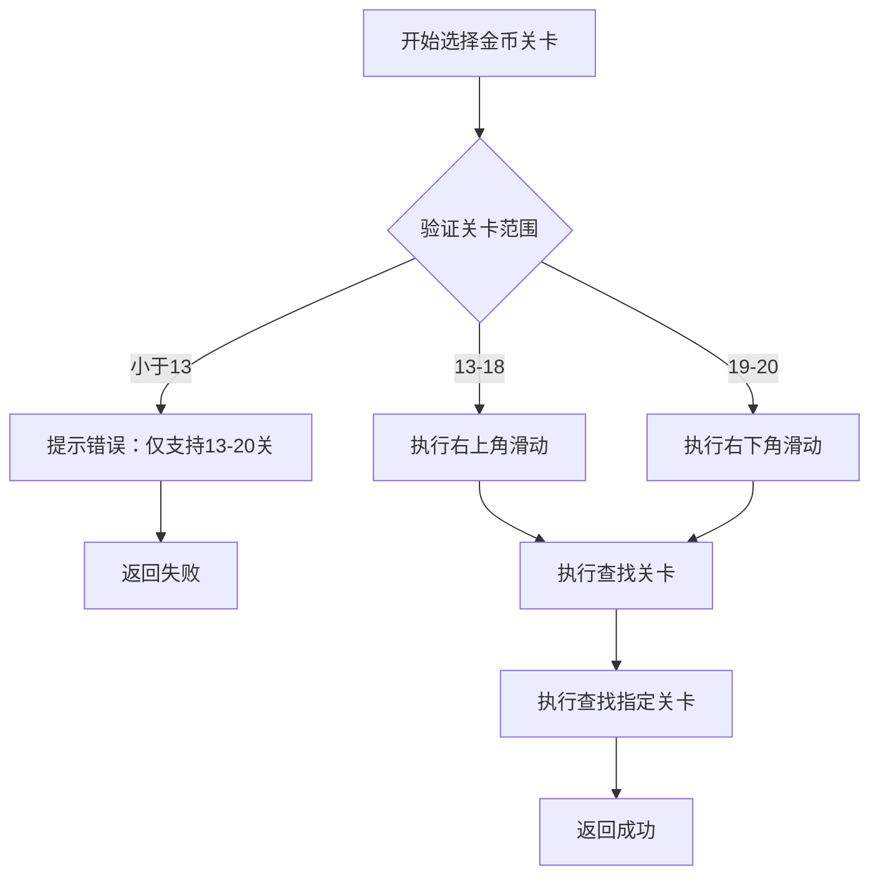
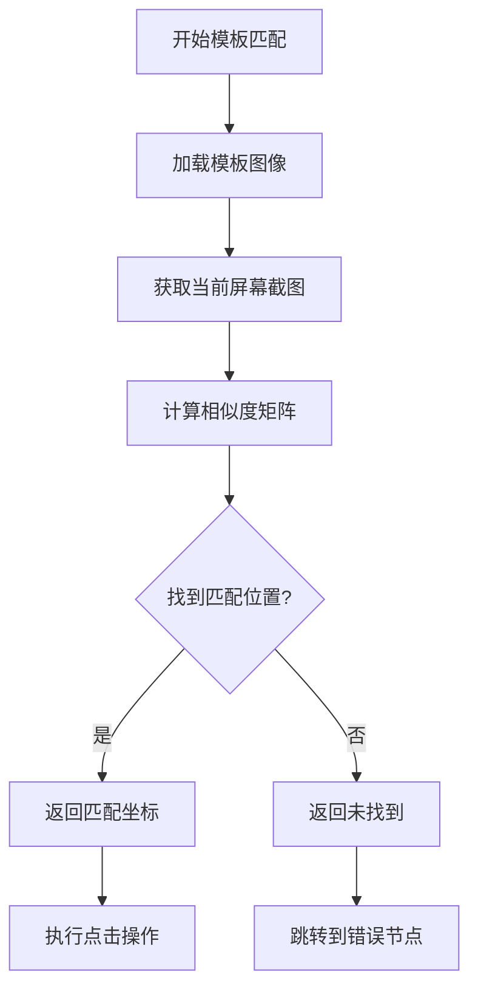
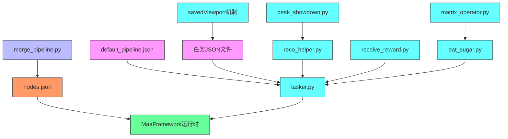

# 任务流水线配置结构

<cite>
**本文档引用文件**  
- [default_pipeline.json](file://assets/resource/base/default_pipeline.json)
- [启动游戏.json](file://assets/resource/base/pipeline/日常任务/启动游戏.json)
- [巅峰对决.json](file://assets/resource/base/pipeline/日常任务/巅峰对决.json)
- [领取邮件.json](file://assets/resource/base/pipeline/日常任务/领取邮件.json)
- [清紫糖.json](file://assets/resource/base/pipeline/日常任务/清紫糖.json)
- [merge_pipeline.py](file://ci/merge_pipeline.py)
- [tasker.py](file://agent/customs/maahelper/tasker.py)
- [reco_helper.py](file://agent/customs/maahelper/reco_helper.py)
- [peak_showdown.py](file://agent/customs/special_treat/peak_showdown.py)
- [receive_reward.py](file://agent/customs/special_treat/receive_reward.py)
- [eat_sugar.py](file://agent/customs/special_treat/eat_sugar.py)
- [matrix_operator.py](file://agent/customs/utils/matrix_operator.py)
</cite>

## 更新摘要
**变更内容**   
- 新增repeat_delay全局默认值配置（400ms）
- 更新启动游戏流水线配置中的viewport保存机制
- 新增坐标系统缩放和视口调整说明
- 完善模板匹配识别机制的坐标转换说明

## 目录
1. [简介](#简介)
2. [项目结构](#项目结构)
3. [核心组件](#核心组件)
4. [架构概述](#架构概述)
5. [详细组件分析](#详细组件分析)
6. [依赖分析](#依赖分析)
7. [性能考量](#性能考量)
8. [故障排除指南](#故障排除指南)
9. [结论](#结论)

## 简介
本文档深入解析MaaDuDuL任务流水线的JSON配置结构，以"启动游戏.json"、"巅峰对决.json"和"领取邮件.json"为例，详细说明每个节点的字段定义及其作用机制。重点阐述default_pipeline.json中Default配置块的全局继承机制，以及如何通过自定义节点实现复杂流程控制。同时说明配置文件的编码要求与格式规范，确保兼容merge_pipeline.py的合并处理。**更新**：新增repeat_delay全局默认值配置和启动游戏流水线中的viewport保存机制，完善坐标系统缩放和视口调整的技术细节。

## 项目结构
MaaDuDuL项目的任务流水线配置文件主要位于`assets/resource/base/pipeline`目录下，按功能分类组织。核心配置包括全局默认值文件default_pipeline.json、各任务独立的JSON配置文件，以及用于合并处理的脚本merge_pipeline.py。整个结构支持模块化配置管理，便于维护和扩展。



**图示来源**  
- [default_pipeline.json](file://assets/resource/base/default_pipeline.json)
- [merge_pipeline.py](file://ci/merge_pipeline.py)
- [启动游戏.json](file://assets/resource/base/pipeline/日常任务/启动游戏.json)
- [清紫糖.json](file://assets/resource/base/pipeline/日常任务/清紫糖.json)

**本节来源**  
- [assets/resource/base](file://assets/resource/base)
- [ci](file://ci)
- [agent/customs](file://agent/customs)

## 核心组件
任务流水线的核心组件包括节点配置结构、全局默认值继承机制、条件跳转逻辑和自定义操作/识别功能。这些组件共同构成了自动化任务执行的基础框架，支持从简单点击到复杂决策的各类操作。**更新**：新增repeat_delay全局默认值和viewport保存机制，增强了配置的灵活性和跨设备兼容性。

**本节来源**  
- [default_pipeline.json:1-7](file://assets/resource/base/default_pipeline.json#L1-L7)
- [启动游戏.json:1-455](file://assets/resource/base/pipeline/日常任务/启动游戏.json#L1-L455)
- [巅峰对决.json:1-626](file://assets/resource/base/pipeline/日常任务/巅峰对决.json#L1-L626)
- [领取邮件.json:1-240](file://assets/resource/base/pipeline/日常任务/领取邮件.json#L1-L240)
- [清紫糖.json:1-882](file://assets/resource/base/pipeline/日常任务/清紫糖.json#L1-L882)

## 架构概述
MaaDuDuL任务流水线采用基于JSON的声明式配置架构，通过节点（Node）构成有向图来描述任务流程。每个节点包含识别方式、操作类型、跳转条件等属性，系统按图遍历执行。全局默认值通过default_pipeline.json提供，减少重复配置。自定义逻辑通过Python模块实现复杂业务规则。**更新**：新增viewport保存机制，支持跨设备的坐标适配和界面缩放。



**图示来源**  
- [default_pipeline.json:1-7](file://assets/resource/base/default_pipeline.json#L1-L7)
- [merge_pipeline.py:1-73](file://ci/merge_pipeline.py#L1-L73)
- [tasker.py:60-122](file://agent/customs/maahelper/tasker.py#L60-L122)

## 详细组件分析

### 节点字段定义分析
任务流水线中的每个节点都包含一系列标准化字段，用于定义其行为特征。以下以"启动游戏.json"、"巅峰对决.json"和"领取邮件.json"为例进行详细分析。

#### name（节点名称）
节点的唯一标识符，用于在流程中定位和跳转。命名通常采用"任务名_功能描述"的格式，如"启动游戏_启动游戏"、"巅峰对决_对战开始"。

#### recognition（识别方式）
定义节点的触发条件和识别策略，支持多种识别类型：
- **OCR**: 文本识别，需指定expected（期望文本）和roi（识别区域）
- **TemplateMatch**: 模板匹配，通过图像比对识别界面元素
- **DirectHit**: 直接触发，不进行任何识别判断
- **Custom**: 自定义识别，调用Python代码实现复杂逻辑



**图示来源**  
- [启动游戏.json:29-42](file://assets/resource/base/pipeline/日常任务/启动游戏.json#L29-L42)
- [巅峰对决.json:146-152](file://assets/resource/base/pipeline/日常任务/巅峰对决.json#L146-L152)
- [领取邮件.json:144-150](file://assets/resource/base/pipeline/日常任务/领取邮件.json#L144-L150)
- [reco_helper.py:62-90](file://agent/customs/maahelper/reco_helper.py#L62-L90)

#### action（操作定义）
定义节点被激活后执行的具体操作，主要包括：
- **Click**: 点击指定坐标或识别结果
- **Swipe**: 执行滑动操作
- **StartApp**: 启动指定的应用包
- **DoNothing**: 空操作，仅用于流程控制
- **Custom**: 调用自定义动作

#### target（目标坐标或图像）
对于Click操作，target字段定义点击位置。可以是绝对坐标[x, y]，也可以是相对坐标[x, y, 0, 0]。在模板匹配中，template字段指定图像资源路径。

#### condition（条件跳转逻辑）
通过next和on_error字段实现条件跳转：
- **next**: 识别成功后的跳转目标
- **on_error**: 识别失败或超时后的跳转目标
- 支持多个跳转目标，形成分支逻辑



**图示来源**  
- [启动游戏.json:103-113](file://assets/resource/base/pipeline/日常任务/启动游戏.json#L103-L113)
- [巅峰对决.json:184-193](file://assets/resource/base/pipeline/日常任务/巅峰对决.json#L184-L193)
- [领取邮件.json:163-170](file://assets/resource/base/pipeline/日常任务/领取邮件.json#L163-L170)
- [tasker.py:80-121](file://agent/customs/maahelper/tasker.py#L80-L121)

#### timeout（超时时间）
定义节点等待识别结果的最大时长（毫秒）。若在此时间内未满足识别条件，则视为失败并跳转到on_error节点。未指定时继承全局默认值。

#### pre_delay（前置延迟）
在节点执行前等待的时间（毫秒），用于确保界面稳定后再进行识别。同样支持继承机制。

#### post_delay（后置延迟）
在节点执行后等待的时间（毫秒），用于等待界面动画或过渡效果完成。支持继承机制。

#### rate_limit（速率限制）
限制节点执行的最小间隔时间（毫秒），防止过于频繁的操作。支持继承机制。

### 全局继承机制分析
default_pipeline.json中的Default配置块为所有任务节点提供默认值，实现配置复用。

```json
{
    "Default": {
        "timeout": 30000,
        "pre_delay": 600,
        "repeat_delay": 400
    }
}
```

该机制的工作原理如下：
1. 系统加载所有JSON配置文件
2. 将Default配置作为基础模板
3. 每个节点继承这些默认值
4. 节点可覆盖特定字段的默认值

**更新**：新增repeat_delay全局默认值（400ms），用于控制任务执行的重复间隔，增强系统的稳定性。



**图示来源**  
- [default_pipeline.json:1-7](file://assets/resource/base/default_pipeline.json#L1-L7)
- [merge_pipeline.py:21-34](file://ci/merge_pipeline.py#L21-L34)
- [tasker.py:60-122](file://agent/customs/maahelper/tasker.py#L60-L122)

**本节来源**  
- [default_pipeline.json:1-7](file://assets/resource/base/default_pipeline.json#L1-L7)
- [启动游戏.json:117](file://assets/resource/base/pipeline/日常任务/启动游戏.json#L117)
- [巅峰对决.json:186](file://assets/resource/base/pipeline/日常任务/巅峰对决.json#L186)
- [领取邮件.json](file://assets/resource/base/pipeline/日常任务/领取邮件.json)
- [清紫糖.json:1-882](file://assets/resource/base/pipeline/日常任务/清紫糖.json#L1-L882)

### 视口保存机制分析
**更新**：启动游戏配置文件引入了savedViewport机制，用于保存和恢复界面视口状态。

```json
{
    "$__mpe_config_启动游戏": {
        "$__mpe_code": {
            "savedViewport": {
                "x": -441,
                "y": -692,
                "zoom": 0.95
            }
        }
    }
}
```

该机制的工作原理：
1. 记录界面的视口偏移量（x, y）和缩放比例（zoom）
2. 在不同分辨率和设备上自动调整坐标
3. 确保任务在不同显示环境下的一致性



**图示来源**  
- [启动游戏.json:9-13](file://assets/resource/base/pipeline/日常任务/启动游戏.json#L9-L13)
- [巅峰对决.json:8-12](file://assets/resource/base/pipeline/日常任务/巅峰对决.json#L8-L12)
- [领取邮件.json:8-12](file://assets/resource/base/pipeline/日常任务/领取邮件.json#L8-L12)

### 自定义逻辑实现分析
通过Python代码实现复杂业务逻辑，如"巅峰对决"中的对手选择策略和"清紫糖"中的金币关卡智能选择。

#### 自定义识别：选择对手
在peak_showdown.py中实现了PickOpponent类，通过OCR识别所有对手的战斗力，并选择最低者。



**图示来源**  
- [peak_showdown.py:51-94](file://agent/customs/special_treat/peak_showdown.py#L51-L94)
- [巅峰对决.json:497-500](file://assets/resource/base/pipeline/日常任务/巅峰对决.json#L497-L500)

#### 自定义动作：领取奖励
在receive_reward.py中实现了不同类型的奖励领取逻辑，支持参数化调用。

#### 自定义动作：清紫糖金币关卡选择
在eat_sugar.py中实现了SelectDuplicateLevel类，专门处理金币大作战的智能关卡选择逻辑。



**图示来源**  
- [eat_sugar.py:209-237](file://agent/customs/special_treat/eat_sugar.py#L209-L237)
- [清紫糖.json:735-839](file://assets/resource/base/pipeline/日常任务/清紫糖.json#L735-L839)

#### 智能滑动操作
清紫糖金币节点包含四个方向的滑动操作，用于导航到不同的关卡区域：

- **清紫糖_金币右上角**: 从右下角滑动到右上角区域
- **清紫糖_金币右下角**: 从右上角滑动到右下角区域  
- **清紫糖_金币左上角**: 从左下角滑动到左上角区域
- **清紫糖_金币左下角**: 从左上角滑动到左下角区域

这些滑动操作通过Swipe指令实现，支持自定义滑动起点、终点和持续时间。

**本节来源**  
- [peak_showdown.py:1-96](file://agent/customs/special_treat/peak_showdown.py#L1-L96)
- [receive_reward.py:1-65](file://agent/customs/special_treat/receive_reward.py#L1-L65)
- [reco_helper.py](file://agent/customs/maahelper/reco_helper.py)
- [eat_sugar.py:209-237](file://agent/customs/special_treat/eat_sugar.py#L209-L237)
- [matrix_operator.py:1-58](file://agent/customs/utils/matrix_operator.py#L1-L58)

### 模板匹配识别机制
清紫糖金币大作战节点广泛使用模板匹配识别技术，通过图像比对实现精确的目标定位。

#### 模板匹配工作原理
模板匹配通过比较屏幕截图与预定义模板图像的相似度来识别界面元素。在清紫糖配置中，模板文件位于`purple/gold.png`路径，用于识别金币大作战的入口图标。



**图示来源**  
- [清紫糖.json:584-590](file://assets/resource/base/pipeline/日常任务/清紫糖.json#L584-L590)
- [清紫糖.json:750-756](file://assets/resource/base/pipeline/日常任务/清紫糖.json#L750-L756)

**本节来源**  
- [清紫糖.json:584-590](file://assets/resource/base/pipeline/日常任务/清紫糖.json#L584-L590)
- [清紫糖.json:750-756](file://assets/resource/base/pipeline/日常任务/清紫糖.json#L750-L756)

## 依赖分析
任务流水线系统的各组件之间存在明确的依赖关系。配置文件依赖于处理脚本进行合并，自定义逻辑模块依赖于基础辅助类，最终所有组件共同依赖于MaaFramework核心。



**图示来源**  
- [merge_pipeline.py](file://ci/merge_pipeline.py)
- [tasker.py](file://agent/customs/maahelper/tasker.py)
- [reco_helper.py](file://agent/customs/maahelper/reco_helper.py)
- [eat_sugar.py](file://agent/customs/special_treat/eat_sugar.py)

**本节来源**  
- [ci/merge_pipeline.py](file://ci/merge_pipeline.py)
- [agent/customs](file://agent/customs)

## 性能考量
任务流水线的设计充分考虑了执行效率和资源利用。通过合理的pre_delay设置避免频繁无效识别，timeout机制防止无限等待，自定义识别优化复杂逻辑处理。配置合并过程在启动时完成，减少运行时开销。**更新**：新增repeat_delay配置优化任务执行节奏，savedViewport机制确保跨设备兼容性，智能滑动操作经过优化减少不必要的滑动次数。

## 故障排除指南
常见问题及解决方案：
- **节点无法识别**: 检查roi区域是否正确，调整识别参数
- **跳转逻辑异常**: 验证next和on_error配置，确保目标节点存在
- **自定义逻辑不执行**: 确认Python模块已正确注册，参数传递无误
- **合并失败**: 检查JSON格式是否正确，确保使用UTF-8编码
- **金币关卡选择失败**: 确认关卡号在13-20范围内，检查滑动操作是否正确执行
- **坐标不匹配**: 检查savedViewport配置，确认设备分辨率和缩放设置
- **执行速度过快**: 调整repeat_delay默认值，避免过于频繁的操作

**本节来源**  
- [merge_pipeline.py:36-37](file://ci/merge_pipeline.py#L36-L37)
- [tasker.py:50-58](file://agent/customs/maahelper/tasker.py#L50-L58)
- [reco_helper.py:95-96](file://agent/customs/maahelper/reco_helper.py#L95-L96)
- [eat_sugar.py:223-225](file://agent/customs/special_treat/eat_sugar.py#L223-L225)

## 结论
MaaDuDuL任务流水线通过JSON配置与Python自定义逻辑相结合的方式，构建了一个灵活、可扩展的自动化框架。全局默认值机制有效减少了配置冗余，条件跳转支持复杂流程控制，自定义识别和动作满足特殊需求。**更新**：新增的repeat_delay全局默认值和savedViewport视口保存机制进一步增强了系统的稳定性和兼容性，展示了模板匹配识别和智能关卡选择的强大能力，通过精确的图像比对和坐标计算实现高效的自动化操作。整个系统设计合理，易于维护和扩展。