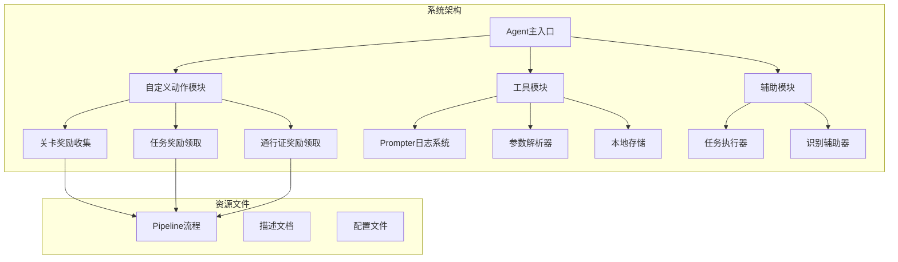
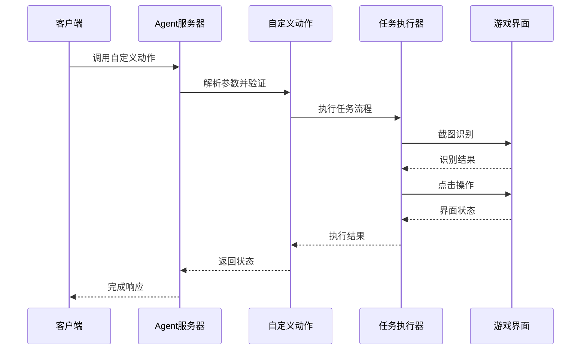
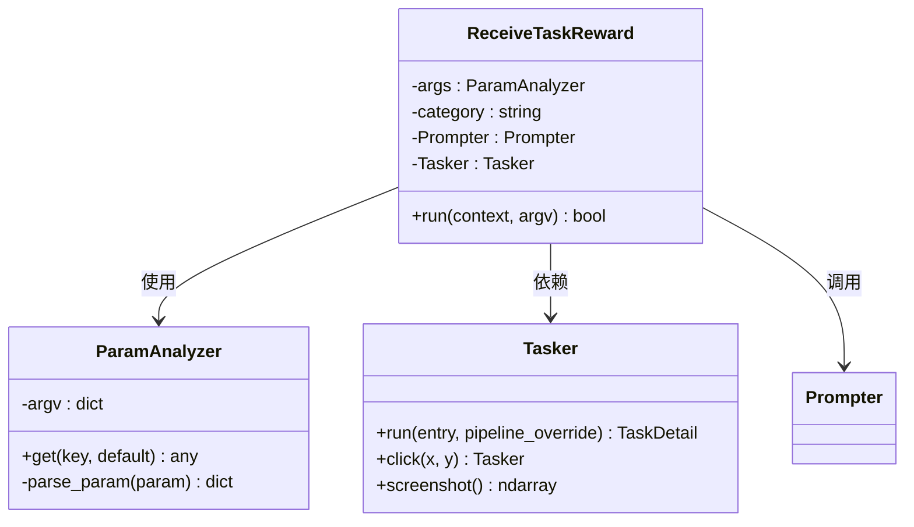
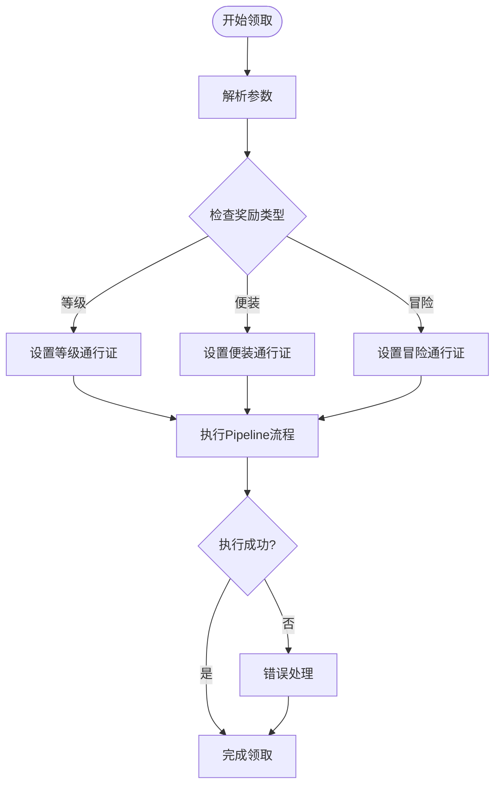
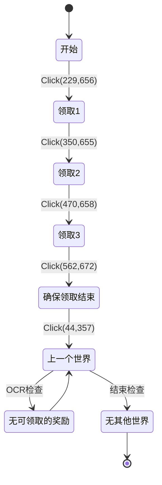
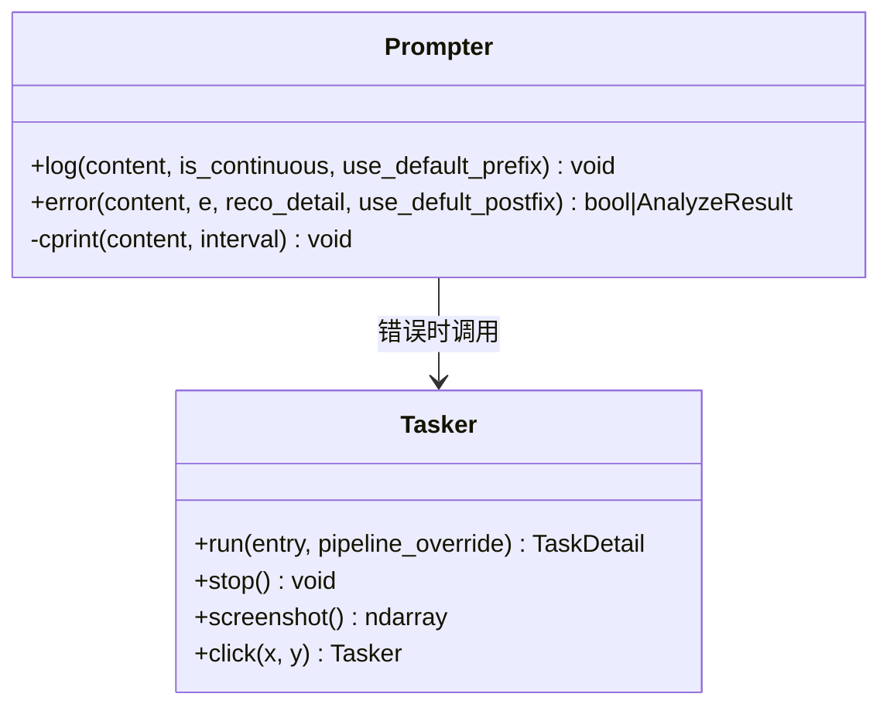
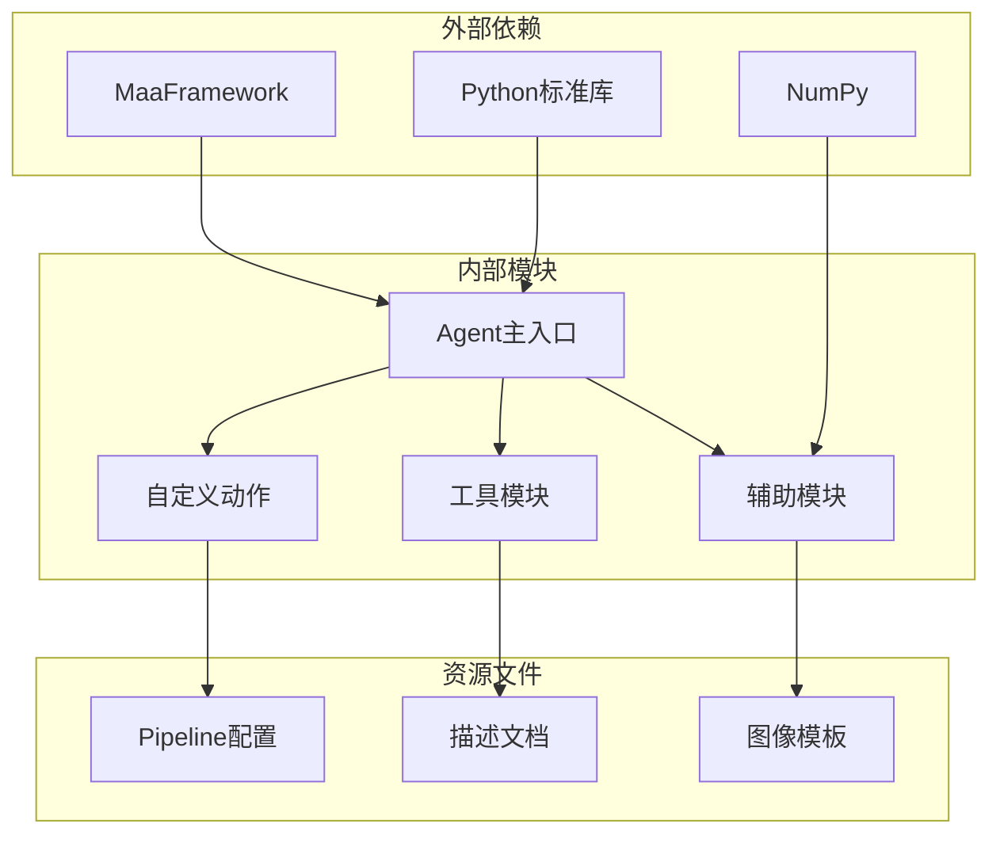

# 关卡奖励收集系统

<cite>
**本文档引用的文件**
- [receive_reward.py](file://MFAAvalonia/agent/customs/special_treat/receive_reward.py)
- [__init__.py](file://MFAAvalonia/agent/customs/special_treat/__init__.py)
- [main.py](file://MFAAvalonia/agent/main.py)
- [prompter.py](file://MFAAvalonia/agent/customs/utils/prompter.py)
- [tasker.py](file://MFAAvalonia/agent/customs/maahelper/tasker.py)
- [argv_analyzer.py](file://MFAAvalonia/agent/customs/maahelper/argv_analyzer.py)
- [领取关卡奖励.json](file://MFAAvalonia/Resource/base/pipeline/开荒功能/领取关卡奖励.json)
- [level_rewards.md](file://MFAAvalonia/Resource/descs/single/level_rewards.md)
- [local_storage.py](file://MFAAvalonia/agent/customs/utils/local_storage.py)
- [setup.py](file://MFAAvalonia/agent/preprocess/setup.py)
- [reco_helper.py](file://MFAAvalonia/agent/customs/maahelper/reco_helper.py)
</cite>

## 目录
1. [简介](#简介)
2. [项目结构](#项目结构)
3. [核心组件](#核心组件)
4. [架构概览](#架构概览)
5. [详细组件分析](#详细组件分析)
6. [依赖关系分析](#依赖关系分析)
7. [性能考虑](#性能考虑)
8. [故障排除指南](#故障排除指南)
9. [结论](#结论)

## 简介

关卡奖励收集系统是一个基于MaaFramework开发的自动化游戏奖励领取系统。该系统专门用于自动收集游戏中的关卡奖励，包括任务奖励、通行证奖励和关卡奖励等多种类型的奖励。

系统采用模块化设计，通过自定义动作和识别器实现智能化的奖励领取流程。主要功能包括：
- 自动识别和领取任务奖励
- 自动领取各类通行证奖励
- 自动收集关卡通关奖励
- 智能的错误处理和恢复机制

## 项目结构

**图表来源**
- [main.py](file://MFAAvalonia/agent/main.py#L1-L77)
- [__init__.py](file://MFAAvalonia/agent/customs/special_treat/__init__.py#L1-L9)

**章节来源**
- [main.py](file://MFAAvalonia/agent/main.py#L1-L77)
- [__init__.py](file://MFAAvalonia/agent/customs/special_treat/__init__.py#L1-L9)

## 核心组件

### 自定义动作模块

系统的核心是自定义动作模块，提供了三种主要的奖励领取功能：

1. **任务奖励领取** (`receive_task_reward`)
2. **通行证奖励领取** (`receive_pass_reward`)  
3. **关卡奖励收集** (Pipeline流程)

每个自定义动作都实现了统一的接口规范，通过装饰器注册到Agent服务器中。

### 工具模块

- **Prompter日志系统**：提供统一的日志输出和错误处理机制
- **参数解析器**：支持多种参数格式的自动解析
- **本地存储**：提供基于JSON的键值存储功能

### 辅助模块

- **任务执行器**：封装MaaFramework的任务执行操作
- **识别辅助器**：提供识别结果处理和点击操作功能

**章节来源**
- [receive_reward.py](file://MFAAvalonia/agent/customs/special_treat/receive_reward.py#L1-L65)
- [prompter.py](file://MFAAvalonia/agent/customs/utils/prompter.py#L1-L55)
- [argv_analyzer.py](file://MFAAvalonia/agent/customs/maahelper/argv_analyzer.py#L1-L159)

## 架构概览

**图表来源**
- [main.py](file://MFAAvalonia/agent/main.py#L47-L77)
- [receive_reward.py](file://MFAAvalonia/agent/customs/special_treat/receive_reward.py#L13-L33)

系统采用分层架构设计，各层职责明确：

1. **表示层**：Agent服务器负责接收客户端请求
2. **业务逻辑层**：自定义动作模块处理具体的业务逻辑
3. **数据访问层**：任务执行器和识别辅助器处理与游戏的交互
4. **基础设施层**：工具模块提供通用的服务支持

## 详细组件分析

### 任务奖励领取组件

**图表来源**
- [receive_reward.py](file://MFAAvalonia/agent/customs/special_treat/receive_reward.py#L9-L33)
- [argv_analyzer.py](file://MFAAvalonia/agent/customs/maahelper/argv_analyzer.py#L17-L159)
- [tasker.py](file://MFAAvalonia/agent/customs/maahelper/tasker.py#L16-L190)

任务奖励领取组件的工作流程：

1. **参数解析**：使用ParamAnalyzer解析传入的参数
2. **分类处理**：根据奖励类型进行相应的处理
3. **流程执行**：通过Tasker执行预定义的Pipeline流程
4. **状态监控**：实时监控任务执行状态

**章节来源**
- [receive_reward.py](file://MFAAvalonia/agent/customs/special_treat/receive_reward.py#L13-L33)
- [argv_analyzer.py](file://MFAAvalonia/agent/customs/maahelper/argv_analyzer.py#L48-L131)

### 通行证奖励领取组件

**图表来源**
- [receive_reward.py](file://MFAAvalonia/agent/customs/special_treat/receive_reward.py#L36-L65)

**章节来源**
- [receive_reward.py](file://MFAAvalonia/agent/customs/special_treat/receive_reward.py#L40-L65)

### 关卡奖励收集组件

关卡奖励收集是最复杂的组件，通过完整的Pipeline流程实现：

**图表来源**
- [领取关卡奖励.json](file://MFAAvalonia/Resource/base/pipeline/开荒功能/领取关卡奖励.json#L16-L248)

**章节来源**
- [领取关卡奖励.json](file://MFAAvalonia/Resource/base/pipeline/开荒功能/领取关卡奖励.json#L1-L250)

### 日志和错误处理系统

**图表来源**
- [prompter.py](file://MFAAvalonia/agent/customs/utils/prompter.py#L16-L55)
- [tasker.py](file://MFAAvalonia/agent/customs/maahelper/tasker.py#L124-L190)

系统采用统一的日志输出格式，提供详细的执行状态信息和错误详情。

**章节来源**
- [prompter.py](file://MFAAvalonia/agent/customs/utils/prompter.py#L16-L55)

## 依赖关系分析

**图表来源**
- [main.py](file://MFAAvalonia/agent/main.py#L49-L62)
- [receive_reward.py](file://MFAAvalonia/agent/customs/special_treat/receive_reward.py#L1-L6)

系统的主要依赖关系：

1. **MaaFramework**：提供核心的游戏自动化能力
2. **Python生态系统**：包括标准库和第三方库
3. **内部模块依赖**：各模块之间的调用关系
4. **资源文件依赖**：Pipeline配置和图像模板

**章节来源**
- [main.py](file://MFAAvalonia/agent/main.py#L49-L62)
- [setup.py](file://MFAAvalonia/agent/preprocess/setup.py#L204-L230)

## 性能考虑

### 执行效率优化

1. **智能截图缓存**：识别辅助器支持截图缓存，避免重复截图操作
2. **批量操作优化**：支持批量点击操作，减少通信开销
3. **超时控制**：为每个识别操作设置合理的超时时间
4. **错误恢复机制**：提供on_error回退路径，提高系统稳定性

### 内存管理

1. **资源及时释放**：确保识别结果和截图资源及时清理
2. **异常处理**：完善的异常捕获和资源清理机制
3. **配置管理**：通过配置文件管理资源使用

## 故障排除指南

### 常见问题及解决方案

1. **识别失败**
   - 检查图像模板是否正确
   - 调整OCR识别参数
   - 确认游戏界面分辨率

2. **点击位置错误**
   - 更新坐标配置
   - 检查设备适配
   - 验证界面布局

3. **任务执行中断**
   - 检查网络连接
   - 验证Agent服务状态
   - 查看日志文件

### 调试工具

系统提供了丰富的调试功能：

- **详细日志输出**：显示每一步的执行状态
- **错误详情记录**：记录异常堆栈信息
- **截图保存**：保存关键执行时刻的界面截图
- **状态监控**：实时监控任务执行进度

**章节来源**
- [prompter.py](file://MFAAvalonia/agent/customs/utils/prompter.py#L34-L55)

## 结论

关卡奖励收集系统是一个功能完整、架构清晰的自动化奖励领取解决方案。系统具有以下特点：

1. **模块化设计**：各功能模块职责明确，便于维护和扩展
2. **智能化识别**：支持多种识别方式，适应不同的游戏界面
3. **完善的错误处理**：提供多层次的错误检测和恢复机制
4. **易于使用**：通过简单的配置即可实现复杂的自动化操作

该系统为游戏自动化提供了良好的基础框架，可以根据具体需求进行定制和扩展。