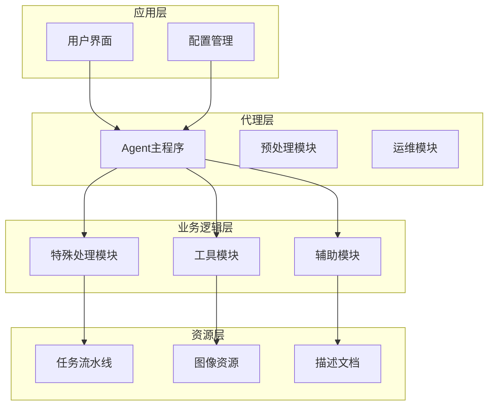
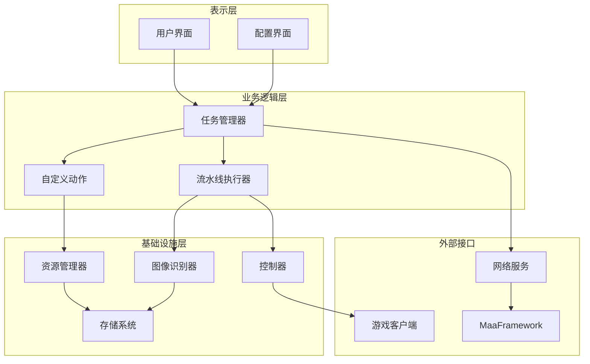
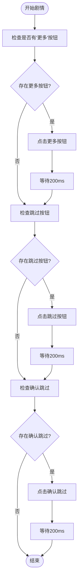
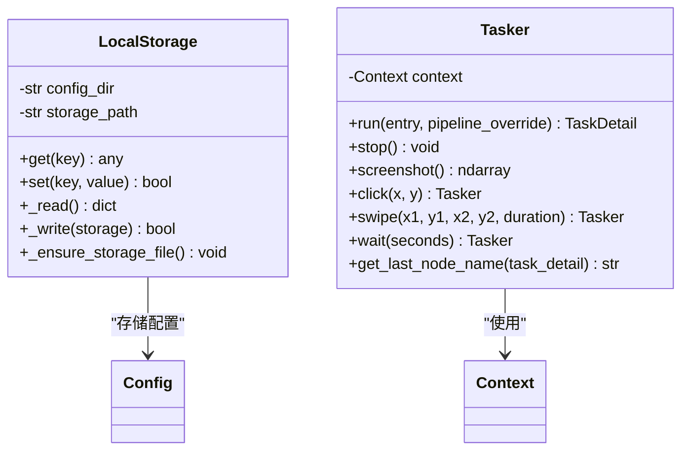
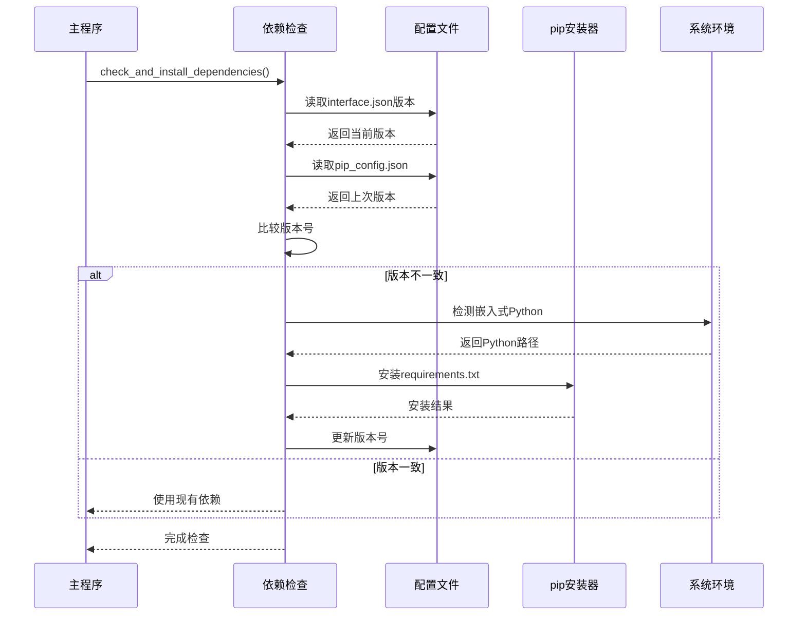
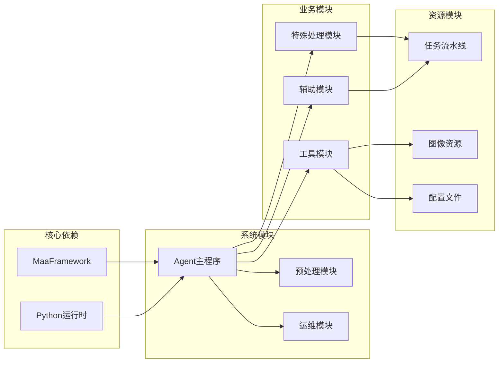

# 快速剧情系统

<cite>
**本文档引用的文件**
- [MFAAvalonia/agent/main.py](file://MFAAvalonia/agent/main.py)
- [MFAAvalonia/agent/preprocess/setup.py](file://MFAAvalonia/agent/preprocess/setup.py)
- [MFAAvalonia/agent/preprocess/clear.py](file://MFAAvalonia/agent/preprocess/clear.py)
- [MFAAvalonia/agent/devops/report.py](file://MFAAvalonia/agent/devops/report.py)
- [MFAAvalonia/agent/customs/special_treat/__init__.py](file://MFAAvalonia/agent/customs/special_treat/__init__.py)
- [MFAAvalonia/agent/customs/special_treat/activity.py](file://MFAAvalonia/agent/customs/special_treat/activity.py)
- [MFAAvalonia/agent/customs/special_treat/store.py](file://MFAAvalonia/agent/customs/special_treat/store.py)
- [MFAAvalonia/agent/customs/utils/local_storage.py](file://MFAAvalonia/agent/customs/utils/local_storage.py)
- [MFAAvalonia/agent/customs/maahelper/tasker.py](file://MFAAvalonia/agent/customs/maahelper/tasker.py)
- [assets/resource/base/pipeline/开荒功能/快速剧情.json](file://assets/resource/base/pipeline/开荒功能/快速剧情.json)
- [assets/resource/descs/single/quick_plot.md](file://assets/resource/descs/single/quick_plot.md)
- [MFAAvalonia/config/config.json](file://MFAAvalonia/config/config.json)
</cite>

## 目录
1. [简介](#简介)
2. [项目结构](#项目结构)
3. [核心组件](#核心组件)
4. [架构概览](#架构概览)
5. [详细组件分析](#详细组件分析)
6. [依赖关系分析](#依赖关系分析)
7. [性能考虑](#性能考虑)
8. [故障排除指南](#故障排除指南)
9. [结论](#结论)

## 简介

快速剧情系统是一个基于MaaFramework开发的自动化脚本系统，专门用于快速跳过游戏中的剧情场景。该系统通过智能识别和自动化操作，能够高效地完成剧情跳过任务，节省玩家的游戏时间。

系统采用模块化设计，包含完整的依赖管理、任务调度、图像识别和自动化控制等功能。通过JSON配置文件定义任务流程，结合Python自定义动作实现复杂的业务逻辑。

## 项目结构

项目采用清晰的分层架构，主要分为以下几个层次：

**图表来源**
- [MFAAvalonia/agent/main.py](file://MFAAvalonia/agent/main.py#L47-L77)
- [MFAAvalonia/agent/preprocess/setup.py](file://MFAAvalonia/agent/preprocess/setup.py#L204-L230)

**章节来源**
- [MFAAvalonia/agent/main.py](file://MFAAvalonia/agent/main.py#L1-L77)
- [MFAAvalonia/config/config.json](file://MFAAvalonia/config/config.json#L1-L545)

## 核心组件

### Agent主程序
Agent主程序是整个系统的入口点，负责初始化环境、检查依赖并启动Agent服务器。

### 预处理模块
包含依赖检查、环境清理和自动安装功能，确保系统运行所需的Python包正确安装。

### 特殊处理模块
提供针对特定游戏功能的自定义动作，包括活动处理、商店操作等。

### 工具模块
包含本地存储、图像识别辅助等功能，为其他模块提供基础服务。

**章节来源**
- [MFAAvalonia/agent/main.py](file://MFAAvalonia/agent/main.py#L47-L77)
- [MFAAvalonia/agent/preprocess/setup.py](file://MFAAvalonia/agent/preprocess/setup.py#L204-L230)
- [MFAAvalonia/agent/customs/special_treat/__init__.py](file://MFAAvalonia/agent/customs/special_treat/__init__.py#L1-L9)

## 架构概览

系统采用分层架构设计，各层之间职责明确，耦合度低：

**图表来源**
- [MFAAvalonia/agent/main.py](file://MFAAvalonia/agent/main.py#L47-L77)
- [MFAAvalonia/agent/customs/maahelper/tasker.py](file://MFAAvalonia/agent/customs/maahelper/tasker.py#L16-L50)

## 详细组件分析

### 快速剧情流水线

快速剧情系统的核心是基于JSON定义的流水线配置，实现了智能的剧情跳过逻辑：

**图表来源**
- [assets/resource/base/pipeline/开荒功能/快速剧情.json](file://assets/resource/base/pipeline/开荒功能/快速剧情.json#L16-L99)

### 自定义动作实现

系统提供了丰富的自定义动作来处理各种游戏场景：

#### 活动相关动作
- `enter_activity`: 进入指定活动界面
- `claim_candy`: 领取指定时间段的糖果
- `check_activity_progress`: 检查活动进度并动态调整参数

#### 商店相关动作
- `gift`: 领取指定名称的礼包
- `buy`: 购买指定商品

**章节来源**
- [MFAAvalonia/agent/customs/special_treat/activity.py](file://MFAAvalonia/agent/customs/special_treat/activity.py#L17-L145)
- [MFAAvalonia/agent/customs/special_treat/store.py](file://MFAAvalonia/agent/customs/special_treat/store.py#L14-L96)

### 数据存储系统

系统采用本地JSON文件存储机制，提供简单可靠的数据持久化：

**图表来源**
- [MFAAvalonia/agent/customs/utils/local_storage.py](file://MFAAvalonia/agent/customs/utils/local_storage.py#L10-L111)
- [MFAAvalonia/agent/customs/maahelper/tasker.py](file://MFAAvalonia/agent/customs/maahelper/tasker.py#L16-L190)

**章节来源**
- [MFAAvalonia/agent/customs/utils/local_storage.py](file://MFAAvalonia/agent/customs/utils/local_storage.py#L1-L111)
- [MFAAvalonia/agent/customs/maahelper/tasker.py](file://MFAAvalonia/agent/customs/maahelper/tasker.py#L1-L190)

### 依赖管理系统

系统具备完善的依赖管理功能，能够自动检测和安装所需的Python包：

**图表来源**
- [MFAAvalonia/agent/preprocess/setup.py](file://MFAAvalonia/agent/preprocess/setup.py#L204-L230)

**章节来源**
- [MFAAvalonia/agent/preprocess/setup.py](file://MFAAvalonia/agent/preprocess/setup.py#L29-L198)

## 依赖关系分析

系统各组件之间的依赖关系如下：

**图表来源**
- [MFAAvalonia/agent/main.py](file://MFAAvalonia/agent/main.py#L47-L77)
- [MFAAvalonia/agent/preprocess/setup.py](file://MFAAvalonia/agent/preprocess/setup.py#L204-L230)

**章节来源**
- [MFAAvalonia/agent/main.py](file://MFAAvalonia/agent/main.py#L47-L77)
- [MFAAvalonia/agent/preprocess/clear.py](file://MFAAvalonia/agent/preprocess/clear.py#L31-L41)

## 性能考虑

系统在设计时充分考虑了性能优化：

1. **异步操作**: 使用MaaFramework的异步特性，避免阻塞主线程
2. **缓存机制**: 图像模板和识别结果进行缓存，减少重复计算
3. **智能重试**: 对于网络请求和文件操作提供重试机制
4. **内存管理**: 及时释放不再使用的资源和图像数据
5. **并发控制**: 合理控制同时运行的任务数量

## 故障排除指南

### 常见问题及解决方案

#### 依赖安装失败
- 检查网络连接和镜像源配置
- 确认Python环境路径正确
- 查看详细的错误日志信息

#### 图像识别失败
- 调整ROI区域设置
- 检查图像对比阈值
- 确认游戏画面分辨率匹配

#### 任务执行异常
- 查看调试截图文件
- 检查任务流水线配置
- 验证自定义动作参数

**章节来源**
- [MFAAvalonia/agent/devops/report.py](file://MFAAvalonia/agent/devops/report.py#L9-L34)
- [MFAAvalonia/agent/preprocess/clear.py](file://MFAAvalonia/agent/preprocess/clear.py#L10-L41)

## 结论

快速剧情系统是一个功能完整、架构清晰的自动化脚本框架。通过模块化设计和智能的依赖管理，系统能够稳定地处理各种游戏自动化任务。

系统的主要优势包括：
- 完善的依赖管理机制
- 灵活的任务流水线配置
- 丰富的自定义动作扩展
- 可靠的数据持久化
- 良好的错误处理和恢复能力

未来可以进一步优化的方向包括：增强机器学习识别能力、提供更丰富的可视化调试工具、支持更多的游戏场景等。