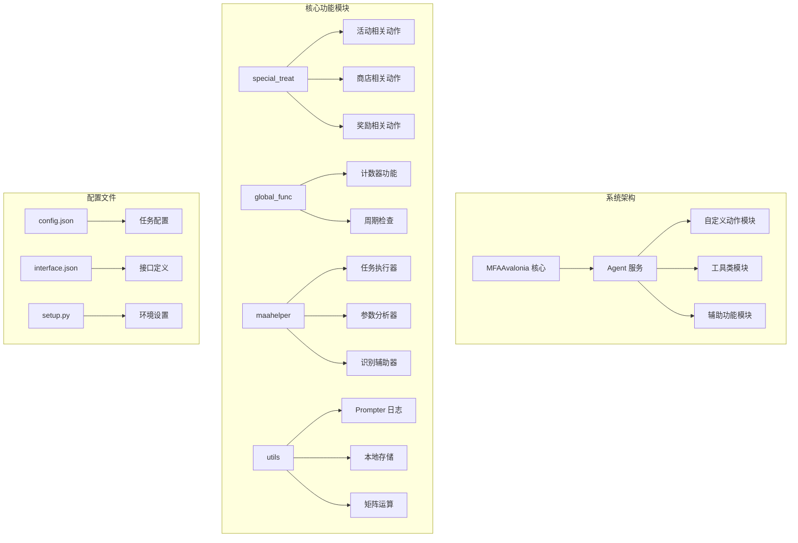
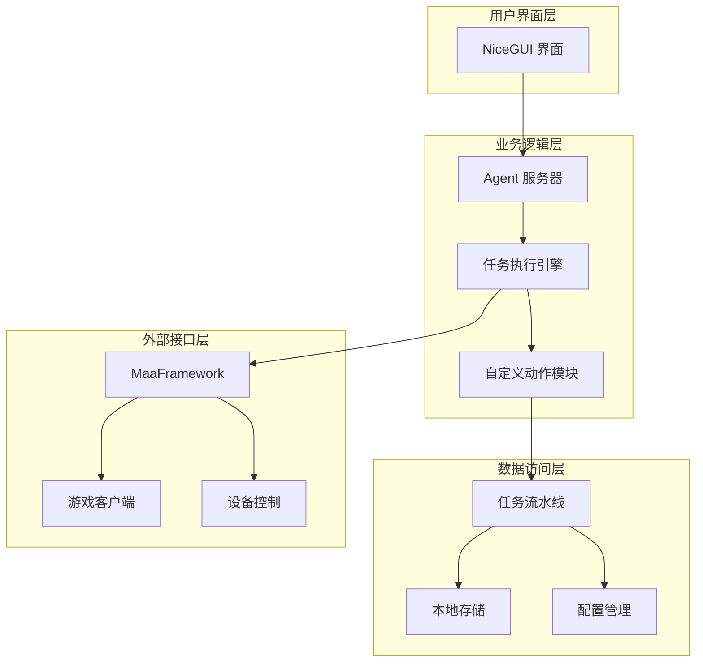
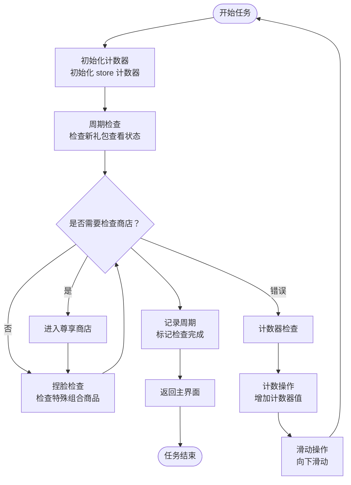
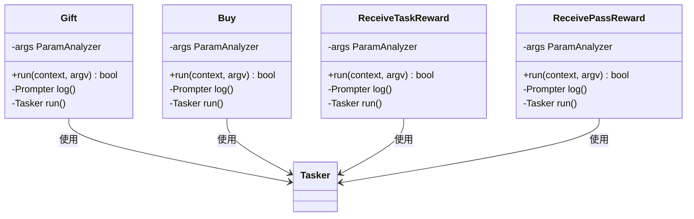
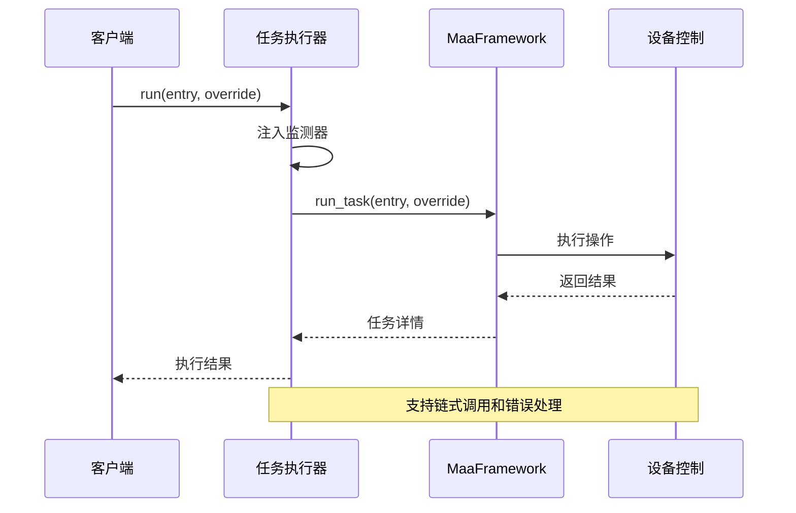
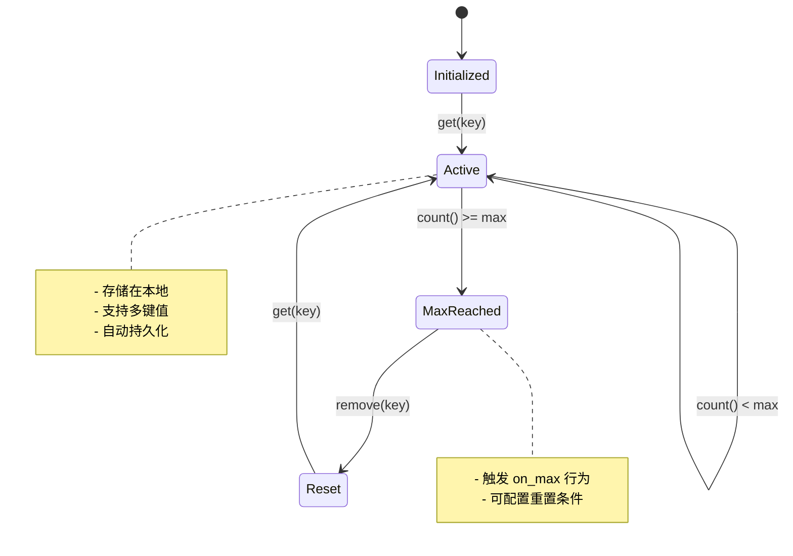
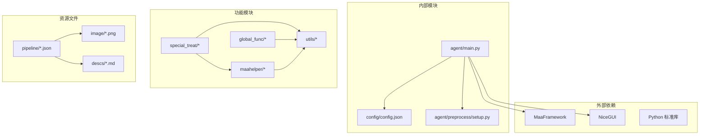

# 新礼包查看系统

<cite>
**本文档引用的文件**
- [新礼包查看.json](file://assets/resource/base/pipeline/开荒功能/新礼包查看.json)
- [receive_reward.py](file://MFAAvalonia/agent/customs/special_treat/receive_reward.py)
- [activity.py](file://MFAAvalonia/agent/customs/special_treat/activity.py)
- [store.py](file://MFAAvalonia/agent/customs/special_treat/store.py)
- [counter.py](file://MFAAvalonia/agent/customs/global_func/counter.py)
- [prompter.py](file://MFAAvalonia/agent/customs/utils/prompter.py)
- [tasker.py](file://MFAAvalonia/agent/customs/maahelper/tasker.py)
- [reco_helper.py](file://MFAAvalonia/agent/customs/maahelper/reco_helper.py)
- [argv_analyzer.py](file://MFAAvalonia/agent/customs/maahelper/argv_analyzer.py)
- [main.py](file://MFAAvalonia/agent/main.py)
- [config.json](file://MFAAvalonia/config/config.json)
- [setup.py](file://MFAAvalonia/agent/preprocess/setup.py)
</cite>

## 更新摘要
**变更内容**
- 更新了流水线优化信息，从888行精简至698行
- 移除了冗余的专门检查节点（每周礼包、每月礼包、水晶叶、精品店检查）
- 优化了系统架构以提升效率和可靠性
- 更新了详细的组件分析以反映最新的流水线结构

## 目录
1. [简介](#简介)
2. [项目结构](#项目结构)
3. [核心组件](#核心组件)
4. [架构概览](#架构概览)
5. [详细组件分析](#详细组件分析)
6. [依赖关系分析](#依赖关系分析)
7. [性能考虑](#性能考虑)
8. [故障排除指南](#故障排除指南)
9. [结论](#结论)

## 简介

新礼包查看系统是 MaaDuDuL 项目中的一个重要功能模块，专门用于自动化检查和领取游戏中的新商品礼包。该系统通过智能识别技术自动扫描商店界面，发现新商品并执行相应的领取操作，大大提高了游戏效率。

**更新** 系统经过重大优化，从原有的888行流水线精简至698行，移除了冗余的专门检查节点，显著提升了系统效率和可靠性。

系统主要包含以下核心功能：
- 自动识别商店中的新商品礼包
- 智能检查礼包状态和可用性
- 自动执行领取和购买操作
- 周期性检查机制防止重复操作
- 错误处理和日志记录系统

## 项目结构

新礼包查看系统的文件组织遵循清晰的模块化架构：

**图表来源**
- [main.py](file://MFAAvalonia/agent/main.py#L1-L77)
- [config.json](file://MFAAvalonia/config/config.json#L1-L545)

**章节来源**
- [main.py](file://MFAAvalonia/agent/main.py#L1-L77)
- [config.json](file://MFAAvalonia/config/config.json#L1-L545)

## 核心组件

新礼包查看系统由多个相互协作的核心组件构成，每个组件都有明确的职责分工：

### 自定义动作模块
- **special_treat**: 处理商店和活动相关的自定义动作
- **global_func**: 提供全局功能如计数器和周期检查
- **maahelper**: 封装 MaaFramework 的核心功能
- **utils**: 提供通用工具类和辅助功能

### 任务执行引擎
- **Tasker**: 封装 MaaFramework 的任务执行接口
- **ParamAnalyzer**: 解析自定义参数的工具类
- **RecoHelper**: 处理识别结果和点击操作

### 数据管理
- **Counter**: 实现计数器功能
- **Prompter**: 提供统一的日志记录和错误处理
- **LocalStorage**: 管理本地存储数据

**章节来源**
- [receive_reward.py](file://MFAAvalonia/agent/customs/special_treat/receive_reward.py#L1-L65)
- [activity.py](file://MFAAvalonia/agent/customs/special_treat/activity.py#L1-L145)
- [store.py](file://MFAAvalonia/agent/customs/special_treat/store.py#L1-L96)
- [counter.py](file://MFAAvalonia/agent/customs/global_func/counter.py#L1-L118)

## 架构概览

新礼包查看系统采用分层架构设计，确保各组件之间的松耦合和高内聚：

**图表来源**
- [main.py](file://MFAAvalonia/agent/main.py#L47-L77)
- [config.json](file://MFAAvalonia/config/config.json#L400-L416)

## 详细组件分析

### 新礼包查看流水线

新礼包查看系统的核心是完整的任务流水线，经过优化后包含多个精心设计的节点：

**更新** 流水线已从888行精简至698行，移除了冗余的专门检查节点，包括每周礼包、每月礼包、水晶叶和精品店检查节点，简化了整体流程。

**图表来源**
- [新礼包查看.json](file://assets/resource/base/pipeline/开荒功能/新礼包查看.json#L106-L185)

#### 关键节点功能分析

**周期检查节点**
- 使用 `periodic_check` 自定义动作进行周期性检查
- 支持按周、天等不同周期模式
- 自动跳过已完成的检查

**计数器管理节点**
- `init_counter`: 初始化 store 计数器，设置最大值为 1
- `check_counter`: 检查计数器状态，防止重复操作
- `count`: 执行计数操作，递增计数器值

**滑动操作节点**
- `上下滑动`: 向上滑动检查更多商品
- `上下半滑动`: 精确控制滑动距离
- `左右滑动`: 切换不同的商品分类

**检查节点**
- `检查标点`: 识别新商品标记
- `检查特殊组合`: 检查特殊组合商品
- `检查月卡商店`: 检查月卡商店商品

**章节来源**
- [新礼包查看.json](file://assets/resource/base/pipeline/开荒功能/新礼包查看.json#L139-L185)

### 自定义动作实现

系统实现了多个自定义动作来处理不同的业务场景：

#### 商店相关动作

**图表来源**
- [store.py](file://MFAAvalonia/agent/customs/special_treat/store.py#L14-L50)
- [receive_reward.py](file://MFAAvalonia/agent/customs/special_treat/receive_reward.py#L9-L34)

#### 参数解析器

参数解析器支持多种参数格式，提供灵活的配置选项：

**参数解析流程**
1. 检测参数字符串格式
2. 尝试 JSON 格式解析
3. 回退到查询字符串格式
4. 提供默认值和类型转换

**支持的参数格式**
- JSON 对象: `{"key": "value"}`
- 查询字符串: `key=value&other=test`
- 混合格式: 支持数组和对象

**章节来源**
- [argv_analyzer.py](file://MFAAvalonia/agent/customs/maahelper/argv_analyzer.py#L17-L159)

### 任务执行器

任务执行器封装了 MaaFramework 的核心功能，提供简洁易用的接口：

**图表来源**
- [tasker.py](file://MFAAvalonia/agent/customs/maahelper/tasker.py#L60-L122)

**章节来源**
- [tasker.py](file://MFAAvalonia/agent/customs/maahelper/tasker.py#L16-L190)

### 计数器系统

计数器系统提供了精确的状态跟踪和防重复机制：

**图表来源**
- [counter.py](file://MFAAvalonia/agent/customs/global_func/counter.py#L21-L49)

**章节来源**
- [counter.py](file://MFAAvalonia/agent/customs/global_func/counter.py#L1-L118)

## 依赖关系分析

新礼包查看系统的依赖关系体现了清晰的分层架构：

**图表来源**
- [main.py](file://MFAAvalonia/agent/main.py#L47-L77)
- [setup.py](file://MFAAvalonia/agent/preprocess/setup.py#L204-L230)

**章节来源**
- [main.py](file://MFAAvalonia/agent/main.py#L1-L77)
- [setup.py](file://MFAAvalonia/agent/preprocess/setup.py#L1-L230)

## 性能考虑

新礼包查看系统在设计时充分考虑了性能优化：

### 图像处理优化
- 使用 ROI（感兴趣区域）限制识别范围
- 缓存截图结果避免重复捕获
- 智能识别算法减少误判率

### 网络和I/O优化
- 本地存储避免频繁磁盘访问
- 批量操作减少通信开销
- 异步处理提高响应速度

### 内存管理
- 及时释放图像和识别结果
- 控制同时运行的任务数量
- 优化数据结构减少内存占用

**更新** 经过优化后，系统从888行精简至698行，减少了不必要的节点调用和重复检查，进一步提升了执行效率。

## 故障排除指南

### 常见问题及解决方案

**识别失败**
- 检查图像质量是否足够清晰
- 调整 ROI 区域大小
- 确认模板图片是否正确

**操作超时**
- 增加节点超时时间
- 检查游戏响应速度
- 验证设备连接稳定性

**计数器异常**
- 检查计数器键名是否正确
- 验证计数器配置参数
- 确认本地存储权限

**章节来源**
- [prompter.py](file://MFAAvalonia/agent/customs/utils/prompter.py#L16-L55)
- [reco_helper.py](file://MFAAvalonia/agent/customs/maahelper/reco_helper.py#L62-L95)

### 调试技巧

1. **启用详细日志**: 使用 `Prompter.log()` 输出关键信息
2. **截图验证**: 在关键节点截图确认识别结果
3. **参数验证**: 检查自定义参数的格式和值
4. **逐步测试**: 单独测试每个节点的功能

## 结论

新礼包查看系统展现了现代自动化框架的设计理念，通过模块化架构、智能识别技术和完善的错误处理机制，实现了高效可靠的商品礼包检查功能。

**更新** 经过重大优化后，系统从888行精简至698行，移除了冗余的专门检查节点，显著提升了系统效率和可靠性。

系统的主要优势包括：
- **高度模块化**: 清晰的职责分离便于维护和扩展
- **智能识别**: 基于模板匹配和OCR的多模式识别
- **容错性强**: 完善的错误处理和恢复机制
- **性能优化**: 多层次的性能优化策略，包括从888行精简至698行的架构优化
- **易于使用**: 简洁的API和丰富的配置选项

未来可以考虑的改进方向：
- 增强机器学习识别能力
- 优化多设备并发处理
- 扩展更多商店类型的适配
- 提供更丰富的统计和报告功能