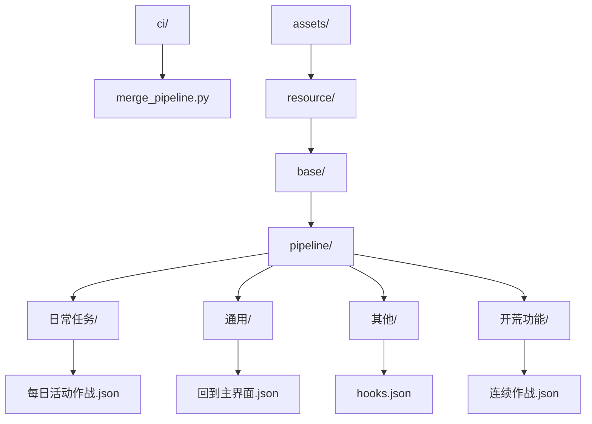
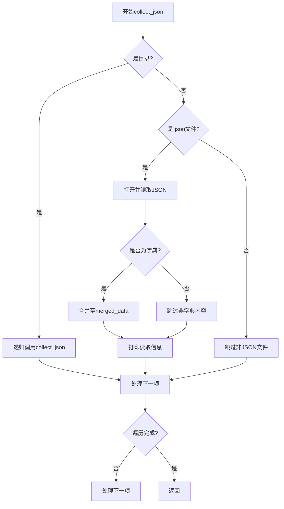
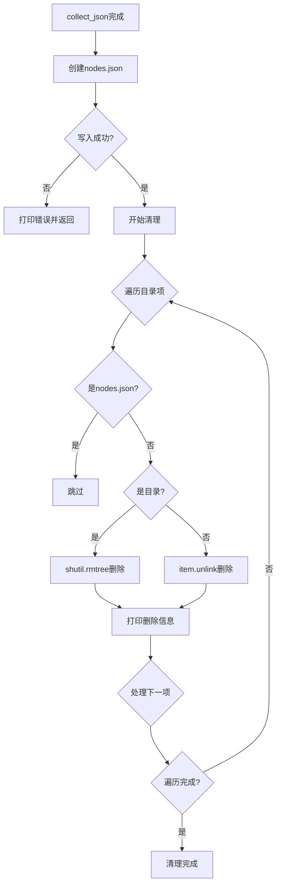
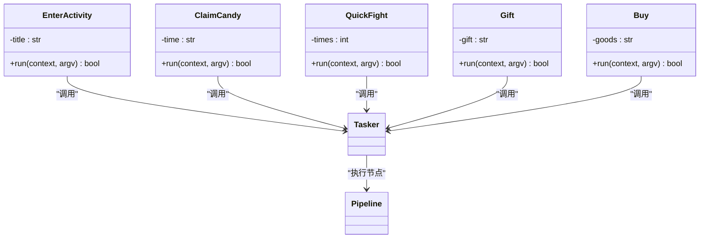
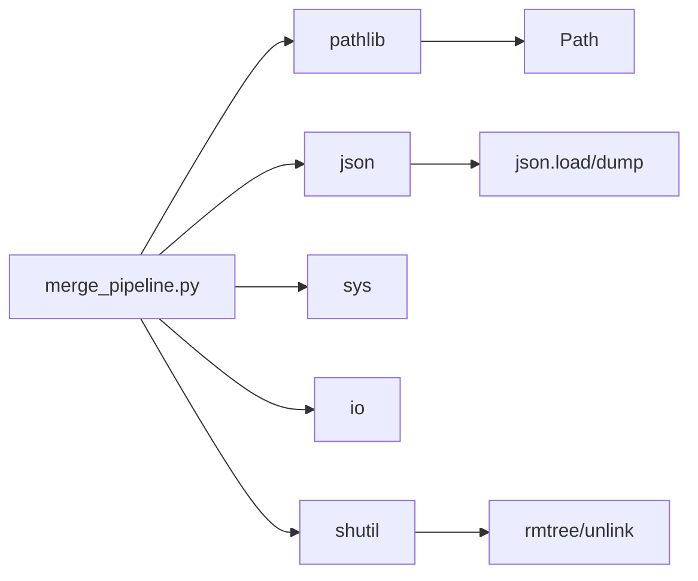

# 流水线合并机制

<cite>
**本文档引用文件**  
- [ci/merge_pipeline.py](file://ci/merge_pipeline.py)
- [assets/resource/base/pipeline/日常任务/每日活动作战.json](file://assets/resource/base/pipeline/日常任务/每日活动作战.json)
- [assets/resource/base/pipeline/通用/回到主界面.json](file://assets/resource/base/pipeline/通用/回到主界面.json)
- [assets/resource/base/pipeline/其他/hooks.json](file://assets/resource/base/pipeline/其他/hooks.json)
- [assets/resource/base/pipeline/其他/分隔符.json](file://assets/resource/base/pipeline/其他/分隔符.json)
- [assets/resource/base/pipeline/其他/说明.json](file://assets/resource/base/pipeline/其他/说明.json)
- [assets/resource/base/pipeline/开荒功能/连续作战.json](file://assets/resource/base/pipeline/开荒功能/连续作战.json)
- [assets/resource/base/pipeline/通用/快捷启动.json](file://assets/resource/base/pipeline/通用/快捷启动.json)
- [assets/resource/base/pipeline/通用/懒加载返回主界面.json](file://assets/resource/base/pipeline/通用/懒加载返回主界面.json)
- [assets/resource/base/pipeline/通用/捏脸.json](file://assets/resource/base/pipeline/通用/捏脸.json)
- [assets/resource/base/pipeline/通用/进入活动界面.json](file://assets/resource/base/pipeline/通用/进入活动界面.json)
- [assets/resource/base/default_pipeline.json](file://assets/resource/base/default_pipeline.json)
- [agent/customs/special_treat/activity.py](file://agent/customs/special_treat/activity.py)
- [agent/customs/special_treat/eat_sugar.py](file://agent/customs/special_treat/eat_sugar.py)
- [agent/customs/special_treat/store.py](file://agent/customs/special_treat/store.py)
</cite>

## 目录
1. [简介](#简介)
2. [项目结构](#项目结构)
3. [核心组件](#核心组件)
4. [架构概述](#架构概述)
5. [详细组件分析](#详细组件分析)
6. [依赖分析](#依赖分析)
7. [性能考虑](#性能考虑)
8. [故障排除指南](#故障排除指南)
9. [结论](#结论)

## 简介
本文档详细阐述MaaDuDuL项目的流水线配置合并机制，基于`ci/merge_pipeline.py`的实现逻辑。该机制通过自动化脚本将分散在多个子资源包中的JSON格式流水线配置文件合并为统一的`nodes.json`文件，实现资源的扁平化管理。此设计支持模块化开发模式，允许开发者在独立目录中维护功能模块（如“特殊活动”），并通过标准命名与路径规则参与合并流程，便于版本控制与资源复用。文档将深入解析脚本执行流程、合并逻辑、清理策略及潜在风险。

## 项目结构
MaaDuDuL项目采用模块化结构，其中`assets/resource`目录存放所有资源包，每个子目录（如`base`）代表一个独立的资源包。每个资源包内的`pipeline`子目录包含多个层级的JSON文件，这些文件定义了自动化任务的节点逻辑。`ci/merge_pipeline.py`脚本负责扫描所有资源包的`pipeline`目录，递归读取JSON文件并合并内容。

**图示来源**  
- [ci/merge_pipeline.py](file://ci/merge_pipeline.py#L9-L13)
- [assets/resource/base/pipeline/日常任务/每日活动作战.json](file://assets/resource/base/pipeline/日常任务/每日活动作战.json)
- [assets/resource/base/pipeline/通用/回到主界面.json](file://assets/resource/base/pipeline/通用/回到主界面.json)

**本节来源**  
- [ci/merge_pipeline.py](file://ci/merge_pipeline.py#L9-L13)
- 项目结构信息

## 核心组件
`ci/merge_pipeline.py`是流水线合并机制的核心组件，其主要功能包括：定位所有资源包的`pipeline`目录、递归扫描JSON文件、合并JSON内容至全局字典、输出统一的`nodes.json`文件，并清理原始分散文件。该脚本通过`pathlib.Path`实现跨平台路径操作，使用`json`模块进行数据读写，并通过`shutil`完成目录删除操作。

**本节来源**  
- [ci/merge_pipeline.py](file://ci/merge_pipeline.py#L1-L73)

## 架构概述
流水线合并机制采用集中式架构，由`merge_pipeline.py`作为中心控制器，协调资源发现、数据合并与结构清理三个核心流程。系统启动后，首先识别`assets/resource`下的所有子资源包，然后对每个包的`pipeline`目录执行合并操作。合并过程采用深度优先遍历策略递归加载JSON文件，最终生成扁平化的`nodes.json`。

**图示来源**  
- [ci/merge_pipeline.py](file://ci/merge_pipeline.py#L67-L71)
- [ci/merge_pipeline.py](file://ci/merge_pipeline.py#L16-L65)

## 详细组件分析

### 合并函数分析
`merge_json_files`函数是流水线合并的核心逻辑单元，负责处理单个资源包的`pipeline`目录。函数首先检查目录是否存在，然后通过嵌套函数`collect_json`递归遍历所有子目录和JSON文件。

#### 数据收集流程

**图示来源**  
- [ci/merge_pipeline.py](file://ci/merge_pipeline.py#L24-L40)

#### 合并与清理流程

**图示来源**  
- [ci/merge_pipeline.py](file://ci/merge_pipeline.py#L42-L65)

**本节来源**  
- [ci/merge_pipeline.py](file://ci/merge_pipeline.py#L16-L65)

### 模块化开发支持
该机制通过标准化的目录结构和命名规则支持模块化开发。开发者可在独立资源包中维护功能模块，如`特殊活动`相关的自定义动作在`agent/customs/special_treat/`目录下实现。

#### 自定义动作与流水线协同

**图示来源**  
- [agent/customs/special_treat/activity.py](file://agent/customs/special_treat/activity.py#L17-L55)
- [agent/customs/special_treat/eat_sugar.py](file://agent/customs/special_treat/eat_sugar.py#L21-L62)
- [agent/customs/special_treat/store.py](file://agent/customs/special_treat/store.py#L14-L49)

**本节来源**  
- [agent/customs/special_treat/activity.py](file://agent/customs/special_treat/activity.py)
- [agent/customs/special_treat/eat_sugar.py](file://agent/customs/special_treat/eat_sugar.py)
- [agent/customs/special_treat/store.py](file://agent/customs/special_treat/store.py)

## 依赖分析
流水线合并机制依赖Python标准库中的`pathlib`、`json`、`sys`、`io`和`shutil`模块。`pathlib`用于路径操作，`json`用于数据序列化，`shutil`用于文件系统操作。该机制与项目其他组件通过文件系统接口耦合，不直接依赖其他Python模块。

**图示来源**  
- [ci/merge_pipeline.py](file://ci/merge_pipeline.py#L1-L5)

**本节来源**  
- [ci/merge_pipeline.py](file://ci/merge_pipeline.py#L1-L5)

## 性能考虑
合并机制的性能主要受JSON文件数量和大小影响。由于采用递归遍历和内存中合并，对于大量小文件的场景表现良好。建议保持单个JSON文件小于1MB，避免深层嵌套目录结构。编码一致性（UTF-8）和避免节点命名冲突是保证合并效率的关键因素。

## 故障排除指南
常见问题包括编码错误、文件权限问题和节点命名冲突。脚本已内置异常处理，会打印详细的错误信息。建议使用统一的UTF-8编码，避免在不同操作系统间直接复制文件。若合并失败，可检查`print`输出的错误日志，确认文件路径和权限设置。

**本节来源**  
- [ci/merge_pipeline.py](file://ci/merge_pipeline.py#L36-L37)
- [ci/merge_pipeline.py](file://ci/merge_pipeline.py#L48-L49)
- [ci/merge_pipeline.py](file://ci/merge_pipeline.py#L63-L64)

## 结论
MaaDuDuL的流水线合并机制通过`ci/merge_pipeline.py`实现了高效的资源配置管理。该机制支持模块化开发，便于团队协作和版本控制。通过自动化合并与清理，确保了运行时配置的简洁性和一致性。最佳实践包括：使用统一编码、避免命名冲突、合理划分功能模块，并定期验证合并结果。