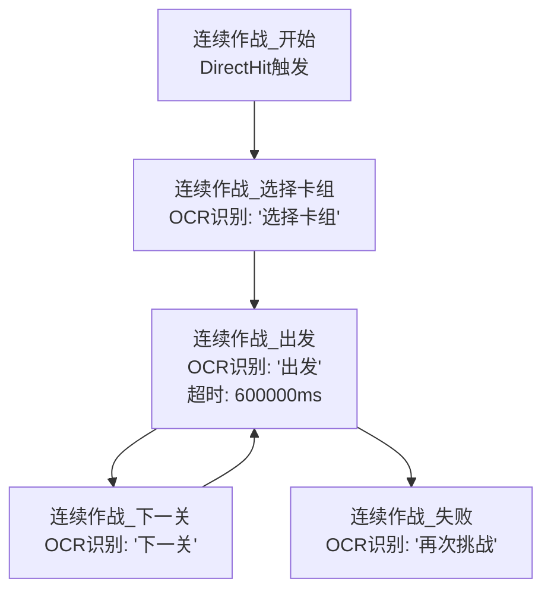
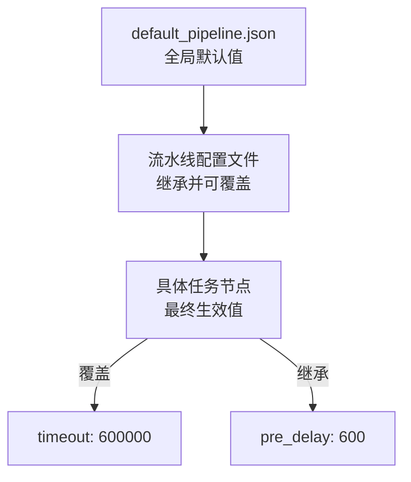
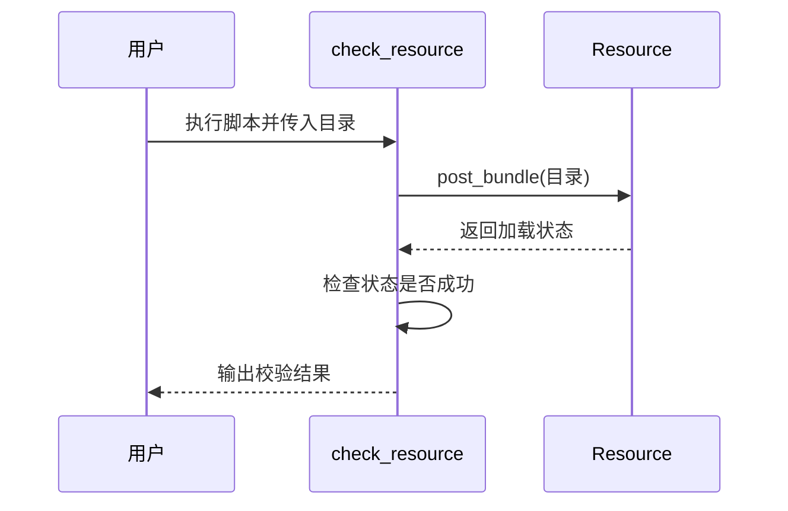
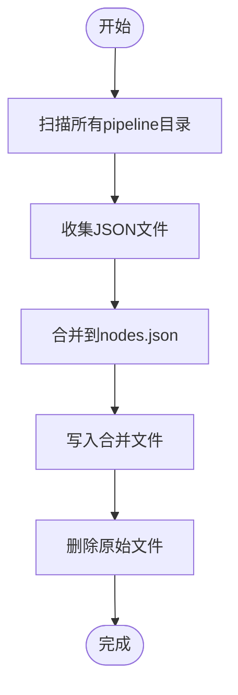

# 资源与配置管理

<cite>
**本文档引用文件**  
- [check_resource.py](file://check_resource.py)
- [ci/merge_pipeline.py](file://ci/merge_pipeline.py)
- [assets/MaaCommonAssets/OCR/README.md](file://assets/MaaCommonAssets/OCR/README.md)
- [assets/MaaCommonAssets/OCR/ppocr_v5/README.md](file://assets/MaaCommonAssets/OCR/ppocr_v5/README.md)
- [assets/MaaCommonAssets/OCR/ppocr_v3/zh_cn/README.md](file://assets/MaaCommonAssets/OCR/ppocr_v3/zh_cn/README.md)
- [assets/MaaCommonAssets/OCR/ppocr_v4/zh_cn/README.md](file://assets/MaaCommonAssets/OCR/ppocr_v4/zh_cn/README.md)
- [assets/MaaCommonAssets/OCR/ppocr_v3/en_us/README.md](file://assets/MaaCommonAssets/OCR/ppocr_v3/en_us/README.md)
- [assets/MaaCommonAssets/OCR/ppocr_v4/en_us/README.md](file://assets/MaaCommonAssets/OCR/ppocr_v4/en_us/README.md)
- [assets/resource/base/default_pipeline.json](file://assets/resource/base/default_pipeline.json)
- [assets/resource/base/pipeline/开荒功能/连续作战.json](file://assets/resource/base/pipeline/开荒功能/连续作战.json)
- [assets/resource/base/pipeline/日常任务/每日活动作战.json](file://assets/resource/base/pipeline/日常任务/每日活动作战.json)
- [assets/resource/base/pipeline/通用/回到主界面.json](file://assets/resource/base/pipeline/通用/回到主界面.json)
- [assets/resource/base/model/ocr/README.md](file://assets/resource/base/model/ocr/README.md)
- [assets/config/maa_pi_config.json](file://assets/config/maa_pi_config.json)
</cite>

## 目录
1. [资源体系概述](#资源体系概述)
2. [OCR模型管理](#ocr模型管理)
3. [任务流水线配置](#任务流水线配置)
4. [默认任务流机制](#默认任务流机制)
5. [资源校验与合并](#资源校验与合并)
6. [资源包制作指南](#资源包制作指南)

## 资源体系概述

MaaDuDuL的资源管理体系采用模块化设计，主要分为OCR模型、任务流水线配置和资源校验三大核心组件。系统通过`assets`目录下的多层级结构组织资源，支持灵活的资源加载与覆盖机制。`assets/resource/base`作为基础资源目录，包含默认的流水线配置和模型文件，而`assets/MaaCommonAssets`则存放共享的OCR模型资源。

**Section sources**
- [assets/config/maa_pi_config.json](file://assets/config/maa_pi_config.json#L1-L3)

## OCR模型管理

### ppocr_v3/v4/v5系列模型特性

MaaDuDuL集成了PaddleOCR的多版本模型，满足不同场景下的文字识别需求：

- **ppocr_v3系列**：支持中、英、日、韩等多语言识别，适用于需要广泛语言覆盖的场景。其中`zh_cn`版本专为中文优化，同时兼容英文文本识别。
- **ppocr_v4系列**：在v3基础上进一步优化了模型体积与识别速度，特别适合移动端或资源受限环境。`en_us`版本专注于英文与数字识别，精度更高。
- **ppocr_v5系列**：最新一代模型，采用单一模型支持简体中文、繁体中文、英文、日文四种主要语言，同时具备对手写、竖版、拼音等复杂文本的识别能力。根据[官方说明](file://assets/MaaCommonAssets/OCR/ppocr_v5/README.md)，v5模型在保持高精度的同时显著提升了推理效率。

### 语言支持与适用场景

| 模型版本 | 支持语言 | 适用场景 |
|---------|--------|--------|
| ppocr_v3 | 中文、英文、日文、韩文、多语言 | 多语言混合界面、国际化应用 |
| ppocr_v4 | 中英文、数字 | 高效识别中文界面中的数字与文本 |
| ppocr_v5 | 简体中文、繁体中文、英文、日文 | 复杂文本场景、高精度多语言识别 |

### OCR资源更新与替换

用户可通过以下步骤更新或替换OCR资源：
1. 下载对应版本的PaddleOCR模型文件
2. 将模型转换为ONNX格式（参考`assets/MaaCommonAssets/OCR/README.md`中的转换命令）
3. 替换`assets/MaaCommonAssets/OCR`目录下对应版本的`.onnx`文件
4. 确保`keys.txt`文件与模型版本匹配

**Section sources**
- [assets/MaaCommonAssets/OCR/README.md](file://assets/MaaCommonAssets/OCR/README.md#L1-L41)
- [assets/MaaCommonAssets/OCR/ppocr_v5/README.md](file://assets/MaaCommonAssets/OCR/ppocr_v5/README.md#L1-L6)
- [assets/MaaCommonAssets/OCR/ppocr_v3/zh_cn/README.md](file://assets/MaaCommonAssets/OCR/ppocr_v3/zh_cn/README.md#L1-L24)
- [assets/MaaCommonAssets/OCR/ppocr_v4/zh_cn/README.md](file://assets/MaaCommonAssets/OCR/ppocr_v4/zh_cn/README.md#L1-L24)
- [assets/MaaCommonAssets/OCR/ppocr_v3/en_us/README.md](file://assets/MaaCommonAssets/OCR/ppocr_v3/en_us/README.md#L1-L24)
- [assets/MaaCommonAssets/OCR/ppocr_v4/en_us/README.md](file://assets/MaaCommonAssets/OCR/ppocr_v4/en_us/README.md#L1-L21)
- [assets/resource/base/model/ocr/README.md](file://assets/resource/base/model/ocr/README.md#L1-L24)

## 任务流水线配置

### JSON配置文件结构解析

任务流水线配置文件采用JSON格式，定义了任务节点的识别、动作和流程控制逻辑。以`连续作战.json`为例，其核心结构包括：

- **节点定义**：每个任务节点包含唯一标识符（如"连续作战_出发"）
- **识别方式**（recognition）：支持OCR、模板匹配（TemplateMatch）和直接命中（DirectHit）
- **执行动作**（action）：包括点击（Click）、自定义动作（Custom）等
- **流程控制**（next）：定义成功后的下一个节点
- **超时设置**（timeout）：节点执行的最大等待时间

### ‘连续作战.json’任务节点分析

该配置文件定义了连续作战任务的完整流程：
1. **开始节点**：通过DirectHit触发，作为流程入口
2. **选择卡组**：通过OCR识别"选择卡组"文本，执行点击操作
3. **出发作战**：识别"出发"按钮并点击，设置60秒超时
4. **下一关**：识别"下一关"文本，进入下一轮作战
5. **失败检测**：通过OCR检测"再次挑战"，处理战斗失败情况



**Diagram sources**
- [assets/resource/base/pipeline/开荒功能/连续作战.json](file://assets/resource/base/pipeline/开荒功能/连续作战.json#L1-L120)

**Section sources**
- [assets/resource/base/pipeline/开荒功能/连续作战.json](file://assets/resource/base/pipeline/开荒功能/连续作战.json#L1-L120)

## 默认任务流机制

### default_pipeline.json结构

`default_pipeline.json`文件定义了全局默认参数：
```json
{
    "Default": {
        "timeout": 30000,
        "pre_delay": 600
    }
}
```

### 覆盖机制说明

该文件中的默认值会被所有任务节点继承，具体覆盖规则如下：
- **层级覆盖**：节点级配置 > 流水线级配置 > 全局默认配置
- **参数继承**：未显式定义的参数自动继承默认值
- **动态覆盖**：运行时可通过API动态修改默认参数

例如，`每日活动作战.json`中的节点可以覆盖全局的30秒超时设置，定义自己的超时时间。



**Diagram sources**
- [assets/resource/base/default_pipeline.json](file://assets/resource/base/default_pipeline.json#L1-L7)
- [assets/resource/base/pipeline/日常任务/每日活动作战.json](file://assets/resource/base/pipeline/日常任务/每日活动作战.json#L1-L359)

**Section sources**
- [assets/resource/base/default_pipeline.json](file://assets/resource/base/default_pipeline.json#L1-L7)

## 资源校验与合并

### check_resource.py资源完整性验证

`check_resource.py`是资源完整性校验工具，其核心功能包括：
- 验证指定目录下的资源包是否完整
- 检测资源文件的可读性和格式正确性
- 通过MAA框架的Resource模块进行实际加载测试

使用方法：
```bash
python check_resource.py <目录路径1> <目录路径2> ...
```

校验流程：
1. 创建Resource实例
2. 逐个加载指定目录的资源包
3. 检查加载状态，任一失败则返回False
4. 输出详细的校验日志



**Diagram sources**
- [check_resource.py](file://check_resource.py#L1-L40)

**Section sources**
- [check_resource.py](file://check_resource.py#L1-L40)

### merge_pipeline.py多资源包合并

`ci/merge_pipeline.py`负责合并多个资源包中的流水线配置，主要功能包括：
- 递归扫描所有`pipeline`目录
- 合并所有JSON文件到`nodes.json`
- 清理原始的目录结构，保留合并后的单一文件

处理流程：
1. 确定工作目录和资源路径
2. 收集所有pipeline目录
3. 遍历每个目录，读取并合并JSON文件
4. 生成`nodes.json`文件
5. 删除原始的JSON文件和目录



**Diagram sources**
- [ci/merge_pipeline.py](file://ci/merge_pipeline.py#L1-L73)

**Section sources**
- [ci/merge_pipeline.py](file://ci/merge_pipeline.py#L1-L73)

## 资源包制作指南

### 图像素材准备

1. **截图规范**：使用标准分辨率截图，确保UI元素清晰可见
2. **命名规则**：采用有意义的英文名称，如`global/home.png`
3. **格式要求**：统一使用PNG格式，保持透明通道

### 坐标校准

1. 使用MaaAssistantArknights的MPE编辑器进行可视化编辑
2. 通过`$__mpe_code`中的`position`字段记录节点位置
3. 在`roi`（感兴趣区域）中精确指定识别范围

### 配置文件编写规范

1. **节点命名**：采用"功能_操作"格式，如"连续作战_出发"
2. **识别参数**：
   - OCR：指定`expected`文本和`roi`区域
   - 模板匹配：提供多个模板图片路径
3. **流程控制**：
   - `next`：定义成功后的下一个节点
   - `on_error`：定义错误处理节点
   - `repeat`：设置重复次数
4. **性能优化**：
   - 合理设置`timeout`避免无限等待
   - 使用`pre_delay`和`post_delay`控制操作间隔

**Section sources**
- [assets/resource/base/pipeline/日常任务/每日活动作战.json](file://assets/resource/base/pipeline/日常任务/每日活动作战.json#L1-L359)
- [assets/resource/base/pipeline/通用/回到主界面.json](file://assets/resource/base/pipeline/通用/回到主界面.json#L1-L202)