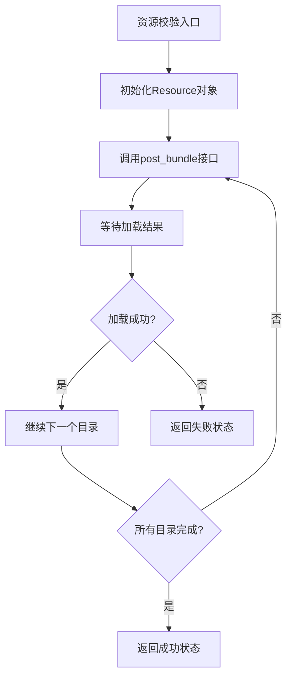
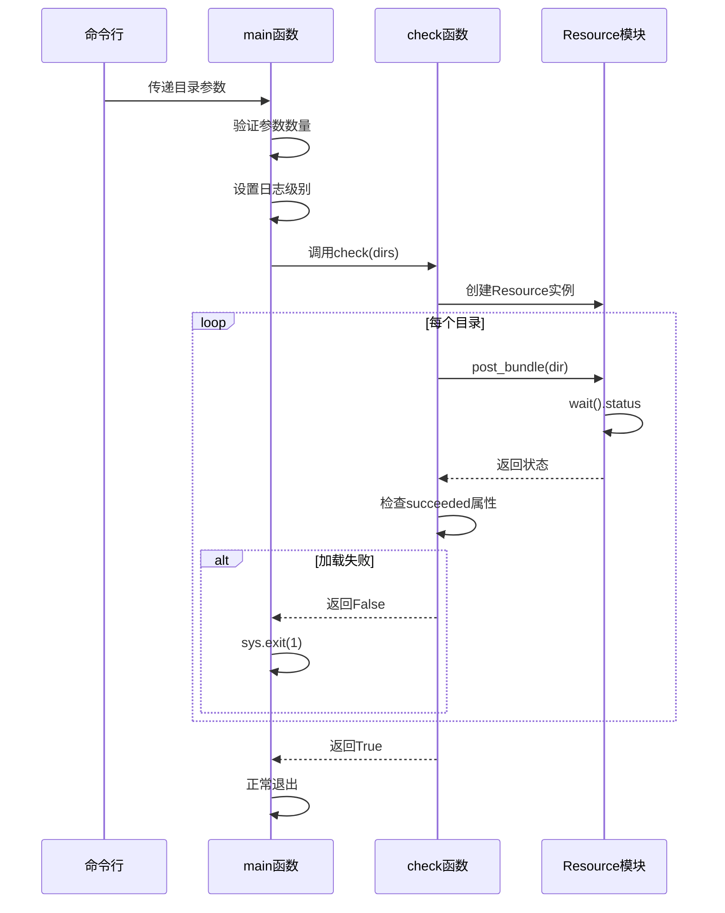
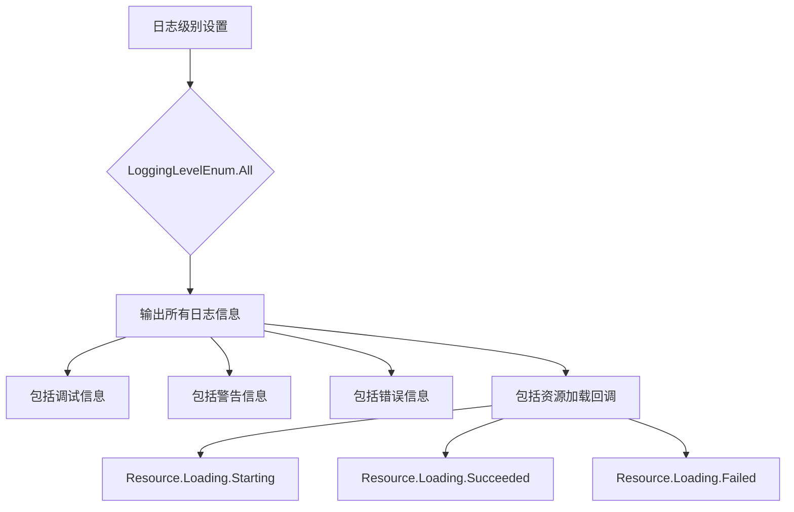
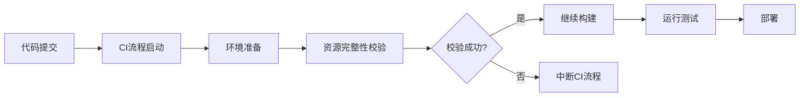

# 资源完整性校验

<cite>
**本文档引用文件**  
- [check_resource.py](file://check_resource.py)
- [interface.json](file://assets/interface.json)
- [ci/config/maa_option.json](file://ci/config/maa_option.json)
- [assets/resource/base/default_pipeline.json](file://assets/resource/base/default_pipeline.json)
- [instructions/maafw-guide/2.3-回调协议.md](file://instructions/maafw-guide/2.3-回调协议.md)
- [instructions/maafw-guide/2.2-集成接口一览.md](file://instructions/maafw-guide/2.2-集成接口一览.md)
</cite>

## 目录
1. [简介](#简介)
2. [资源完整性校验机制](#资源完整性校验机制)
3. [校验脚本实现原理](#校验脚本实现原理)
4. [日志级别配置](#日志级别配置)
5. [CI/CD流程集成](#cicd流程集成)
6. [开发者本地使用指南](#开发者本地使用指南)
7. [常见问题与故障排查](#常见问题与故障排查)
8. [结论](#结论)

## 简介
MaaDuDuL项目通过`check_resource.py`脚本实现了资源完整性校验机制，确保项目资源包的完整性和正确性。该机制在CI/CD流程中发挥关键作用，能够提前发现资源路径错误、文件缺失或格式异常等问题，保障项目稳定运行。

## 资源完整性校验机制
MaaDuDuL的资源完整性校验机制基于MaaFramework的Resource模块实现，通过验证指定目录下的资源包来确保其完整性和可用性。该机制在项目开发和部署过程中起到关键的保障作用。

资源包结构遵循MaaFramework的ProjectInterfaceV2协议规范，包含任务流水线、图像识别模板、OCR模型等核心组件。`interface.json`文件定义了项目的基本信息、控制器配置、资源路径和任务定义，是资源包的核心配置文件。



**图示来源**  
- [check_resource.py](file://check_resource.py#L10-L23)

## 校验脚本实现原理
`check_resource.py`脚本实现了完整的资源校验流程，通过命令行参数接收一个或多个资源目录路径，并逐个进行验证。

脚本的核心逻辑包含两个主要函数：`check()`函数负责执行资源校验，`main()`函数处理命令行参数和程序流程控制。当程序接收到目录参数后，会创建Resource对象，并对每个目录调用`post_bundle()`接口提交资源加载请求。



**图示来源**  
- [check_resource.py](file://check_resource.py#L10-L39)

**本节来源**  
- [check_resource.py](file://check_resource.py#L10-L39)

## 日志级别配置
`check_resource.py`脚本通过`Tasker.set_stdout_level(LoggingLevelEnum.All)`设置日志级别为All，确保输出完整的调试信息。这一配置对于资源校验过程中的问题排查至关重要。

根据MaaFramework的回调协议，资源加载过程会产生多种回调消息，包括`Resource.Loading.Starting`、`Resource.Loading.Succeeded`和`Resource.Loading.Failed`。当日志级别设置为All时，这些详细的回调信息都会被输出到控制台，帮助开发者了解资源加载的详细过程。

在CI/CD环境中，`ci/config/maa_option.json`文件中的`stdout_level`配置项也控制着日志输出级别，默认值为2（Error级别），但在资源校验脚本中通过代码强制设置为All级别，确保获取最详细的调试信息。



**图示来源**  
- [check_resource.py](file://check_resource.py#L31)
- [ci/config/maa_option.json](file://ci/config/maa_option.json#L5)
- [instructions/maafw-guide/2.3-回调协议.md](file://instructions/maafw-guide/2.3-回调协议.md#L22-L56)

**本节来源**  
- [check_resource.py](file://check_resource.py#L31)
- [ci/config/maa_option.json](file://ci/config/maa_option.json#L5)
- [instructions/maafw-guide/2.3-回调协议.md](file://instructions/maafw-guide/2.3-回调协议.md#L22-L56)

## CI/CD流程集成
资源完整性校验机制深度集成到MaaDuDuL项目的CI/CD流程中，作为质量保证的关键环节。通过自动化校验，可以在代码合并前发现潜在的资源问题，避免将错误引入主分支。

CI/CD流程中的资源校验通常在构建阶段执行，作为预构建检查的一部分。`package.json`文件中的脚本定义了相关的开发命令，而CI环境会调用`check_resource.py`脚本来验证资源完整性。

当校验失败时，脚本会返回非零退出码，这会中断CI流程，防止有问题的代码被部署。这种机制确保了只有通过资源完整性校验的代码才能进入后续的构建和部署阶段。



**图示来源**  
- [check_resource.py](file://check_resource.py#L35)
- [package.json](file://package.json#L2-L8)

**本节来源**  
- [check_resource.py](file://check_resource.py#L35)
- [package.json](file://package.json#L2-L8)

## 开发者本地使用指南
开发者在创建或修改自定义资源包后，可以使用`check_resource.py`脚本在本地进行资源完整性校验，提前发现潜在问题。

### 使用示例
```bash
python check_resource.py assets/resource/base
```

该命令会校验`assets/resource/base`目录下的资源包。脚本支持同时校验多个目录：

```bash
python check_resource.py assets/resource/base assets/resource/custom
```

### 本地校验流程
1. 确保Python环境已正确配置
2. 确认`maafw`依赖已安装（可通过`pip install -r requirements.txt`安装）
3. 运行校验脚本并传入资源目录路径
4. 检查输出结果，确认所有目录校验通过

### 常见校验问题
- **路径错误**：检查资源文件路径是否正确，特别是JSON文件中引用的图片路径
- **文件缺失**：确认所有必需的资源文件都已包含在目录中
- **格式异常**：验证JSON文件的语法正确性，确保没有语法错误
- **编码问题**：确保文件使用UTF-8编码，避免中文字符乱码

通过本地运行校验脚本，开发者可以在提交代码前发现并修复这些问题，提高开发效率和代码质量。

**本节来源**  
- [check_resource.py](file://check_resource.py#L27-L39)
- [assets/resource/base](file://assets/resource/base)
- [requirements.txt](file://requirements.txt#L1)

## 常见问题与故障排查
在使用资源完整性校验机制时，可能会遇到一些常见问题。以下是问题排查指南：

### 资源加载失败
当资源加载失败时，首先检查目录路径是否正确。确保传入的路径是存在的资源目录。如果路径正确但仍然失败，可能是资源文件本身存在问题。

### 文件编码问题
资源文件应使用UTF-8编码保存，特别是包含中文字符的文件。编码错误可能导致解析失败或字符乱码。

### 依赖缺失
确保`maafw`库已正确安装。可以通过`pip list`命令检查是否已安装`maafw==5.3.0b5`版本。

### 权限问题
在某些系统上，可能需要管理员权限才能访问某些目录。确保脚本有足够的权限读取资源文件。

### 环境配置
检查Python环境是否正确配置，特别是嵌入式Python环境的设置。`ci/setup_embed_python.ps1`和`ci/setup_embed_python.sh`脚本提供了环境配置的参考。

**本节来源**  
- [check_resource.py](file://check_resource.py#L18-L20)
- [requirements.txt](file://requirements.txt#L1)
- [ci/setup_embed_python.ps1](file://ci/setup_embed_python.ps1)
- [ci/setup_embed_python.sh](file://ci/setup_embed_python.sh)

## 结论
MaaDuDuL的资源完整性校验机制通过`check_resource.py`脚本实现了高效的资源验证功能。该机制利用MaaFramework的Resource模块，通过`post_bundle()`接口对指定目录进行资源加载验证，并通过`wait().status`检查加载结果。

在CI/CD流程中，该机制作为质量门禁，能够有效防止资源不完整或格式错误的代码进入生产环境。通过设置`LoggingLevelEnum.All`日志级别，确保了完整的调试信息输出，便于问题排查。

开发者可以在本地运行校验脚本，提前发现路径错误、文件缺失或格式异常等问题，提高开发效率和代码质量。这一机制为MaaDuDuL项目的稳定运行提供了重要保障。