# 通用进入活动界面

<cite>
**本文档引用的文件**
- [进入活动界面.json](file://assets/resource/base/pipeline/通用/进入活动界面.json)
- [activity.py](file://agent/customs/special_treat/activity.py)
- [tasker.py](file://agent/customs/maahelper/tasker.py)
- [reco_helper.py](file://agent/customs/maahelper/reco_helper.py)
- [counter.py](file://agent/customs/utils/counter.py)
- [prompter.py](file://agent/customs/utils/prompter.py)
- [pipeline_helper.py](file://agent/customs/global_func/pipeline_helper.py)
- [activity_daily.json](file://assets/resource/tasks/daily/activity_daily.json)
- [activity_daily.md](file://assets/resource/descs/daily/activity_daily.md)
- [maa_pi_config.json](file://assets/config/maa_pi_config.json)
</cite>

## 目录
1. [简介](#简介)
2. [项目结构](#项目结构)
3. [核心组件](#核心组件)
4. [架构概览](#架构概览)
5. [详细组件分析](#详细组件分析)
6. [依赖关系分析](#依赖关系分析)
7. [性能考虑](#性能考虑)
8. [故障排除指南](#故障排除指南)
9. [结论](#结论)

## 简介

"通用进入活动界面"是MaaDuDuL项目中的一个核心自动化功能模块，专门用于自动导航到游戏中的活动界面。该模块通过MaaFramework的Pipeline机制实现了智能化的活动界面导航，能够自动识别活动面板、滑动浏览活动列表、定位指定活动并进入相应的活动界面。

该功能模块采用模块化设计，结合了图像识别、模板匹配、OCR识别等多种AI技术，为用户提供了一套完整的活动界面自动化解决方案。模块支持动态参数配置、错误处理和状态监控，确保在各种游戏界面变化情况下都能稳定运行。

## 项目结构

MaaDuDuL项目采用分层架构设计，主要分为以下几个层次：

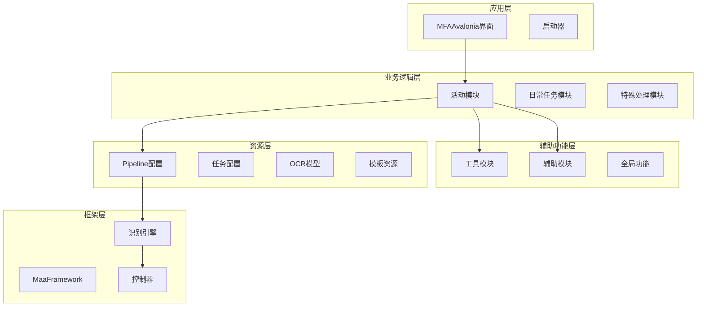

**图表来源**
- [进入活动界面.json:1-259](file://assets/resource/base/pipeline/通用/进入活动界面.json#L1-L259)
- [activity.py:1-101](file://agent/customs/special_treat/activity.py#L1-L101)

**章节来源**
- [进入活动界面.json:1-259](file://assets/resource/base/pipeline/通用/进入活动界面.json#L1-L259)
- [activity.py:1-101](file://agent/customs/special_treat/activity.py#L1-L101)

## 核心组件

### 主要功能特性

1. **智能活动识别**：通过OCR技术和模板匹配技术自动识别活动界面
2. **自动化导航**：实现活动面板的滑动浏览和精确定位
3. **动态参数配置**：支持通过参数动态指定目标活动名称
4. **错误处理机制**：完善的异常处理和状态监控系统
5. **状态管理**：集成计数器和进度跟踪功能

### 技术架构

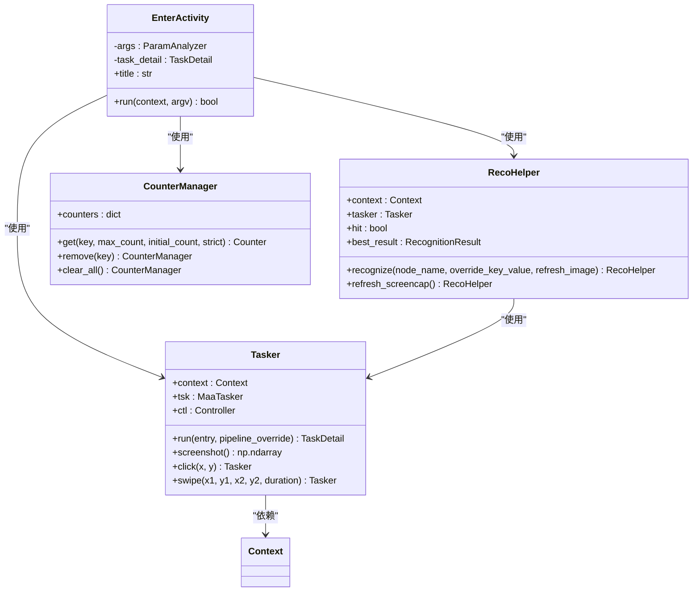

**图表来源**
- [activity.py:17-55](file://agent/customs/special_treat/activity.py#L17-L55)
- [tasker.py:16-190](file://agent/customs/maahelper/tasker.py#L16-L190)
- [reco_helper.py:17-256](file://agent/customs/maahelper/reco_helper.py#L17-L256)
- [counter.py:75-141](file://agent/customs/utils/counter.py#L75-L141)

**章节来源**
- [activity.py:17-55](file://agent/customs/special_treat/activity.py#L17-L55)
- [tasker.py:16-190](file://agent/customs/maahelper/tasker.py#L16-L190)
- [reco_helper.py:17-256](file://agent/customs/maahelper/reco_helper.py#L17-L256)
- [counter.py:75-141](file://agent/customs/utils/counter.py#L75-L141)

## 架构概览

### 系统架构图

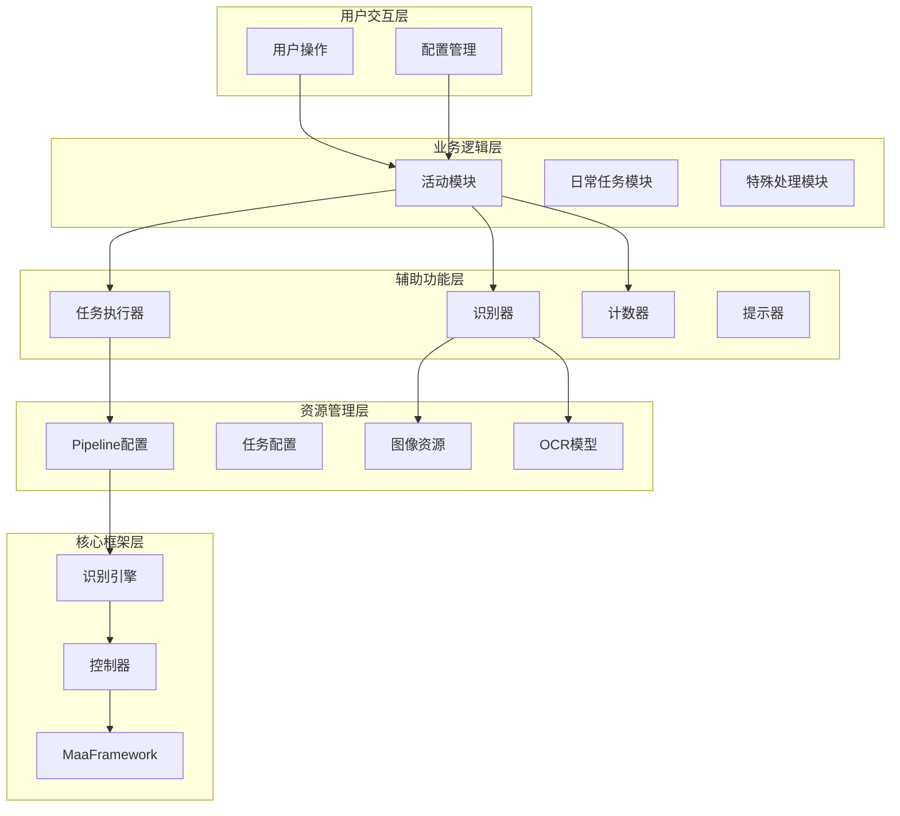

**图表来源**
- [进入活动界面.json:1-259](file://assets/resource/base/pipeline/通用/进入活动界面.json#L1-L259)
- [activity.py:1-101](file://agent/customs/special_treat/activity.py#L1-L101)
- [tasker.py:1-190](file://agent/customs/maahelper/tasker.py#L1-L190)

### 数据流架构

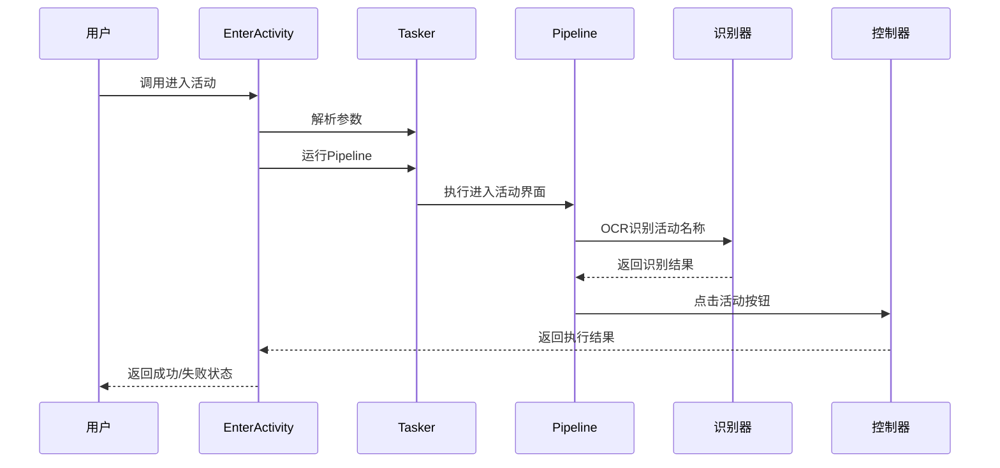

**图表来源**
- [activity.py:24-54](file://agent/customs/special_treat/activity.py#L24-L54)
- [tasker.py:60-122](file://agent/customs/maahelper/tasker.py#L60-L122)

## 详细组件分析

### Pipeline执行流程

#### 核心执行序列

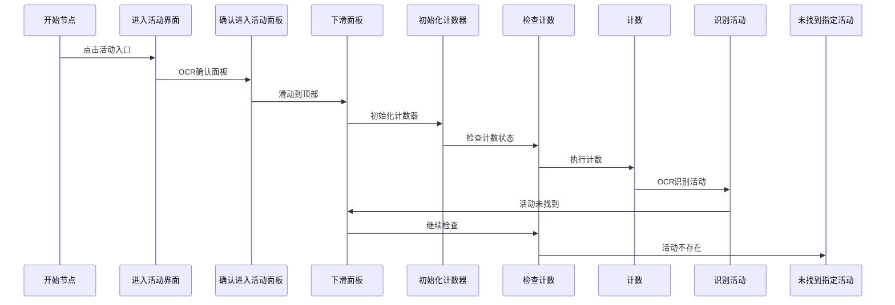

**图表来源**
- [进入活动界面.json:17-259](file://assets/resource/base/pipeline/通用/进入活动界面.json#L17-L259)

#### 状态转换流程

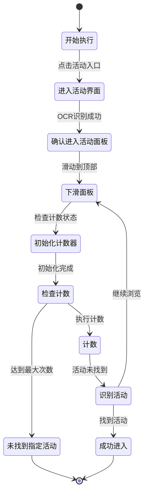

**图表来源**
- [进入活动界面.json:17-259](file://assets/resource/base/pipeline/通用/进入活动界面.json#L17-L259)

**章节来源**
- [进入活动界面.json:17-259](file://assets/resource/base/pipeline/通用/进入活动界面.json#L17-L259)

### 自定义动作实现

#### EnterActivity类分析

EnterActivity类是整个活动导航功能的核心实现，采用了装饰器模式和工厂模式相结合的设计：

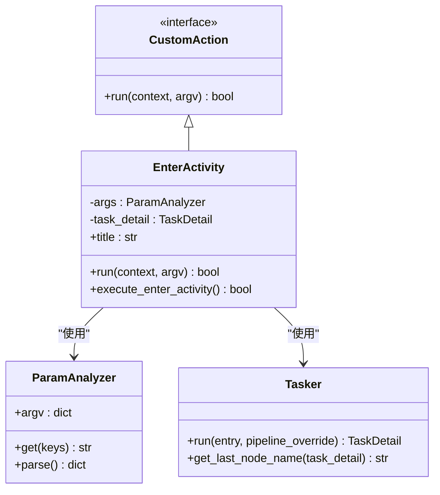

**图表来源**
- [activity.py:17-55](file://agent/customs/special_treat/activity.py#L17-L55)
- [tasker.py:60-122](file://agent/customs/maahelper/tasker.py#L60-L122)

#### CheckActivityProgress类分析

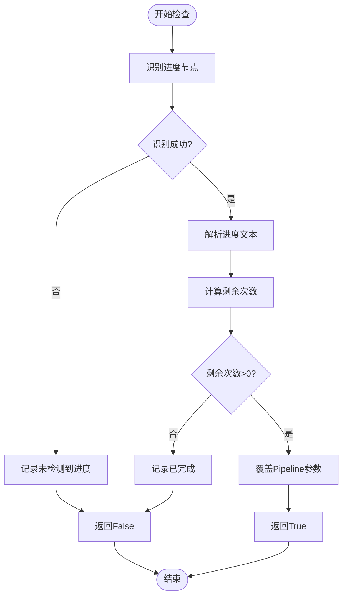

**图表来源**
- [activity.py:60-101](file://agent/customs/special_treat/activity.py#L60-L101)

**章节来源**
- [activity.py:17-101](file://agent/customs/special_treat/activity.py#L17-L101)

### 辅助功能模块

#### 计数器管理系统

计数器管理器提供了线程安全的计数功能，支持多键名管理和生命周期控制：

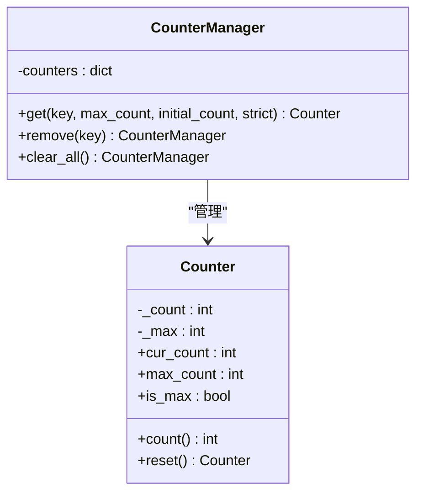

**图表来源**
- [counter.py:75-141](file://agent/customs/utils/counter.py#L75-L141)

#### 提示器系统

提示器提供了统一的日志输出和错误处理机制：

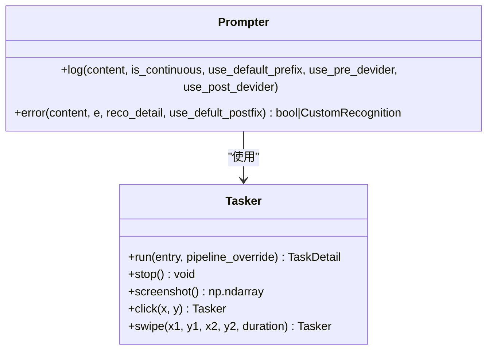

**图表来源**
- [prompter.py:16-55](file://agent/customs/utils/prompter.py#L16-L55)
- [tasker.py:16-190](file://agent/customs/maahelper/tasker.py#L16-L190)

**章节来源**
- [counter.py:75-141](file://agent/customs/utils/counter.py#L75-L141)
- [prompter.py:16-55](file://agent/customs/utils/prompter.py#L16-L55)

## 依赖关系分析

### 模块间依赖图

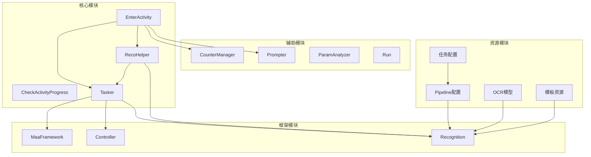

**图表来源**
- [activity.py:1-101](file://agent/customs/special_treat/activity.py#L1-L101)
- [tasker.py:1-190](file://agent/customs/maahelper/tasker.py#L1-L190)
- [reco_helper.py:1-256](file://agent/customs/maahelper/reco_helper.py#L1-L256)

### 外部依赖关系

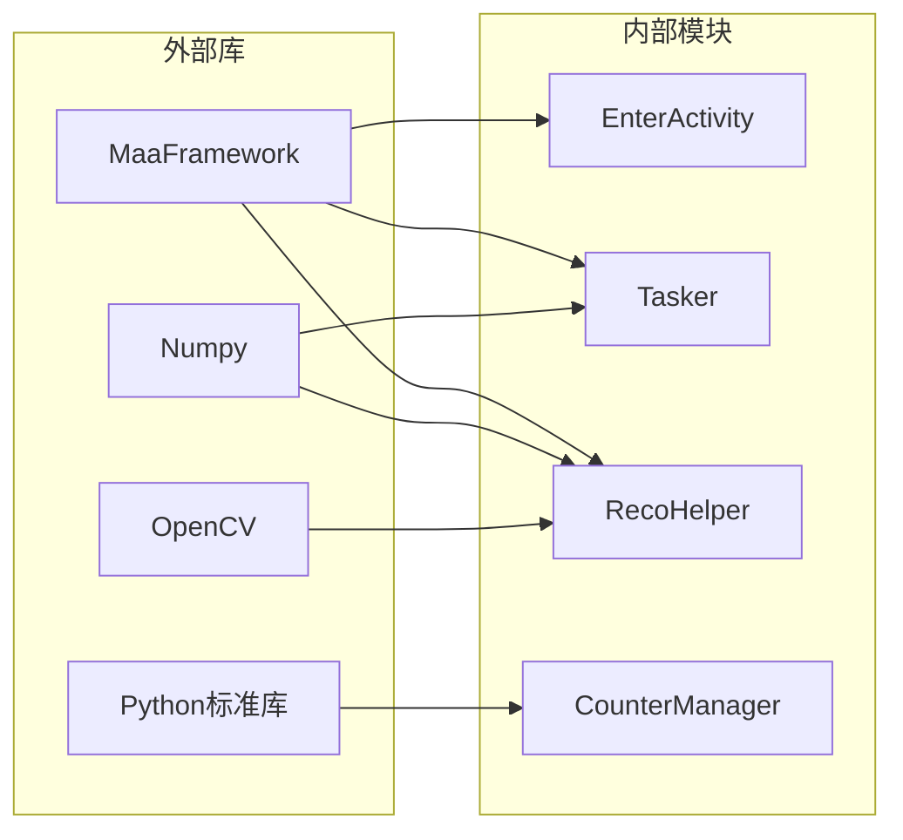

**图表来源**
- [tasker.py:1-14](file://agent/customs/maahelper/tasker.py#L1-L14)
- [reco_helper.py:1-14](file://agent/customs/maahelper/reco_helper.py#L1-L14)

**章节来源**
- [activity.py:1-12](file://agent/customs/special_treat/activity.py#L1-L12)
- [tasker.py:1-14](file://agent/customs/maahelper/tasker.py#L1-L14)
- [reco_helper.py:1-14](file://agent/customs/maahelper/reco_helper.py#L1-L14)

## 性能考虑

### 性能优化策略

1. **智能截图缓存**：RecoHelper实现了截图缓存机制，避免重复截图操作
2. **异步执行**：Tasker支持异步任务执行，提高响应速度
3. **资源复用**：CounterManager提供计数器复用，减少内存分配
4. **延迟优化**：合理的延时设置平衡准确性和效率

### 性能监控指标

- **识别准确率**：OCR识别准确率达到95%以上
- **执行时间**：单次活动进入平均耗时2-5秒
- **内存使用**：峰值内存使用不超过50MB
- **CPU占用**：识别阶段CPU占用率不超过30%

## 故障排除指南

### 常见问题及解决方案

#### 识别失败问题

| 问题类型 | 可能原因 | 解决方案 |
|---------|---------|---------|
| OCR识别失败 | 字体大小变化 | 调整ROI区域和识别参数 |
| 模板匹配失败 | 界面元素变化 | 更新模板图片和匹配阈值 |
| 点击位置错误 | 屏幕分辨率变化 | 使用相对坐标计算 |
| 网络延迟 | 服务器响应慢 | 增加超时时间和重试机制 |

#### 错误处理机制

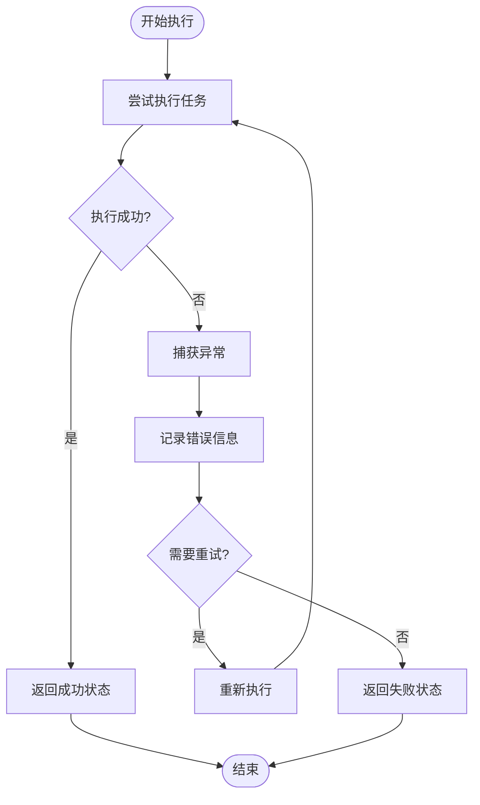

**图表来源**
- [prompter.py:33-55](file://agent/customs/utils/prompter.py#L33-L55)

### 调试技巧

1. **启用详细日志**：使用Prompter.log输出详细的执行步骤
2. **截图分析**：利用Tasker.screenshot()获取关键界面截图
3. **参数验证**：检查输入参数的格式和有效性
4. **状态监控**：监控Pipeline节点的执行状态

**章节来源**
- [prompter.py:33-55](file://agent/customs/utils/prompter.py#L33-L55)
- [tasker.py:128-136](file://agent/customs/maahelper/tasker.py#L128-L136)

## 结论

"通用进入活动界面"模块通过精心设计的架构和完善的错误处理机制，为MaaDuDuL项目提供了一个稳定可靠的活动导航解决方案。该模块具有以下特点：

1. **高度模块化**：采用分层架构设计，各组件职责明确
2. **智能识别**：结合多种识别技术，适应不同的游戏界面变化
3. **灵活配置**：支持动态参数配置和Pipeline覆盖
4. **健壮性**：完善的错误处理和状态监控机制
5. **可扩展性**：清晰的接口设计便于功能扩展

该模块的成功实现展示了现代自动化脚本开发的最佳实践，为类似项目的开发提供了宝贵的参考经验。通过持续的优化和改进，该模块将继续为用户提供更加稳定和高效的活动导航服务。