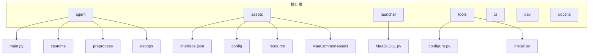
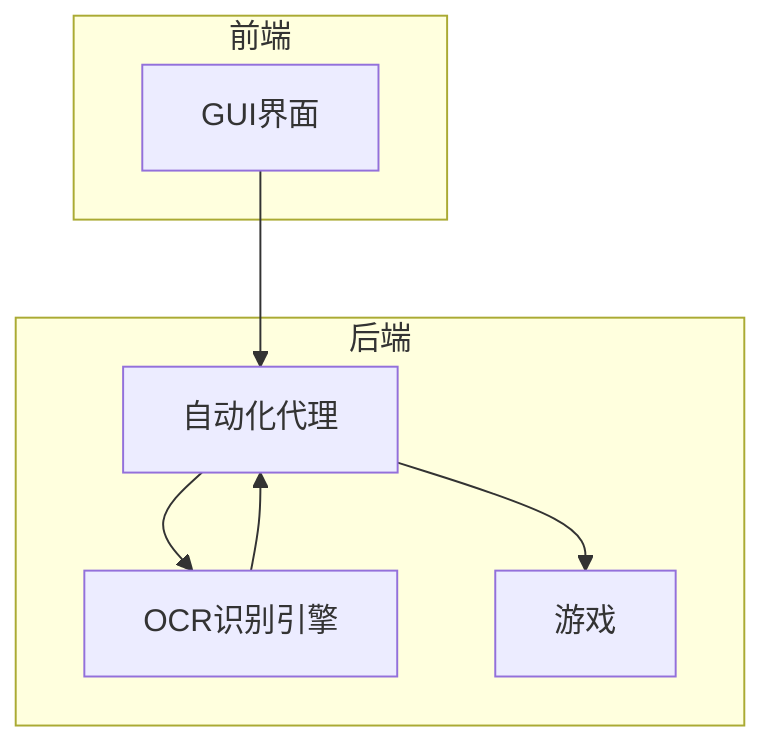
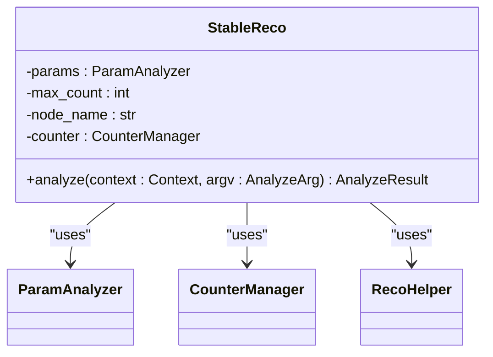
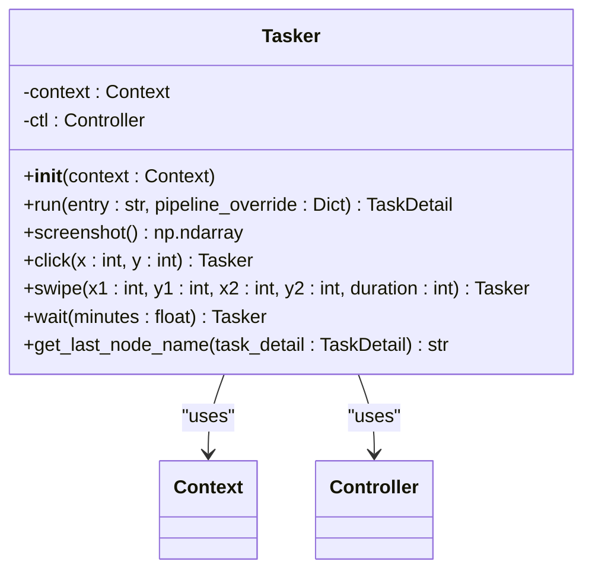
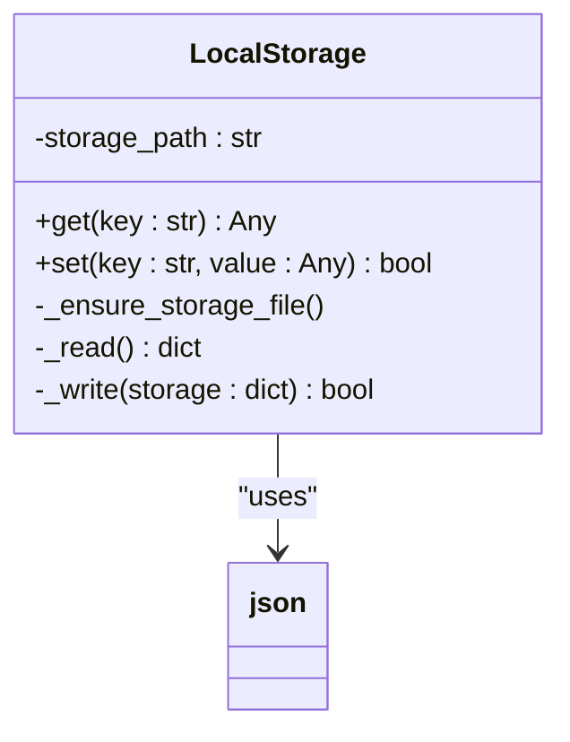
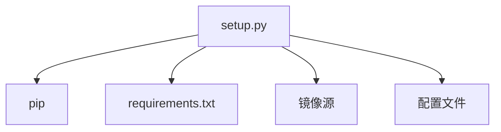

# 项目概述

<cite>
**本文档引用的文件**   
- [README.md](file://README.md)
- [agent/main.py](file://agent/main.py)
- [assets/interface.json](file://assets/interface.json)
- [assets/config/maa_pi_config.json](file://assets/config/maa_pi_config.json)
- [launcher/MaaDuDuL.py](file://launcher/MaaDuDuL.py)
- [agent/preprocess/setup.py](file://agent/preprocess/setup.py)
- [agent/customs/maahelper/tasker.py](file://agent/customs/maahelper/tasker.py)
- [agent/customs/utils/local_storage.py](file://agent/customs/utils/local_storage.py)
- [agent/customs/global_func/logic_enhance.py](file://agent/customs/global_func/logic_enhance.py)
- [assets/resource/base/pipeline/日常任务/领取邮件.json](file://assets/resource/base/pipeline/日常任务/领取邮件.json)
- [assets/resource/base/pipeline/日常任务/领取糖果.json](file://assets/resource/base/pipeline/日常任务/领取糖果.json)
- [assets/resource/base/pipeline/日常任务/每日采购.json](file://assets/resource/base/pipeline/日常任务/每日采购.json)
- [tools/configure.py](file://tools/configure.py)
- [package.json](file://package.json)
</cite>

## 目录

1. [简介](#简介)
2. [项目结构](#项目结构)
3. [核心组件](#核心组件)
4. [架构概览](#架构概览)
5. [详细组件分析](#详细组件分析)
6. [依赖分析](#依赖分析)
7. [性能考虑](#性能考虑)
8. [故障排除指南](#故障排除指南)
9. [结论](#结论)

## 简介

MaaDuDuL（MDDL）是一款专为《嘟嘟脸恶作剧》游戏设计的自动化助手，旨在通过图像识别与模拟控制技术解放玩家双手，实现日常任务的自动化处理。该项目基于强大的MaaFramework和MFAAvalonia构建，支持多种功能，包括自动领取邮件、糖果、执行采购等。MaaDuDuL不仅提供了用户友好的图形界面，还具备高度可扩展性，允许高级开发者通过自定义识别与操作装饰器来增强其功能。

**Section sources**
- [README.md](file://README.md#L1-L118)

## 项目结构

MaaDuDuL的项目结构清晰，各目录职责分明，便于维护和扩展。主要目录包括`agent`、`assets`、`launcher`等，每个目录都有特定的功能。

**Diagram sources **
- [agent/main.py](file://agent/main.py#L1-L48)
- [assets/interface.json](file://assets/interface.json#L1-L800)
- [launcher/MaaDuDuL.py](file://launcher/MaaDuDuL.py#L1-L22)

**Section sources**
- [agent/main.py](file://agent/main.py#L1-L48)
- [assets/interface.json](file://assets/interface.json#L1-L800)
- [launcher/MaaDuDuL.py](file://launcher/MaaDuDuL.py#L1-L22)

## 核心组件

MaaDuDuL的核心组件主要包括自动化代理（Agent）、资源管理（Assets）和启动器（Launcher）。这些组件协同工作，确保系统的稳定运行和高效执行。

### 自动化代理（Agent）

自动化代理是MaaDuDuL的核心，负责执行各种任务。它通过MaaFramework提供的API与游戏进行交互，实现自动化操作。`agent/main.py`是代理的主入口文件，负责初始化环境、检查依赖并启动代理服务器。

**Section sources**
- [agent/main.py](file://agent/main.py#L1-L48)

### 资源管理（Assets）

资源管理目录包含了所有必要的配置文件和资源，如`interface.json`和`maa_pi_config.json`。这些文件定义了系统的初始化参数和任务流程，确保代理能够正确地执行任务。

**Section sources**
- [assets/interface.json](file://assets/interface.json#L1-L800)
- [assets/config/maa_pi_config.json](file://assets/config/maa_pi_config.json#L1-L3)

### 启动器（Launcher）

启动器负责启动整个MaaDuDuL系统。`launcher/MaaDuDuL.py`文件通过调用MFAAvalonia的可执行文件来启动GUI界面，用户可以通过该界面配置和启动自动化任务。

**Section sources**
- [launcher/MaaDuDuL.py](file://launcher/MaaDuDuL.py#L1-L22)

## 架构概览

MaaDuDuL的架构基于MaaFramework和MFAAvalonia，结合了GUI界面、自动化代理和OCR识别引擎（ppocr_v3/v4/v5）的协同工作机制。系统整体设计原理如下：

1. **GUI界面**：用户通过MFAAvalonia提供的图形界面进行配置和启动任务。
2. **自动化代理**：代理服务器接收来自GUI的指令，通过MaaFramework与游戏进行交互。
3. **OCR识别引擎**：使用PaddleOCR的ONNX模型进行文字识别，确保任务的准确执行。

**Diagram sources **
- [assets/interface.json](file://assets/interface.json#L1-L800)
- [agent/main.py](file://agent/main.py#L1-L48)
- [agent/customs/maahelper/tasker.py](file://agent/customs/maahelper/tasker.py#L1-L177)

## 详细组件分析

### 自定义识别器

MaaDuDuL提供了自定义识别器，以增强任务的识别准确性和可靠性。例如，`StableReco`类通过多次连续识别同一目标，确保识别结果的稳定性。

**Diagram sources **
- [agent/customs/global_func/logic_enhance.py](file://agent/customs/global_func/logic_enhance.py#L1-L96)

### 任务执行器

任务执行器类`Tasker`封装了MaaFramework的上下文对象，提供便捷的任务执行接口。它支持节点运行、截图、点击等常用功能。

**Diagram sources **
- [agent/customs/maahelper/tasker.py](file://agent/customs/maahelper/tasker.py#L1-L177)

### 本地存储

本地存储模块提供基于JSON文件的键值存储功能，用于持久化配置和状态数据。`LocalStorage`类提供了简单的键值对存储功能，数据以JSON格式保存到本地文件。

**Diagram sources **
- [agent/customs/utils/local_storage.py](file://agent/customs/utils/local_storage.py#L1-L111)

## 依赖分析

MaaDuDuL的依赖管理通过`setup.py`文件实现。该文件负责检测项目版本变化，并在必要时自动安装或更新Python依赖包。依赖文件`requirements.txt`列出了所有必需的Python包。

**Diagram sources **
- [agent/preprocess/setup.py](file://agent/preprocess/setup.py#L1-L230)

**Section sources**
- [agent/preprocess/setup.py](file://agent/preprocess/setup.py#L1-L230)

## 性能考虑

MaaDuDuL在设计时充分考虑了性能问题。通过使用高效的OCR识别引擎和优化的任务执行流程，确保了系统的快速响应和低资源消耗。此外，系统还支持多任务并行执行，进一步提高了效率。

## 故障排除指南

在使用MaaDuDuL时，可能会遇到一些常见问题。以下是一些故障排除建议：

1. **依赖安装失败**：检查网络连接，确保能够访问pip镜像源。
2. **任务执行失败**：检查任务配置文件，确保所有参数正确无误。
3. **OCR识别失败**：检查OCR模型文件，确保模型文件完整且正确。

**Section sources**
- [agent/preprocess/setup.py](file://agent/preprocess/setup.py#L1-L230)
- [agent/customs/maahelper/tasker.py](file://agent/customs/maahelper/tasker.py#L1-L177)

## 结论

MaaDuDuL是一款功能强大且易于使用的自动化助手，适用于《嘟嘟脸恶作剧》游戏的日常任务自动化。通过结合MaaFramework和MFAAvalonia，MaaDuDuL实现了高效、稳定的自动化操作。无论是初学者还是高级开发者，都可以轻松上手并扩展其功能。希望本文档能帮助您更好地理解和使用MaaDuDuL。